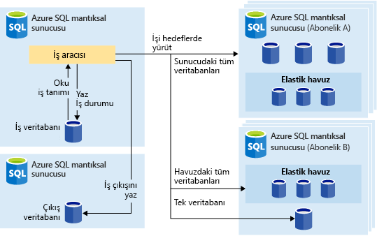
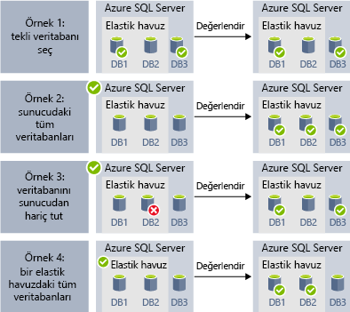
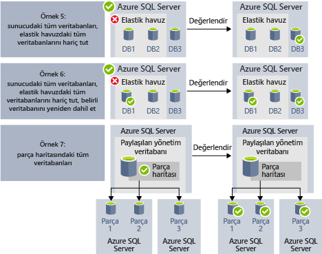

# <a name="automate-management-tasks-using-database-jobs"></a>Veritabanı işlerini kullanarak yönetim görevlerini otomatikleştirme

Azure SQL veritabanı oluşturmak ve düzenli aralıklarla T-SQL sorguları çalıştırmak ve bakım görevlerini gerçekleştirmek için bir veya daha çok veritabanlarında yürütülebilir işleri zamanlamak sağlar. Her iş yürütme durumunu kaydeder ve herhangi bir hata oluşursa işlemleri de otomatik olarak yeniden dener.
Hedef veritabanı veya Azure SQL veritabanlarında burada iş yürütülür ve ayrıca bir işi çalıştırmak için zamanlamalar tanımlayın tanımlayabilirsiniz.
Bir iş, hedef veritabanına oturum açmanın görev işler. Ayrıca tanımlamak, korumak ve Azure SQL veritabanlarından oluşan bir grupta yürütülecek Transact-SQL betikleri kalıcı.

## <a name="when-to-use-automated-jobs"></a>Ne zaman otomatik işlerini kullanma

Proje Otomasyon kullanabilirsiniz, birçok senaryo vardır:

- Yönetim görevlerini otomatikleştirmenizi ve sonra saat, vb. haftanın her günü çalıştırmak için zamanlayabilirsiniz.
  - Şema değişiklikleri, kimlik bilgileri yönetimi, performans verisi toplama veya kiracı (müşteri) telemetri verilerini toplama gibi görevleri dağıtın.
  - (Tüm veritabanlarında ortak bilgiler) başvuru verilerini güncelleştirme, Azure Blob depolamadan veri yükleme.
  - Sorgu performansını artırmak için dizinleri yeniden oluşturun. İşleri bir veritabanı koleksiyonunda yoğun saatlerin dışında yenilenecek şekilde yapılandırın.
  - Bir veritabanı kümesinden alınan sorgu sonuçlarını düzenli olarak merkezi bir tabloya toplayın. Performans sorguları sürekli yürütülebilir ve yürütülecek ek görevleri tetikleyecek şekilde yapılandırılabilir.
- Raporlama için veri toplama
  - Bir Azure SQL veritabanı koleksiyonunda bulunan verileri tek bir hedef tabloda toplayın.
  - Çok sayıda veritabanında müşteri telemetri verilerinin toplanması gibi daha uzun süre çalışan veri işleme sorguları çalıştırın. Sonuçlar daha ayrıntılı analiz için tek bir hedef tabloda toplanır.
- Veri hareketleri
  - Diğer veritabanlarıyla veritabanlarınızı yapılan değişiklikleri çoğaltmak veya uzak veritabanlarında yapılan güncelleştirmeler toplama işleri oluşturmak ve veritabanında değişen uygulayın.
  - SQL Server Integration Services (SSIS) kullanarak veritabanlarınıza ya da veri yükleme işleri oluşturun.

## <a name="overview"></a>Genel Bakış

Aşağıdaki iş zamanlama teknolojiler, Azure SQL veritabanı'nda mevcuttur:

- **SQL Aracısı işleri** olan Klasik ve Kendini ispatlamış SQL Server İş Zamanlama yönetilen örneği'nde kullanılabilir olan bir bileşen. SQL Aracısı işleri tek veritabanlarında kullanılabilir değil.
- **Elastik veritabanı işleri** , bir veya birden çok Azure SQL veritabanlarında özel işleri çalıştırır, iş zamanlama hizmetidir.

Bunu birkaç SQL Aracısı arasındaki farklar hatalarının ayıklanabileceğini belirtmekte yarar (şirket içinde ve SQL veritabanı yönetilen örneği bir parçası olarak) ve veritabanı elastik İş Aracısı (Azure SQL veritabanı ve SQL veri ambarı veritabanlarını tek veritabanları için kullanılabilir).

|  |Elastik İşler  |SQL Aracısı |
|---------|---------|---------|
|Kapsam     |  İş aracısıyla aynı Azure bulutundaki herhangi bir sayıda Azure SQL veritabanı ve/veya veri ambarı. Hedef farklı SQL veritabanı sunucuları, abonelikleri ve/veya bölgeleri olabilir. <br><br>Hedef gruplar tek veritabanı veya veri ambarlarının yanı sıra bir sunucu, havuz veya parça eşlemesi içindeki tüm veritabanlarından (iş zamanında dinamik olarak numaralandırılır) oluşabilir. | Herhangi tek bir veritabanı aynı SQL Server örneğinde SQL Aracısı. |
|Desteklenen API’ler ve Araçlar     |  Portal, PowerShell, T-SQL, Azure Resource Manager      |   T-SQL, SQL Server Management Studio (SSMS)     |

## <a name="sql-agent-jobs"></a>SQL Aracısı işleri

SQL Aracısı işleri T-SQL betiklerini veritabanına karşı belirtilen dizi var. İşler, bir veya birden çok kez çalıştırmak ve başarı veya başarısızlık için izlenen bir yönetim görevi tanımlamak için kullanın.
Bir iş, bir yerel sunucuda veya birden çok uzak sunucularda çalıştırabilirsiniz. SQL aracı işi yönetilen örneğe hizmet içinde yürütülen bir iç veritabanı altyapısı bileşendir.
SQL Aracısı işleri birkaç temel kavram vardır:

- **İş adımları** işinde yürütülen bir veya daha çok adım kümesi. Her bir iş adımı için yeniden deneme stratejisi ve iş adımı başarılı veya başarısız olursa gerçekleşmesi gereken eylemi tanımlayabilirsiniz.
- **Zamanlamalar** işin ne zaman yürütülmesi gereken tanımlayın.
- **Bildirimleri** , iş tamamlandığında e-posta aracılığıyla işleçleri bildirmek için kullanılan kuralları tanımlamanıza olanak sağlar.

### <a name="job-steps"></a>İş adımları

SQL aracı işi, SQL Aracısı yürütülecek Eylemler dizisi adımlardır. Her adım adım başarılı veya başarısız olursa bir hata durumunda yeniden deneme sayısı, yürütülmesi gereken aşağıdaki adım vardır.
SQL Aracısı işi adımları, tek bir Transact-SQL toplu iş veritabanında yürütülen Transact-SQL işi adımı veya özel işletim sistemi betiği yürütebilirsiniz işletim sistemi komut/PowerShell adımları gibi farklı türlerde oluşturmanızı sağlayan, verileri yüklemek SSIS iş adımları sağlar SSIS çalışma zamanı, kullanan veya [çoğaltma](sql-database-managed-instance-transactional-replication.md) Değişiklikleri veritabanınızdan başka bir veritabanına yayımlayabilirsiniz adımları.

[İşlem çoğaltma](sql-database-managed-instance-transactional-replication.md) bir veritabanındaki bir veya birden çok tablolarda yapılan değişiklikleri yayımlamak ve yayımlama/abonelik veritabanları kümesi için dağıtın olanak tanıyan bir veritabanı altyapısı özelliğidir. Aşağıdaki SQL Aracısı işi adımı türlerini kullanarak değişiklikleri yayımlanmasıyla uygulanır:

- İşlem günlüğü okuyucu.
- Anlık görüntü.
- Dağıtıcı.

İş adımları diğer türleri şu anda, dahil olmak üzere desteklenmez:

- Birleştirme çoğaltması iş adımı desteklenmiyor.
- Sıra okuyucusu desteklenmiyor.
- Analysis Services desteklenmiyor

### <a name="job-schedules"></a>İş zamanlamaları

Bir zamanlama, bir işin ne zaman çalışacağını belirtir. Birden fazla işi aynı zamanlamaya göre çalıştırabilir ve birden fazla zamanlama aynı projeye uygulayabilirsiniz.
Bir zamanlama bir işinin çalışma zamanını kez aşağıdaki koşullar tanımlayabilirsiniz:

- Örneği yeniden başlatıldığında (veya SQL Server Agent başladığında). İş, her bir yük devretme işleminden sonra etkinleştirilir.
- Bir kez bir belirli bir tarih ve saatte, olan bazı işinin Gecikmeli yürütme için kullanışlıdır.
- Tekrarlayan bir zamanlamaya göre.

> [!Note]
> Yönetilen örnek şu anda yok örneği "boş" olan bir iş başlattığınızda olanak tanır.

### <a name="job-notifications"></a>İş bildirimlerini

SQL Aracısı işleri işi başarıyla tamamlandığında bildirim almak etkinleştirmeniz veya başarısız oldu. E-posta bildirimi e-posta yoluyla alabilirsiniz.

İlk olarak e-posta bildirimleri göndermek ve hesap adında e-posta profili atamak için kullanılan e-posta hesabı ayarlamanız gerekir `AzureManagedInstance_dbmail_profile`, aşağıdaki örnekte gösterildiği gibi:

```sql
-- Create a Database Mail account
EXECUTE msdb.dbo.sysmail_add_account_sp
    @account_name = 'SQL Agent Account',
    @description = 'Mail account for Azure SQL Managed Instance SQL Agent system.',
    @email_address = '$(loginEmail)',
    @display_name = 'SQL Agent Account',
    @mailserver_name = '$(mailserver)' ,
    @username = '$(loginEmail)' ,  
    @password = '$(password)' 

-- Create a Database Mail profile
EXECUTE msdb.dbo.sysmail_add_profile_sp
    @profile_name = 'AzureManagedInstance_dbmail_profile',
    @description = 'E-mail profile used for messages sent by Managed Instance SQL Agent.' ;

-- Add the account to the profile
EXECUTE msdb.dbo.sysmail_add_profileaccount_sp
    @profile_name = 'AzureManagedInstance_dbmail_profile',
    @account_name = 'SQL Agent Account',
    @sequence_number = 1;
```

Veritabanı yönetilen örneği etkinleştir gerekecektir:

```sql
GO
EXEC sp_configure 'show advanced options', 1;  
GO  
RECONFIGURE;  
GO  
EXEC sp_configure 'Database Mail XPs', 1;  
GO  
RECONFIGURE 
```

İşleci, bir sorun oluştu, SQL Aracısı işleri ile bildirebilir. Bir işleç bakım bir veya daha fazla yönetilen örnek için sorumlu birey için kişi bilgilerini tanımlar. Süre, işleci Sorumluluklar için tek tek atanır.
Birden çok yönetilen örneği veya SQL Server ile sistemlerinde birçok kişiler işletmen sorumlulukları paylaşabilirsiniz. Bir işleç güvenlik bilgileri içermiyor ve bir güvenlik sorumlusu tanımlamıyor.

Aşağıdaki örnekte gösterilen SSMS veya Transact-SQL betiğini kullanarak işleçleri oluşturabilirsiniz:

```sql
EXEC msdb.dbo.sp_add_operator 
    @name=N'Mihajlo Pupun', 
        @enabled=1, 
        @email_address=N'mihajlo.pupin@contoso.com'
```

Herhangi bir işi değiştirebilir ve iş tamamlandığında, başarısız veya SSMS veya aşağıdaki Transact-SQL betiğini kullanarak başarılı olursa, e-posta aracılığıyla bilgilendirileceksiniz işleci atayın:

```sql
EXEC msdb.dbo.sp_update_job @job_name=N'Load data using SSIS', 
        @notify_level_email=3,                        -- Options are: 1 on succeed, 2 on failure, 3 on complete
        @notify_email_operator_name=N'Mihajlo Pupun'
```

### <a name="sql-agent-job-limitations"></a>SQL Aracısı işi sınırlamaları

SQL Server'da bulunan SQL Aracısı özelliklerden bazıları, yönetilen örneği'nde desteklenmez:
- SQL Aracısı ayarları salt okunur. Yordam `sp_set_agent_properties` yönetilen örneği'nde desteklenmiyor.
- Etkinleştirme/Aracısı devre dışı bırakma, yönetilen örneği'nde şu anda desteklenmiyor. SQL Aracısı her zaman çalışıyor.
- Bildirimleri kısmen desteklenir
  - Çağrı desteklenmiyor.
  - NetSend desteklenmiyor.
  - Uyarılar değil henüz desteklenmemektedir.
- Ara sunucular desteklenmez.
- Eventlog desteklenmiyor.

SQL Server Aracısı hakkında daha fazla bilgi için bkz. [SQL Server Agent](https://docs.microsoft.com/sql/ssms/agent/sql-server-agent).

## <a name="elastic-database-jobs"></a>Elastik Veritabanı İşleri

**Elastik Veritabanı İşleri**, bir zaman çizelgesine veya istek üzerine çok sayıda veritabanı arasında bir veya daha fazla T-SQL betiğinin paralel olarak çalıştırılmasını sağlar.

**İşleri tüm veritabanı birleşimleri üzerinde çalıştırabilirsiniz**: Bir veya daha fazla tek veritabanı, bir sunucu üzerindeki tüm veritabanları, bir elastik havuz veya parça eşlemesi içindeki tüm veritabanları için, herhangi bir veritabanını dahil etme veya hariç tutma esnekliğinden faydalanabilirsiniz. **İşler birden fazla sunucu ve birden fazla havuzda çalışabilir, hatta farklı aboneliklerde bulunan veritabanlarını kullanabilir.** Sunucular ve havuzlar çalışma zamanında dinamik olarak numaralandırıldığından işler, yürütme zamanında hedef grupta bulunan tüm veritabanlarında çalışır.

Aşağıdaki resimde farklı türlerdeki hedef gruplarda iş yürüten bir iş aracısı gösterilmektedir:



### <a name="elastic-job-components"></a>Elastik İş bileşenleri

|Bileşen  | Açıklama (ek ayrıntılar tablonun altındadır) |
|---------|---------|
|[**Elastik İş aracısı**](#elastic-job-agent) |  İşleri çalıştırmak ve yönetmek için oluşturduğunuz Azure kaynağıdır.   |
|[**İş veritabanı**](#job-database)    |    İş aracısının işle ilgili veriler, iş tanımları gibi bilgileri depolamak için kullandığı bir Azure SQL veritabanıdır.      |
|[**Hedef grup**](#target-group)      |  Bir işin çalıştırılacağı sunucu, havuz, veritabanı ve parça eşlemesi kümesidir.       |
|[**İş**](#job)  |  Bir işi bir veya daha fazla oluşur iş birimidir [iş adımları](#job-step). İş adımları çalıştırılacak T-SQL betiğinin yanı sıra betiğin yürütülmesi için gerekli olan diğer ayrıntıları belirtir.  |


#### <a name="elastic-job-agent"></a>Elastik İş aracısı

Elastik İş aracısı; işlerin oluşturulması, çalıştırılması ve yönetilmesi için kullanılan Azure kaynağıdır. Elastik İş aracısı, portalda oluşturduğunuz bir Azure kaynağıdır ([PowerShell](elastic-jobs-powershell.md) ve REST de desteklenir). 

**Elastik İş aracısı** oluşturmak için bir SQL veritabanı gerekir. Aracı, mevcut veritabanını [*İş veritabanı*](#job-database) olarak yapılandırır.

Elastik İş aracısı ücretsizdir. İş veritabanı, sıradan SQL veritabanları ile aynı şekilde faturalandırılır.

#### <a name="job-database"></a>İş veritabanı

*İş veritabanı*, işleri tanımlamanın yanı sıra iş yürütme durumunu ve geçmişini takip etmek için kullanılır. *İş veritabanı* ayrıca aracı meta verilerini, günlükleri, sonuçları, iş tanımlarını depolamak için kullanılır ve ayrıca T-SQL kullanarak işlerin oluşturulması, çalıştırılması ve yönetilmesi için birçok faydalı saklı yordam ve farklı veritabanı nesnesi içerir.

Geçerli önizlemede, Elastik İş aracısı oluşturmak için bir Azure SQL veritabanı (S0 veya üzeri) gerekir.

*İş veritabanının* yeni olması şart değildir ancak temiz, boş, S0 veya üzeri hizmet katmanında olması gerekir. *İş veritabanı* için önerilen hizmet katmanı S1 veya üzeridir ancak bu durum iş adımı sayısı, yineleme sayısı ve işlerin çalıştırılma sıklığı gibi performans ihtiyaçlarına göre değişiklik gösterir. Örneğin bir S0 veritabanı, bir saatte birkaç iş çalıştıran bir iş aracısı için yeterli olurken dakikada bir iş çalıştırmak için yeterli performansı sunmayabilir ve bu durumda daha yüksek bir hizmet katmanının kullanılması daha iyi olabilir.


##### <a name="job-database-permissions"></a>İş veritabanı izinleri

İş aracısı oluşturma sırasında *İş veritabanında* bir şema, tablolar ve *jobs_reader* adlı bir rol oluşturulur. Rol, aşağıdaki izinle oluşturulur ve yöneticilere iş izleme için daha ayrıntılı erişim denetimi sunmak üzere tasarlanmıştır:


|Rol adı  |'jobs' şeması izinleri  |'jobs_internal' şeması izinleri  |
|---------|---------|---------|
|**jobs_reader**     |    SELECT     |    None     |

> [!IMPORTANT]
> Veritabanı yöneticisi olarak *İş veritabanına* erişim izni vermeden önce güvenlik durumunu gözden geçirin. İş oluşturma veya düzenleme izinlerine sahip olan kötü niyetli bir kullanıcı, kendi denetimindeki bir veritabanına bağlanmak için kayıtlı kimlik bilgisini kullanan bir iş oluşturarak veya düzenleyerek ilgili kimlik bilgisinin parolasını belirleyebilir.


#### <a name="target-group"></a>Hedef grup

*Hedef grup*, işin üzerinde çalışacağı veritabanı kümesini tanımlar. Hedef grup içinde aşağıdaki bileşenlerden birden fazlası veya birleşimi bulunabilir:

- **SQL veritabanı sunucusu** -bir sunucu belirtilmişse, iş yürütme sırasında sunucuda mevcut tüm veritabanlarını grubun parçası olan. İş yürütülmeden önce grubun numaralandırılması ve güncelleştirilmesi için asıl veritabanı kimlik bilgisinin sağlanması gerekir.
- **Elastik havuz**: Elastik havuz belirtilirse işin yürütülmesi sırasında elastik havuzda mevcut olan tüm veritabanları gruba dahil edilir. Sunucuda olduğu gibi iş yürütülmeden önce grubun güncelleştirilmesi için asıl veritabanı kimlik bilgisinin sağlanması gerekir.
- **Tek veritabanı**: Gruba eklenmek üzere bir veya daha fazla tek veritabanı belirtin.
- **Parça eşlemesi**: Bir parça eşlemesinin veritabanlarıdır.

> [!TIP]
> İşin yürütülmesi sırasında *dinamik numaralandırma*, sunucuları veya havuzları içeren hedef gruplardaki veritabanı kümesini yeniden değerlendirir. Dinamik numaralandırma, **işlerin, yürütüldükleri sırada sunucuda veya havuzda mevcut olan tüm veritabanlarında çalıştırılmasını sağlar**. Veritabanı listesinin çalışma zamanında yeniden değerlendirilmesi özellikle havuz veya sunucu üyeliğinin sık değiştiği senaryolar için kullanışlıdır.

Havuzlar ve tek veritabanları gruba dahil edilebilir veya gruptan hariç tutulabilir. Bu sayede istenen veritabanlarını içeren bir hedef grup oluşturulabilir. Örneğin hedef gruba bir sunucuyu ekleyebilir ancak bir elastik havuzdaki belirli veritabanlarını (veya bir havuzun tamamını) hariç tutabilirsiniz.

Hedef grupta birden fazla abonelikte ve bölgede bulunan veritabanları mevcut olabilir. Birden fazla bölgenin söz konusu olduğu yürütme işlemlerinin aynı bölgedeki yürütmelere kıyasla daha yüksek gecikme süresine sahip olacağını unutmayın.

Aşağıdaki örneklerde işin çalıştırılacağı veritabanlarının belirlenmesi için farklı hedef grubu tanımlarının iş yürütme sırasında nasıl dinamik olarak numaralandırıldığı gösterilmektedir:



**Örnek 1**'de tek veritabanlarının listesini içeren bir hedef grup gösterilmektedir. Bir iş adımı bu hedef grup kullanılarak yürütüldüğünde iş adımının eylemi bu veritabanlarının her birinde yürütülür.<br>
**Örnek 2**'de hedef olarak bir Azure SQL Server içeren bir hedef grup gösterilmektedir. Bir iş adımı bu hedef grup kullanılarak yürütüldüğünde sunucudaki veritabanı listesinin belirlenmesi için sunucu dinamik olarak numaralandırılır. İş adımının eylemi bu veritabanlarının her birinde yürütülür.<br>
**Örnek 3**'te gösterilen hedef grup *Örnek 2*'dekine benzer ancak belirli veritabanları özel olarak hariç tutulmuştur. İş adımının eylemi hariç tutulan veritabanında *yürütülmez*.<br>
**Örnek 4**'te hedef olarak bir elastik havuz içeren bir hedef grup gösterilmektedir. *Örnek 2*'ye benzer şekilde havuz iş çalıştırma zamanında dinamik olarak numaralandırılarak havuzdaki veritabanlarının listesi belirlenir.
<br><br>




**Örnek 5** ve **Örnek 6**'da Azure SQL Servers, elastik havuz ve veritabanı örneklerinin dahil etme ve hariç tutma kurallarıyla birleştirildiği gelişmiş senaryolar gösterilmektedir.<br>
**Örnek 7**'de parça eşlemesi içinde bulunan ve iş çalıştırma zamanında değerlendirilebilecek parçalar gösterilmektedir.

#### <a name="job"></a>İş

*İş*, bir zamanlamaya göre veya tek seferlik yürütülen bir çalışma birimidir. Bir işte bir veya daha fazla *iş adımı* bulunur.

##### <a name="job-step"></a>İş adımı

Her işte yürütülecek bir T-SQL betiği, bu T-SQL betiğinin çalıştırılacağı bir veya daha fazla hedef grup ve iş aracısının hedef veritabanına bağlanması için gereken kimlik bilgileri belirtilir. İşin her adımı özelleştirilebilir zaman aşımı ve yeniden deneme ilkelerine sahiptir ve her adımda isteğe bağlı çıkış parametreleri belirtilebilir.

#### <a name="job-output"></a>İş çıktısı

İş adımlarının her bir hedef veritabanında elde ettiği sonuç ayrıntılı olarak kaydedilir ve betik çıktısı, belirtilen bir tabloya aktarılabilir. Bir işin döndürdüğü verilerin kaydedileceği bir veritabanı belirtebilirsiniz.

#### <a name="job-history"></a>İş geçmişi

İş yürütme geçmişi *İş veritabanında* depolanır. Sistem temizleme işlemi 45 günden daha eski olan yürütme geçmişi verilerini siler. 45 günden daha yeni olan geçmişi kaldırmak için *İş veritabanında* **sp_purge_history** saklı yordamını çağırın.

### <a name="agent-performance-capacity-and-limitations"></a>Aracı performansı, kapasitesi ve sınırlamaları

Elastik İşler, uzun süren işlerin tamamlanması sırasında en az düzeyde işlem kaynağı kullanır.

Hedef veritabanı grubunun boyutuna ve bir işin istenen yürütme süresine (eşzamanlı çalışan sayısı) bağlı olarak aracı için gerekli olan işlem süresi ve *İş veritabanı* performansı değişiklik gösterir (hedef ve iş sayısı ne kadar yüksek olursa gereken işlem zamanı o kadar fazla olur).

Önizleme şu an için 100 eşzamanlı işle sınırlıdır.

#### <a name="prevent-jobs-from-reducing-target-database-performance"></a>İşlerin hedef veritabanının performansını düşürmesini engelleme

Bir SQL elastik havuzundaki veritabanları üzerinde iş çalıştırılması sırasında kaynakların aşırı yüklenmesini önlemek için işler aynı anda üzerinde çalışılabilecek veritabanı sayısını sınırlayacak şekilde yapılandırılabilir.

## <a name="next-steps"></a>Sonraki adımlar

- [SQL Server Agent nedir](https://docs.microsoft.com/sql/ssms/agent/sql-server-agent) 
- [Esnek işler oluşturma ve yönetme konusunda](elastic-jobs-overview.md) 
- [PowerShell’i kullanarak Elastik İşler oluşturma ve yönetme](elastic-jobs-powershell.md) 
- [Transact-SQL (T-SQL) kullanarak Elastik İşler oluşturma ve yönetme](elastic-jobs-tsql.md) 
