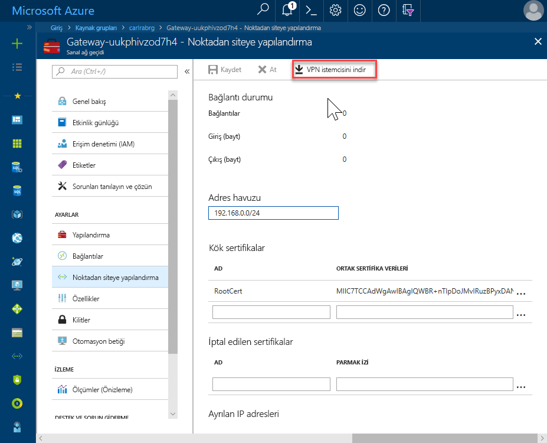
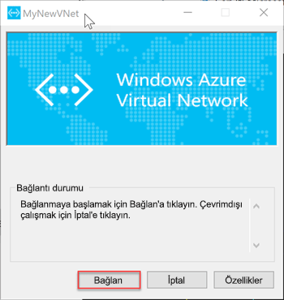

# <a name="quickstart-configure-a-point-to-site-connection-to-an-azure-sql-database-managed-instance-from-on-premises"></a>Hızlı Başlangıç: Noktadan siteye bağlantı, şirket içinden Azure SQL veritabanı yönetilen örneği için yapılandırma

Bu hızlı başlangıçta bir Azure SQL veritabanı yönetilen örneği kullanmaya nasıl bağlanılacağı gösterilmiştir [SQL Server Management Studio](https://docs.microsoft.com/sql/ssms/sql-server-management-studio-ssms) (SSMS) bir noktadan siteye bağlantı üzerinden şirket içi istemci bilgisayarından. Noktadan siteye bağlantılar hakkında daha fazla bilgi için bkz. [noktadan siteye VPN hakkında](../vpn-gateway/point-to-site-about.md)

## <a name="prerequisites"></a>Önkoşullar

Bu hızlı başlangıç:

- Oluşturulan kaynaklar kullanılmaktadır [bir yönetilen örnek oluşturma](sql-database-managed-instance-get-started.md) , başlangıç noktası olarak.
- PowerShell 5.1 ve AZ PowerShell 1.4.0 veya daha sonra şirket içi istemci bilgisayarınız gerektirir. Gerekirse, yönergelerine bakın [Azure PowerShell modülünü yükleme](https://docs.microsoft.com/powershell/azure/install-az-ps#install-the-azure-powershell-module).
- En yeni sürümünü gerektirir [SQL Server Management Studio](https://docs.microsoft.com/sql/ssms/sql-server-management-studio-ssms) (SSMS) şirket içi istemci bilgisayarınızda.

## <a name="attach-a-vpn-gateway-to-your-managed-instance-virtual-network"></a>Yönetilen örnek sanal ağınıza bir VPN ağ geçidi ekleme

1. Şirket içi istemci bilgisayarınızda PowerShell'i açın.

2. Bu PowerShell Betiği kopyalayın. Bu komut dosyasını oluşturduğunuz yönetilen örnek sanal ağ VPN ağ geçidi ekler [bir yönetilen örnek oluşturma](sql-database-managed-instance-get-started.md) hızlı başlangıç. Bu betik şunları yapar:

   - Oluşturur ve sertifika istemci makineye yükleme
   - Gelecekteki bir VPN ağ geçidi alt ağ IP aralığı hesaplar.
   - GatewaySubnet oluşturur
   - VPN ağ geçidi için VPN alt ağa bağlanan bir Azure Resource Manager şablonu dağıtır

     ```powershell
     $scriptUrlBase = 'https://raw.githubusercontent.com/Microsoft/sql-server-samples/master/samples/manage/azure-sql-db-managed-instance/attach-vpn-gateway'

     $parameters = @{
       subscriptionId = '<subscriptionId>'
       resourceGroupName = '<resourceGroupName>'
       virtualNetworkName = '<virtualNetworkName>'
       certificateNamePrefix  = '<certificateNamePrefix>'
       }

     Invoke-Command -ScriptBlock ([Scriptblock]::Create((iwr ($scriptUrlBase+'/attachVPNGateway.ps1?t='+ [DateTime]::Now.Ticks)).Content)) -ArgumentList $parameters, $scriptUrlBase
     ```

     > [!IMPORTANT]
     > Az modül yerine Azure PowerShell Resource Manager modülü kullanmak için aşağıdaki cmdlet'i kullanın: `attachVPNGateway.ps1` yerine `attachVPNGatewayAz.ps1` cmdlet'i.

3. Betik PowerShell pencerenize yapıştırın ve gerekli parametreleri belirtin. Değerleri `<subscriptionId>`, `<resourceGroup>`, ve `<virtualNetworkName>` için kullanılan değerler eşleşmelidir [yönetilen örnek oluşturma](sql-database-managed-instance-get-started.md) hızlı başlangıç. Değeri `<certificateNamePrefix>` tercih ettiğiniz bir dize olabilir.

4. PowerShell betiğini çalıştırın.

> [!IMPORTANT]
> PowerShell betiğini tamamlanana kadar devam etmeyin.

## <a name="create-a-vpn-connection-to-your-managed-instance"></a>Yönetilen Örneğiniz için bir VPN bağlantısı oluşturma

1. [Azure Portal](https://portal.azure.com/) oturum açın.
2. Sanal ağ geçidi oluşturduğunuz kaynak grubunu açın ve ardından sanal ağ geçidi kaynağı açın.
3. Seçin **noktadan siteye yapılandırma** seçip **VPN istemcisini indir**.

      
4. Şirket içi istemci bilgisayarınızda zip dosyasından dosyaları ayıklayın ve ardından ayıklanan dosyaları klasörünü açın.
5. Aç '**WindowsAmd64** klasörü ve açık **VpnClientSetupAmd64.exe** dosya.
6. Alırsanız bir **Windows bilgisayarınıza korumalı** ye ileti **daha fazla bilgi** ve ardından **yine de Çalıştır**.

    \
7. Kullanıcı Hesabı Denetimi iletişim kutusunda **Evet** devam etmek için.
8. İletişim kutusunda, sanal ağınızın başvuran seçin **Evet** sanal ağınızın VPN istemcisini yüklemek için.

## <a name="connect-to-the-vpn-connection"></a>VPN bağlantısı

1. Git **VPN** içinde **ağ ve Internet** şirket içi istemci bilgisayarınızda bu sanal ağ ile bağlantı kurmak için yönetilen örnek sanal ağı seçin. Aşağıdaki görüntüde, VNet adlı **MyNewVNet**.

      
2. **Bağlan**’ı seçin.
3. İletişim kutusunda **Connect**.

      
4. Bağlantı Yöneticisi'ni seçin, rota tablosunu güncelleştirmek için yükseltilmiş ayrıcalık gerekli istendiğinde **devam**.
5. Seçin **Evet** devam etmek için kullanıcı hesabı denetimi iletişim kutusunda.

   Yönetilen örnek sanal ağınıza bir VPN bağlantısını kurduktan.

      

## <a name="use-ssms-to-connect-to-the-managed-instance"></a>SSMS, yönetilen örneği'ne bağlanın

1. Şirket içi istemci bilgisayarda, SQL Server Management Studio (SSMS) açın.
2. İçinde **sunucuya Bağlan** iletişim kutusunda, tam girin **ana bilgisayar adı** yönetilen örneğinizin **sunucu adı** kutusu.
3. Seçin **SQL Server kimlik doğrulaması**kullanıcı adı ve parola sağlayın ve ardından **Connect**.

      

Bağlandıktan sonra sistem ve kullanıcı veritabanlarınızı veritabanları düğümünde görüntüleyebilirsiniz. Ayrıca, güvenlik, sunucu nesneleri, çoğaltma, yönetim, SQL Server Agent ve XEvent Profiler düğümlerin çeşitli nesneleri görüntüleyebilirsiniz.

## <a name="next-steps"></a>Sonraki adımlar

- Azure sanal makinesinden bağlanma gösteren Hızlı Başlangıç için bkz: [noktadan siteye bağlantı yapılandırma](sql-database-managed-instance-configure-p2s.md).
- Uygulamaların bağlantı seçeneklerine genel bir bakış için bkz: [Uygulamalarınızı Yönetilen Örneğe bağlama](sql-database-managed-instance-connect-app.md).
- Mevcut SQL Server veritabanını şirket içinden bir yönetilen örneğine geri yüklemek için kullanabileceğiniz [geçiş için Azure veritabanı geçiş hizmeti (DMS)](../dms/tutorial-sql-server-to-managed-instance.md) veya [T-SQL RESTORE komutunu](sql-database-managed-instance-get-started-restore.md) geri bir veritabanı yedekleme dosyası.
