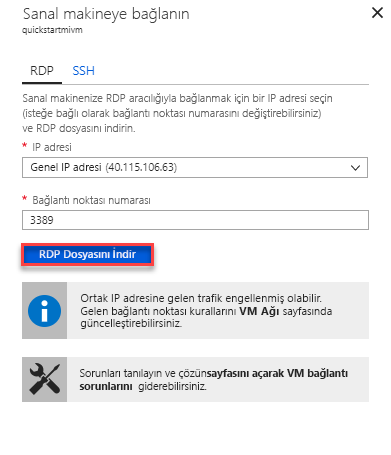

# Hızlı Başlangıç: Azure VM, Azure SQL veritabanı yönetilen örneğine bağlanmak için yapılandırın

Bu hızlı SQL Server Management Studio (SSMS) kullanarak bir Azure SQL veritabanı yönetilen örneğine bağlanmak için bir Azure sanal makinesi yapılandırma gösterilmektedir. Noktadan siteye bağlantısı kullanarak bir şirket içi istemci bilgisayarından bağlanmak gösteren bir hızlı başlangıç için bkz: [noktadan siteye bağlantı yapılandırma](sql-database-managed-instance-configure-p2s.md)

## Önkoşullar

Bu hızlı başlangıçta oluşturulan kaynakları kullanan [bir yönetilen örnek oluşturma](sql-database-managed-instance-get-started.md) , başlangıç noktası olarak.

## Azure portalında oturum açın

[Azure Portal](https://portal.azure.com/) oturum açın.

## Yönetilen örnek sanal ağda yeni bir alt ağ oluşturma

Bir Azure sanal makinesi yönetilen örneği'ne bağlanabilmesi için aşağıdaki adımları yönetilen örnek sanal ağda yeni bir alt ağ oluşturun. Yönetilen örnek alt yönetilen örnekler için ayrılmıştır. Bu alt ağda Azure sanal makineler gibi diğer tüm kaynakları oluşturulamıyor.

1. Yönetilen örnek, oluşturduğunuz kaynak grubunu açın [bir yönetilen örnek oluşturma](sql-database-managed-instance-get-started.md) hızlı başlangıç. Sanal ağ için yönetilen örneğinizi seçin.

   

2. Seçin **alt ağlar** seçip **+ alt ağ** yeni bir alt ağ oluşturmak için.

   

3. Bu tabloda verilen bilgileri kullanarak formunu doldurun:

   | Ayar| Önerilen değer | Açıklama |
   | ---------------- | ----------------- | ----------- |
   | **Ad** | Geçerli bir ad|Geçerli adlar için bkz. [Adlandırma kuralları ve kısıtlamalar](https://docs.microsoft.com/azure/architecture/best-practices/naming-conventions).|
   | **Adres aralığı (CIDR bloğu)** | Geçerli bir aralık | Bu Hızlı Başlangıç için iyi varsayılan değerdir.|
   | **Ağ güvenlik grubu** | None | Bu Hızlı Başlangıç için iyi varsayılan değerdir.|
   | **Yol tablosu** | None | Bu Hızlı Başlangıç için iyi varsayılan değerdir.|
   | **Hizmet uç noktaları** | 0 adet seçildi | Bu Hızlı Başlangıç için iyi varsayılan değerdir.|
   | **Alt ağ temsilci seçme** | None | Bu Hızlı Başlangıç için iyi varsayılan değerdir.|

   

4. Seçin **Tamam** yönetilen örnek sanal ağda bu ek alt ağ oluşturmak için.

## Sanal ağdaki yeni alt ağ içinde sanal makine oluşturma

Aşağıdaki adımlar yönetilen örneğine bağlanmak için yeni bir alt ağ içinde bir sanal makine oluşturma işlemini gösterir.

## Azure sanal makinesi hazırlama

SQL yönetilen örneği, özel sanal ağınızdaki yerleştirilir olduğundan, SQL Server Management Studio veya Azure Data Studio gibi yüklü bir SQL istemci aracı ile Azure VM oluşturmak gerekir. Bu araç, yönetilen örneğe bağlanma ve sorgu yürütme sağlar. Bu hızlı başlangıçta, SQL Server Management Studio kullanılmaktadır.

Tüm gerekli araçları ile bir istemci sanal makine oluşturmak için en kolay yolu, Azure Resource Manager şablonları kullanmaktır.

1. Başka bir tarayıcı sekmesinde Azure portalında oturum açmadıysanız, emin olun. Ardından, istemci sanal makine oluşturma ve SQL Server Management Studio'yu yüklemek için aşağıdaki düğmeyi seçin:

    

2. Aşağıdaki tabloda verilen bilgileri kullanarak formunu doldurun:

   | Ayar| Önerilen değer | Açıklama |
   | ---------------- | ----------------- | ----------- |
   | **Abonelik** | Geçerli bir abonelik | Yeni kaynaklar oluşturma izni olan bir aboneliği olması gerekir. |
   | **Kaynak Grubu** |Belirtilen kaynak grubu [yönetilen örnek oluşturma](sql-database-managed-instance-get-started.md) hızlı başlangıç.|Bu kaynak grubu, sanal ağın bulunduğu bir olmalıdır.|
   | **Konum** | Kaynak grubu konumu | Bu değer, seçili kaynak grubuna göre doldurulur. |
   | **Sanal makine adı**  | Geçerli bir ad | Geçerli adlar için bkz. [Adlandırma kuralları ve kısıtlamalar](https://docs.microsoft.com/azure/architecture/best-practices/naming-conventions).|
   |**Yönetici kullanıcı adı**|Herhangi bir geçerli kullanıcı adı|Geçerli adlar için bkz. [Adlandırma kuralları ve kısıtlamalar](https://docs.microsoft.com/azure/architecture/best-practices/naming-conventions). Ayrılmış bir sunucu düzeyindeki rolüdür gibi "serveradmin" kullanmayın. Bu kullanıcı adı kullanmak istediğiniz zaman [VM'ye bağlanmak](#connect-to-virtual-machine).|
   |**Parola**|Geçerli bir parola|Parola en az 12 karakter uzunluğunda olmalı ve [tanımlanmış karmaşıklık gereksinimlerini](../virtual-machines/windows/faq.md#what-are-the-password-requirements-when-creating-a-vm) karşılamalıdır. Bu parolayı kullanmak istediğiniz zaman [VM'ye bağlanmak](#connect-to-virtual-machine).|
   | **Sanal makine boyutu** | Herhangi bir geçerli boyut | Bu şablon varsayılan **Standard_B2s** Bu Hızlı Başlangıç için yeterlidir. |
   | **Konum**|[resourceGroup () .location].| Bu değeri değiştirmeyin. |
   | **Sanal ağ adı**|Yönetilen örneğin oluşturulacağı sanal ağı.|
   | **Alt ağ adı**|Önceki yordamda oluşturduğunuz alt ağ adı| Yönetilen örnek oluşturduğunuz alt ağ seçmeyin.|
   | **yapıtları konumu** | [dağıtım.properties.templateLink.uri ()] | Bu değeri değiştirmeyin. |
   | **yapıtları konumu Sas belirteci** | Boş bırakın | Bu değeri değiştirmeyin. |

   

   Önerilen sanal ağ adına ve varsayılan alt ağda kullanılan [yönetilen örneğinizi oluşturma](sql-database-managed-instance-get-started.md), son iki parametreyi değiştirmek gerekmez. Aksi halde ağ ortamını ayarlarken girdiğiniz değerlere bu değerleri değiştirmeniz gerekir.

3. Seçin **hüküm ve koşulları yukarıda belirtilen kabul ediyorum** onay kutusu.
4. Seçin **satın alma** ağınızda Azure VM dağıtmak için.
5. Seçin **bildirimleri** dağıtım durumu görüntülenecek simge.

> [!IMPORTANT]
> SQL Server Management Studio'yu yüklemek oluşturma sonrası betikler için zaman vermek için sanal makine oluşturulduktan sonra yaklaşık 15 dakika kadar devam etmeyin.

## Sanal makineye bağlanma

Aşağıdaki adımlarda, uzak masaüstü bağlantısı kullanarak yeni oluşturduğunuz sanal makineye bağlanma işlemi gösterilmektedir.

1. Dağıtım tamamlandıktan sonra sanal makine kaynağına gidin.

      

2. **Bağlan**’ı seçin.

   Genel IP adresi ve bağlantı noktası numarasını sanal makine ile bir Uzak Masaüstü Protokolü dosyasını (.rdp dosyası) formu görüntülenir.

     

3. Seçin **RDP dosyasını indir**.

   > [!NOTE]
   > Ayrıca, sanal Makinenize bağlanmak için SSH kullanabilirsiniz.

4. Kapat **sanal makineye bağlanma** formu.
5. VM'nize bağlanmak için indirilen RDP dosyasını açın.
6. Sorulduğunda, **Connect**. Mac bilgisayarlarda, Mac App Store’dan bu [Uzak Masaüstü İstemcisi](https://itunes.apple.com/us/app/microsoft-remote-desktop/id715768417?mt=12) gibi bir RDP istemcisi indirmeniz gerekir.

7. Kullanıcı adı ve sanal makine oluştururken belirttiğiniz parolayı girin ve ardından **Tamam**.

8. Oturum açma işlemi sırasında bir sertifika uyarısı alabilirsiniz. Seçin **Evet** veya **devam** bağlantıya devam etmek için.

Sunucu Yöneticisi panosunda sanal makinenize bağlandınız.

## SSMS, yönetilen örneği'ne bağlanın

1. Sanal makineler'de SQL Server Management Studio (SSMS) açın.

   Bu ilk kez SSMS başlatılmış olduğundan yapılandırmasını tamamlamak gereken açmak için birkaç dakika sürer.
2. İçinde **sunucuya Bağlan** iletişim kutusunda, tam girin **ana bilgisayar adı** yönetilen örneğinizin **sunucu adı** kutusu. Seçin **SQL Server kimlik doğrulaması**kullanıcı adı ve parola sağlayın ve ardından **Connect**.

      

Bağlandıktan sonra Veritabanları düğümündeki sistem ve kullanıcı veritabanlarınızı ve Güvenlik, Sunucu Nesneleri, Çoğaltma, Yönetim, SQL Server Agent ile XEvent Profil Oluşturucu düğümlerindeki çeşitli nesneleri görüntüleyebilirsiniz.

## Sonraki adımlar

- Noktadan siteye bağlantısı kullanarak bir şirket içi istemci bilgisayarından bağlanmak gösteren bir hızlı başlangıç için bkz: [noktadan siteye bağlantı yapılandırma](sql-database-managed-instance-configure-p2s.md).
- Uygulamaların bağlantı seçeneklerine genel bir bakış için bkz: [Uygulamalarınızı Yönetilen Örneğe bağlama](sql-database-managed-instance-connect-app.md).
- Mevcut SQL Server veritabanını şirket içi, yönetilen örneğe geri yüklemek için kullanabileceğiniz [geçiş için Azure veritabanı geçiş hizmeti (DMS)](../dms/tutorial-sql-server-to-managed-instance.md) veya [T-SQL RESTORE komutunu](sql-database-managed-instance-get-started-restore.md) geri bir veritabanı yedekleme dosyası.
