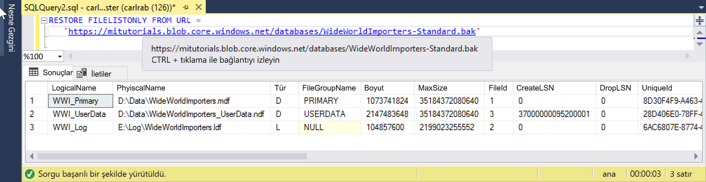

# <a name="quickstart-restore-a-database-to-a-managed-instance"></a>Hızlı Başlangıç: Bir veritabanı yönetilen örneği'ne geri yükleme

Bu hızlı başlangıçta, SQL Server Management Studio (SSMS) (Wide World Importers - standart yedekleme dosyasını) bir veritabanını geri yüklemek için Azure Blob depolama alanından Azure SQL veritabanı'na kullanacağınız [yönetilen örneği](sql-database-managed-instance.md).

> [!VIDEO https://www.youtube.com/embed/RxWYojo_Y3Q]

> [!NOTE]
> Kullanarak Azure veritabanı geçiş hizmeti (DMS) geçişi hakkında daha fazla bilgi için bkz. [DMS kullanarak yönetilen örneğe geçiş](../dms/tutorial-sql-server-to-managed-instance.md).
> Çeşitli geçiş yöntemleri hakkında daha fazla bilgi için bkz. [Azure SQL veritabanı yönetilen örneği SQL Server örneği geçiş](sql-database-managed-instance-migrate.md).

## <a name="prerequisites"></a>Önkoşullar

Bu hızlı başlangıç:

- Kaynaklardan kullanan [bir yönetilen örnek oluşturma](sql-database-managed-instance-get-started.md) hızlı başlangıç.
- Bilgisayarınızda yüklü en son gerektirir [SQL Server Management Studio](https://docs.microsoft.com/sql/ssms/sql-server-management-studio-ssms) yüklü.
- SSMS yönetilen Örneğinize bağlanmak için kullanılması gerekir. Bağlanmak Bu hızlı başlangıçlara bakın:
  - [Bir Azure VM'den bir Azure SQL Veritabanı Yönetilen Örneğine bağlanma](sql-database-managed-instance-configure-vm.md)
  - [Noktadan siteye bağlantı, şirket içinden Azure SQL veritabanı yönetilen örneği için yapılandırma](sql-database-managed-instance-configure-p2s.md).

> [!NOTE]
> Veritabanı yedekleme ve bir SQL Server geri yükleme hakkında daha fazla bilgi için Azure Blob Depolama kullanan ve bir [paylaşılan erişim imzası (SAS) anahtarı](https://docs.microsoft.com/azure/storage/common/storage-dotnet-shared-access-signature-part-1), bkz: [URL'ye SQL Server Yedekleme](sql-database-managed-instance-get-started-restore.md).

## <a name="restore-the-database-from-a-backup-file"></a>Veritabanını bir yedekleme dosyasından geri yükleyin.

SSMS'de, yönetilen Örneğinize Wide World Importers veritabanını geri yüklemek için aşağıdaki adımları izleyin. Veritabanı yedek dosyasını, önceden yapılandırılmış bir Azure Blob Depolama hesabında depolanır.

1. SMSS açın ve yönetilen Örneğinize bağlanın.
2. Sol taraftaki menüden, yönetilen Örneğinize sağ tıklayıp **yeni sorgu** yeni bir sorgu penceresi açın.
3. Önceden yapılandırılmış depolama hesabı ve SAS anahtarı kullanan aşağıdaki SQL betiğini çalıştırın [bir kimlik bilgisi oluşturmak](https://docs.microsoft.com/sql/t-sql/statements/create-credential-transact-sql) yönetilen Örneğinize içinde.

   ```sql
   CREATE CREDENTIAL [https://mitutorials.blob.core.windows.net/databases]
   WITH IDENTITY = 'SHARED ACCESS SIGNATURE'
   , SECRET = 'sv=2017-11-09&ss=bfqt&srt=sco&sp=rwdlacup&se=2028-09-06T02:52:55Z&st=2018-09-04T18:52:55Z&spr=https&sig=WOTiM%2FS4GVF%2FEEs9DGQR9Im0W%2BwndxW2CQ7%2B5fHd7Is%3D'
   ```

    

4. Kimlik bilgilerinizi denetlemek için kullandığı aşağıdaki betiği çalıştırın. bir [kapsayıcı](https://azure.microsoft.com/services/container-instances/) bir yedek dosya listesini almak için URL.

   ```sql
   RESTORE FILELISTONLY FROM URL =
      'https://mitutorials.blob.core.windows.net/databases/WideWorldImporters-Standard.bak'
   ```

    

5. Wide World Importers veritabanını geri yüklemek için aşağıdaki betiği çalıştırın.

   ```sql
   RESTORE DATABASE [Wide World Importers] FROM URL =
     'https://mitutorials.blob.core.windows.net/databases/WideWorldImporters-Standard.bak'
   ```

    

6. Geri yükleme 's durumunu izlemek için aşağıdaki betiği çalıştırın.

   ```sql
   SELECT session_id as SPID, command, a.text AS Query, start_time, percent_complete
      , dateadd(second,estimated_completion_time/1000, getdate()) as estimated_completion_time
   FROM sys.dm_exec_requests r
   CROSS APPLY sys.dm_exec_sql_text(r.sql_handle) a
   WHERE r.command in ('BACKUP DATABASE','RESTORE DATABASE')
   ```

7. Geri yükleme tamamlandığında Nesne Gezgini içinde görüntüleyin.

## <a name="next-steps"></a>Sonraki adımlar

- URL'ye yedekleme sorunlarını giderme için bkz: [URL en iyi yöntemler ve sorun giderme için SQL Server Yedekleme](https://docs.microsoft.com/sql/relational-databases/backup-restore/sql-server-backup-to-url-best-practices-and-troubleshooting).
- Uygulama bağlantı seçeneklerine genel bakış için bkz. [, uygulamaların yönetilen örneğe bağlanma](sql-database-managed-instance-connect-app.md).
- En sevdiğiniz araçları veya dilleri kullanarak sorgulamak için bkz: [hızlı Başlangıçlar: Azure SQL veritabanına bağlanma ve sorgulama](sql-database-connect-query.md).
