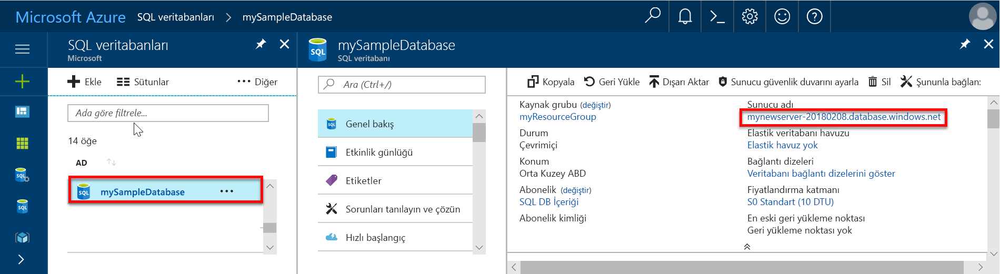

# Hızlı Başlangıç: Azure portalını kullanarak tek ve havuza alınmış veritabanları için bir sunucu düzeyinde güvenlik duvarı kuralı oluşturma

Bu hızlı başlangıçta oluşturma hakkında bilgi vermektedir. bir [sunucu düzeyinde güvenlik duvarı kuralı](sql-database-firewall-configure.md) tek bir veritabanı sunucularına bağlanmasını sağlamak için Azure portalını kullanarak Azure SQL veritabanı'nda tek ve havuza alınmış veritabanları için veritabanları ve elastik havuzlar ve kendi veritabanları. Bir güvenlik duvarı kuralı, diğer Azure kaynakları ve şirket içi kaynaklara bağlanmak için gereklidir.

## Önkoşullar

Bu hızlı başlangıçta oluşturulan kaynakları kullanan [Azure portalını kullanarak tek veritabanı oluşturma](sql-database-single-database-get-started.md) , başlangıç noktası olarak.

## Azure portalında oturum açın

[Azure Portal](https://portal.azure.com/) oturum açın.

## Sunucu düzeyinde IP güvenlik duvarı kuralı oluşturma

SQL veritabanı hizmeti, tek ve havuza alınmış veritabanları için veritabanı sunucu düzeyinde bir güvenlik duvarı oluşturur. Bu güvenlik duvarı güvenlik duvarını açmak için bir IP güvenlik duvarı kuralı oluşturmadığınız sürece sunucu veya herhangi bir tek veya havuza alınmış veritabanlarına bağlanırken istemci uygulamaların engeller. Azure dışında bir IP adresinden bir bağlantı için belirli bir IP adresi ya da, bağlanmak istediğiniz adres aralığı için bir güvenlik duvarı kuralı oluşturun. Sunucu düzeyinde ve veritabanı düzeyinde IP güvenlik duvarı kuralları hakkında daha fazla bilgi için bkz. [SQL veritabanı sunucu düzeyinde ve veritabanı düzeyinde IP güvenlik duvarı kuralları](sql-database-firewall-configure.md).

> [!NOTE]
> SQL Veritabanı 1433 numaralı bağlantı noktası üzerinden iletişim kurar. Kurumsal ağ içinden gelen bağlanmaya çalışıyorsanız, ağınızın güvenlik duvarı tarafından 1433 numaralı bağlantı noktası üzerinden giden trafiğe verilmeyebilir. Bu durumda BT departmanınız 1433 numaralı bağlantı noktasını açmadığı sürece Azure SQL veritabanı sunucusuna bağlanamıyor.
> [!IMPORTANT]
> Bir güvenlik duvarı kuralı 0.0.0.0 sunucu düzeyinde güvenlik duvarı kuralı geçirmek ve tek veya havuza alınmış bir veritabanı sunucusu üzerinden bağlanma girişiminde tüm Azure hizmetleri sağlar. Sanal ağ kuralları kullanma hakkında bilgi edinmek için [IP kuralları alternatifleri olarak sanal ağ kuralları](sql-database-firewall-configure.md#virtual-network-rules-as-alternatives-to-ip-rules).

İstemcinizin IP adresi için bir sunucu düzeyinde IP güvenlik duvarı kuralı oluşturun ve IP adresiniz yalnızca SQL veritabanı güvenlik duvarı üzerinden dış bağlantıları etkinleştirmek için aşağıdaki adımları izleyin.

1. Sonra [önkoşul Azure SQL veritabanı](#prerequisites) dağıtım tamamlandığında, seçin **SQL veritabanları** sol taraftaki menüden seçip **mySampleDatabase** üzerinde **SQL veritabanları** sayfası. Veritabanınıza ilişkin genel bakış sayfası açılır ve tam sunucu adı (örneğin, **mynewserver-20170824.database.windows.net**) görüntülenerek daha fazla yapılandırma seçeneği sunulur.

2. Sunucunuza ve veritabanlarına diğer hızlı başlangıçlar bağlanırken kullanması için bu tam sunucu adını kopyalayın.

   

3. Seçin **sunucu güvenlik duvarını Ayarla** araç. **Güvenlik Duvarı ayarları** veritabanı sunucusu için sayfası açılır.

   

4. Seçin **istemci IP'si Ekle** geçerli IP adresinizi yeni bir sunucu düzeyinde IP güvenlik duvarı kuralına eklemek için araç çubuğunda. Sunucu düzeyinde IP güvenlik duvarı kuralı, tek bir IP adresi veya bir IP adresi aralığı için 1433 numaralı bağlantı noktasını açabilirsiniz.

   > [!IMPORTANT]
   > Varsayılan olarak, SQL Veritabanı güvenlik duvarı üzerinden erişim tüm Azure hizmetleri için etkindir. Seçin **OFF** tüm Azure Hizmetleri için devre dışı bırakmak için bu sayfadaki.
   >

5. **Kaydet**’i seçin. SQL veritabanı sunucusu üzerindeki 1433 numaralı bağlantı noktasını açma geçerli IP adresiniz için sunucu düzeyinde IP güvenlik duvarı kuralı oluşturulur.

6. Kapat **Güvenlik Duvarı ayarları** sayfası.

SQL Server Management Studio veya seçtiğiniz başka bir aracı kullanarak, artık SQL veritabanı sunucusuna ve sunucuya ait veritabanlarına için daha önce oluşturduğunuz sunucu yönetici hesabıyla bu IP adresinden bağlanabilirsiniz.

## Kaynakları temizleme

[Sonraki adımlar](#next-steps)’a geçip farklı yöntemler kullanarak veritabanını sorgulama hakkında bilgi edinmek istiyorsanız bu kaynakları kaydedin. Bu hızlı başlangıçta oluşturduğunuz kaynakları silmek istiyorsanız, aşağıdaki adımları kullanın.

1. Azure portalında sol taraftaki menüden seçin **kaynak grupları** seçip **myResourceGroup**.
2. Kaynak grubu sayfanızda seçin **Sil**, türü **myResourceGroup** metin kutusuna ve ardından **Sil**.

## Sonraki adımlar

- Artık bir veritabanınız olduğuna göre, şunlar dahil tercih ettiğiniz araçlar ya da diller ile veritabanında [bağlanma ve sorgulama](sql-database-connect-query.md) işlemleri yapabilirsiniz:
  - [SQL Server Management Studio kullanarak bağlanma ve sorgulama](sql-database-connect-query-ssms.md)
  - [Azure Data Studio kullanarak bağlanma ve sorgulama](/sql/azure-data-studio/quickstart-sql-database?toc=/azure/sql-database/toc.json)
- İlk veritabanınızı tasarlamayı, tablolar oluşturmayı ve veri eklemeyi öğrenmek için, şu öğreticilerden birine bakın:
  - [SSMS kullanarak Azure SQL veritabanı'nda ilk tek veritabanı tasarlama](sql-database-design-first-database.md)
  - [Azure SQL veritabanı'nda tek bir veritabanı tasarlama ve ile bağlama C# ve ADO.NET](sql-database-design-first-database-csharp.md)
