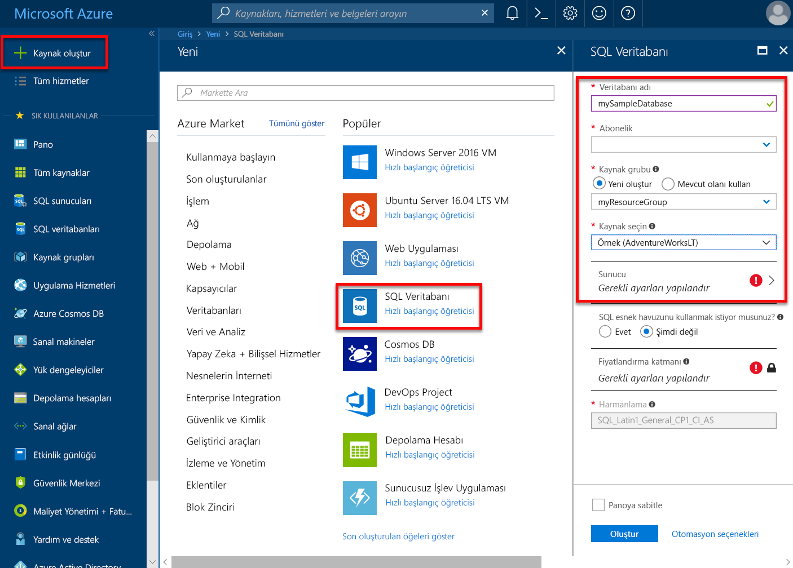
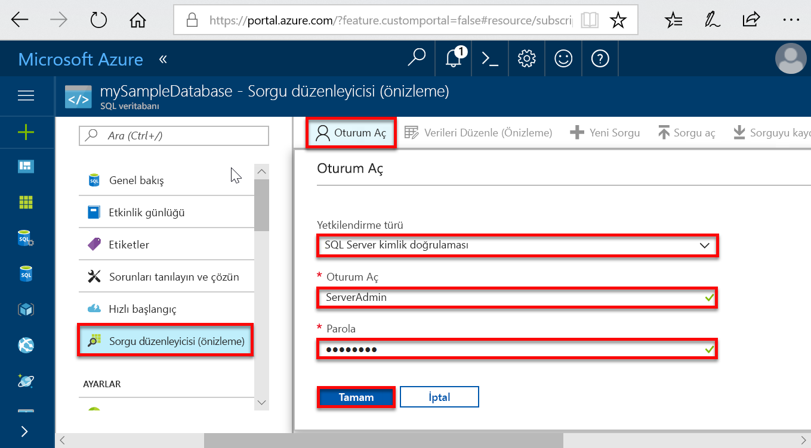
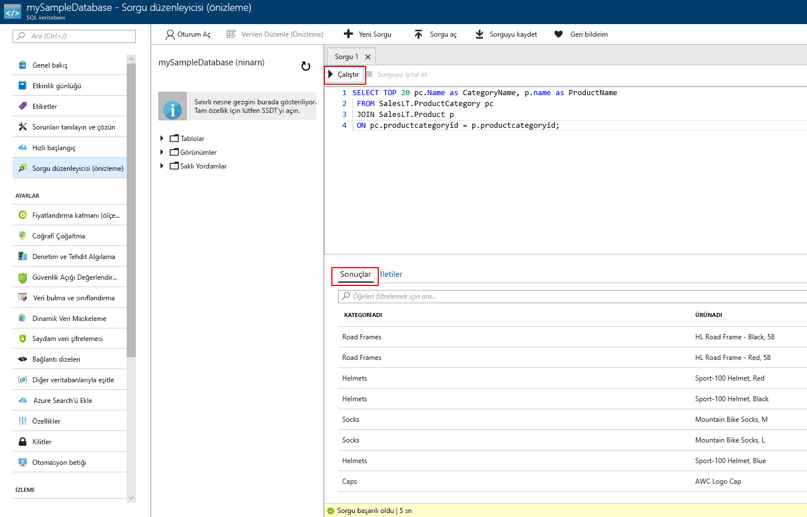

# <a name="quickstart-create-a-single-database-in-azure-sql-database-using-the-azure-portal"></a>Hızlı Başlangıç: Azure portalını kullanarak Azure SQL veritabanı tek veritabanı oluşturma

Oluşturma bir [tek veritabanı](sql-database-single-database.md) Azure SQL veritabanında bir veritabanı oluşturmak için hızlı ve kolay bir dağıtım seçeneğidir. Bu hızlı başlangıçta oluşturma ve ardından Azure portalını kullanarak tek bir veritabanını sorgulama gösterilmektedir.

Azure aboneliğiniz yoksa [ücretsiz bir hesap](https://azure.microsoft.com/free/) oluşturun.

Bu hızlı Başlangıçta tüm adımları için oturum açın [Azure portalında](https://portal.azure.com/).

## <a name="create-a-single-database"></a>Tek veritabanı oluşturma

Tek bir veritabanı ya da sağlanan veya sunucusuz oluşturulabilir (Önizleme) bilgi işlem katmanı.

- Sağlanan işlem katmanında tek bir veritabanını önceden ayrılmış işlem kaynakları tanımlanan bir miktarda ek iki birini kullanarak, bellek ve depolama kaynakları kümesi sahiptir [satın alma modeli](sql-database-purchase-models.md).
- Sunucusuz bilgi işlem katmanı tek bir veritabanında bir dizi otomatik-ölçeklendirilen işlem kaynakları yanı sıra belirli bir çekirdek başına bellek miktarını ve depolama kaynaklarını belirli bir miktarını ve yalnızca kullanılabilir [sanal çekirdek tabanlı satın alma modeli ](sql-database-service-tiers-vcore.md).

Tek bir veritabanı oluşturduğunuzda, aynı zamanda tanımlamış bir [SQL veritabanı sunucusu](sql-database-servers.md) yönetip içine yerleştirdiğiniz [Azure kaynak grubu](../azure-resource-manager/resource-group-overview.md) belirli bir bölgede.

> [!NOTE]
> Bu hızlı başlangıçta kullanılmaktadır [sanal çekirdek tabanlı satın alma modeli](sql-database-service-tiers-vcore.md) ve [sunucusuz](sql-database-serverless.md) katmanı, işlem ancak [DTU tabanlı satın alma modeli](sql-database-service-tiers-DTU.md) de kullanılabilir.

AdventureWorksLT örnek verilerini içeren tek bir veritabanı oluşturmak için:

1. Azure portalının sol üst köşesinde bulunan **Kaynak oluştur** öğesini seçin.
2. Seçin **veritabanları** seçip **SQL veritabanı** açmak için **SQL veritabanı oluşturma** sayfası.

   

3. Üzerinde **Temelleri** sekmesinde **Project Details** bölümüne yazın veya aşağıdaki değerleri seçin:

   - **Abonelik**: Açılan menü ve görünmüyorsa doğru aboneliği seçin.
   - **Kaynak grubu**: Seçin **Yeni Oluştur**, türü `myResourceGroup`seçip **Tamam**.

     

4. İçinde **veritabanı ayrıntıları** bölümüne yazın veya aşağıdaki değerleri seçin:

   - **Veritabanı adı**: `mySampleDatabase` yazın.
   - **Sunucu**: Seçin **Yeni Oluştur** ve aşağıdaki değerleri girin ve ardından **seçin**.
       - **Sunucu adı**: Tür `mysqlserver`; bazı sayılar için benzersizlik yanı sıra.
       - **Sunucu Yöneticisi oturum açma**: `azureuser` yazın.
       - **Parola**: Parola gereksinimlerini karşılayan bir karmaşık bir parola yazın.
       - **Konum**: Açılan listeden, aşağıdaki gibi bir konum seçin `West US 2`.

         

      > [!IMPORTANT]
      > Sunucu Yöneticisi oturum açma ve parola, sunucu ve veritabanları için bu ve diğer hızlı başlangıçlar oturum açabilmek kaydetmeyi unutmayın. Oturum açma veya parolayı unutursanız, oturum açma adı veya parola sıfırlamasına **SQL server** sayfası. Açmak için **SQL server** sayfasında, veritabanı sunucu adını seçin **genel bakış** veritabanı oluşturulduktan sonra sayfa.

        

   - **SQL esnek havuzu kullanmak istediğiniz**: Seçin **Hayır** seçeneği.
   - **İşlem ve depolama**: Seçin **yapılandırma veritabanı** ve bu hızlı başlangıçta **sanal çekirdek tabanlı satın alma seçenekleri**

     

   - Seçin **sunucusuz**.

     

   - Ayarlarını gözden geçirip **en çok sanal çekirdek**, **en düşük Vcore**, **otomatik duraklatma gecikme**, ve **veri boyutu en fazla**. Bunları istediğiniz gibi değiştirin.
   - Önizleme koşullarını kabul edin ve tıklayın **Tamam**.
   - **Uygula**’yı seçin.

5. Seçin **ek ayarlar** sekmesi. 
6. İçinde **veri kaynağı** bölümündeki **mevcut verilerden yararlanabilirsiniz**seçin `Sample`. 

   

   > [!IMPORTANT]
   > Seçtiğinizden emin olun **örnek (AdventureWorksLT)** bu ve bu verileri kullanan diğer Azure SQL veritabanı hızlı başlangıçları kolayca izleyebilmeniz veri.

7. Geri kalan değerler varsayılan ve select bırakın **gözden geçir + Oluştur** formun alt kısmındaki.
8. Son ayarları gözden geçirin ve seçin **Oluştur**.

9. Üzerinde **SQL veritabanı** form, select **Oluştur** dağıtma ve kaynak grubu, sunucu ve veritabanı sağlama.

## <a name="query-the-database"></a>Veritabanını sorgulama

Yerleşik sorgu aracını Azure portalında bir veritabanı oluşturduğunuza göre veritabanına bağlanmak ve verileri sorgulamak için kullanın.

1. Üzerinde **SQL veritabanı** seçin, veritabanı için sayfa **sorgu Düzenleyicisi (Önizleme)** soldaki menüde.

   

2. Oturum açma bilgilerinizi girin ve seçin **Tamam**.
3. Aşağıdaki sorguyu girin **sorgu Düzenleyicisi** bölmesi.

   ```sql
   SELECT TOP 20 pc.Name as CategoryName, p.name as ProductName
   FROM SalesLT.ProductCategory pc
   JOIN SalesLT.Product p
   ON pc.productcategoryid = p.productcategoryid;
   ```

4. Seçin **çalıştırma**ve ardından sorgu sonuçlarını gözden **sonuçları** bölmesi.

   

5. Kapat **sorgu Düzenleyicisi** sayfasında ve seçin **Tamam** kaydedilmemiş düzenlemelerinizi iptal etmek isteyip istemediğiniz sorulduğunda.

## <a name="clean-up-resources"></a>Kaynakları temizleme

Bu kaynak grubu, veritabanı sunucusu ve tek veritabanı için gitmek isterseniz tutmak [sonraki adımlar](#next-steps). Sonraki adımlar bağlanın ve farklı yöntemler kullanarak veritabanını sorgulama işlemini göstermektedir.

Bu kaynakları kullanarak tamamladığınızda, aşağıda gösterildiği gibi silebilirsiniz:

1. Azure portalında sol menüden seçim yapın **kaynak grupları**ve ardından **myResourceGroup**.
2. Kaynak grubu sayfanızda seçin **kaynak grubunu Sil**.
3. Girin *myResourceGroup* alan ve ardından **Sil**.

## <a name="next-steps"></a>Sonraki adımlar

- Şirket içi veya uzak Araçlar tek bir veritabanına bağlanmak için sunucu düzeyinde güvenlik duvarı kuralı oluşturun. Daha fazla bilgi için [sunucu düzeyinde güvenlik duvarı kuralı oluşturma](sql-database-server-level-firewall-rule.md).
- Bir sunucu düzeyinde güvenlik duvarı kuralı oluşturduktan sonra [bağlanma ve sorgulama](sql-database-connect-query.md) birkaç farklı araçları ve dilleri kullanarak veritabanınızı.
  - [SQL Server Management Studio kullanarak bağlanma ve sorgulama](sql-database-connect-query-ssms.md)
  - [Azure Data Studio kullanarak bağlanma ve sorgulama](https://docs.microsoft.com/sql/azure-data-studio/quickstart-sql-database?toc=/azure/sql-database/toc.json)
- Azure CLI'yı kullanarak sağlanan işlem katmanında tek bir veritabanı oluşturmak için bkz [Azure CLI örnekleri](sql-database-cli-samples.md).
- Azure PowerShell kullanarak sağlanan işlem katmanında tek bir veritabanı oluşturmak için bkz [Azure PowerShell örnekleri](sql-database-powershell-samples.md).
- Azure Powershell kullanarak sunucusuz işlem katmanında tek bir veritabanı oluşturmak için bkz [PowerShell kullanarak sunucusuz veritabanı oluştur](sql-database-serverless.md#create-new-database-using-powershell)
