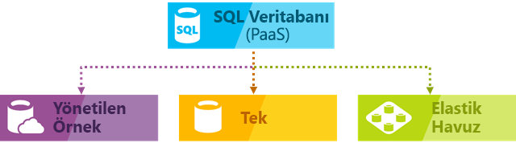
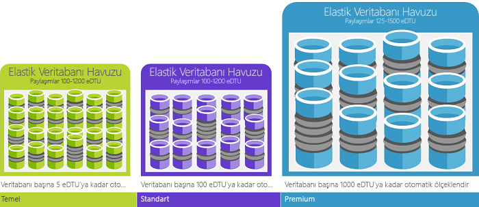
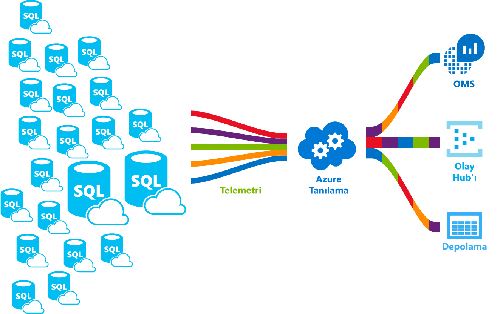

# Azure SQL veritabanı hizmeti nedir

Azure SQL veritabanı, yüksek oranda kullanılabilir olarak oluşturmanızı sağlayan yönetilen çok amaçlı ilişkisel veritabanı hizmeti ve Microsoft Azure bulut çözümleri ve uygulamaları için yüksek performanslı veri depolama katmanı olan. SQL veritabanı, çeşitli modern bulut uygulamaları için doğru seçenek olabilir, çünkü hem ilişkisel verileri hem de işleme için güçlü işlevlerini kullanmanıza olanak sağlar ve [ilişkisel olmayan yapılar](sql-database-multi-model-features.md) grafikler, JSON, uzamsal gibi ve XML. En son kararlı sürümünü alan [Microsoft SQL Server veritabanı altyapısı](https://docs.microsoft.com/sql/sql-server/sql-server-technical-documentation?toc=/azure/sql-database/toc.json) ve zengin Gelişmiş sorgu işleme gibi özelliklerini kullanmanıza olanak tanır [yüksek performanslı bellek içi teknolojileri](sql-database-in-memory.md)ve [akıllı sorgu işleme](https://docs.microsoft.com/sql/relational-databases/performance/intelligent-query-processing?toc=/azure/sql-database/toc.json). Microsoft'un bulut öncelikli stratejisi kapsamında en yeni SQL Server özellikleri önce SQL Veritabanı'na, ardından da SQL Server'ın kendine uygulanır. Bu yaklaşım sayesinde düzeltme veya yükseltme zahmetine girmeden milyonlarca veritabanında test edilmiş en yeni SQL Server özelliklerine sahip olabilirsiniz. SQL veritabanı, kolayca tanımlamak ve iki farklı satın alma modeli içinde performans ölçeğini olanak tanır: bir [sanal çekirdek tabanlı satın alma modeli](sql-database-service-tiers-vcore.md) ve [DTU tabanlı satın alma modeli](sql-database-service-tiers-dtu.md). SQL veritabanı, yerleşik yüksek kullanılabilirlik, yedeklemeleri ve diğer ortak bakım işlemleri tam olarak yönetilen hizmetidir. Microsoft, tüm düzeltme eki uygulama ve sorunsuz bir şekilde SQL ve işletim sistemi kodunu güncelleştirme işler ve altyapının tüm yönetim dengelediği.

> [!NOTE]
> Bir Azure SQL veritabanı'nda terimler sözlüğü için bkz: [SQL veritabanı terimler sözlüğü](sql-database-glossary-terms.md)

Azure SQL Veritabanı, bir Azure SQL veritabanı için aşağıdaki dağıtım seçeneklerini sunar:

- [Tek veritabanı](sql-database-single-database.md) modern bulut uygulamaları için mükemmel seçimdir yalıtılmış veritabanı tam olarak yönetilen ve tek bir güvenilir veri kaynağına ihtiyacınız mikro hizmetler temsil eder. Tek bir veritabanı benzer bir [içerdiği veritabanları](https://docs.microsoft.com/sql/relational-databases/databases/contained-databases?toc=/azure/sql-database/toc.json) içinde [Microsoft SQL Server veritabanı altyapısı](https://docs.microsoft.com/sql/sql-server/sql-server-technical-documentation?toc=/azure/sql-database/toc.json).
- [Yönetilen örnek](sql-database-managed-instance.md) tam olarak yönetilen bir örneğinin [Microsoft SQL Server veritabanı altyapısı](https://docs.microsoft.com/sql/sql-server/sql-server-technical-documentation?toc=/azure/sql-database/toc.json) birlikte kullanılabilecek bir veritabanları kümesi içeren. Bunu şirket içi SQL Server veritabanlarını Azure buluta kolay geçişi için ve SQL Server veritabanı altyapısı sağlayan güçlü veritabanı özelliklerinden yararlanmasını gerek duyan uygulamalar için mükemmel bir seçimdir.
- [Elastik havuz](sql-database-elastic-pool.md) koleksiyonudur [tek veritabanları](sql-database-single-database.md) CPU veya bellek gibi kaynakların paylaşılan bir grup. Tek veritabanları, içine ve elastik havuz dışına taşınabilir.

> [!IMPORTANT]
> Farklı Azure SQL veritabanı dağıtım seçenekleri arasındaki farklar yanı sıra, SQL veritabanı ve SQL Server arasındaki özellik farklarını anlamak için bkz [SQL özellikleri](sql-database-features.md).

SQL veritabanı ile birden çok kaynak türleri, hizmet katmanları ve bilgi işlem boyutlarına hiç kapalı kalma süresi, yerleşik zeka iyileştirmesi, global ölçeklenebilirlik ve kullanılabilirlik ve Gelişmiş Güvenlik ile dinamik ölçeklenebilirlik sunan, tahmin edilebilir performans sunar. seçenekleri — neredeyse sıfır yönetim gereksinimiyle. Bu özellikler sayesinde değerli zamanınızı ve kaynaklarınızı sanal makine ve altyapı yönetimi yerine hızlı uygulama geliştirmeye ve piyasaya sunma sürenizi kısaltmaya ayırabilirsiniz. SQL Veritabanı şu anda dünyanın farklı yerlerindeki toplam 38 veri merkezini kullanmaktadır ve düzenli aralıklarla eklenen yeni veri merkezleri, veritabanınızı bulunduğunuz konuma yakın bir veri merkezinde çalıştırmanızı sağlar.

## Ölçeklenebilir performans ve havuzlar

SQL veritabanı'nın tüm özellikleri, atanacak kaynakların miktarını tanımlamanıza imkan tanır. 
- Tek veritabanları ile birbirine ve taşınabilir, her işlem, bellek ve depolama kaynakları kendi garanti edilen miktarda ile her veritabanı yalıtılır. SQL veritabanı için farklı gereksinimleri - farklı bilgi işlem, bellek ve depolama kaynakları ve yeteneği dinamik olarak sağlar [tek veritabanı kaynaklarının ölçeğini](sql-database-single-database-scale.md) yukarı ve aşağı. [Hiper ölçekli hizmet katmanı](sql-database-service-tier-hyperscale.md) tek veritabanı 100 TB için ölçeklendirme ile hızlı yedekleme ve geri yükleme sağlar.
- Elastik havuzlar sayesinde yeni veritabanları oluşturabilir veya tek veritabanları kaynaklarının kullanımını en üst düzeye çıkarmak ve para - ve yeteneği dinamik olarak kaydetmek için bir kaynak havuzunun dışına taşıma [ölçeğini elastik havuz kaynakları](sql-database-elastic-pool-scale.md) yukarı ve aşağı.
- Yönetilen örneği ile her yönetilen örnek garanti edilen kaynaklarla diğer örneklerden yalıtılır. Kaynaklar - ve yeteneği bir dizi örnek veritabanları bir yönetilen örnek içinde dinamik olarak paylaşma [yönetilen örnek kaynaklarının ölçeğini](sql-database-managed-instance-resource-limits.md) yukarı ve aşağı.

Düşük bir maliyetle genel amaçlı hizmet katmanındaki aylık küçük, tek bir veritabanı üzerinde ilk uygulamanızı oluşturun ve ardından Hizmet katmanını elle veya programlama yoluyla herhangi bir zamanda, çözümünüzün gereksinimlerini karşılamak için iş kritik hizmet katmanına değiştirebilirsiniz. Performansı uygulamanız veya müşterileriniz kesinti yaşamadan ayarlayabilirsiniz. Dinamik ölçeklenebilirlik, veritabanınızın hızla değişen kaynak gereksinimlerine hızlı şekilde yanıt vermesini ve yalnızca ihtiyaç duyduğunuz kaynaklara ve ihtiyaç duyduğunuz süre boyunca ödeme yapmanızı sağlar.

Dinamik ölçeklenebilirlik, otomatik ölçeklendirmeden farklıdır. Bir hizmet ölçütlere dayalı olarak otomatik şekilde ölçeklendirildiğinde otomatik ölçeklendirme oluşurken, dinamik ölçeklenebilirlik ise kesinti süresi olmadan el ile ölçeklendirmeye olanak sağlar. Tek bir veritabanı destekler: el ile dinamik ölçeklenebilirlik, ancak otomatik ölçeklendirme değil. Daha *otomatik* bir deneyim için, veritabanlarının tek tek veritabanı gereksinimlerine göre bir havuzdaki kaynakları paylaşmasına olanak sağlayan elastik havuzları kullanın. Ancak, tek bir veritabanı için ölçeklenebilirlik otomatikleştirilmesine yardımcı olur betik vardır. Bir örnek için bkz. [PowerShell kullanarak tek bir veritabanının ölçeğini yarayan](scripts/sql-database-monitor-and-scale-database-powershell.md).

### Modelleri, hizmet katmanları, bilgi işlem boyutlarına ve depolama alanı miktarları satın alma

SQL veritabanı iki satın alma modeli sunar:
- [Sanal çekirdek tabanlı satın alma modeli](sql-database-service-tiers-vcore.md) sanal çekirdek miktarı veya bellek ve miktarını sayısını ve depolama hızını seçmenize olanak sağlar. Sanal çekirdek tabanlı satın alma modeli de kullanmanıza olanak tanır [SQL Server için Azure hibrit avantajı](https://azure.microsoft.com/pricing/hybrid-benefit/) maliyet tasarrufu elde etmek için. Azure hibrit Avantajı hakkında daha fazla bilgi için bkz: [sık sorulan sorular](#sql-database-frequently-asked-questions-faq).
- [DTU tabanlı satın alma modeli](sql-database-service-tiers-dtu.md) işlem, bellek, hafif ve ağır veritabanı iş yüklerini desteklemek için üç hizmet katmanı g/ç kaynakları karışımını sunar. İşlem boyutları her katman içinde ek depolama kaynakları ekleyebileceğiniz, bu kaynakları farklı bir karışımını sağlar.

### Kaynak kullanımını en verimli hale getirmek için elastik havuzlar

Tek veritabanı oluşturabilmek ve veritabanı performansını isteğe göre yükseltip düşürebilmek, özellikle kullanım biçimlerinin nispeten tahmin edilebilir olduğu durumlarda birçok işletme ve uygulama için yeterlidir. Ancak tahmin edilemeyen kullanım biçimlerine sahipseniz bu durum maliyetlerin ve iş modelinizin yönetimini zorlaştırabilir. [Elastik havuzlar](sql-database-elastic-pool.md) bu sorunu çözmek için tasarlanmıştır. Esnek havuzların işleyiş mantığı gayet basittir. Performans kaynaklarını tek bir veritabanı yerine bir havuz ayırmak ve tek veritabanı performansı yerine havuzun toplu performansı kaynakları için ödeme yaparsınız.

   

Elastik havuzlar sayesinde kaynak talebindeki dalgalanmalara ayak uydurmak için veritabanı performansında sürekli ayarlama yapmanız gerekmez. Havuza alınan veritabanları, gerektiğinde elastik havuzun performans kaynaklarını tüketir. Havuza alınan veritabanları havuzu kullanır ancak havuz sınırlarını aşmaz, böylece veritabanı kullanımınız tahmin edilebilir olmasa bile maliyetleriniz için durum tam tersidir. Ayrıca kontrolü sizin elinizde olan bir bütçe dahilinde [havuza veritabanı ekleme ve havuzdan veritabanı kaldırma](sql-database-elastic-pool-manage-portal.md) işlemlerini gerçekleştirebilir ve uygulamanızı birkaç veritabanından tutun binlerce veritabanına ölçeklendirebilirsiniz. Havuzdaki veritabanlarına sunulan kaynakların alt ve üst sınırlarını denetleyerek havuzdaki veritabanlarının havuzdaki tüm kaynakları kullanmasını önleyebilir ve havuza alınan tüm veritabanlarının kaynaklardan pay almasını garanti edebilirsiniz. Esnek havuzları kullanan SaaS uygulamalarının tasarım desenleri hakkında daha fazla bilgi edinmek için bkz. [SQL Veritabanı kullanan Çok Kiracılı SaaS Uygulamaları için Tasarım Desenleri](sql-database-design-patterns-multi-tenancy-saas-applications.md).

Betikler, elastik havuzların izlenmesine ve ölçeklendirilmesine yardımcı olabilir. Örnek için bkz. [PowerShell kullanarak Azure SQL Veritabanında bir SQL elastik havuzunu izleme ve ölçeklendirme](scripts/sql-database-monitor-and-scale-pool-powershell.md)

> [!IMPORTANT]
> Yönetilen örneği, elastik havuzları desteklemez. Bunun yerine, bir yönetilen örnek, yönetilen örnek kaynakları paylaşan örnek veritabanları oluşan bir koleksiyondur.

### Tek veritabanlarını havuza alınan veritabanlarıyla karıştırma

Tek veritabanlarını elastik havuzlarla ve tek veritabanları ve elastik havuzların hizmet katmanlarını hızla ve kolayca değiştirmek kendi durumunuza uyarlamak için. Azure'un benzersiz gücü ve erişim özellikleri sayesinde benzersiz uygulama tasarımı ihtiyaçlarınızı karşılamak, maliyet ve kaynak verimliliği sağlamak ve yeni iş fırsatlarını yakalamak amacıyla diğer Azure hizmetlerini SQL Veritabanı ile birleştirebilir ve eşleştirebilirsiniz.

## Kapsamlı izleme ve uyarı özellikleri

Performans değerlendirmeleriyle birlikte [yerleşik performans izleme](sql-database-performance.md) ve [uyarı](sql-database-insights-alerts-portal.md) araçlarını kullanırsınız. Bu araçları kullanarak geçerli veya projeye özgü performans ihtiyaçlarınıza göre ölçek büyütme veya küçültme işlemlerinin etkisini hızlı bir şekilde değerlendirebilirsiniz. SQL Veritabanı ayrıca izlemeyi kolaylaştırmak için [ölçümler ve tanılama günlükleri oluşturabilir](sql-database-metrics-diag-logging.md). SQL Veritabanını kaynak kullanımını, çalışanları, oturumları ve bu Azure kaynaklarından birine yapılan bağlantıları kaydedecek şekilde yapılandırabilirsiniz:

- **Azure depolama**: Maliyetlerle çok sayıda küçük için telemetri arşivleme için
- **Azure olay hub'ı**: SQL veritabanı telemetrisini özel izleme çözümünüz veya yoğun işlem hatlarıyla tümleştirmek için
- **Azure İzleyici günlüklerine**: Raporlama, uyarı ve azaltma özelliklerine sahip yerleşik izleme çözümü için.

    

## Kullanılabilirlik özellikleri

Geleneksel bir SQL Server ortamında yerel olarak tam (zaman uyumlu olarak tutulan) (AlwaysOn Kullanılabilirlik grupları veya yük devretme kümeleme örnekleri gibi özellikleri kullanarak) verilerin kopyaları karşı korumak için ayarlayın (en az) 2 makine genellikle olurdu bir tek bir makine/bileşen hatası.  Bu, yüksek düzeyde kullanılabilirlik sağlar ancak yok etme veri merkezinizin doğal afetler karşı korumaz.

Olağanüstü durum kurtarma varsayar bir felaket coğrafi olarak olacağını başka bir makine/makineler ile verilerinizin bir kopyasının uzakta kümeniz için yeterli yerelleştirilmiş.  SQL Server Always On kullanılabilirlik zaman uyumsuz modda çalışan grupları bu özellik almak için kullanabilirsiniz.  Açık sorunlar hızına genellikle kişiler uzakta yani olası veri kaybı, planlanmamış yük devretmeler yaptığınızda, bir işlem yapmadan önce gerçekleşen çoğaltmanın bekleyin istemediğiniz anlamına gelir.

Premium ve iş kritik hizmeti veritabanlarında katmanlarını zaten [çok benzer bir şey](sql-database-high-availability.md#premium-and-business-critical-service-tier-availability) bir kullanılabilirlik grubunda eşitleme. Daha düşük hizmet katmanlarındaki veritabanları depolama aracılığıyla yedeklilik sağlayan bir [farklı, ancak eşdeğer bir mekanizma](sql-database-high-availability.md#basic-standard-and-general-purpose-service-tier-availability). Tek makine hatasına karşı koruyan mantığı yoktur.  Etkin coğrafi çoğaltma özelliği burada tüm bölge yok olağanüstü durum karşı koruma olanağı verir.

Azure kullanılabilirlik alanları, yüksek kullanılabilirlik sorunu Yürüt ' dir.  Tek bir bölgede oluşturma tek bir veri merkezi kesintisi karşı korumak çalışır.  Bu nedenle, güç veya bir yapı için ağ kaybına karşı koruma sağlamak istiyor. SQL Azure bu farklı kopyaya farklı kullanılabilirlik alanlarında yerleştirerek çalışır (farklı binalar, etkili bir şekilde) ve aksi takdirde önceki gibi çalışmaya.

Aslında, Azure'nın sektörde lider % 99,99 kullanılabilirlik hizmet düzeyi sözleşmesi [(SLA)](https://azure.microsoft.com/support/legal/sla/), Microsoft tarafından yönetilen veri merkezlerinden oluşan küresel bir ağı tarafından desteklenen, uygulamanızın 7/24 çalışan uğramamasına yardımcı olur. Azure platformu, tam olarak her veritabanı yöneten ve hiçbir veri kaybı ve yüksek miktarda veri kullanılabilirliği garanti eder. Azure düzeltme eki uygulama, yedekleme, çoğaltma, hata algılama, arka plandaki potansiyel donanım, yazılım veya ağ arızaları, hata giderme, yük devretme, veritabanı yükseltmesi ve diğer bakım görevlerini otomatik olarak gerçekleştirir. Standart kullanılabilirlik düzeyine ulaşmak için işlem ve depolama katmanları ayrılır. Premium kullanılabilirliği, işlem ve depolama performansı için tek bir düğümde tümleştirme ve ardından perde Always On kullanılabilirlik grupları için benzer teknoloji uygulayarak elde edilir. Azure SQL veritabanı yüksek kullanılabilirlik özellikleri tam bir irdelemesi için bkz: [SQL veritabanı kullanılabilirlik](sql-database-high-availability.md). SQL Veritabanı ayrıca aşağıdakiler dahil olmak üzere yerleşik [iş sürekliliği ve global ölçeklenebilirlik](sql-database-business-continuity.md) özelliklerine sahiptir:

- **[Otomatik yedeklemeler](sql-database-automated-backups.md)** :

  SQL veritabanı, tam, değişiklik yedeklemelerinin ve işlem günlüğü yedeklemeleri Azure SQL veritabanı, herhangi bir noktasına geri yükleme sağlamak için otomatik olarak gerçekleştirir. Tek veritabanları ve havuza alınmış veritabanları için uzun süreli yedek saklama için Azure depolama için tam veritabanı yedeklemelerini depolamak için SQL veritabanı'nı yapılandırabilirsiniz. Yönetilen örnek için uzun süreli yedek saklama için yalnızca kopya yedekleri de gerçekleştirebilirsiniz.

- **[Zaman içinde nokta geri yüklemeler](sql-database-recovery-using-backups.md)** :

  Tüm SQL veritabanı dağıtım seçeneklerine zaman herhangi bir Azure SQL veritabanı otomatik yedek elde tutma dönemi içinde bir noktaya geri destekler.
- **[Etkin coğrafi çoğaltma](sql-database-active-geo-replication.md)** :

  Tek veritabanı ve havuza alınmış veritabanları, en fazla dört okunabilir ikincil veritabanı yapılandırmanızı aynı ya da Global olarak dağıtılmış Azure veri merkezlerinden sağlar.  Örneğin, yüksek hacimli eşzamanlı salt okunur işlemlere sahip bir katalog veritabanı kullanan bir SaaS uygulamanız varsa, etkin coğrafi çoğaltmayı kullanarak global okuma ölçeğini etkinleştirebilir ve birincil veritabanı üzerindeki okuma iş yükü kaynaklı performans sorunlarını ortadan kaldırabilirsiniz. Yönetilen örnek için otomatik yük devretme grupları kullanın.
- **[Otomatik Yük devretme grupları](sql-database-auto-failover-group.md)** :

  Tüm SQL veritabanı dağıtım seçeneklerine yüksek kullanılabilirliği etkinleştirme ve Yük Dengeleme saydam coğrafi çoğaltma ve yük devretme veritabanları, elastik havuzlar ve yönetilen örnekleri büyük kümeleri dahil olmak üzere global ölçekte, yük devretme grupları kullanmanıza olanak sağlar. Yük devretme grupları, en az yönetim yükü tüm karmaşık izleme, Yönlendirme ve yük devretme düzenlemesini SQL veritabanı'na bırakarak ile Global olarak dağıtılmış SaaS uygulamalarının oluşturulmasını sağlar.
- **[Bölgesel olarak yedekli veritabanları](sql-database-high-availability.md)** :

  SQL veritabanı birden çok kullanılabilirlik alanında premium sağlama veya iş kritik veritabanları ya da elastik havuzlar sağlar. Bu veritabanları ve elastik havuzlar yüksek kullanılabilirlik için birden fazla yedekli çoğaltma içerdiğinden, bu çoğaltmaların birden fazla kullanılabilirlik alanına yerleştirilmesi, veri merkezi ölçek hatalarından veri kaybı olmadan otomatik olarak kurtarma becerisi de dahil olmak üzere daha yüksek esneklik sağlar.

## Yerleşik zeka

SQL Veritabanı ile veritabanı çalıştırma ve yönetim maliyetlerini önemli ölçüde azaltmanıza yardımcı olan ve uygulamanızı hem performans hem de güvenlik açısından üst düzeye taşıyan yerleşik zekaya sahip olursunuz. Her saniye milyonlarca müşterinin iş yükünü çalıştıran SQL Veritabanı çok büyük miktarlarda telemetri verilerini toplayıp işlemenin yanı sıra arka planda müşteri gizliliğini de korumaktadır. Telemetri verilerini sürekli değerlendiren çok farklı algoritmalar sayesinde hizmet uygulamanızı öğrenip kendini ona göre uyarlayabilir. Hizmet bu analize dayalı olarak iş yükünüze özel performans geliştirme önerileri sunar.

### Otomatik performans izleme ve ayarlama

SQL Veritabanı izlemeniz gereken sorgularla ilgili ayrıntılı öngörüler sunar. SQL Veritabanı'nın veritabanı desenleriniz hakkında öğrendikleri sayesinde veritabanı şemanızı iş yükünüze uyarlayabilirsiniz. SQL Veritabanı, [performans ayarlama önerilerinde](sql-database-advisor.md) bulunur. Siz de bu ayarları gözden geçirebilir ve uygulayabilirsiniz.

Ancak özellikle birden fazla veritabanıyla ilgilenirken bir veritabanını sürekli izlemek zor ve yorucu bir görevdir. [Akıllı Öngörüler](sql-database-intelligent-insights.md), SQL Veritabanı performansını otomatik olarak ölçekte izleyerek bu işi sizin için yapar ve performans düşüşü sorunlarını size bildirir, sorunun kök kaynağını belirler ve mümkün olduğunda performans iyileştirme önerileri sağlar.

Çok sayıda veritabanını yönetmek SQL Veritabanı ve Azure portalı tarafından sunulan araçlarla bile verimli şekilde yapılması imkanız bir görev haline gelebilir. Veritabanınızı el ile izlemek ve ayarlamak yerine izleme ve ayarlama işlerinin bazılarını SQL Veritabanı'na bırakarak [otomatik ayarlamayı](sql-database-automatic-tuning.md) kullanabilirsiniz. SQL Veritabanı önerileri otomatik olarak uygular, test eder ve yapılan tüm ayarları doğrulayarak performansın arttığından emin olur. SQL Veritabanı bu şekilde iş yükünüze kontrollü ve güvenli bir şekilde ayak uydurur. Otomatik ayarlama, veritabanınızın performansının dikkatli bir şekilde izlenmesi ve her ayar işleminden önce ve sonraki durumunun karşılaştırılarak performans artışı görülmediği durumlarda ayarların geri alındığı bir durumdur.

Bugün SQL Veritabanı üzerinde [çok kiracılı SaaS multi-tenant uygulamaları](sql-database-design-patterns-multi-tenancy-saas-applications.md) çalıştıran iş ortaklarımızın çoğu uygulamalarının kararlı ve tahmin edilebilir performansa sahip olduğundan emin olmak için otomatik performans ayarlarına güveniyor. İş ortaklarımız bu özelliğin gecenin ortasında performans sorunu yaşama riskini önemli ölçüde azalttığını söylüyor. Ayrıca müşterilerinin belirli bölümü SQL Server kullandığından SQL Server müşterilerine yardımcı olmak için SQL Veritabanı tarafından sunulan dizinleme önerilerinden faydalanıyorlar.

[SQL Veritabanında](sql-database-automatic-tuning.md) iki otomatik ayarlama yöntemi mevcuttur:

- **Otomatik dizin yönetimi**: Veritabanınıza eklenmesi ve veritabanınızdan kaldırılması gereken dizinleri tanımlar.
- **Otomatik plan düzeltme**: Sorunlu planları tanımlar ve SQL planı performans sorunlarını düzeltir (yakında, SQL Server 2017 ile kullanılabilir).

### Uyarlamalı sorgu işleme

SQL Veritabanı'na çok durumlu tablo değerli işlevler için araya eklemeli yürütme, toplu iş modu bellek ataması geri bildirimi ve toplu iş modu uyarlamalı birleşimler dahil olmak üzere [uyarlamalı sorgu işleme](/sql/relational-databases/performance/intelligent-query-processing) özellik ailesini de ekliyoruz. Bu uyarlamalı sorgu işleme özelliklerinin her biri benzer "öğren ve uyarla" tekniklerini uygulayarak geçmişe dönük zorlu sorgu iyileştirme sorunlarıyla ilgili performans sorunlarında yardımcı olmaktadır.

## Gelişmiş koruma ve uyumluluk

SQL Veritabanı, uygulamanızın çeşitli güvenlik ve uyumluluk gereksinimlerine uygun olmasına yardımcı olmak için bir dizi [yerleşik güvenlik ve uyum özelliğine](sql-database-security-overview.md) sahiptir.

> [!IMPORTANT]
> Azure SQL veritabanı (tüm dağıtım seçeneklerini) sertifikalıdır bir dizi uyumluluk standardı karşı. Daha fazla bilgi için [Microsoft Azure Trust Center](https://gallery.technet.microsoft.com/Overview-of-Azure-c1be3942) burada bulabilirsiniz SQL veritabanı uyumluluk sertifikaları en güncel listesi.

### Gelişmiş Tehdit Koruması

Gelişmiş veri güvenliği, Gelişmiş SQL güvenlik özellikleri için birleştirilmiş bir pakettir. Hassas verileri keşfedip sınıflandırma, veritabanınızın güvenlik açıklarını yönetme ve veritabanınıza ilişkin bir tehdit belirtisi olabilecek anormal etkinlikleri algılamaya yönelik işlevsellik sağlar. Bu özellikler tek bir konumdan etkinleştirilebilir ve yönetilebilir.

- [Veri bulma & sınıflandırma](sql-database-data-discovery-and-classification.md):

  Bu özellik (şu anda önizlemede), bulma, Sınıflandırma, etiketleme ve veritabanlarınızı hassas verileri korumak için Azure SQL veritabanında yerleşik özellikler sağlar. Veri sınıflandırma durumunuz için görünürlük sağlamanın yanı sıra veritabanı içindeki ve dışındaki hassas verilere erişimin izlenmesi için kullanılabilir.
- [Güvenlik Açığı değerlendirmesi](sql-vulnerability-assessment.md):

  Bu hizmet, bulmak, izlemek ve olası veritabanı güvenlik açıklarını düzeltin yardımcı. Güvenlik durumunuz hakkında görünürlük sağlamasının yanı sıra güvenlik sorunlarınızı çözmek ve veritabanı güçlendirmelerinizi geliştirmek için eyleme dönüştürülebilir adımlar sunar.
- [Tehdit algılama](sql-database-threat-detection.md):

  Bu özellik erişmek veya veritabanınızı yararlanmak için sıra dışı ve zararlı olabilecek girişimleri gösteren anormal etkinlikleri algılar. Veritabanınızı şüpheli etkinliklere karşı sürekli izler ve olası güvenlik açıkları, SQL ekleme saldırıları ve anormal veritabanı erişim modelleri hakkında anında güvenlik uyarıları sunar. Tehdit algılama uyarıları, şüpheli etkinlik ayrıntılarını sağlayın ve eylemi araştırmak ve tehdidi azaltmak için önerilir.

### Uyumluluk ve güvenlik denetimi

[Denetim](sql-database-auditing.md) veritabanı olaylarını izler ve bir denetim günlüğüne Azure depolama hesabınızdaki yazar. Denetim mevzuatla uyumluluk, veritabanı etkinliğini anlama ve işletme sorunlarını veya şüpheli güvenlik ihlallerini işaret edebilecek farklılıklar ve anormal durumlar hakkında öngörü sahip olmanıza yardımcı olabilir.

### Veri şifrelemesi

SQL veritabanı ile Hareket halindeki veriler için şifreleme sağlayarak verilerinizi korur [Aktarım Katmanı Güvenliği](https://support.microsoft.com/kb/3135244), ile bekleyen veriler için [saydam veri şifrelemesi](https://docs.microsoft.com/sql/relational-databases/security/encryption/transparent-data-encryption-azure-sql)ve kullanılmakta olan veriler için [ her zaman şifreli](https://docs.microsoft.com/sql/relational-databases/security/encryption/always-encrypted-database-engine).

### Azure Active Directory tümleştirmesi ve çok faktörlü kimlik doğrulaması

SQL Veritabanı, [Azure Active Directory tümleştirmesi](sql-database-aad-authentication.md) ile veritabanı kullanıcısı ve diğer Microsoft hizmetleri kimliklerini bir merkezden yönetmenizi sağlar. Bu özellik, izin yönetimini kolaylaştırırken güvenliği artırır. Azure Active Directory, veri ve uygulama güvenliğini artırmak için [çok faktörlü kimlik doğrulamasını](sql-database-ssms-mfa-authentication.md) (MFA) ve çoklu oturum açma işlemini destekler.

### Uyumluluk sertifikası

SQL Veritabanı düzenli olarak denetimden geçmektedir ve birden fazla uyumluluk standardı sertifikasına sahiptir. Daha fazla bilgi için [Microsoft Azure Trust Center](https://gallery.technet.microsoft.com/Overview-of-Azure-c1be3942) burada bulabilirsiniz SQL veritabanı uyumluluk sertifikaları en güncel listesi.

## Kullanımı kolay araçlar

SQL Veritabanı uygulama oluşturma ve uygulamaların bakımını yapma işlemlerinin daha kolay ve daha verimli şekilde yapılmasını sağlar. SQL Veritabanı size, en iyi yaptığınız işe; mükemmel uygulamalar oluşturmaya odaklanma seçeneği sunar. Sahip olduğunuz araçları ve becerileri kullanarak SQL Veritabanı ile yönetebilir ve geliştirebilirsiniz.

- **[Azure portalında](https://portal.azure.com/)** :

  Tüm Azure hizmetleri yönetmek için web tabanlı bir uygulama
- **[SQL Server Management Studio](https://docs.microsoft.com/sql/ssms/download-sql-server-management-studio-ssms)** :

  SQL Server'dan SQL veritabanı tüm SQL altyapılarını yönetebileceğiniz ücretsiz ve indirilebilir istemci uygulaması
- **[SQL Server veri araçları, Visual Studio'da](https://docs.microsoft.com/sql/ssdt/download-sql-server-data-tools-ssdt)** :

  SQL Server ilişkisel veritabanları, Azure SQL veritabanları, Integration Services paketleri, Analysis Services veri modelleri ve Reporting Services raporları geliştirmeye yönelik ücretsiz ve indirilebilir istemci uygulaması.
- **[Visual Studio Code'u](https://code.visualstudio.com/docs)** :

  Windows, macOS ve Linux dahil olmak üzere uzantıları destekleyen bir ücretsiz, indirilebilir ve açık kaynak kod Düzenleyicisi [mssql uzantısı](https://aka.ms/mssql-marketplace) Microsoft SQL Server, Azure SQL veritabanı ve SQL veri ambarı'nı sorgulamak için.

SQL Veritabanı MacOS, Linux ve Windows üzerinde Python, Java, Node.js, PHP, Ruby ve .NET ile uygulama oluşturmayı destekler. SQL Veritabanı, SQL Server ile aynı [bağlantı kitaplıklarını destekler](sql-database-libraries.md).

## SQL veritabanı sık sorulan sorular (SSS)

### SQL veritabanı'nın geçerli sürümü nedir

Geçerli sürümü, SQL veritabanı V12 ' dir. Sürüm V11 kullanımdan kaldırılmıştır.

### Kapalı kalma süresi düzeltme eki uygulama oluştuğunda denetleyebilirim

Hayır. Düzeltme eki uygulama etkisini genellikle belirgin değil ise, [yeniden deneme mantığı uyguluyor](sql-database-develop-overview.md#resiliency) uygulamanızda. Azure SQL veritabanınızı planlı bakım olayları için hazırlanması hakkında daha fazla bilgi için bkz. [Azure SQL veritabanı'nda Azure bakım olayları için planlama](sql-database-planned-maintenance.md).

### Azure hibrit avantajı soruları

#### SQL Server için Azure hibrit avantajı ile çift kullanımlı hakları vardır

Geçişleri sorunsuz bir şekilde çalıştığından emin olmak için ikili kullanım hakları lisans 180 günü var. Bu 180 günlük süre sonra SQL Server Lisansı yalnızca SQL veritabanı bulutta kullanılabilir ve ikili kullanım hakları şirket içi yok ve bulut.

#### Azure hibrit avantajı, SQL Server için lisans taşınabilirliği ' farkı nedir

Bugün, lisans taşınabilirliği avantajlarından paylaşılan üçüncü taraf sunucular için lisanslarını yeniden atanmasına imkan tanır Yazılım Güvencesi içeren SQL Server müşterileri için sunuyoruz. Bu avantajı, Azure Iaas ve AWS EC2 üzerinde kullanılabilir.
SQL Server için Azure hibrit avantajı, lisans taşınabilirliği iki temel alanlarda farklıdır:

- Bu, yüksek oranda sanallaştırılmış iş yüklerini Azure'a taşımak için ekonomik avantajlarını sağlar. SQL EE müşteriler, 4 çekirdek alabilir yüksek oranda sanallaştırılmış uygulamalar için şirket içi oldukları her çekirdek için genel amaçlı SKU'SUNDA Azure'da içinde. Lisans taşınabilirliği sanallaştırılmış iş yüklerini buluta taşımak için herhangi bir özel maliyet avantajları izin vermez.
- SQL Server ile şirket içinde yüksek oranda uyumludur (SQL veritabanı yönetilen örneği) Azure PaaS hedefte sağlar

#### SQL Server için Azure hibrit Avantajı'ndan belirli haklar nelerdir

SQL veritabanı müşterilerinin, SQL Server için Azure hibrit avantajı ile ilişkili aşağıdaki hakkına sahip olursunuz:

|Lisans Ayak izi|Azure hibrit avantajı SQL Server almak sizin için yapar?|
|---|---|
|SQL Server Enterprise Edition çekirdek müşterilerle SA|<li>Genel amaçlı ya da iş açısından kritik SKU'SUNDA taban ücreti ödeyebilirsiniz</li> <li>1 çekirdek şirket içi genel amaçlı SKU'SUNDA 4 çekirdek =</li> <li>1 çekirdek şirket içi iş açısından kritik SKU'SUNDA 1 çekirdek =</li>|
|SQL Server Standard Edition çekirdek müşterilerle SA|<li>Taban fiyatı yalnızca genel amaçlı SKU'SUNDA ödeyebilirsiniz</li> <li>1 çekirdek şirket içi genel amaçlı SKU'SUNDA 1 çekirdek =</li>|
|||

## SQL Server mühendislik ekibi ile iletişime geçme

- [DBA Stack Exchange](https://dba.stackexchange.com/questions/tagged/sql-server): Veritabanı yönetimi hakkında sorular
- [Yığın Taşması](https://stackoverflow.com/questions/tagged/sql-server): Geliştirme hakkında sorular
- [MSDN Forumları](https://social.msdn.microsoft.com/Forums/home?category=sqlserver): Teknik sorular sorun
- [Geri bildirim](https://aka.ms/sqlfeedback): Rapor bildirimleri ve özellik istekleri
- [Reddit](https://www.reddit.com/r/SQLServer/): SQL Server'ı tartışmak

## Sonraki adımlar

- Tek veritabanı ve elastik havuz maliyet karşılaştırmaları ve hesaplayıcıları için bkz. [fiyatlandırma sayfası](https://azure.microsoft.com/pricing/details/sql-database/).
- Başlamanıza yardımcı olacak şu hızlı başlangıçlara bakın:

  - [Azure portalda SQL veritabanı oluşturma](sql-database-single-database-get-started.md)  
  - [Azure CLI ile SQL veritabanı oluşturma](sql-database-get-started-cli.md)
  - [PowerShell ile SQL veritabanı oluşturma](sql-database-get-started-powershell.md)

- Azure CLI ve PowerShell örnekleri için bkz.:
  - [SQL Veritabanı için Azure CLI örnekleri](sql-database-cli-samples.md)
  - [SQL Veritabanı için Azure PowerShell örnekleri](sql-database-powershell-samples.md)

 - Bunlar duyurulduğu gibi yeni özellikler hakkında bilgi için bkz: 
   - **[SQL veritabanı için Azure yol haritası](https://azure.microsoft.com/roadmap/?category=databases)**  -yenilikleri ve yakında çıkacak öğrenmek için bir yer.
  - **[Azure SQL veritabanı blogu](https://azure.microsoft.com/blog/topics/database)**  -Burada, SQL Server ürün ekibi üyeleri blog SQL veritabanı haberleri ve özellikleri hakkında bir yer.

