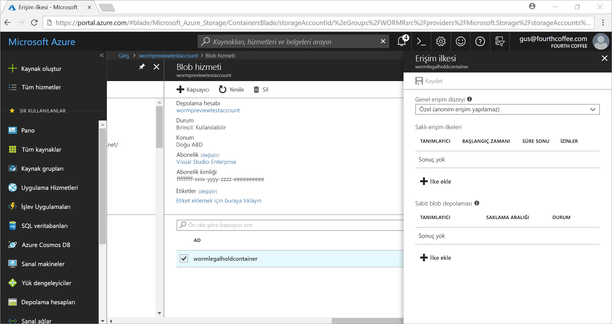
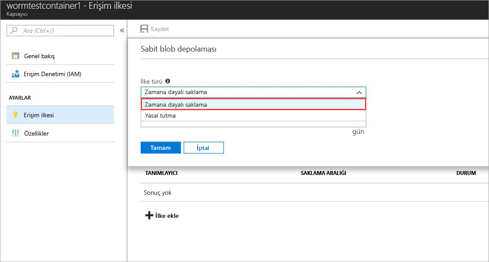
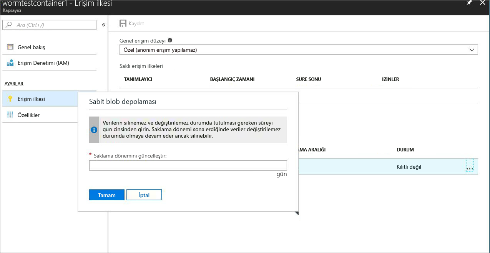
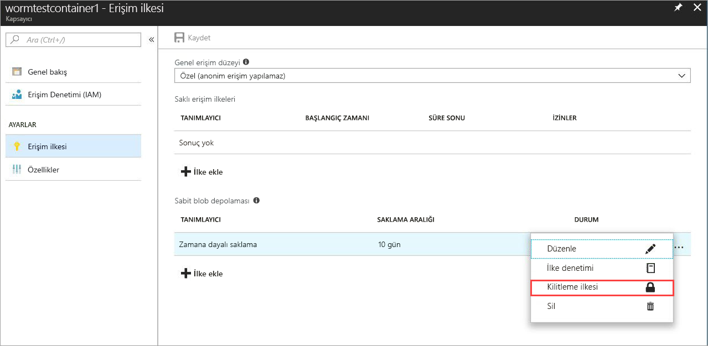
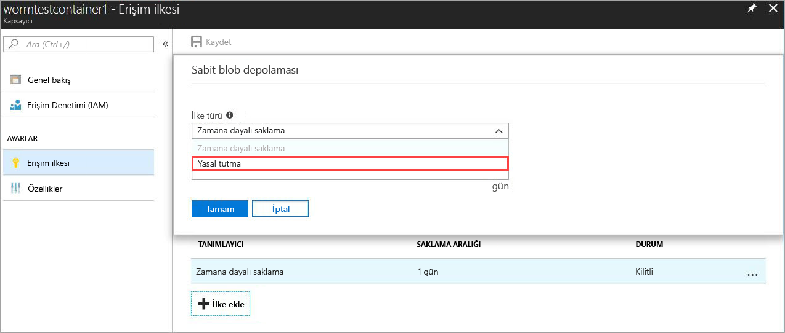
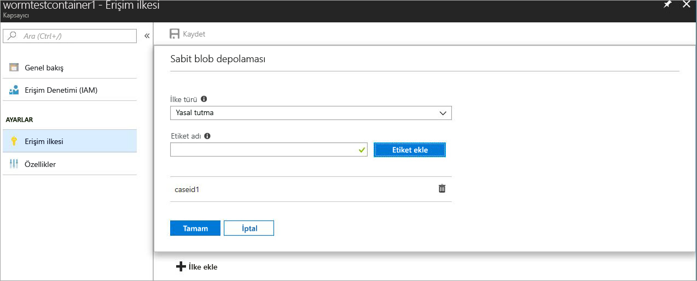

# <a name="store-business-critical-data-in-azure-blob-storage"></a>İş açısından kritik verilerin Azure Blob Depolama alanında Store

Azure Blob Depolama için sabit depolama, kullanıcıların bir SOLUCAN (yazma, okuma çok kez) durumda iş açısından kritik veri nesneleri depolamak sağlar. Bu durum verileri silinebilir olmayan ve değiştirilebilir olmayan bir kullanıcı tarafından belirtilen aralığı için yapar. BLOB nesnelerini oluşturulabilir ve okuma, ancak değil değiştirildi veya silindi, elde tutma aralığı boyunca. Sabit depolama genel amaçlı v2 ve Blob Depolama hesapları tüm Azure bölgelerinde etkin.

## <a name="overview"></a>Genel Bakış

Sabit depolama sağlık hizmeti kuruluşunda, Finans kuruluşları ve dağıtılmasından--verileri güvenli bir şekilde depolamak için özellikle Aracısı dağıtıcı kuruluşların--yardımcı olur. Ayrıca, değiştirme veya silme karşı kritik verileri korumak için hiçbir senaryoda de yararlanılabilir. 

Tipik kullanım alanları şunlardır:

- **Yasal Uyumluluk**: Azure Blob Depolama için sabit depolama, kuruluşlara adresi sn 17a-4(f), CFTC 1.31(d), STANDARTLAR ve diğer düzenlemelere yardımcı olur. Nasıl sabit depolama adresleri yasal gereksinimlerin aracılığıyla indirilebilir bir teknik incelemedir Cohasset ilişkilendirir tarafından ayrıntıları [Microsoft hizmet güveni portalı](https://aka.ms/AzureWormStorage). [Azure Güven Merkezi](https://www.microsoft.com/trustcenter/compliance/compliance-overview) uyumluluk sertifikalarımız ilgili ayrıntılı bilgiler içerir.

- **Belge bekletme güvenli**: Azure Blob Depolama için sabit depolama, veri değiştirilemez veya hesabı yönetici ayrıcalıklarına sahip kullanıcılar dahil olmak üzere herhangi bir kullanıcı tarafından silinmiş olduğunu sağlar.

- **Yasal tutma**: Azure Blob Depolama için sabit depolama kullanılacak dava veya iş artıklığının durumda tutma kaldırılana kadar istenen süre için kritik olan hassas bilgileri depolamak kullanıcıların sağlar. Bu özellik yalnızca yasal kullanım örnekleri için sınırlı değildir, ancak Ayrıca, bir olay-tabanlı tutun veya bir kurumsal kilit olarak gereken olay tetikleyicileri şirket ilkesini temel alarak veya verilerini korumak için gerekli olduğu düşünülebilir.

Aşağıdaki sabit depolama destekler:

- **[Zamana bağlı Bekletme İlkesi desteği](#time-based-retention)** : Kullanıcılar için belirli bir aralıkta verileri depolamak için ilkeler ayarlayabilir. Zamana bağlı bekletme ilkesi olduğunda ayarlamak, BLOB'ları oluşturulan ve okuma, ancak olmayan değiştirilebilir veya silindi. Saklama süresi sona erdiğinde blobları silindi ancak üzerine yazılmaz.

- **[Yasal tutma ilkesi desteği](#legal-holds)** : Bekletme aralığı bilinmiyorsa, kullanıcıların yasal tutma temizlenene kadar immutably verileri depolamak için yasal tutma kuralı ayarlayabilirsiniz.  Yasal tutma ilkesi ayarladığınızda, blobları oluşturulabilir ve okuma, ancak değil değiştirilmiş veya silinmiş. Her bir yasal tutma, bir kimlik dizesi kullanılan bir kullanıcı tanımlı alfasayısal etiket (örneğin, bir durum kimliği, olay adı, vb.) ile ilişkilidir. 

- **Tüm katmanları blob desteği**: SOLUCAN ilkeleri, Azure Blob Depolama katmanını bağımsızdır ve katmanları için geçerlidir: sık erişimli, seyrek erişimli ve Arşiv. Kullanıcılar, veri değiştirilemezlik korurken veri iş yüklerini en maliyet açısından iyileştirilmiş katmanına geçiş yapabilirsiniz.

- **Kapsayıcı düzeyi yapılandırma**: Kullanıcılar, zamana bağlı bekletme ilkeleri yapılandırabilir ve yasal kapsayıcı düzeyinde etiketler tutun. Basit bir kapsayıcı düzeyi ayarlarını kullanarak, kullanıcılar oluşturun ve kilitleme zamana bağlı bekletme ilkeleri, bekletme aralıkları, küme ve Temizle yasal tutma kuralı ve daha fazlasını edinin. Bu ilkeleri, mevcut ve yeni kapsayıcıdaki tüm blobları için geçerlidir.

- **Denetim günlük desteği**: Her kapsayıcı, bir ilke Denetim günlüğü içerir. Bu en fazla yedi zamana bağlı bekletme kilitli zamana bağlı bekletme ilkeleri için komutları ve kullanıcı kimliği, komut türü, zaman damgaları ve elde tutma aralığı içeren gösterir. Yasal tutma kuralı günlüğü, kullanıcı kimliği, komut türü, zaman damgalarını içerir ve yasal tutma etiketler. Bu günlük sn 17a-4(f) yasal yönergelerine uygun olarak ilkesinin ömrünü saklanır. [Azure etkinlik günlüğü](../../azure-monitor/platform/activity-logs-overview.md) tüm denetim düzlemi etkinlikleri; etkinleştirme sırasında daha kapsamlı bir günlüğünü gösterir [Azure tanılama günlükleri](../../azure-monitor/platform/diagnostic-logs-overview.md) korur ve veri düzlemi işlemleri gösterilmektedir. Bu günlük dosyaları sınıflandırmanıza, yasal veya diğer amaçlar için gerekli olduğu gibi depolamak kullanıcının sorumluluğundadır.

## <a name="how-it-works"></a>Nasıl çalışır?

Azure Blob Depolama için sabit depolama SOLUCAN veya sabit ilkeleri iki tür destekler: zamana bağlı bekletme ve yasal tutma kuralı. Zamana bağlı bekletme ilkesi veya yasal tutma bir kapsayıcı uygulandığında, tüm mevcut blobları 30 saniyeden kısa bir süre içinde sabit olmayan bir SOLUCAN duruma taşıyın. Bu kapsayıcıya yüklenir ve yeni tüm bloblar da sabit duruma taşınır. Sabit duruma taşınmış tüm bloblar, sabit ilke doğrulanır ve tüm üzerine ya da sildiğinizde sonra değişmez kapsayıcısında mevcut ve yeni nesneler için işlemlerine izin verilmez.

Sabit bir ilke tarafından korunan tüm blobların varsa kapsayıcı ve hesabını silme işlemi de izin verilmez. Kilitli zamana bağlı bekletme ilkesi veya yasal tutma ile en az bir blob mevcut kapsayıcı silme işlemi başarısız olur. Yasal tutma ilkesine veya zaman tabanlı saklama aralığına sahip en az bir WORM kapsayıcısı olması halinde depolama hesabı silme işlemi başarısız olur. 

### <a name="time-based-retention"></a>Zamana bağlı bekletme

> [!IMPORTANT]
> Zamana bağlı bekletme ilkesi olmalıdır *kilitli* bir uyumlu olması blob için değişmez (yazma ve silme korumalı) sn 17a-4(f) ve diğer yasal uyumluluk durumunda. İlkeyi zaman makul bir süre genellikle 24 saatten az kilitlemenizi öneririz. Uygulanan zamana bağlı bekletme ilkesini ilk durumu *kilidi*, bunu kilitlediğinizde ilkeyi özelliği test etmek ve değişiklikleri etmenize imkan sağlar. Sırada *kilidi* durumu değiştirilemezlik koruma sağlar, kullanımı önerilmemektedir *kilidi* kısa süreli özellik denemeler dışındaki herhangi bir amaçla durum. 

Bir kapsayıcı zamana bağlı Bekletme İlkesi uygulandığında, kapsayıcıdaki tüm blob'lara süresi boyunca sabit durumda kalır *etkili* saklama süresi. Mevcut blobları için geçerli saklama süresi, kullanıcı tarafından belirtilen saklama aralığı blob değiştirme saati arasındaki farkı eşittir.

Yeni bloblar için geçerli olan saklama süresi, kullanıcı tarafından belirtilen saklama aralığına eşittir. Kullanıcıları elde tutma aralığı genişletebilirsiniz çünkü sabit depolama en son değeri kullanıcı tarafından belirtilen bekletme aralığının geçerli saklama dönemi hesaplamak için kullanır.

> [!TIP]
> **Örnek:** Bir kullanıcı bir zamana bağlı bekletme ilkesi ile beş yıllık bir bekletme aralığı oluşturur.
>
> Bu kapsayıcı içinde mevcut blob _testblob1_, bir yıl önce oluşturuldu. Geçerli saklama süresini _testblob1_ dört yıl.
>
> Yeni bir blob _testblob2_, artık kapsayıcıya yüklenir. Bu yeni blob için geçerli saklama süresi, beş yıl ' dir.

Bir kilidi zamana bağlı bekletme ilkesi özelliği yalnızca test için önerilir ve sn 17a-4(f) ve diğer yasal uyumluluk ile uyumlu olması için bir ilke kilitlenmelidir. Zamana bağlı bekletme ilkesi kilitlendikten sonra ilke kaldırılamaz ve en fazla 5 etkin tutma süresi artışları izin verilir. Ayarlayın ve kilitleme zamana bağlı bekletme ilkeleri hakkında daha fazla bilgi için bkz. [Başlarken](#getting-started) bölümü.

### <a name="legal-holds"></a>Yasal tutma

Yasal tutma ayarlandığında, tüm mevcut ve yeni BLOB'lar yasal tutma temizlenene kadar değişmez durumda kalır. Ayarlama ve Temizle yasal tutma kuralı hakkında daha fazla bilgi için bkz. [Başlarken](#getting-started) bölümü.

Bir kapsayıcı, aynı anda hem yasal tutma hem de zamana bağlı bekletme ilkesi olabilir. Tüm yasal tutma kuralı temizlenir kadar bu kapsayıcıdaki tüm blob'lara, etkin tutma süresi dolmuş olsa bile değişmez durumda kalır. Buna karşılık, etkin tutma süresi dolana kadar tüm yasal tutma kuralı temizlenmiş olsa bile bir blob değişmez bir durumda kalır.

Aşağıdaki tabloda farklı bir sabit senaryolar için devre dışı bırakılmış blob işlemlerin türlerini gösterir. Daha fazla bilgi için [Azure Blob hizmeti API'si](https://docs.microsoft.com/rest/api/storageservices/blob-service-rest-api) belgeleri.

|Senaryo  |BLOB durumu  |İzin blob işlemleri  |
|---------|---------|---------|
|Blobdaki geçerli saklama süresi dolmadı ve/veya yasal tutma ayarlandı     |Sabit: hem silme hem de yazma korumalı         | İkili büyük nesne koyma<sup>1</sup>, blok yerleştirme<sup>1</sup>, engelleme listesine koymak<sup>1</sup>, kapsayıcı, Blob silme, kümesi Blob meta verilerini silmek, sayfası yerleştirmek, Blob özelliklerini, anlık görüntü Blob artımlı kopya blob'u, Ayarla Blok ekleme         |
|Blob üzerindeki geçerli saklama süresi doldu     |Yalnızca yazma korumalı (silme işlemlerine izin verilir)         |İkili büyük nesne koyma<sup>1</sup>, blok yerleştirme<sup>1</sup>, engelleme listesine koymak<sup>1</sup>, Blob meta verileri ayarlama, sayfa yerleştirme, Blob özelliklerini, anlık görüntü Blob artımlı kopya blob'u ayarlayın, blok ekleme         |
|Tüm yasal temizlenmiş tutar ve zamana bağlı bekletme ilkesi yok, kapsayıcıdaki ayarlanır     |Değiştirilebilir         |None         |
|Hiçbir SOLUCAN İlkesi (zamana bağlı bekletme veya yasal tutma) oluşturulur.     |Değiştirilebilir         |None         |

<sup>1</sup> uygulamanın yeni bir blob kez oluşturmak Bu işlemlere izin verir. Tüm sonraki üzerine değişmez bir kapsayıcıda bir blob yolundaki işlemleri yapılamaz.

## <a name="supported-values"></a>Desteklenen değerler

### <a name="time-based-retention"></a>Zamana bağlı bekletme
- Bir depolama hesabı için kapsayıcılar ile zamana dayalı kilitli sabit ilkeleri sayısı 1000 ' dir.
- En düşük bekletme aralığı 1 gündür. En fazla 146,000 (400 yıl) gündür.
- Bir kapsayıcı için zamana bağlı kilitli sabit ilkeleri için bir bekletme aralığı genişletmek için düzenlemeleri sayısı 5'tir.
- Bir kapsayıcı için en fazla 7 zamana bağlı bekletme ilkesi denetim günlüklerini ilke süresince korunur.

### <a name="legal-hold"></a>Yasal tutma
- Bir depolama hesabı için kapsayıcılar yasal tutma ayarı sayısı 1000 ' dir.
- Bir kapsayıcı için yasal tutma etiket sayısı 10'dur.
- En az bir yasal etiket uzunluğunu 3 alfasayısal karakter olabilir. En fazla 23 alfasayısal karakter uzunluğundadır.
- Bir kapsayıcı için en fazla 10 yasal tutun İlkesi denetim günlükleri ilke süresince korunur.

## <a name="pricing"></a>Fiyatlandırma

Bu özelliği kullanmak için ek ücret yoktur. Sabit veri aynı şekilde normal, kesilebilir veri olarak fiyatlandırılır. Azure Blob Depolama fiyatlandırma ayrıntıları için bkz: [Azure depolama fiyatlandırma sayfası](https://azure.microsoft.com/pricing/details/storage/blobs/).

## <a name="getting-started"></a>Başlarken
Sabit depolama, yalnızca genel amaçlı v2 ve Blob Depolama hesapları için kullanılabilir. Bu hesaplar aracılığıyla yönetilmelidir [Azure Resource Manager](https://docs.microsoft.com/azure/azure-resource-manager/resource-group-overview). Mevcut bir genel amaçlı v1 depolama hesabını yükseltme hakkında daha fazla bilgi için bkz. [bir depolama hesabını yükseltme](../common/storage-account-upgrade.md).

En son sürümleri [Azure portalında](https://portal.azure.com), [Azure CLI](https://docs.microsoft.com/cli/azure/install-azure-cli?view=azure-cli-latest), ve [Azure PowerShell](https://github.com/Azure/azure-powershell/releases) sabit depolama Azure Blob Depolama için destek. [İstemci Kitaplığı desteğiyle](#client-libraries) de sağlanır.

### <a name="azure-portal"></a>Azure portal

1. Sabit durumda tutulması gereken blobların depolanması için yeni bir kapsayıcı oluşturun veya mevcut bir kapsayıcıyı seçin.
 Kapsayıcı bir GPv2 veya blob depolama hesabında olmalıdır.
2. Seçin **erişim ilkesi** kapsayıcı ayarları. Ardından **+ ilke Ekle** altında **sabit blob depolaması**.

    

3. Zamana bağlı bekletme etkinleştirmek için seçin **zamana bağlı bekletme** aşağı açılan menüden.

    

4. Bekletme aralığı gün içinde (kabul edilebilir değerler için 1 146000 gün) girin.

    

    İlkeyi Başlangıç durumu özelliği test etmek ve bunu kilitlediğinizde ilkesinde değişiklik kilitli değil. Kilitleme ilkesi sn 17a-4 gibi düzenlemelerle uyumluluğu için önemlidir.

5. İlke kilitleyin. Üç nokta simgesine sağ tıklayın ( **...** ), ve ek eylemleri aşağıdaki menü görünür:

    

6. Seçin **kilitleme ilkesi** ve kilit onaylayın. İlke artık kilitli durumda ve silinemez, yalnızca uzantıları bekletme aralığının izin verilir. BLOB siler ve geçersiz kılmaları izin verilmez. 

    

7. Yasal tutma Kuralı etkinleştirmek için seçin **+ ilke Ekle**. Seçin **yasal tutma** aşağı açılan menüden.

    

8. Yasal tutma, bir veya daha fazla etiket ile oluşturun.

    

9. Yasal tutma temizlemek için basitçe uygulanan yasal tutma tanımlayıcısı etiket kaldırın.

### <a name="azure-cli"></a>Azure CLI

Bu özellik aşağıdaki komut gruplarını dahildir: `az storage container immutability-policy` ve `az storage container legal-hold`. Çalıştırma `-h` bunlara komutları görmek için.

### <a name="powershell"></a>PowerShell

Sabit depolama Az.Storage modülü destekler.  Özelliği etkinleştirmek için aşağıdaki adımları izleyin:

1. PowerShellGet yüklü en son sürümüne sahip olduğunuzdan emin olun: `Install-Module PowerShellGet –Repository PSGallery –Force`.
2. Azure PowerShell'in önceki tüm yüklemesini kaldırın.
3. Azure PowerShell'i yükleme: `Install-Module Az –Repository PSGallery –AllowClobber`.

[Örnek PowerShell kodu](#sample-powershell-code) bu makalenin devamındaki bölümüne özellik kullanımı gösterilmektedir.

## <a name="client-libraries"></a>İstemci kitaplıkları

Aşağıdaki istemci kitaplıkları, Azure Blob Depolama için sabit depolamayı destekler:

- [.NET istemci kitaplığı sürümü 7.2.0-preview ve üzeri](https://www.nuget.org/packages/Microsoft.Azure.Management.Storage/7.2.0-preview)
- [Node.js istemci kitaplığı sürüm 4.0.0 ve üzeri](https://www.npmjs.com/package/azure-arm-storage)
- [Python istemci kitaplığı sürüm 2.0.0 Sürüm Adayı 2 ve üzeri](https://pypi.org/project/azure-mgmt-storage/2.0.0rc2/)
- [Java istemci kitaplığı](https://github.com/Azure/azure-rest-api-specs/tree/master/specification/storage/resource-manager/Microsoft.Storage/preview/2018-03-01-preview)

## <a name="faq"></a>SSS

**Belgeleri SOLUCAN uyumluluk sağlayabilir miyim?**

Evet. Belge uyumluluk için Microsoft kayıtları yönetim ve bilgi İdaresi, Azure Blob Depolama sabit ve belirli gereksinimler ile uyumluluğunu değerlendirmek için Cohasset ilişkilendirir, konusunda uzmanlaşmış önde gelen bağımsız değerlendirme firması korunur Finansal Hizmetler sektöründe için. Azure sabit Blob Blobları zamana bağlı bir SOLUCAN durumda tutmak için kullanılan depolama CFTC kural 1.31(c)-(d) ve STANDARTLAR kural 4511 sn kural 17a-4 ilgili depolama gereksinimlerini karşıladığını Cohasset doğrulandı. Finans kuruluşları için kayıt saklama için genel olarak en normatif bir Rehber temsil ettikleri olarak Microsoft bu kural kümesi hedeflenen. Cohasset raporun kullanılabilir [Microsoft Service Trust Center](https://aka.ms/AzureWormStorage). Kanıtlama harfini SOLUCAN uyumluluk ile ilgili Microsoft istemek için lütfen Azure desteğine başvurun.

**Bu özellik, yalnızca blok blobları, veya sayfa ve ekleme blobları da için geçerli midir?**

Sabit depolama ile herhangi bir blob türü kullanılabilir, ancak çoğunlukla blok blobları için kullanmanızı öneririz. Aksine blok blobları, sayfa blobları ve ekleme blobları dışında bir SOLUCAN container oluşturulması gerekir ve ardından içinde kopyalanır. Bu bloblar bir SOLUCAN kapsayıcıya Hayır daha da kopyaladığınız sonra *ekler* için bir ekleme blobu veya bir sayfa blobu değişiklikleri izin verilir.

**Bu özelliği kullanmak için yeni bir depolama hesabı oluşturmak gerekiyor mu?**

Hayır, herhangi bir mevcut veya yeni oluşturulan genel amaçlı v2 veya Blob Depolama hesapları ile sabit depolamayı kullanabilirsiniz. Bu özellik, GPv2 ve Blob Depolama hesaplarında blok bloblarının ile kullanım için tasarlanmıştır. Genel amaçlı v1 depolama hesapları desteklenmez, ancak genel amaçlı v2'ye kolayca yükseltilebilir. Mevcut bir genel amaçlı v1 depolama hesabını yükseltme hakkında daha fazla bilgi için bkz. [bir depolama hesabını yükseltme](../common/storage-account-upgrade.md).

**Bir yasal tutma ve zamana bağlı bekletme ilkesi uygulayabilir miyim?**

Evet, bir kapsayıcı aynı anda hem yasal tutma hem de zamana bağlı bekletme ilkesi olabilir. Tüm yasal tutma kuralı temizlenir kadar bu kapsayıcıdaki tüm blob'lara, etkin tutma süresi dolmuş olsa bile değişmez durumda kalır. Buna karşılık, etkin tutma süresi dolana kadar tüm yasal tutma kuralı temizlenmiş olsa bile bir blob değişmez bir durumda kalır.

**Yasal tutma için yalnızca yasal Study ilkelerdir veya diğer kullanım senaryoları vardır?**

Hayır, yasal tutma olmayan zamana bağlı bekletme ilkesi için kullanılan yalnızca genel bir terimdir. Yalnızca dava için kullanılması gerekmez ilgili bildirileri. Yasal tutma ilkeleri, bekletme dönemi bilinmeyen olduğu üzerine yazma ve silme önemli kurumsal SOLUCAN verileri korumak için devre dışı bırakmak için yararlı olur. Görev açısından kritik SOLUCAN iş yüklerinizi korumak veya bir özel olay tetikleyicisi zamana bağlı bekletme ilkesini gerektirir önce bir hazırlama İlkesi kullanmak için bir kuruluş ilkesi bunu kullanabilir. 

**Kaldırmak bir *kilitli* zamana bağlı bekletme ilkesini veya yasal tutma?**

Yalnızca kilidi zamana bağlı bekletme ilkeleri, bir kapsayıcıdan kaldırılabilir. Zamana bağlı bekletme ilkesi kilitlendikten sonra kaldırılamaz; yalnızca etkin tutma süresi uzantıları izin verilir. Yasal tutma etiketleri silinebilir. Yasal tüm etiketleri silindiğinde, yasal tutma kaldırılır.

**Zaman tabanlı saklama veya yasal tutma ilkesi ile *kilitlenmiş* bir kapsayıcıyı silmeye çalışırsam ne olur?**

Kilitli zamana bağlı bekletme ilkesi veya yasal tutma ile en az bir blob mevcut kapsayıcı silme işlemi başarısız olur. Kapsayıcı silme işlemi yalnızca bir etkin tutma aralığı ile hiçbir blob mevcut olduğundan ve hiçbir yasal tutma kuralı vardır başarılı olur. Kapsayıcıyı silmeden önce BLOB'ları silmeniz gerekir.

**Zaman tabanlı saklama veya yasal tutma ilkesi ile *kilitlenmiş* bir WORM kapsayıcısı bulunan depolama hesabını silmeye çalışırsam ne olur?**

Yasal tutma ilkesine veya zaman tabanlı saklama aralığına sahip en az bir WORM kapsayıcısı olması halinde depolama hesabı silme işlemi başarısız olur. Depolama hesabını silmeden önce tüm SOLUCAN kapsayıcıları silmeniz gerekir. Önceki soruyu kapsayıcı silme hakkında daha fazla bilgi için bkz.

**Blob sabit durumda olduğunda farklı blob katmanları (sık erişimli, seyrek erişimli, soğuk depolama) arasında veri aktarımı gerçekleştirebilir miyim?**

Evet, uyumlu sabit durumunda verileri korurken blob katmanlarda verileri taşımak için Blob katmanını ayarlama komutunu kullanabilirsiniz. Sabit depolama desteklenir sık, seyrek ve Arşiv katmanları blob.

**Ödemeyi yapamadıysam ve saklama süresi dolmadıysa ne olur?**

Ödeme söz konusu olduğunda, normal veri bekletme ilkeleri görünürlüğe hüküm ve koşullar sözleşmenizin Microsoft ile uygulanır.

**Özelliği deneyebilmek için deneme veya yetkisiz kullanım süresi sunuyor musunuz?**

Evet. Zamana bağlı bekletme ilkesini ilk oluşturulduğunda olan bir *kilidi* durumu. Bu durumda, bekletme aralığı, artış gibi istediğiniz herhangi bir değişiklik yapmak veya azaltma ve bile ilkeyi silin. İlke kilitlendikten sonra elde tutma aralığı süresi dolana kadar kilitli kalır. Kilitli Bu ilke, silme ve bekletme aralığı için değişiklik engeller. Kullanmanızı öneririz *kilidi* durum yalnızca deneme amacıyla ve ilkeyi bir 24 saatlik süre içinde kilitleyin. Bu yöntemler sn 17a-4(f) ve diğer düzenlemelere uygun yardımcı olur.

**Geçici silme sabit blob ilkeleri ile birlikte kullanabilir miyim?**

Evet. [Azure Blob Depolama için geçici silme](storage-blob-soft-delete.md) yasal tutma veya zamana bağlı bekletme ilkesi bağımsız olarak bir depolama hesabındaki tüm kapsayıcıları için geçerlidir. Tüm sabit SOLUCAN ilkeleri uygulanır ve onaylanan önce ek koruma için geçici silme etkinleştirmenizi öneririz. 

**Bu özellik nerede kullanılabilir?**

Sabit depolama, Azure genel, Çin ve kamu bölgelerinde kullanılabilir. Lütfen sabit depolama Bölgenizde kullanılabilir durumda değilse, desteği ve e-posta başvurun azurestoragefeedback@microsoft.com.

## <a name="sample-powershell-code"></a>Örnek PowerShell kodu

[!INCLUDE [updated-for-az](../../../includes/updated-for-az.md)]

Aşağıdaki örnek PowerShell Betiği için bir başvurudur. Bu betik, yeni depolama hesabı ve kapsayıcı oluşturur. Bunu ardından, ayarlayın ve yasal tutma kuralı temizleyin, oluşturma ve bir zamana bağlı bekletme ilkesi (değiştirilemezlik ilkesi olarak da bilinir) kilitleyin ve elde tutma aralığı genişletmek gösterilmektedir.

Ayarlama ve Azure depolama hesabına test:

```powershell
$ResourceGroup = "<Enter your resource group>”
$StorageAccount = "<Enter your storage account name>"
$container = "<Enter your container name>"
$container2 = "<Enter another container name>”
$location = "<Enter the storage account location>"

# Log in to the Azure Resource Manager account
Login-AzAccount
Register-AzResourceProvider -ProviderNamespace "Microsoft.Storage"

# Create your Azure resource group
New-AzResourceGroup -Name $ResourceGroup -Location $location

# Create your Azure storage account
New-AzStorageAccount -ResourceGroupName $ResourceGroup -StorageAccountName `
    $StorageAccount -SkuName Standard_LRS -Location $location -Kind StorageV2

# Create a new container
New-AzStorageContainer -ResourceGroupName $ResourceGroup `
    -StorageAccountName $StorageAccount -Name $container

# Create Container 2 with a storage account object
$accountObject = Get-AzStorageAccount -ResourceGroupName $ResourceGroup `
    -StorageAccountName $StorageAccount
New-AzStorageContainer -StorageAccount $accountObject -Name $container2

# Get a container
Get-AzStorageContainer -ResourceGroupName $ResourceGroup `
    -StorageAccountName $StorageAccount -Name $container

# Get a container with an account object
$containerObject = Get-AzStorageContainer -StorageAccount $accountObject -Name $container

# List containers
Get-AzStorageContainer -ResourceGroupName $ResourceGroup `
    -StorageAccountName $StorageAccount

# Remove a container (add -Force to dismiss the prompt)
Remove-AzStorageContainer -ResourceGroupName $ResourceGroup `
    -StorageAccountName $StorageAccount -Name $container2

# Remove a container with an account object
Remove-AzStorageContainer -StorageAccount $accountObject -Name $container2

# Remove a container with a container object
$containerObject2 = Get-AzStorageContainer -StorageAccount $accountObject -Name $container2
Remove-AzStorageContainer -InputObject $containerObject2
```

Ayarlayın ve yasal tutma kuralı temizleyin:

```powershell
# Set a legal hold
Add-AzRmStorageContainerLegalHold -ResourceGroupName $ResourceGroup `
    -StorageAccountName $StorageAccount -Name $container -Tag <tag1>,<tag2>,...

# with an account object
Add-AzRmStorageContainerLegalHold -StorageAccount $accountObject -Name $container -Tag <tag3>

# with a container object
Add-AzRmStorageContainerLegalHold -Container $containerObject -Tag <tag4>,<tag5>,...

# Clear a legal hold
Remove-AzRmStorageContainerLegalHold -ResourceGroupName $ResourceGroup `
    -StorageAccountName $StorageAccount -Name $container -Tag <tag2>

# with an account object
Remove-AzRmStorageContainerLegalHold -StorageAccount $accountObject -Name $container -Tag <tag3>,<tag5>

# with a container object
Remove-AzRmStorageContainerLegalHold -Container $containerObject -Tag <tag4>
```

Oluşturma veya güncelleştirme değiştirilemezlik İlkesi:
```powershell
# with an account name or container name
Set-AzRmStorageContainerImmutabilityPolicy -ResourceGroupName $ResourceGroup `
    -StorageAccountName $StorageAccount -ContainerName $container -ImmutabilityPeriod 10

# with an account object
Set-AzRmStorageContainerImmutabilityPolicy -StorageAccount $accountObject `
    -ContainerName $container -ImmutabilityPeriod 1 -Etag $policy.Etag

# with a container object
$policy = Set-AzRmStorageContainerImmutabilityPolicy -Container `
    $containerObject -ImmutabilityPeriod 7

# with an immutability policy object
Set-AzRmStorageContainerImmutabilityPolicy -ImmutabilityPolicy $policy -ImmutabilityPeriod 5
```

Değiştirilemezlik İlkesi alın:
```powershell
# Get an immutability policy
Get-AzRmStorageContainerImmutabilityPolicy -ResourceGroupName $ResourceGroup `
    -StorageAccountName $StorageAccount -ContainerName $container

# with an account object
Get-AzRmStorageContainerImmutabilityPolicy -StorageAccount $accountObject `
    -ContainerName $container

# with a container object
Get-AzRmStorageContainerImmutabilityPolicy -Container $containerObject
```

Kilitleme değiştirilemezlik İlkesi (add - isteği kapatmak için zorla):
```powershell
# with an immutability policy object
$policy = Get-AzRmStorageContainerImmutabilityPolicy -ResourceGroupName `
    $ResourceGroup -StorageAccountName $StorageAccount -ContainerName $container
$policy = Lock-AzRmStorageContainerImmutabilityPolicy -ImmutabilityPolicy $policy -force

# with an account name or container name
$policy = Lock-AzRmStorageContainerImmutabilityPolicy -ResourceGroupName `
    $ResourceGroup -StorageAccountName $StorageAccount -ContainerName $container `
    -Etag $policy.Etag

# with an account object
$policy = Lock-AzRmStorageContainerImmutabilityPolicy -StorageAccount `
    $accountObject -ContainerName $container -Etag $policy.Etag

# with a container object
$policy = Lock-AzRmStorageContainerImmutabilityPolicy -Container `
    $containerObject -Etag $policy.Etag -force
```

Değiştirilemezlik İlkesi genişletin:
```powershell

# with an immutability policy object
$policy = Get-AzRmStorageContainerImmutabilityPolicy -ResourceGroupName `
    $ResourceGroup -StorageAccountName $StorageAccount -ContainerName $container

$policy = Set-AzRmStorageContainerImmutabilityPolicy -ImmutabilityPolicy `
    $policy -ImmutabilityPeriod 11 -ExtendPolicy

# with an account name or container name
$policy = Set-AzRmStorageContainerImmutabilityPolicy -ResourceGroupName `
    $ResourceGroup -StorageAccountName $StorageAccount -ContainerName $container `
    -ImmutabilityPeriod 11 -Etag $policy.Etag -ExtendPolicy

# with an account object
$policy = Set-AzRmStorageContainerImmutabilityPolicy -StorageAccount `
    $accountObject -ContainerName $container -ImmutabilityPeriod 12 -Etag `
    $policy.Etag -ExtendPolicy

# with a container object
$policy = Set-AzRmStorageContainerImmutabilityPolicy -Container `
    $containerObject -ImmutabilityPeriod 13 -Etag $policy.Etag -ExtendPolicy
```

Kilitli değiştirilemezlik ilkesini kaldırmak (add - isteği kapatmak için zorla):
```powershell
# with an immutability policy object
$policy = Get-AzRmStorageContainerImmutabilityPolicy -ResourceGroupName `
    $ResourceGroup -StorageAccountName $StorageAccount -ContainerName $container
Remove-AzRmStorageContainerImmutabilityPolicy -ImmutabilityPolicy $policy

# with an account name or container name
Remove-AzRmStorageContainerImmutabilityPolicy -ResourceGroupName `
    $ResourceGroup -StorageAccountName $StorageAccount -ContainerName $container `
    -Etag $policy.Etag

# with an account object
Remove-AzRmStorageContainerImmutabilityPolicy -StorageAccount $accountObject `
    -ContainerName $container -Etag $policy.Etag

# with a container object
Remove-AzRmStorageContainerImmutabilityPolicy -Container $containerObject `
    -Etag $policy.Etag

```
