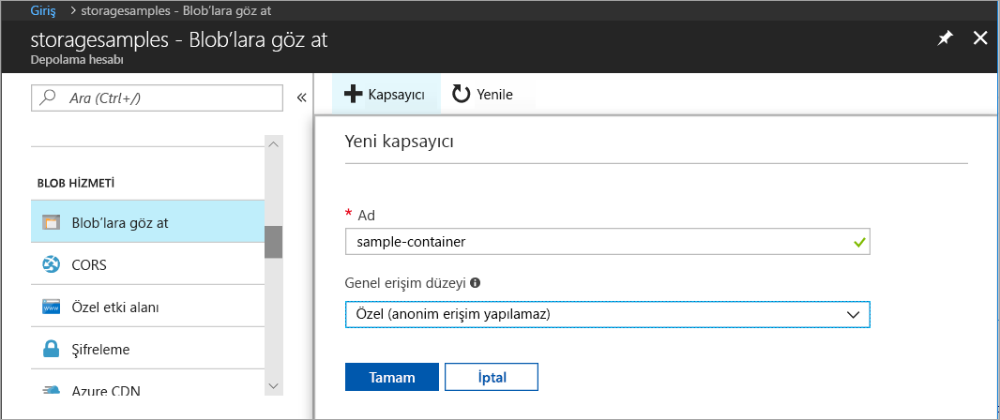
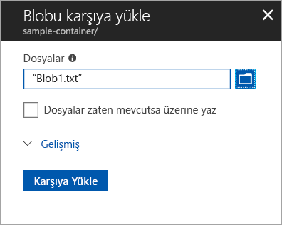

# Hızlı Başlangıç: Karşıya yükleme, indirme ve Azure portalı ile blobları Listele

Bu hızlı başlangıçta, [Azure portalını](https://portal.azure.com/) kullanarak Azure Depolamada bir kapsayıcı oluşturma ve bu kapsayıcı içinde blok bloblarını karşıya yükleme ve indirme hakkında bilgi edineceksiniz.

## Önkoşullar

[!INCLUDE [storage-quickstart-prereq-include](../../../includes/storage-quickstart-prereq-include.md)]

## Bir kapsayıcı oluşturma

Azure portalında bir kapsayıcı oluşturmak için şu adımları izleyin:

1. Azure portalında yeni depolama hesabınıza gidin.
2. Depolama hesabının sol menüsünde **Blob hizmeti** bölümüne gidip **Bloblar**’ı seçin.
3. **+ Kapsayıcı** düğmesini seçin.
4. Yeni kapsayıcınız için bir ad yazın. Kapsayıcı adı küçük harflerden oluşmalı ve bir harf veya rakamla başlamalıdır; yalnızca harf, rakam ve tire (-) karakterini içerebilir. Kapsayıcılar ve blob adları hakkında daha fazla bilgi için bkz. [Kapsayıcıları, blobları ve meta verileri adlandırma ve bunlara başvurma](https://docs.microsoft.com/rest/api/storageservices/naming-and-referencing-containers--blobs--and-metadata).
5. Kapsayıcıya genel erişim düzeyini ayarlayın. Varsayılan düzey **Özel (anonim erişim yok)** şeklindedir.
6. Kapsayıcıyı oluşturmak için **Tamam**'ı seçin.

    

## Blok blobunu karşıya yükleme

Blok blobları, bir blob oluşturmak üzere birleştirilmiş veri bloklarından oluşur. Blob depolama kullanan çoğu senaryoda blok blobları kullanılır. Blok blobları, bulutta metin ve dosya, görüntü ve video gibi ikili verileri depolamak için idealdir. Bu hızlı başlangıçta blok blobları ile çalışma hakkında bilgi verilmektedir. 

Azure portalında yeni kapsayıcınıza bir blok blobu yüklemek için aşağıdaki adımları izleyin:

1. Azure portalında, önceki bölümde oluşturduğunuz kapsayıcıya gidin.
2. İçerdiği blobların listesini görüntülemek üzere kapsayıcıyı seçin. Bu kapsayıcı yeni olduğundan içinde blob olmayacaktır.
3. Kapsayıcıya bir blob yüklemek için **Karşıya Yükle** düğmesini seçin.
4. Blok blobu olarak yüklenecek bir dosya bulmak için yerel dosya sisteminize göz atın ve **Karşıya Yükle**’yi seçin.
     
    

5. **Kimlik doğrulama türü**'nü seçin. Varsayılan seçenek **SAS** olacaktır.
6. Bu şekilde istediğiniz sayıda blobu karşıya yükleyin. Artık yeni blobların kapsayıcı içinde listelendiğini görürsünüz.

## Blok blobu indirme

Bir blok blobunu tarayıcıda görüntülemek veya yerel dosya sisteminize kaydetmek üzere indirebilirsiniz. Bir blok blobu indirmek için şu adımları izleyin:

1. Önceki bölümde karşıya yüklediğiniz blob listesine gidin. 
2. İndirmek istediğiniz bloba sağ tıklayın ve **İndir**'i seçin. 

## Kaynakları temizleme

Bu hızlı başlangıçta oluşturduğunuz kaynakları kaldırmak için kapsayıcıyı silebilirsiniz. Kapsayıcıdaki tüm blob'lar da silinir.

Kapsayıcıyı silmek için:

1. Azure portalında, depolama hesabınızdaki kapsayıcı listesine gidin.
2. Silinecek kapsayıcıyı seçin.
3. **Daha fazla** düğmesini (**...**) ve ardından **Sil**’i seçin.
4. Kapsayıcıyı silmek istediğinizi onaylayın.

## Sonraki adımlar

Bu hızlı başlangıçta, dosyaları Azure portalla yerel bir disk ve Azure Blob depolama arasında aktarmayı öğrendiniz. Blob depolamayla çalışma hakkında daha fazla bilgi edinmek için, Blob depolama nasıl yapılır öğreticisiyle devam edin.

> [!div class="nextstepaction"]
> [Blob Depolama İşlemleri Nasıl Yapılır](storage-dotnet-how-to-use-blobs.md)

