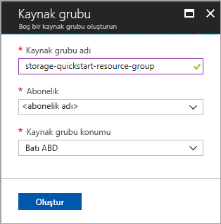
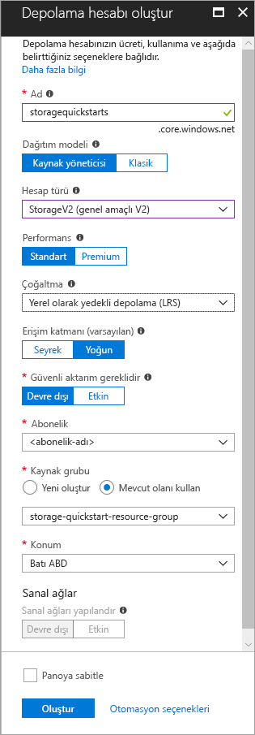

# <a name="create-a-new-storage-account"></a>Yeni depolama hesabı oluşturma

Azure depolama hesabı, Azure Depolamada veri nesnelerinizi depolamak ve bunlara erişmek için benzersiz ad alanı sağlar. Bir depolama hesabı, söz konusu hesap altında oluşturduğunuz herhangi bir blob, dosya, kuyruk, tablo ve diski içerir. 

Azure Depolama'yı kullanmaya başlamak için öncelikle yeni bir depolama hesabı oluşturmanız gerekir. [Azure portalı](https://portal.azure.com/), [Azure PowerShell](https://docs.microsoft.com/powershell/azure/overview) veya [Azure CLI](https://docs.microsoft.com/cli/azure/overview?view=azure-cli-latest) kullanarak bir Azure depolama hesabı oluşturabilirsiniz. Bu hızlı başlangıçta, yeni depolama hesabınızı oluşturmak için bu seçeneklerin her birinin nasıl kullanılacağı gösterilmektedir. 


## <a name="prerequisites"></a>Ön koşullar

Azure aboneliğiniz yoksa başlamadan önce [ücretsiz bir hesap](https://azure.microsoft.com/free/) oluşturun.

# <a name="portaltabportal"></a>[Portal](#tab/portal)

Yok.

# <a name="powershelltabpowershell"></a>[PowerShell](#tab/powershell)

Bu hızlı başlangıç, Azure PowerShell modülü 3.6 veya sonraki bir sürümü gerektirir. Geçerli sürümünüzü bulmak için `Get-Module -ListAvailable AzureRM` komutunu çalıştırın. Yüklemeniz veya yükseltmeniz gerekirse, bkz. [Azure PowerShell Modülü yükleme](/powershell/azure/install-azurerm-ps).

# <a name="azure-clitabazure-cli"></a>[Azure CLI](#tab/azure-cli)

İki yöntemden biriyle Azure'da oturum açarak Azure CLI komutlarını çalıştırabilirsiniz:

- CLI komutlarını Azure portalında Azure Cloud Shell içinden çalıştırabilirsiniz 
- CLI yükleyip CLI komutlarını yerel olarak çalıştırabilirsiniz  

### <a name="use-azure-cloud-shell"></a>Azure Cloud Shell kullanma

Azure Cloud Shell doğrudan Azure portalının içinde çalıştırabileceğiniz ücretsiz bir Bash kabuğudur. Azure CLI, kabuğa önceden yüklenmiştir ve kabuk, hesabınızla birlikte kullanılacak şekilde yapılandırılmıştır. Azure portalının sağ üst tarafında yer alan menüdeki **Cloud Shell** düğmesine tıklayın:

[](https://portal.azure.com)

Düğme bu hızlı başlangıçtaki adımları uygulamak için kullanabileceğiniz etkileşimli bir kabuk başlatır:

[](https://portal.azure.com)

### <a name="install-the-cli-locally"></a>CLI’yi yerel olarak yükleme

Ayrıca, Azure CLI’yi yerel olarak yükleyip kullanabilirsiniz. Bu hızlı başlangıç için Azure CLI 2.0.4 veya sonraki bir sürümü kullanmanız gerekir. Sürümü bulmak için `az --version` komutunu çalıştırın. Yüklemeniz veya yükseltmeniz gerekirse, bkz. [Azure CLI 2.0 yükleme](/cli/azure/install-azure-cli). 

---

## <a name="log-in-to-azure"></a>Azure'da oturum açma

# <a name="portaltabportal"></a>[Portal](#tab/portal)

[Azure Portal](https://portal.azure.com)’da oturum açın.

# <a name="powershelltabpowershell"></a>[PowerShell](#tab/powershell)

`Login-AzureRmAccount` komutuyla Azure aboneliğinizde oturum açın ve ekrandaki yönergeleri izleyerek kimlik doğrulaması yapın.

```powershell
Login-AzureRmAccount
```

# <a name="azure-clitabazure-cli"></a>[Azure CLI](#tab/azure-cli)

Azure Cloud Shell’i başlatmak için [Azure portalında](https://portal.azure.com) oturum açın.

CLI yerel yüklemesinde oturum açmak için oturum açma komutunu çalıştırın:

```cli
az login
```

---

## <a name="create-a-resource-group"></a>Kaynak grubu oluşturma

Azure kaynak grubu, Azure kaynaklarının dağıtıldığı ve yönetildiği bir mantıksal kapsayıcıdır. Kaynak grupları hakkında daha fazla bilgi için bkz. [Azure Resource Manager’a genel bakış](../../azure-resource-manager/resource-group-overview.md).

# <a name="portaltabportal"></a>[Portal](#tab/portal)

Azure portalında bir kaynak grubu oluşturmak için şu adımları izleyin:

1. Azure portalında sol taraftaki menüyü genişleterek hizmet menüsünü açın ve **Kaynak Grupları**'nı seçin.
2. **Ekle**’ye tıklayarak yeni bir kaynak grubu ekleyin.
3. Yeni kaynak grubu için bir ad girin.
4. Yeni kaynak grubunun oluşturulacağı aboneliği seçin.
5. Kaynak grubu için konum seçin.
6. **Oluştur** düğmesine tıklayın.  



# <a name="powershelltabpowershell"></a>[PowerShell](#tab/powershell)

PowerShell ile yeni bir kaynak grubu oluşturmak için [New-AzureRmResourceGroup](/powershell/module/azurerm.resources/new-azurermresourcegroup) komutunu kullanın: 

```powershell
# put resource group in a variable so you can use the same group name going forward,
# without hardcoding it repeatedly
$resourceGroup = "storage-quickstart-resource-group"
New-AzureRmResourceGroup -Name $resourceGroup -Location $location 
```

`-Location` parametresi için hangi bölgeyi belirteceğinizden emin değilseniz, [Get-AzureRmLocation](/powershell/module/azurerm.resources/get-azurermlocation) komutuyla aboneliğiniz için desteklenen bölgelerin bir listesini alabilirsiniz:

```powershell
Get-AzureRmLocation | select Location 
$location = "westus"
```

# <a name="azure-clitabazure-cli"></a>[Azure CLI](#tab/azure-cli)

Azure CLI ile yeni bir kaynak grubu oluşturmak için [az group create](/cli/azure/group#create) komutunu kullanın. 

```azurecli-interactive
az group create \
    --name storage-quickstart-resource-group \
    --location westus
```

`--location` parametresi için hangi bölgeyi belirteceğinizden emin değilseniz, [az account list-locations](/cli/azure/account#list) komutuyla aboneliğiniz için desteklenen bölgelerin bir listesini alabilirsiniz.

```azurecli-interactive
az account list-locations \
    --query "[].{Region:name}" \
    --out table
```

---

# <a name="create-a-general-purpose-storage-account"></a>Genel amaçlı depolama hesabı oluşturma

Genel amaçlı bir depolama hesabı, tüm Azure Depolama hizmetlerine erişim sağlar: blob'lar, dosyalar, kuyruklar ve tablolar. Genel amaçlı bir depolama hesabı, standart veya premium katmanında oluşturulabilir. Bu makaledeki örnekler, standart katmanda (varsayılan) genel amaçlı bir depolama hesabı oluşturmayı gösterir. Depolama hesabı seçenekleri hakkında daha fazla bilgi için bkz. [Microsoft Azure Depolama’ya giriş](storage-introduction.md).

Depolama hesabınızı adlandırırken şu kuralları göz önünde bulundurun:

- Depolama hesabı adları 3 ile 24 karakter arasında olmalı ve yalnızca sayıyla küçük harf içermelidir.
- Depolama hesabınızın adının Azure içinde benzersiz olması gerekir. İki depolama hesabı aynı ada sahip olamaz.

# <a name="portaltabportal"></a>[Portal](#tab/portal)

Azure portalında genel amaçlı bir depolama hesabı oluşturmak için aşağıdaki adımları izleyin:

1. Azure portalında sol taraftaki menüyü genişleterek hizmet menüsünü açın ve **Diğer Hizmetler**'i seçin. Ardından **Depolama** bölümüne inin ve **Depolama hesapları**'nı seçin. Açılan **Depolama Hesapları** penceresinde **Ekle**'yi seçin.
2. Depolama hesabınız için bir ad girin.
3. Şu alanları varsayılan değerlerinde bırakın: **Dağıtım modeli**, **Hesap türü**, **Performans**, **Çoğaltma**, **Güvenli aktarım gerekli**.
4. Depolama hesabını oluşturmak istediğiniz aboneliği seçin.
5. **Kaynak grubu** bölümünde **Var olanı kullan**’ı seçin, ardından önceki bölümde oluşturduğunuz kaynak grubunu seçin.
6. Yeni depolama hesabınız için konum seçin.
7. Depolama hesabını oluşturmak için **Oluştur**’a tıklayın.      



# <a name="powershelltabpowershell"></a>[PowerShell](#tab/powershell)

PowerShell’den genel amaçlı bir depolama hesabı oluşturmak için [New-AzureRmStorageAccount](/powershell/module/azurerm.storage/New-AzureRmStorageAccount) komutunu kullanın: 

```powershell
New-AzureRmStorageAccount -ResourceGroupName $resourceGroup `
  -Name "storagequickstart" `
  -Location $location `
  -SkuName Standard_LRS `
  -Kind Storage 
```

# <a name="azure-clitabazure-cli"></a>[Azure CLI](#tab/azure-cli)

Azure CLI’dan genel amaçlı bir depolama hesabı oluşturmak için [az storage account create](/cli/azure/storage/account#create) komutunu kullanın.

```azurecli-interactive
az storage account create \
    --name storagequickstart \
    --resource-group storage-quickstart-resource-group \
    --location westus \
    --sku Standard_LRS 
```

---

## <a name="clean-up-resources"></a>Kaynakları temizleme

Bu hızlı başlangıç tarafından oluşturulan kaynakları temizlemek isterseniz, kaynak grubunu silmeniz yeterlidir. Kaynak grubunun silinmesi, ilişkili depolama hesabını ve kaynak grubuyla ilişkili diğer tüm kaynakları da siler.

# <a name="portaltabportal"></a>[Portal](#tab/portal)

Azure portalını kullanarak kaynak grubunu kaldırmak için:

1. Azure portalında sol taraftaki menüyü genişleterek hizmet menüsünü açın ve **Kaynak Grupları**'nı seçerek kaynak gruplarınızın listesini görüntüleyin.
2. Silinecek kaynak grubunu bulun ve listenin sağ tarafındaki **Daha fazla** düğmesine (**...**) sağ tıklayın.
3. **Kaynak grubunu sil**'i seçip onaylayın.

# <a name="powershelltabpowershell"></a>[PowerShell](#tab/powershell)

Kaynak grubunu ve yeni depolama hesabı dahil olmak üzere ilişkili kaynakları kaldırmak için [Remove-AzureRmResourceGroup](/powershell/module/azurerm.resources/remove-azurermresourcegroup) komutunu kullanın: 

```powershell
Remove-AzureRmResourceGroup -Name $resourceGroup
```

# <a name="azure-clitabazure-cli"></a>[Azure CLI](#tab/azure-cli)

Kaynak grubunu ve yeni depolama hesabı dahil olmak üzere ilişkili kaynakları kaldırmak için [az group delete](/cli/azure/group#delete) komutunu kullanın.

```azurecli-interactive
az group delete --name myResourceGroup
```

---

## <a name="next-steps"></a>Sonraki adımlar

Bu hızlı başlangıçta, genel amaçlı bir standart depolama hesabı oluşturdunuz. Depolama hesabınıza/hesabınızdan blobları karşıya yüklemeyi ve indirmeyi öğrenmek için, Blob depolama hızlı başlangıcı ile devam edin.

# <a name="portaltabportal"></a>[Portal](#tab/portal)

> [!div class="nextstepaction"]
> [Azure portalını kullanarak nesneleri Azure Blob depolama içine/dışına aktarma](../blobs/storage-quickstart-blobs-portal.md)

# <a name="powershelltabpowershell"></a>[PowerShell](#tab/powershell)

> [!div class="nextstepaction"]
> [PowerShell kullanarak nesneleri Azure Blob depolama içine/dışına aktarma](../blobs/storage-quickstart-blobs-powershell.md)

# <a name="azure-clitabazure-cli"></a>[Azure CLI](#tab/azure-cli)

> [!div class="nextstepaction"]
> [Azure CLI kullanarak nesneleri Azure Blob depolama içine ve dışına aktarma](../blobs/storage-quickstart-blobs-cli.md)

---