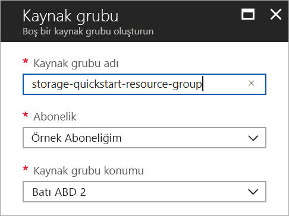
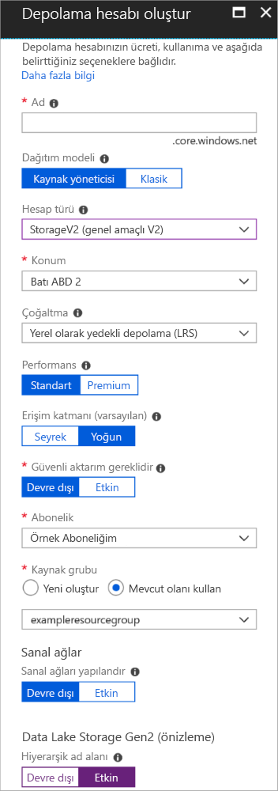

# <a name="quickstart-create-an-azure-data-lake-storage-gen2-preview-storage-account"></a>Hızlı Başlangıç: Azure Data Lake Storage Gen2 Önizleme depolama hesabı oluşturma

Azure Data Lake Storage Gen2 Önizleme hesapları, Hadoop Dağıtılmış Dosya Sistemi (HDFS) ile çalışacak şekilde tasarlanmış yerel dizin tabanlı dosya sistemi sunan [Hiyerarşik Ad Alanı Hizmeti](introduction.md) sunar. HDFS'den Data Lake Storage Gen2 verilerine erişim [ABFS sürücüsü](abfs-driver.md) aracılığıyla sağlanabilir.

Depolama hesabınızda Data Lake Storage Gen2 özelliklerini etkinleştirmek için [önizleme anketini doldurarak erişim isteğinde bulunun](https://aka.ms/adlsgen2signup). İsteğiniz onaylandıktan sonra yeni bir Data Lake Storage Gen2 hesabı oluşturabilirsiniz. Bu hızlı başlangıçta [Azure portal](https://portal.azure.com/), [Azure PowerShell](https://docs.microsoft.com/powershell/azure/overview) veya [Azure CLI](https://docs.microsoft.com/cli/azure?view=azure-cli-latest) kullanarak hesap oluşturma adımları gösterilmektedir.

> [!NOTE]
> Data Lake Storage Gen2 hesabını oluşturma onayı verildikten sonra Azure portalındaki hesap oluşturma arabirimi güncelleştirilir. Aynı şekilde Data Lake Storage Gen2 ile ilgili PowerShell ve CLI bağımsız değişkenleri yalnızca önizleme onayından sonra çalışır.

## <a name="prerequisites"></a>Ön koşullar

Azure aboneliğiniz yoksa başlamadan önce [ücretsiz bir hesap](https://azure.microsoft.com/free/) oluşturun.

|           | Önkoşul |
|-----------|--------------|
|Portal     | None         |
|PowerShell | Bu hızlı başlangıç, Azure PowerShell modülü **5.0.4-önizleme** veya sonraki bir sürümü gerektirir. Geçerli sürümünüzü bulmak için `Get-Module -ListAvailable AzureRM` komutunu çalıştırın. Yüklemeniz veya yükseltmeniz gerekirse, bkz. [Azure PowerShell Modülü yükleme](/powershell/azure/install-azurerm-ps). |
|CLI        | İki yöntemden biriyle Azure'da oturum açarak Azure CLI komutlarını çalıştırabilirsiniz: <ul><li>CLI komutlarını Azure portalında Azure Cloud Shell içinden çalıştırabilirsiniz </li><li>CLI yükleyip CLI komutlarını yerel olarak çalıştırabilirsiniz</li></ul>|

Komut satırında çalışırken Azure Cloud Shell'i çalıştırabilir veya CLI'yı yerel ortama yükleyebilirsiniz.

### <a name="use-azure-cloud-shell"></a>Azure Cloud Shell kullanma

Azure Cloud Shell doğrudan Azure portalının içinde çalıştırabileceğiniz ücretsiz bir Bash kabuğudur. Azure CLI, kabuğa önceden yüklenmiştir ve kabuk, hesabınızla birlikte kullanılacak şekilde yapılandırılmıştır. Azure portalının sağ üst tarafında yer alan menüdeki **Cloud Shell** düğmesine tıklayın:

[](https://portal.azure.com)

Düğme bu hızlı başlangıçtaki adımları uygulamak için kullanabileceğiniz etkileşimli bir kabuk başlatır:

[](https://portal.azure.com)

### <a name="install-the-cli-locally"></a>CLI’yi yerel olarak yükleme

Ayrıca, Azure CLI’yi yerel olarak yükleyip kullanabilirsiniz. Bu hızlı başlangıç için Azure CLI 2.0.38 veya sonraki bir sürümü kullanmanız gerekir. Sürümü bulmak için `az --version` komutunu çalıştırın. Yükleme veya yükseltme yapmanız gerekirse bkz. [Azure CLI’yı yükleme](/cli/azure/install-azure-cli).

## <a name="overview-of-creating-an-azure-data-lake-storage-gen2-account"></a>Azure Data Lake Storage Gen2 hesabı oluşturmaya genel bakış

Hesap oluşturmadan önce depolama hesapları veya oluşturduğunuz diğer Azure kaynakları için mantıksal kapsayıcı görevi görecek bir kaynak grubu oluşturmanız gerekir. Bu hızlı başlangıç tarafından oluşturulan kaynakları temizlemek isterseniz, kaynak grubunu silmeniz yeterlidir. Kaynak grubunun silinmesi, ilişkili depolama hesabını ve kaynak grubuyla ilişkili diğer tüm kaynakları da siler. Kaynak grupları hakkında daha fazla bilgi için bkz. [Azure Resource Manager’a genel bakış](../../azure-resource-manager/resource-group-overview.md).

> [!NOTE]
> Data Lake Storage Gen2 özelliklerinden faydalanmak için yeni depolama hesaplarını **StorageV2 (genel amaçlı V2)** türünde oluşturmanız gerekir.  

Depolama hesapları hakkında daha fazla bilgi için bkz. [Azure Depolama hesabına genel bakış](../common/storage-account-overview.md).

Depolama hesabınızı adlandırırken şu kuralları göz önünde bulundurun:

- Depolama hesabı adları 3 ile 24 karakter arasında olmalı ve yalnızca sayıyla küçük harf içermelidir.
- Depolama hesabınızın adının Azure içinde benzersiz olması gerekir. İki depolama hesabı aynı ada sahip olamaz.

## <a name="create-an-account-using-the-azure-portal"></a>Azure portalı kullanarak bir hesap oluşturma

[Azure Portal](https://portal.azure.com)’da oturum açın.

### <a name="create-a-resource-group"></a>Kaynak grubu oluşturma

Azure portalında bir kaynak grubu oluşturmak için şu adımları izleyin:

1. Azure portalında sol taraftaki menüyü genişleterek hizmet menüsünü açın ve **Kaynak Grupları**'nı seçin.
2. **Ekle**’ye tıklayarak yeni bir kaynak grubu ekleyin.
3. Yeni kaynak grubu için bir ad girin.
4. Yeni kaynak grubunun oluşturulacağı aboneliği seçin.
5. Kaynak grubu için konum seçin.
6. **Oluştur** düğmesine tıklayın.  



### <a name="create-a-general-purpose-v2-storage-account"></a>Genel amaçlı v2 depolama hesabı oluşturma

Azure portalında genel amaçlı v2 bir depolama hesabı oluşturmak için aşağıdaki adımları izleyin:

> [!NOTE]
> Hiyerarşik ad alanı, yalnızca Doğu ABD, Doğu ABD 2, Batı ABD, Batı ABD 2, Batı Orta ABD, Kuzey Avrupa, Batı Avrupa, Güneydoğu Asya ve Doğu Avustralya için etkindir. Depolama hesabını oluştururken bu konumlardan birini belirttiğinizden emin olun.

1. Azure portalında sol taraftaki menüyü genişleterek hizmet menüsünü açın ve **Tüm hizmetler**'i seçin. Ardından **Depolama** bölümüne inin ve **Depolama hesapları**'nı seçin. Açılan **Depolama Hesapları** penceresinde **Ekle**'yi seçin.
2. Depolama hesabınız için bir ad girin.
3. **Dağıtım modeli**'ni varsayılan değerde bırakın.
4. **Hesap türü** alanını, **StorageV2 (genel amaçlı v2)** olarak ayarlayın.
5. **Konum**'u **Batı ABD 2** olarak belirleyin
6. **Çoğaltma** alanını, **Yerel Olarak Yedekli Depolama (LRS)** olarak bırakın.
7. Şu alanları varsayılan değerlerinde bırakın: **Çoğaltma**. **Performans**, **Erişim katmanı**.
8. Depolama hesabını oluşturmak istediğiniz aboneliği seçin.
9. **Kaynak grubu** bölümünde **Var olanı kullan**’ı seçin, ardından önceki bölümde oluşturduğunuz kaynak grubunu seçin.
10. **Sanal Ağlar** için varsayılan değeri koruyun
11. **Data Lake Storage Gen2 (önizleme)** bölümünde **Hiyerarşik ad alanı**'nı **Etkin** duruma getirin.
12. Depolama hesabını oluşturmak için **Oluştur**’a tıklayın.



Depolama hesabınız portaldan oluşturulmuş olur.

### <a name="clean-up-resources"></a>Kaynakları temizleme

Azure portalını kullanarak kaynak grubunu kaldırmak için:

1. Azure portalında sol taraftaki menüyü genişleterek hizmet menüsünü açın ve **Kaynak Grupları**'nı seçerek kaynak gruplarınızın listesini görüntüleyin.
2. Silinecek kaynak grubunu bulun ve listenin sağ tarafındaki **Daha fazla** düğmesine (**...**) sağ tıklayın.
3. **Kaynak grubunu sil**'i seçip onaylayın.

## <a name="create-an-account-using-powershell"></a>PowerShell kullanarak hesap oluşturma

`Login-AzureRmAccount` komutuyla Azure aboneliğinizde oturum açın ve ekrandaki yönergeleri izleyerek kimlik doğrulaması yapın.

```powershell
Login-AzureRmAccount
```

### <a name="upgrade-your-powershell-module"></a>PowerShell modülünüzü yükseltme

PowerShell aracılığıyla Data Lake Storage Gen2 ile etkileşim kurmak istiyorsanız modülünüzü önizleme sürümüne yükseltmeniz gerekir.

Bunu yapmak için yükseltilmiş PowerShell açın ve şu komutu girin: `Install-Module AzureRM.Storage –Repository PSGallery -RequiredVersion 5.0.4-preview –AllowPrerelease –AllowClobber –Force `

Ardından PowerShell'i yeniden başlatın.

### <a name="create-a-resource-group"></a>Kaynak grubu oluşturma

PowerShell ile yeni bir kaynak grubu oluşturmak için [New-AzureRmResourceGroup](/powershell/module/azurerm.resources/new-azurermresourcegroup) komutunu kullanın: 

> [!NOTE]
> Hiyerarşik ad alanı, yalnızca Doğu ABD, Doğu ABD 2, Batı ABD, Batı ABD 2, Batı Orta ABD, Kuzey Avrupa, Batı Avrupa, Güneydoğu Asya ve Doğu Avustralya için etkindir. Depolama hesabını oluştururken bu konumlardan birini belirttiğinizden emin olun.

```powershell
# put resource group in a variable so you can use the same group name going forward,
# without hardcoding it repeatedly
$resourceGroup = "storage-quickstart-resource-group"
$location = "westus2"
New-AzureRmResourceGroup -Name $resourceGroup -Location $location
```

### <a name="create-a-general-purpose-v2-storage-account"></a>Genel amaçlı v2 depolama hesabı oluşturma

PowerShell’den yerel olarak yedekli depolama (LRS) ile genel amaçlı bir v2 depolama hesabı oluşturmak için [New-AzureRmStorageAccount](/powershell/module/azurerm.storage/New-AzureRmStorageAccount) komutunu kullanın:

```powershell
Get-AzureRmLocation | select Location 
$location = "westus2"

New-AzureRmStorageAccount -ResourceGroupName $resourceGroup `
  -Name "storagequickstart" `
  -Location $location `
  -SkuName Standard_LRS `
  -Kind StorageV2 
  -EnableHierarchicalNamespace $True
```

### <a name="clean-up-resources"></a>Kaynakları temizleme

Kaynak grubunu ve yeni depolama hesabı dahil olmak üzere ilişkili kaynakları kaldırmak için [Remove-AzureRmResourceGroup](/powershell/module/azurerm.resources/remove-azurermresourcegroup) komutunu kullanın: 

```powershell
Remove-AzureRmResourceGroup -Name $resourceGroup
```

## <a name="create-an-account-using-azure-cli"></a>Azure CLI'yı kullanarak hesap oluşturma

Azure Cloud Shell’i başlatmak için [Azure portalında](https://portal.azure.com) oturum açın.

CLI yerel yüklemesinde oturum açmak için oturum açma komutunu çalıştırın:

```cli
az login
```

### <a name="upgrade-your-cli-module"></a>CLI modülünüzü yükseltme

CLI aracılığıyla Data Lake Storage Gen2 ile etkileşim kurmak için uzantıyı kabuğunuza eklemeniz gerekir.

Bunu yapmak için Cloud Shell veya yerel kabuk ile şu komutu girin: `az extension add --name storage-preview`

### <a name="create-a-resource-group"></a>Kaynak grubu oluşturma

Azure CLI ile yeni bir kaynak grubu oluşturmak için [az group create](/cli/azure/group#az_group_create) komutunu kullanın.

```azurecli-interactive
az group create \
    --name storage-quickstart-resource-group \
    --location westus2
```

> [!NOTE]
> Hiyerarşik ad alanı, yalnızca Doğu ABD, Doğu ABD 2, Batı ABD, Batı ABD 2, Batı Orta ABD, Kuzey Avrupa, Batı Avrupa, Güneydoğu Asya ve Doğu Avustralya için etkindir. Depolama hesabını oluştururken bu konumlardan birini belirttiğinizden emin olun.

### <a name="create-a-general-purpose-v2-storage-account"></a>Genel amaçlı v2 depolama hesabı oluşturma

Azure CLI’dan yerel olarak yedekli depolama ile genel amaçlı v2 depolama hesabı oluşturmak için [az storage account create](/cli/azure/storage/account#az_storage_account_create) komutunu kullanın.

```azurecli-interactive
az storage account create \
    --name storagequickstart \
    --resource-group storage-quickstart-resource-group \
    --location westus2 \
    --sku Standard_LRS \
    --kind StorageV2 \
    --hierarchical-namespace true
```

### <a name="clean-up-resources"></a>Kaynakları temizleme

Kaynak grubunu ve yeni depolama hesabı dahil olmak üzere ilişkili kaynakları kaldırmak için [az group delete](/cli/azure/group#az_group_delete) komutunu kullanın.

```azurecli-interactive
az group delete --name myResourceGroup
```

## <a name="next-steps"></a>Sonraki adımlar

Bu hızlı başlangıçta, bir Data Lake Storage Gen2 hesabı oluşturdunuz. Depolama hesabınıza/hesabınızdan blobları karşıya yüklemeyi ve indirmeyi öğrenmek için, Blob depolama hızlı başlangıcı ile devam edin.

* [AzCopy kullanarak Azure Blob Depolamadan/Depolamaya veri taşıma](https://docs.microsoft.com/en-us/azure/machine-learning/team-data-science-process/move-data-to-azure-blob-using-azcopy)