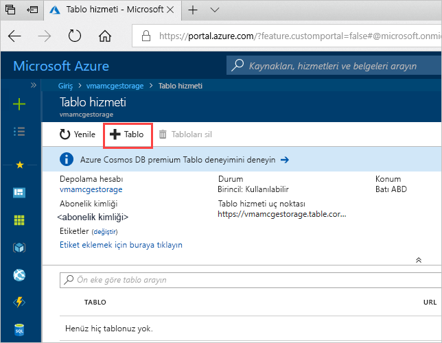
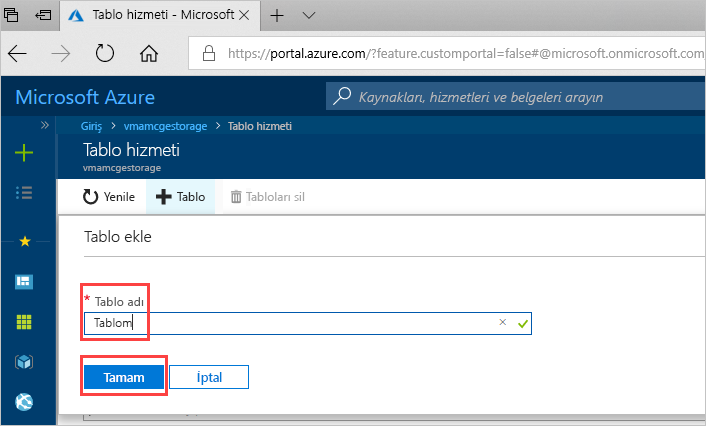

# Hızlı Başlangıç: Azure portalında bir Azure depolama tablosu oluşturma 

Bu hızlı başlangıçta web tabanlı Azure portalda tablo ve varlıkların nasıl oluşturulacağı gösterilir. Bu hızlı başlangıçta aynı zamanda bir Azure depolama hesabının nasıl oluşturulacağı da gösterilmektedir.

[!INCLUDE [quickstarts-free-trial-note](../../../includes/quickstarts-free-trial-note.md)]

## Önkoşullar

Bu hızlı başlangıcı tamamlamak için ilk olarak [Azure portalında](https://portal.azure.com/#create/Microsoft.StorageAccount-ARM) bir Azure depolama hesabı oluşturun. Hesap oluşturmayla ilgili yardım için bkz. [Depolama hesabı oluşturma](../common/storage-quickstart-create-account.md).

## Tablo ekleme

Bir tablo oluşturmak için artık Azure portaldaki Tablo Depolamayı kullanabilirsiniz.

1. Genel Bakış > Tablolar seçeneğine tıklayın.

   

2. **+ Tablo**’ya tıklayın.

   

3. **Tablo adı** kutusundaki tablonuz için bir ad yazın ve ardından **Tamam**’a tıklayın. 

   

## Sonraki adımlar

- [Tablo tasarımı için yönergeler](table-storage-design-guidelines.md)
