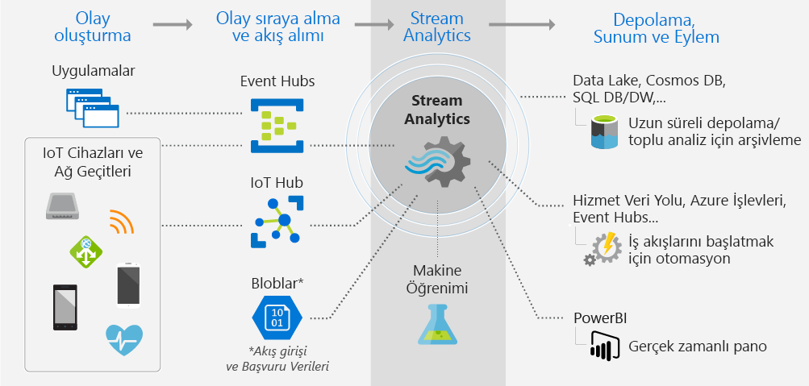
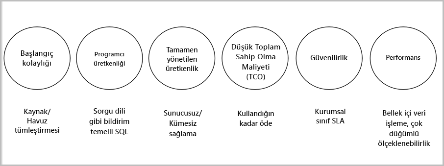

# Stream Analytics nedir?

Azure Stream Analytics, cihazlardan yüksek hacimlerde veri akışı incelemenize olanak tanıyan bir olay işleme altyapısıdır. Gelen veriler cihazlardan, sensörlerden, web sitelerinden, sosyal medya akışlarından, uygulamalardan ve çok daha fazlasından alınabilir. Ayrıca, veri akışlarından bilgi ayıklamayı, desenleri ve ilişkileri tanımlamayı destekler. Daha sonra uyarılar gibi diğer aşağı yönde eylemleri tetiklemek, bir raporlama aracına bilgileri göndermek veya daha sonra kullanmak üzere depolamak için bu desenleri kullanabilirsiniz.

Azure Stream Analytics’in kullanılabildiği bazı örnekler aşağıda verilmiştir: 

* Nesnelerin İnterneti (IoT) Sensör füzyonu ve cihaz telemetrisi üzerinde gerçek zamanlı analizler
* Web günlükleri/clickstream analizi
* Filo yönetimi ve sürücüsüz araçlar için jeo-uzamsal analiz
* Yüksek değerli varlıklar için uzaktan izleme ve tahmine dayalı bakım
* Envanter denetimi ve anomali algılama için Satış Noktasında gerçek zamanlı analizler

## Stream Analytics nasıl çalışır?

Azure Stream Analytics; Azure Event Hub, Azure IoT Hub’a veya Azure Blob Depolama gibi bir veri deposundan alınan bir akış verileri kaynağı ile başlar. Akışları incelemek için veri akışı yapan giriş kaynağını belirten bir Stream Analytics işi oluşturursunuz. İş ayrıca verilerin, desenlerin veya ilişkilerin arama şeklini tanımlayan bir dönüşüm sorgusu belirtir. Dönüşüm sorgusu, bir süre boyunca akış verilerini filtrelemek, sıralamak, toplamak ve birleştirmek için kullanılan SQL benzeri bir sorgu dilinden yararlanır. İşi yürütürken olay sıralama seçeneklerini ve toplama işlemlerini gerçekleştirirken zaman pencerelerinin süresini ayarlayabilirsiniz.

Gelen verileri analiz ettikten sonra dönüştürülen verilerin bir çıktısını belirtebilir ve analiz ettiğiniz bilgilere yanıt olarak neler yapılacağını denetleyebilirsiniz. Örneğin, aşağıdaki gibi eylemler gerçekleştirebilirsiniz:

* Özel iş akışlarını aşağı yönde tetiklemek için izlenen bir kuyruğa veri gönderme.
* Gerçek zamanlı görselleştirme için bir Power BI panosuna veri gönderme.
* Diğer Azure depolama hizmetlerine verileri arşivleme.

Aşağıdaki görüntüde Stream Analytics işlem hattı gösterilmektedir. Stream Analytics işiniz tümünü veya giriş ve çıkış yapması durumunda seçili bir kümeyi kullanabilir. Bu görüntüde verilerin Stream Analytics’e gönderilmesi, analiz edilmesi ve depolama ya da sunum gibi diğer eylemler için gönderilmesi gösterilmiştir:

## Temel işlevler ve avantajlar

Azure Stream Analytics kullanımı kolay, esnek, güvenilir ve her boyuttaki iş için ölçeklenebilir olacak şekilde tasarlanmıştır. Birden çok veri merkezinin yanı sıra bağımsız bulutlarda kullanılabilir. Aşağıdaki görüntüde Azure Stream Analytics’in temel özellikleri gösterilmiştir:

## Başlama kolaylığı

Azure Stream Analytics’i kullanmaya başlamak kolaydır. Yalnızca birkaç tıklama ile birden fazla kaynağa ve havuza bağlanılabilir ve uçtan uca bir işlem hattı oluşturulabilir. Stream Analytics, akış verilerini almak için [Azure Event Hubs](https://docs.microsoft.com/azure/event-hubs/), [Azure IoT Hub](https://docs.microsoft.com/azure/iot-hub/)’a bağlanabilir. Ayrıca, geçmiş verileri almak için [Azure Blob depolama](https://docs.microsoft.com/azure/storage/storage-introduction) hizmetine de bağlanabilir. Olay hub'larından gelen verileri diğer veri kaynakları ve işleme altyapıları ile birleştirebilir. İş girdileri, statik veya yavaş değişen verilerden oluşan başvuru verileri de içerebilir ve arama işlemleri gerçekleştirmek için akış verilerini bu başvuru verilerine ekleyebilirsiniz.

Stream Analytics, iş çıktısını [Azure Blob](https://docs.microsoft.com/azure/storage/storage-introduction), [Azure SQL Veritabanı](https://docs.microsoft.com/azure/sql-database/), [Azure Data Lake Stores](https://docs.microsoft.com/azure/data-lake-store/) veya [Azure Cosmos DB](https://docs.microsoft.com/azure/cosmos-db/introduction) gibi çok sayıda depolama sistemine yönlendirebilir. Depolama sonrasında, Azure HDInsight ile toplu analiz gerçekleştirebilir veya çıktıyı tüketim için Event Hubs veya Power Bi akış API’sini kullanarak gerçek zamanlı görselleştirme için [Power BI](https://docs.microsoft.com/power-bi/) gibi başka bir hizmete gönderebilirsiniz.

## Programcı Verimliliği

Azure Stream Analytics, hareket halindeki verileri çözümlemek için güçlü geçici kısıtlamalarla büyütülmüş basit bir SQL tabanlı sorgu dili kullanır. İş dönüşümlerini tanımlamak için, basit SQL yapıları kullanarak karmaşık geçici sorgular ve analizler yazmanıza olanak tanıyan basit, bildirim temelli bir [Stream Analytics sorgu dili](https://msdn.microsoft.com/library/azure/dn834998.aspx) kullanırsınız. Stream Analytics sorgu dili SQL dili ile tutarlıdır ve iş oluşturmaya başlamak için SQL dilinin tanınması yeterlidir. Ayrıca Azure PowerShell, [Stream Analytics Visual Studio araçları](stream-analytics-tools-for-visual-studio-install.md) veya Azure Resource Manager şablonları gibi geliştirici araçlarını kullanarak da iş oluşturabilirsiniz. Geliştirici araçlarının kullanılması, çevrimdışı ortamda dönüşüm sorguları geliştirmenize ve [CI/CD işlem hattı](stream-analytics-tools-for-visual-studio-cicd.md) kullanarak Azure’a iş göndermenize olanak tanır. 

Stream Analytics sorgu dili, akış verilerini analiz etme ve işlemeye yönelik çok çeşitli işlevler sunar. Bu sorgu dili basit veri işleme, toplama işlevlerini ve karmaşık jeo-uzamsal işlevleri destekler. Portalda sorguları düzenleyebilir ve canlı akıştan ayıklanan örnek verileri kullanarak test edebilirsiniz.

Ek işlevler tanımlayıp çağırarak sorgu dilinin yapabileceklerini artırabilirsiniz. Azure Machine Learning çözümlerinden yararlanmak için Azure Machine Learning hizmetinde işlev çağrıları tanımlayabilir ve bir Stream Analytics sorgusunun parçası olarak karmaşık hesaplamalar gerçekleştirmek üzere JavaScript kullanıcı tanımlı işlevlerini (UDF) ya da kullanıcı tanımlı toplamları tümleştirebilirsiniz.

## Tam olarak yönetilir 

Azure Stream Analytics, Azure üzerinde tam olarak yönetilen bir sunucusuz (PaaS) tekliftir. Diğer bir deyişle, işlerinizi çalıştırmak için herhangi bir donanım sağlamanız veya kümeleri yönetmeniz gerekmez. Azure Stream Analytics, bulutta karmaşık işlem kümeleri oluşturma işlemini ve işi çalıştırmak için gereken performans ayarını yaparak işinizi tam olarak yönetir. Azure Event Hubs ve Azure IoT Hub ile tümleştirme; bağlı cihazlar, tıklama dizileri ve günlük dosyaları gibi çeşitli kaynaklardan gelen, saniyede milyonlarca olayın işler tarafından alınmasını sağlar. Olay hub'larının bölümleme özelliğini kullanarak hesaplamaları mantıksal adımlara ayırabilir, her birini bölümlere ayırarak ölçeklenebilirliği artırabilirsiniz.

## Toplam Sahip Olma Maliyetinin Düşüklüğü

Bir bulut hizmeti olan Stream Analytics, maliyet için iyileştirilmiştir. Herhangi bir ön maliyet yoktur; yalnızca [kullandığınız akış birimleri](stream-analytics-streaming-unit-consumption.md) ve işlenen veri miktarı için ödeme yaparsınız. Herhangi bir taahhüt veya küme sağlama gerekli değildir. İş gereksinimlerinize göre akış işlerinizin ölçeğini artırabilir veya azaltabilirsiniz. 

## Güvenilirlik 

Yönetilen bir hizmet olarak Stream Analytics, %99,9 kullanılabilirlikle olay işlemeyi garanti eder, veri kaybını önlemeye yardımcı olur ve iş sürekliliği sağlar. Daha fazla bilgi için [Stream Analytics SLA](https://azure.microsoft.com/support/legal/sla/stream-analytics/v1_0/) sayfasına bakın. Stream Analytics her saniyede milyonlarca olay işleyebilir ve düşük gecikme süresiyle sonuçlar sunabilir.
Stream Analytics tam bir olay işlemesi ve en az bir olay teslimini garanti eder. Bir olayın tesliminin başarısız olması durumunda yerleşik kurtarma özellikleri vardır. Stream Analytics, işinizin durumunu dahili olarak koruyabilir, son çıktı zamanından bir iş başlatabilirsiniz ve sürekli aynı sonuçları sağlayarak tekrarlanabilir sonuçlar sunar. Stream Analytics’in bu özelliği sayesinde kök neden analizi gerçekleştirirken zamanda geriye giderek hesaplamaları araştırabilirsiniz. 

## Performans

Azure Stream Analytics, yüksek performans için iyileştirilmiştir, akış verilerini işleyebilir ve bellek içi hesaplamalar gerçekleştirebilir. Gerçek zamanlı ve karmaşık olay işleme uygulamalarını kullanmak üzere ölçeği artırmanıza veya azaltmanıza izin verir. Stream Analytics, bölümleme yoluyla performansı destekler. Karmaşık bir sorgu paralel hale getirilip birden çok akış düğümünde yürütülebilir. 

## Sonraki adımlar

Azure Stream Analytics’e genel bakışı gördünüz. Bundan sonra derinlere inerek ilk Stream Analytics işinizi oluşturabilirsiniz:

* [Azure portalını kullanarak Stream Analytics işi oluşturma](stream-analytics-quick-create-portal.md).
* [Azure PowerShell kullanarak Stream Analytics işi oluşturma](stream-analytics-quick-create-powershell.md).
