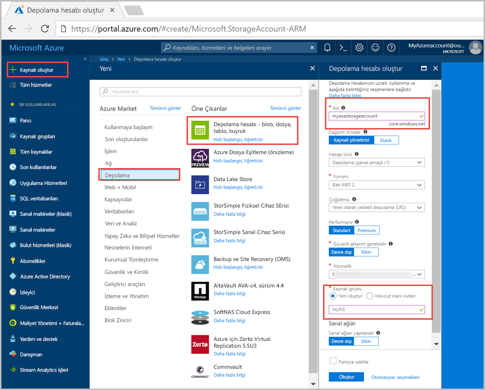
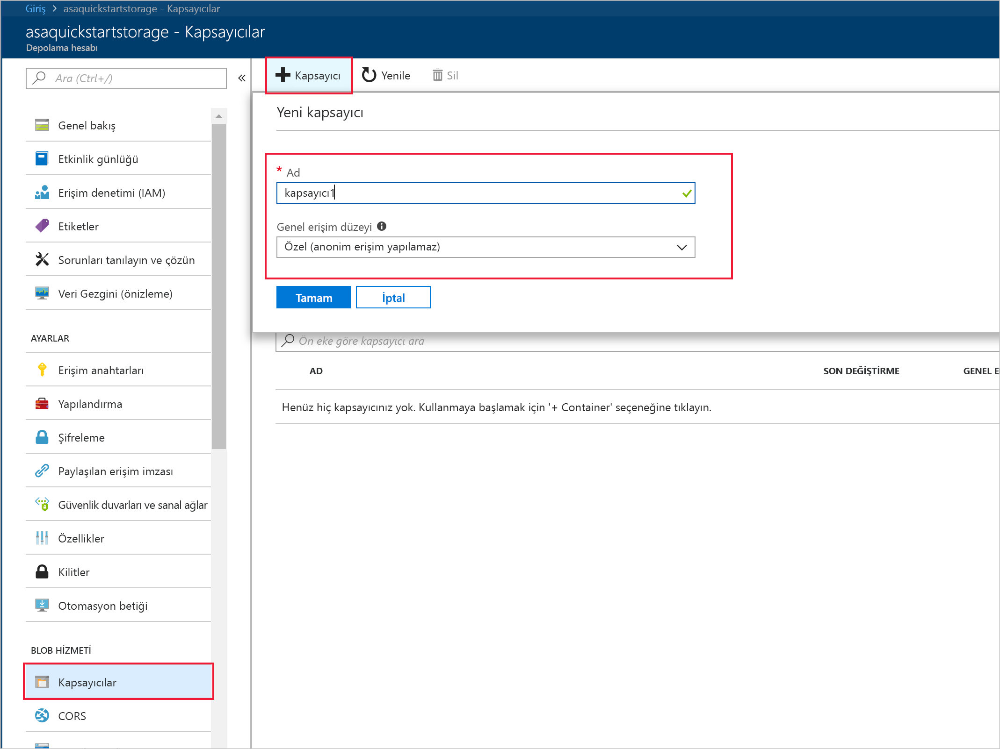
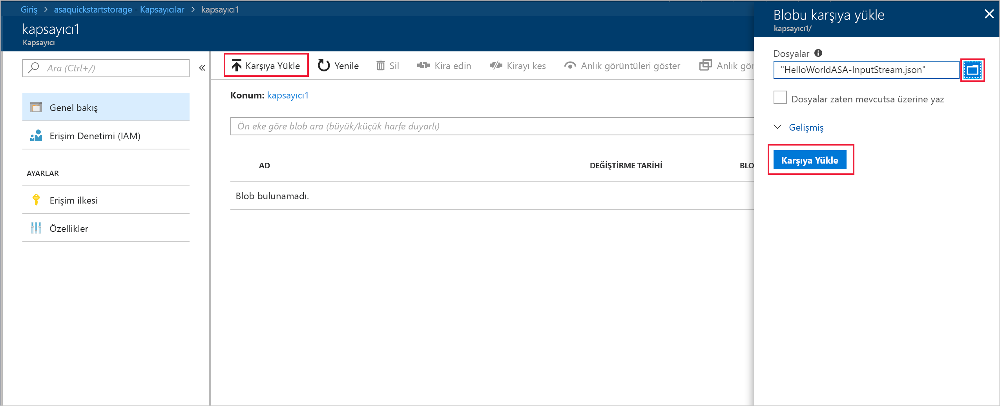
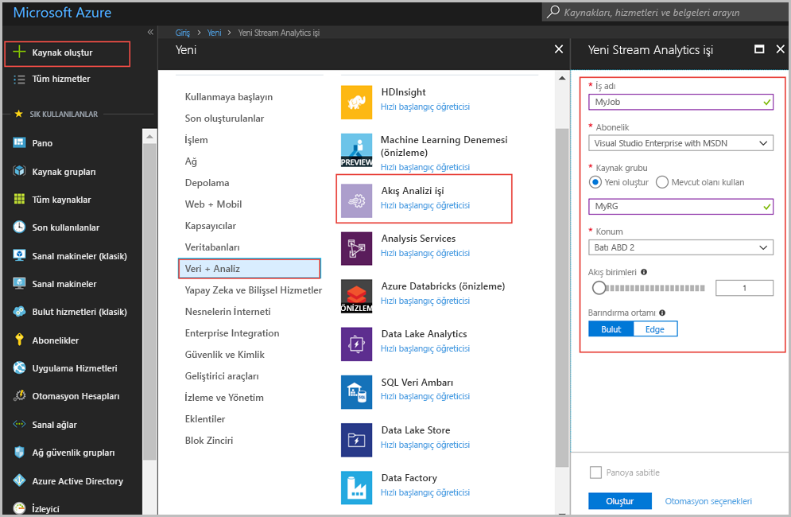
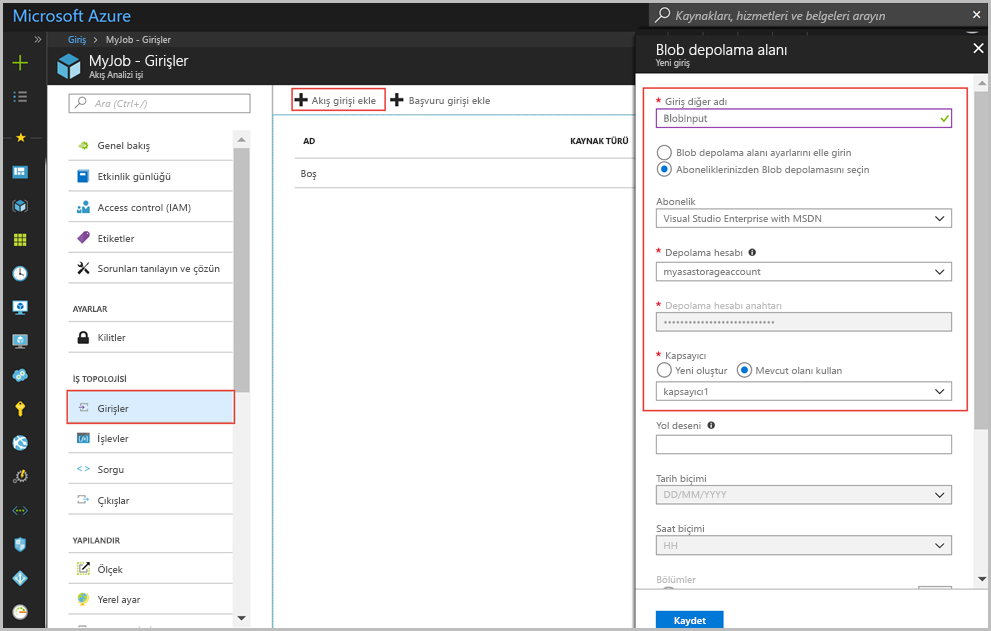
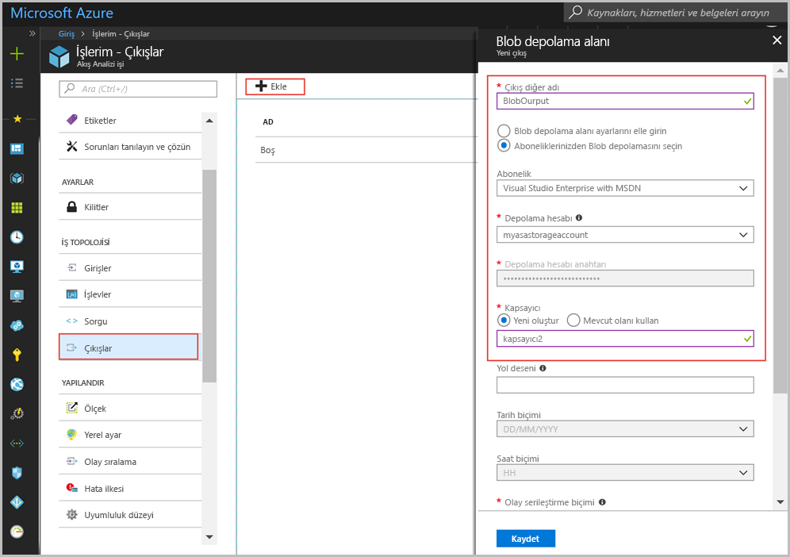
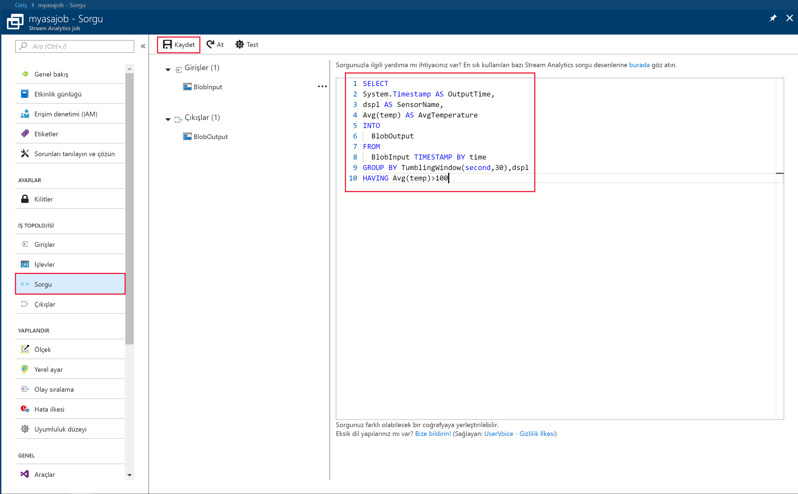
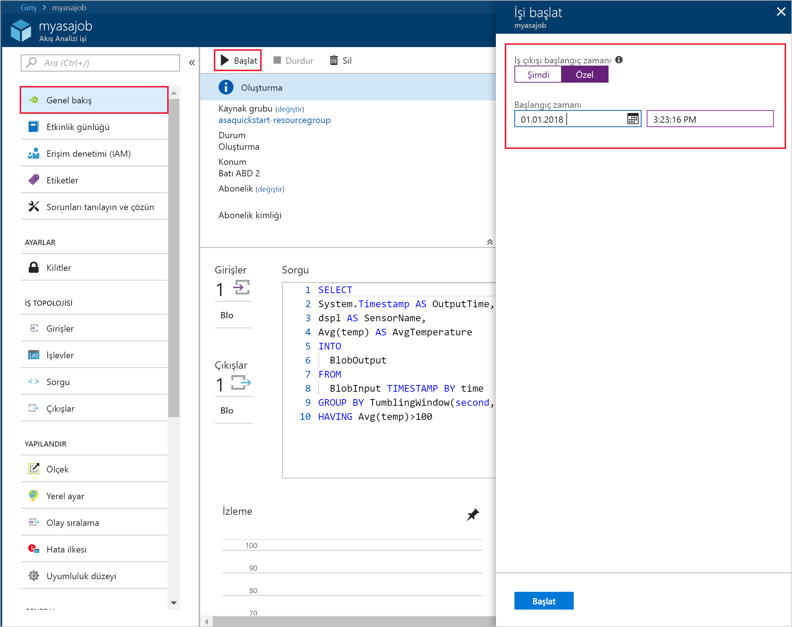
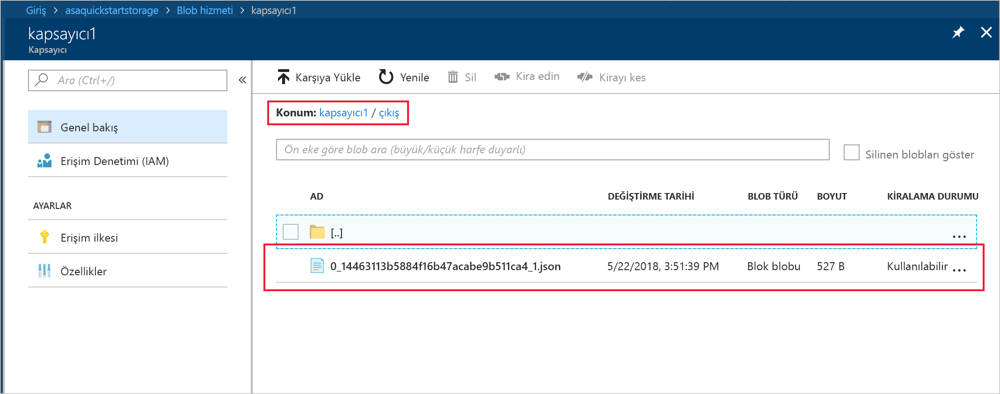

# <a name="quickstart-create-a-stream-analytics-job-by-using-the-azure-portal"></a>Hızlı başlangıç: Azure portalını kullanarak Stream Analytics işi oluşturma

Bu hızlı başlangıçta bir Stream Analytics işini oluşturmaya nasıl başlanacağı gösterilmektedir. Bu hızlı başlangıçta, örnek algılayıcı verilerini okuyan ve 30 saniyede bir 100’den yüksek bir ortalama sıcaklığa sahip satırları filtreleyen bir Stream Analytics işi tanımlayacaksınız. Bu makalede, blob depolama alanından verileri okuyacak, dönüştürecek ve aynı blob depolama alanındaki farklı bir kapsayıcıya geri yazacaksınız. Bu hızlı başlangıçta kullanılan girdi verileri dosyası yalnızca tanım amaçlı statik veriler içerir. Gerçek dünya senaryolarında bir Stream Analytics işi için akışı yapılan girdi verilerini kullanırsınız.

## <a name="before-you-begin"></a>Başlamadan önce

* Azure aboneliğiniz yoksa [ücretsiz bir hesap](https://azure.microsoft.com/free/) oluşturun.

* [Azure Portal](https://portal.azure.com/) oturum açın.

## <a name="prepare-the-input-data"></a>Girdi verilerini hazırlama

Stream Analytics işini tanımlamadan önce işe girdi olarak yapılandırılan verileri hazırlamanız gerekir. İş için gereken girdi verilerini hazırlamak için aşağıdaki adımları uygulayın:

1. GitHub’dan [örnek sensör verilerini](https://raw.githubusercontent.com/Azure/azure-stream-analytics/master/Samples/GettingStarted/HelloWorldASA-InputStream.json) indirin. Örnek veriler aşağıdaki JSON biçiminde sensör bilgilerini içerir:  

   ```json
   {
     "time": "2018-01-26T21:18:52.0000000",
     "dspl": "sensorC",
     "temp": 87,
     "hmdt": 44
   }
   ```
2. [Azure Portal](https://portal.azure.com/) oturum açın.  

3. Azure portalının sol üst köşesinden **Kaynak oluştur** > **Depolama** > **Depolama hesabı**’nı seçin. Depolama hesabı işi sayfasını **Ad** değeri "asaquickstartstorage", **Konum** değeri "Batı ABD 2", **Kaynak grubu** "asaquickstart-resourcegroup" olarak ayarlanmış şekilde doldurun (daha yüksek performans için depolama hesabını Akış işiyle aynı kaynak grubunda barındırın). Diğer ayarlar varsayılan değerlerinde bırakılabilir.  

   

4. **Tüm kaynaklar** sayfasında, önceki adımda oluşturduğunuz depolama hesabını bulun. **Genel Bakış** sayfasını ve ardından **Bloblar** kutucuğunu açın.  

5. **Blob Hizmeti** sayfasından **Kapsayıcı**’yı seçin, kapsayıcınız için *kapsayıcı1* gibi bir **Ad** sağlayın ve **Genel erişim düzeyi**’ni Blob olarak değiştirin (yalnızca bloblar için anonim okuma erişimi) > **Tamam**’ı seçin.  

   

6. Önceki adımda oluşturduğunuz kapsayıcıya gidin. **Karşıya yükle**’yi seçin ve ilk adımda elde ettiğiniz algılayıcı verilerini karşıya yükleyin.  

   

## <a name="create-a-stream-analytics-job"></a>Akış Analizi işi oluşturma

1. Azure Portal’da oturum açın.

2. Azure portalının sol üst köşesinde bulunan **Kaynak oluştur** öğesini seçin.  

3. Sonuçlar listesinden **Veri ve Analiz** > **Stream Analytics işi**’ni seçin.  

4. Stream Analytics işi sayfasını aşağıdaki bilgilerle doldurun:

   |**Ayar**  |**Önerilen değer**  |**Açıklama**  |
   |---------|---------|---------|
   |İş adı   |  myasajob   |   Stream Analytics işinizi tanımlamak için bir ad girin. Stream Analytics işinin adı yalnızca alfasayısal karakter, kısa çizgi ve alt çizgi içerebilir ve 3 ila 63 karakter uzunluğunda olmalıdır. |
   |Abonelik  | \<Aboneliğiniz\> |  Bu iş için kullanmak istediğiniz Azure aboneliğini seçin. |
   |Kaynak grubu   |   asaquickstart-resourcegroup  |   **Yeni Oluştur**’u seçin ve hesabınız için yeni bir kaynak grubu adı girin. |
   |Konum  |  \<Kullanıcılarınıza en yakın bölgeyi seçin\> | Stream Analytics işinizi barındırabileceğiniz coğrafi konumu seçin. Daha iyi performans elde etmek ve veri aktarımı maliyetini azaltmak için kullanıcılarınıza en yakın konumu seçin. |
   |Akış birimleri  | 1  |   Akış birimleri, bir işin yürütülmesi için gereken bilgi işlem kaynaklarını temsil eder. Varsayılan olarak, bu değer 1 olarak ayarlanır. Akış birimlerini ölçeklendirme hakkında bilgi edinmek için [akış birimlerini anlama ve ayarlama](stream-analytics-streaming-unit-consumption.md) başlıklı makaleye bakın.   |
   |Barındırma ortamı  |  Bulut  |   Stream Analytics işleri buluta veya uca dağıtılabilir. Bulut, Azure Cloud’a dağıtım yapmanıza Edge ise IoT Edge cihazına dağıtım yapmanıza olanak tanır. |

   

5. **Panoya sabitle** kutusunu işaretleyerek işinizi panonuza yerleştirin ve sonra **Oluştur**’u seçin.  

6. Tarayıcı pencerenizin sağ üst köşesinde 'Dağıtım sürüyor...' yazısını görürsünüz. 

## <a name="configure-input-to-the-job"></a>İş girdisini yapılandırma

Bu bölümde blob depolama alanını Stream Analytics işinin girdisi olarak yapılandıracaksınız. Girdiyi yapılandırmadan önce bir blob depolama hesabı oluşturun.  

### <a name="add-the-input"></a>Girdi ekleme 

1. Stream Analytics işinize gidin.  

2. **Girdiler** > **Akış girdisi ekle** > **Blob depolama alanı**’nı seçin.  

3. **Blob depolama** sayfasını aşağıdaki değerlerle doldurun:

   |**Ayar**  |**Önerilen değer**  |**Açıklama**  |
   |---------|---------|---------|
   |Girdi diğer adı  |  BlobInput   |  İşin girdisini tanımlamak için bir ad girin.   |
   |Abonelik   |  \<Aboneliğiniz\> |  Oluşturduğunuz depolama hesabını içeren Azure aboneliğini seçin. Depolama hesabı, aynı veya farklı bir abonelikte olabilir. Bu örnekte, aynı abonelikte depolama hesabı oluşturduğunuz varsayılır. |
   |Depolama hesabı  |  myasastorageaccount |  Depolama hesabının adını seçin veya girin. Depolama hesabı adları aynı abonelikte oluşturulursa otomatik olarak algılanır. |
   |Kapsayıcı  | kapsayıcı1 | Örnek verileri içeren kapsayıcının adını seçin. Kapsayıcı adları aynı abonelikte oluşturulursa otomatik olarak algılanır. |

4. Diğer seçenekleri varsayılan değerlerinde bırakın ve ayarları kaydetmek **Kaydet**’i seçin.  

   
 
## <a name="configure-output-to-the-job"></a>İş çıktısını yapılandırma

1. Daha önce oluşturduğunuz Stream Analytics işine gidin.  

2. **Çıktılar > Ekle > Blob depolama alanı**’nı seçin.  

3. **Blob depolama** sayfasını aşağıdaki değerlerle doldurun:

   |**Ayar**  |**Önerilen değer**  |**Açıklama**  |
   |---------|---------|---------|
   |Çıktı diğer adı |   BlobOutput   |   İşin çıktısını tanımlamak için bir ad girin. |
   |Abonelik  |  \<Aboneliğiniz\>  |  Oluşturduğunuz depolama hesabını içeren Azure aboneliğini seçin. Depolama hesabı, aynı veya farklı bir abonelikte olabilir. Bu örnekte, aynı abonelikte depolama hesabı oluşturduğunuz varsayılır. |
   |Depolama hesabı |  asaquickstartstorage |   Depolama hesabının adını seçin veya girin. Depolama hesabı adları aynı abonelikte oluşturulursa otomatik olarak algılanır.       |
   |Kapsayıcı |   kapsayıcı1  |  Depolama hesabınızda oluşturduğunuz mevcut kapsayıcıyı seçin.   |
   |Yol deseni |   çıkış  |  Çıkışa ait mevcut kapsayıcınız içinde yol olarak hizmet etmesi için bir ad girin.   |

4. Diğer seçenekleri varsayılan değerlerinde bırakın ve ayarları kaydetmek **Kaydet**’i seçin.  

   
 
## <a name="define-the-transformation-query"></a>Dönüşüm sorgusunu tanımlama

1. Daha önce oluşturduğunuz Stream Analytics işine gidin.  

2. **Sorgu**’yu seçin ve sorguyu aşağıdaki gibi güncelleştirin:  

   ```sql
   SELECT 
   System.Timestamp AS OutputTime,
   dspl AS SensorName,
   Avg(temp) AS AvgTemperature
   INTO
     BlobOutput
   FROM
     BlobInput TIMESTAMP BY time
   GROUP BY TumblingWindow(second,30),dspl
   HAVING Avg(temp)>100
   ```

3. Bu örnekte sorgu, verileri blob’dan okur ve blob’daki yeni bir dosyaya kopyalar. **Kaydet**’i seçin.  

   

## <a name="start-the-stream-analytics-job-and-check-the-output"></a>Stream Analytics işini başlatıp çıktıyı denetleyin

1. İşe genel bakış sayfasına dönün ve **Başlat**’ı seçin.

2. **İşi başlat** altında **Başlangıç zamanı** alanı için **Özel**’i seçin. Başlangıç tarihi olarak `2018-01-24` tarihini seçin, ancak saati değiştirmeyin. Bu başlangıç tarihi, örnek verilerdeki olay zaman damgasından önce olduğu için seçilir. İşiniz bittiğinde **Başlat**’ı seçin.

   

3. Birkaç dakika sonra portalda işin çıktısı olarak yapılandırdığınız depolama hesabını ve kapsayıcıyı bulun. Çıkış yolunu seçin. Çıktı dosyasını artık kapsayıcıda görebilirsiniz. İşin ilk kez başlatılması birkaç dakika sürer ve başlatıldıktan sonra veriler ulaştıkça çalışmaya devam eder.  

   

## <a name="clean-up-resources"></a>Kaynakları temizleme

Artık gerekli olmadığında kaynak grubunu, akış işini ve tüm ilgili kaynakları silin. İşin silinmesi, iş tarafından kullanılan akış birimlerinin faturalanmasını önler. İşi gelecekte kullanmayı planlıyorsanız, durdurup daha sonra gerektiğinde yeniden başlatabilirsiniz. Bu işi kullanmaya devam etmeyecekseniz aşağıdaki adımları kullanarak bu hızlı başlangıçla oluşturulan tüm kaynakları silin:

1. Azure portalında sol taraftaki menüden, **Kaynak grupları**'nı ve ardından oluşturduğunuz kaynağın adını seçin.  

2. Kaynak grubu sayfanızda, **Sil**'i seçin, metin kutusuna silinecek kaynağın adını yazın ve ardından **Sil**'i seçin.

## <a name="next-steps"></a>Sonraki adımlar

Bu hızlı başlangıçta basit bir Stream Analytics işi dağıttınız. Diğer girdi kaynaklarını yapılandırma ve gerçek zamanlı algılama hakkında bilgi almak için aşağıdaki makaleye geçin:

> [!div class="nextstepaction"]
> [Azure Stream Analytics kullanarak gerçek zamanlı sahtekarlık algılama](stream-analytics-real-time-fraud-detection.md)

