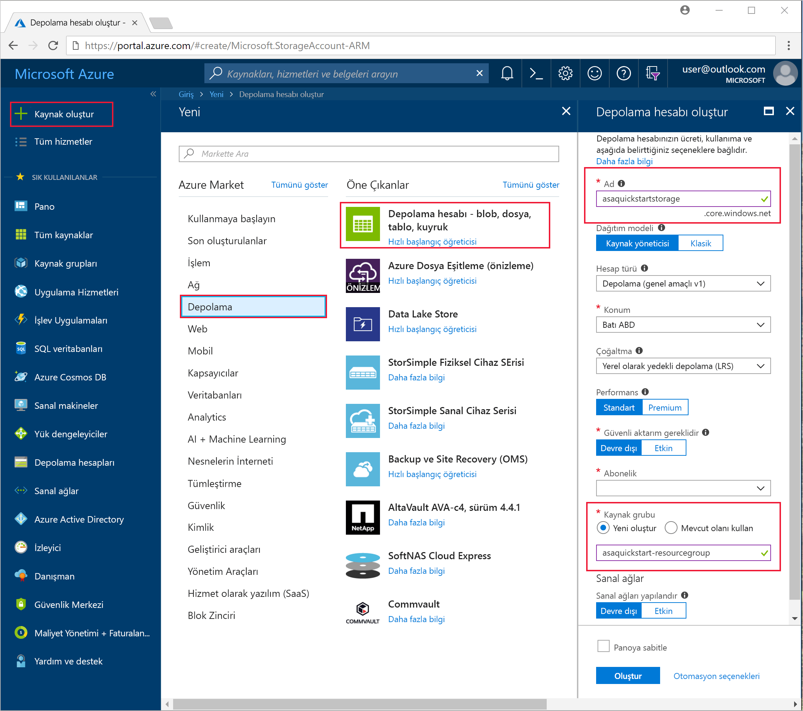
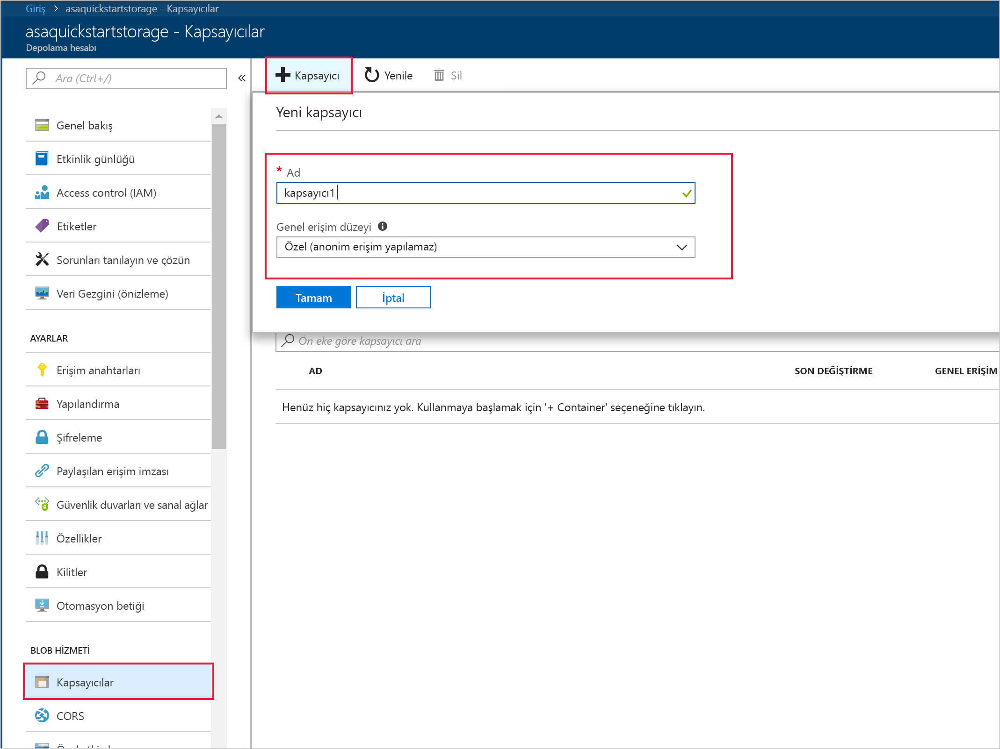
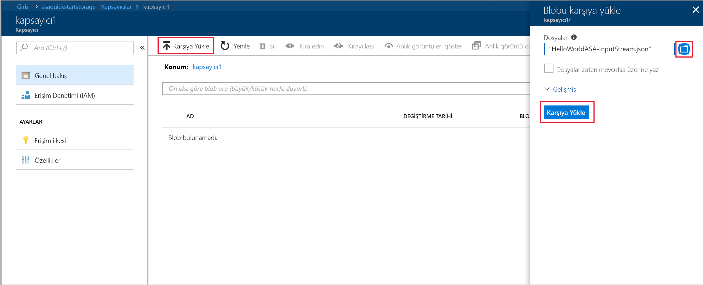

# <a name="quickstart-create-a-stream-analytics-job-by-using-the-azure-stream-analytics-tools-for-visual-studio"></a>Hızlı başlangıç: Visual Studio için Azure Stream Analytics araçlarını kullanarak bir Stream Analytics işi oluşturma

Bu hızlı başlangıçta Visual Studio için Azure Stream Analytics araçlarını kullanarak bir Stream Analytics işi oluşturma ve çalıştırma adımları gösterilmektedir. Örnek iş, Azure blob depolamadan akış verilerini okur. Bu hızlı başlangıçta kullanılan girdi verileri dosyası yalnızca tanım amaçlı statik veriler içerir. Gerçek dünya senaryolarında bir Stream Analytics işi için akışı yapılan girdi verilerini kullanırsınız. Bu hızlı başlangıçta 100° üzerindeki ortalama sıcaklığı hesaplayan ve sonuç olaylarını yeni bir dosyaya yazan bir iş tanımlayacaksınız.

## <a name="before-you-begin"></a>Başlamadan önce

* Azure aboneliğiniz yoksa [ücretsiz bir hesap](https://azure.microsoft.com/free/) oluşturun.

* [Azure Portal](https://portal.azure.com/) oturum açın.

* Visual Studio 2017, Visual Studio 2015 veya Visual Studio 2013 Güncelleştirme 4'ü yükleyin. Enterprise (Ultimate/Premium), Professional ve Community sürümleri desteklenir. Express sürümü desteklenmez.

* [Yükleme talimatlarını](https://docs.microsoft.com/azure/stream-analytics/stream-analytics-tools-for-visual-studio-install) izleyerek Visual Studio için Stream Analytics araçlarını yükleyin.

## <a name="prepare-the-input-data"></a>Girdi verilerini hazırlama

Stream Analytics işini tanımlamadan önce işe girdi olarak yapılandırılan verileri hazırlamanız gerekir. İş için gereken girdi verilerini hazırlamak için aşağıdaki adımları uygulayın:

1. GitHub’dan [örnek sensör verilerini](https://raw.githubusercontent.com/Azure/azure-stream-analytics/master/Samples/GettingStarted/HelloWorldASA-InputStream.json) indirin. Örnek veriler aşağıdaki JSON biçiminde sensör bilgilerini içerir:  

   ```json
   {
     "time": "2018-01-26T21:18:52.0000000",
     "dspl": "sensorC",
     "temp": 87,
     "hmdt": 44
   }
   ```
2. [Azure Portal](https://portal.azure.com/) oturum açın.

3. Azure portalının sol üst köşesinden **Kaynak oluştur** > **Depolama** > **Depolama hesabı**’nı seçin. Depolama hesabı işi sayfasını **Ad** değeri "asaquickstartstorage", **Konum** değeri "Batı ABD", **Kaynak grubu** "asaquickstart-resourcegroup" olarak ayarlanmış şekilde doldurun (daha yüksek performans için depolama hesabını Akış işiyle aynı kaynak grubunda barındırın). Diğer ayarlar varsayılan değerlerinde bırakılabilir.  

   

4. **Tüm kaynaklar** sayfasında, önceki adımda oluşturduğunuz depolama hesabını bulun. **Genel Bakış** sayfasını ve ardından **Bloblar** kutucuğunu açın.  

5. **Blob Hizmeti** sayfasında **Kapsayıcı**'yı seçin, kapsayıcınıza bir **Ad** verin (*container1* gibi) ve **Tamam**'ı seçin.  

   

6. Önceki adımda oluşturduğunuz kapsayıcıya gidin. **Karşıya yükle**’yi seçin ve ilk adımda elde ettiğiniz algılayıcı verilerini karşıya yükleyin.  

   

## <a name="create-a-stream-analytics-project"></a>Stream Analytics projesi oluşturma

1. Visual Studio’yu çalıştırın.

2. **Dosya > Yeni Proje**'yi seçin.  

3. Sol taraftaki şablon listesinden **Stream Analytics**'i ve ardından **Azure Stream Analytics Uygulaması**'nı seçin.  

4. Projenin **Ad**, **Konum** ve **Çözüm adı** değerlerini girip **Tamam**'ı seçin.

   

Azure Stream Analytics projesine dahil edilen öğelere dikkat edin.

   


## <a name="choose-the-required-subscription"></a>Gerekli aboneliği seçin

1. Visual Studio'nun **Görünüm** menüsünde **Sunucu Gezgini**'ni seçin.

2. **Azure**'a sağ tıklayıp **Microsoft Azure Aboneliğine Bağlan**'ı seçin ve Azure hesabınızla oturum açın.

## <a name="define-input"></a>Girişi tanımlama

1. **Çözüm Gezgini**'nde **Girişler** düğümünü genişletin ve **Input.json** dosyasına çift tıklayın.

2. **Stream Analytics Giriş Yapılandırması**'na aşağıdaki değerleri ekleyin:

   |**Ayar**  |**Önerilen değer**  |**Açıklama**   |
   |---------|---------|---------|
   |Girdi Diğer Adı  |  Girdi   |  İşin girdisini tanımlamak için bir ad girin.   |
   |Kaynak Türü   |  Veri Akışı |  Uygun giriş kaynağını seçin: Veri Akışı veya Başvuru Verileri.   |
   |Kaynak  |  Blob Depolama |  Uygun giriş kaynağını seçin.   |
   |Kaynak  | Geçerli hesaptaki veri kaynağını seçin | Verileri el ile girin veya var olan bir hesabı seçin.   |
   |Abonelik  |  \<Aboneliğiniz\>   | Oluşturduğunuz depolama hesabını içeren Azure aboneliğini seçin. Depolama hesabı, aynı veya farklı bir abonelikte olabilir. Bu örnekte, aynı abonelikte depolama hesabı oluşturduğunuz varsayılır.   |
   |Depolama Hesabı  |  asaquickstartstorage   |  Depolama hesabının adını seçin veya girin. Depolama hesabı adları aynı abonelikte oluşturulursa otomatik olarak algılanır.   |
   |Kapsayıcı  |  kapsayıcı1   |  Depolama hesabınızda oluşturduğunuz mevcut kapsayıcıyı seçin.   |
   
3. Diğer seçenekleri varsayılan değerlerinde bırakın ve ayarları kaydetmek **Kaydet**’i seçin.  

   

## <a name="define-output"></a>Çıkışı tanımlama

1. **Çözüm Gezgini**'nde **Çıkışlar** düğümünü genişletin ve **Output.json** dosyasına çift tıklayın.

2. **Stream Analytics Çıkış Yapılandırması**'na aşağıdaki değerleri ekleyin:

   |**Ayar**  |**Önerilen değer**  |**Açıklama**   |
   |---------|---------|---------|
   |Çıktı Diğer Adı  |  Çıktı   |  İşin çıktısını tanımlamak için bir ad girin.   |
   |Havuz   |  Blob Depolama |  Uygun havuzu seçin.    |
   |Kaynak  |  Veri kaynağı ayarlarını el ile sağlayın |  Verileri el ile girin veya var olan bir hesabı seçin.   |
   |Abonelik  |  \<Aboneliğiniz\>   | Oluşturduğunuz depolama hesabını içeren Azure aboneliğini seçin. Depolama hesabı, aynı veya farklı bir abonelikte olabilir. Bu örnekte, aynı abonelikte depolama hesabı oluşturduğunuz varsayılır.   |
   |Depolama Hesabı  |  asaquickstartstorage   |  Depolama hesabının adını seçin veya girin. Depolama hesabı adları aynı abonelikte oluşturulursa otomatik olarak algılanır.   |
   |Kapsayıcı  |  kapsayıcı1   |  Depolama hesabınızda oluşturduğunuz mevcut kapsayıcıyı seçin.   |
   |Yol Deseni  |  çıkış   |  Kapsayıcıda oluşturulacak dosya yolunun adını girin.   |
   
3. Diğer seçenekleri varsayılan değerlerinde bırakın ve ayarları kaydetmek **Kaydet**’i seçin.  

   

## <a name="define-the-transformation-query"></a>Dönüşüm sorgusunu tanımlama

1. Visual Studio'da **Çözüm Gezgini**'nden **Script.asaql** dosyasını açın.

2. Aşağıdaki sorguyu ekleyin:

   ```sql
   SELECT 
   System.Timestamp AS OutputTime,
   dspl AS SensorName,
   Avg(temp) AS AvgTemperature
   INTO
     Output
   FROM
     Input TIMESTAMP BY time
   GROUP BY TumblingWindow(second,30),dspl
   HAVING Avg(temp)>100
   ```

## <a name="submit-a-stream-analytics-query-to-azure"></a>Azure'a bir Stream Analytics sorgusu gönderme

1. **Sorgu Düzenleyicisi**'nin betik düzenleyici bölümünde **Azure'a Gönder**'i seçin.

2. **Yeni bir Azure Stream Analytics işi oluştur**'u seçip bir **İş Adı** girin. Hızlı başlangıcın başında kullandığınız **Abonelik**, **Kaynak Grubu** ve **Konum** bilgilerini seçin.

   

## <a name="start-the-stream-analytics-job-and-check-output"></a>Stream Analytics işini başlatıp çıktıyı denetleyin

1. İşiniz oluşturulduğunda otomatik olarak iş görünümü açılır. İşi başlatmak için yeşil ok düğmesini seçin.

   

2. **Özel Zaman**'ı `2018-01-01` olarak değiştirip **Başlat**'ı seçin.

   

3. İş durumunun **Çalışıyor** olarak değiştiğine ve giriş/çıkış olayları olduğuna dikkat edin. Bu birkaç dakika sürebilir.

   

4. Sonuçları görüntülemek için **Görünüm** menüsünde **Bulut Gezgini**'ni seçin ve kaynak grubunuzdaki depolama hesabına gidin. **Blob Kapsayıcıları** bölümünde **container1**'e ve ardından **output** dosya yoluna çift tıklayın.

   

## <a name="clean-up-resources"></a>Kaynakları temizleme

Artık gerekli olmadığında kaynak grubunu, akış işini ve tüm ilgili kaynakları silin. İşin silinmesi, iş tarafından kullanılan akış birimlerinin faturalanmasını önler. İşi gelecekte kullanmayı planlıyorsanız, durdurup daha sonra gerektiğinde yeniden başlatabilirsiniz. Bu işi kullanmaya devam etmeyecekseniz aşağıdaki adımları kullanarak bu hızlı başlangıçla oluşturulan tüm kaynakları silin:

1. Azure portalında sol taraftaki menüden, **Kaynak grupları**'nı ve ardından oluşturduğunuz kaynağın adını seçin.  

2. Kaynak grubu sayfanızda, **Sil**'i seçin, metin kutusuna silinecek kaynağın adını yazın ve ardından **Sil**'i seçin.

## <a name="next-steps"></a>Sonraki adımlar

Bu hızlı başlangıçta basit bir Stream Analytics işi dağıttınız. Diğer girdi kaynaklarını yapılandırma ve gerçek zamanlı algılama hakkında bilgi almak için aşağıdaki makaleye geçin:

> [!div class="nextstepaction"]
> [Azure Stream Analytics kullanarak gerçek zamanlı sahtekarlık algılama](stream-analytics-real-time-fraud-detection.md)
