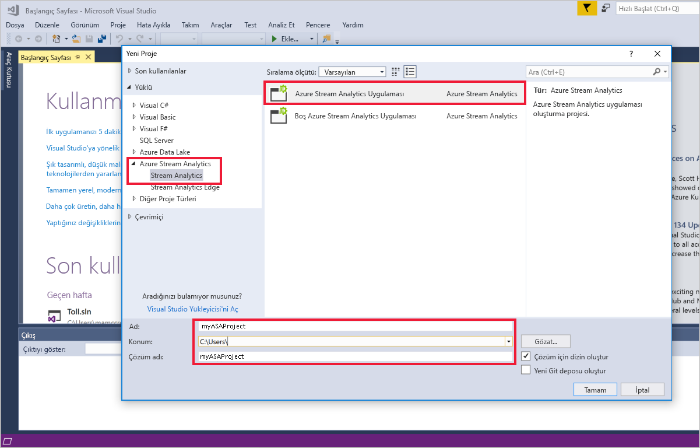
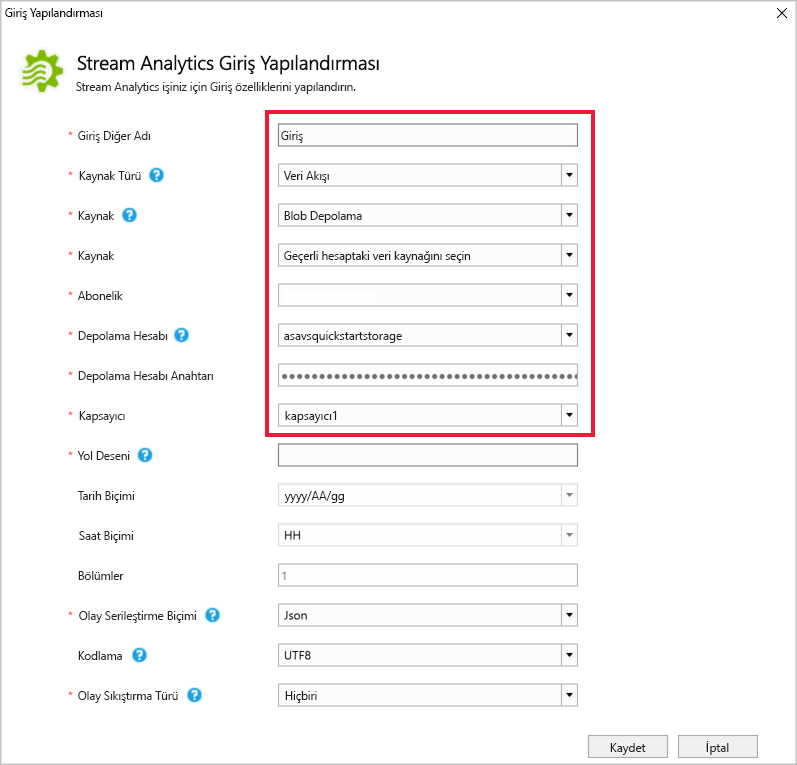
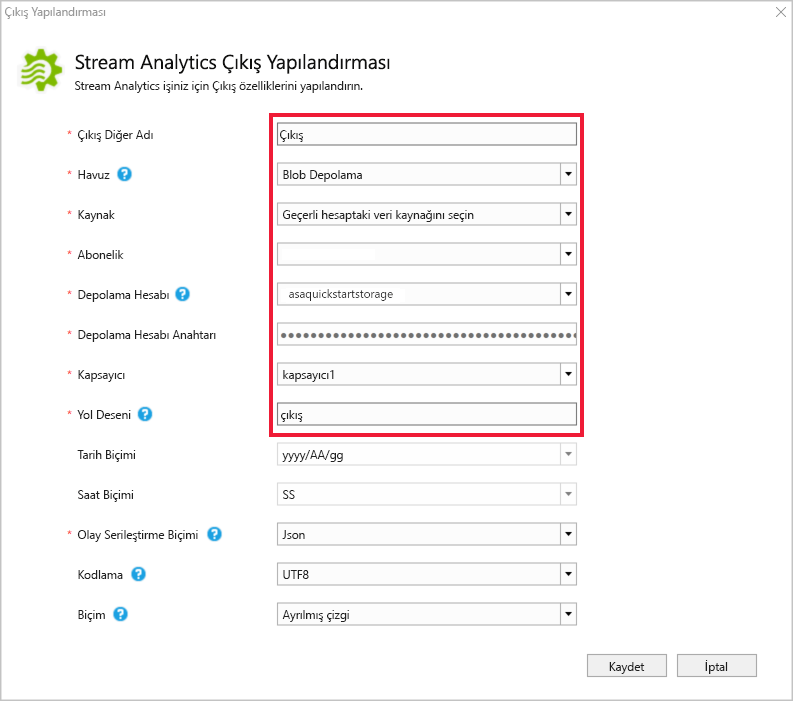
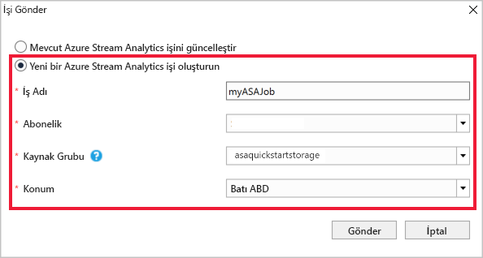
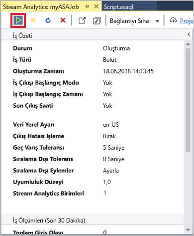
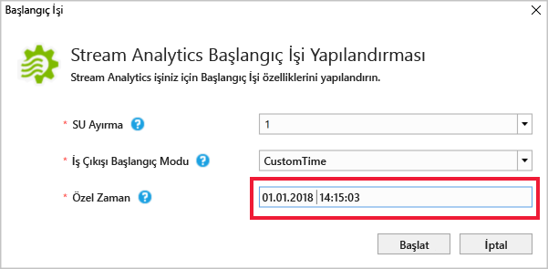
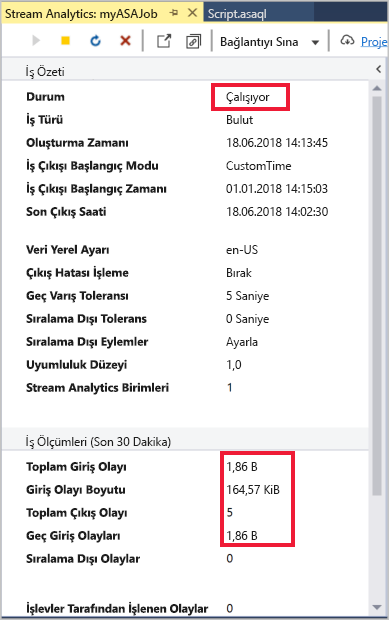
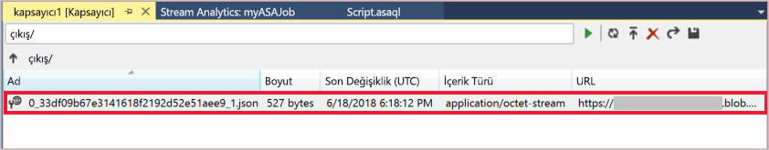

# <a name="quickstart-create-a-stream-analytics-job-by-using-the-azure-stream-analytics-tools-for-visual-studio"></a>Hızlı Başlangıç: Visual Studio için Azure Stream Analytics araçları kullanarak bir Stream Analytics işi oluşturma

Bu hızlı başlangıçta Visual Studio için Azure Stream Analytics araçlarını kullanarak bir Stream Analytics işi oluşturma ve çalıştırma adımları gösterilmektedir. Örnek Proje bir IOT Hub CİHAZDAN akış verilerini okur. Blob depolama üzerinde 27 ° ve yeni bir dosya için olayları sonuç çıktısı Yazar ortalama sıcaklık hesaplar olan bir işi tanımlarsınız.

## <a name="before-you-begin"></a>Başlamadan önce

* Azure aboneliğiniz yoksa [ücretsiz bir hesap](https://azure.microsoft.com/free/) oluşturun.

* [Azure Portal](https://portal.azure.com/) oturum açın.

* Visual Studio 2017, Visual Studio 2015 veya Visual Studio 2013 Güncelleştirme 4'ü yükleyin. Enterprise (Ultimate/Premium), Professional ve Community sürümleri desteklenir. Express sürümü desteklenmez.

* [Yükleme talimatlarını](https://docs.microsoft.com/azure/stream-analytics/stream-analytics-tools-for-visual-studio-install) izleyerek Visual Studio için Stream Analytics araçlarını yükleyin.

## <a name="prepare-the-input-data"></a>Girdi verilerini hazırlama

Stream Analytics işini tanımlamadan önce daha sonra iş girdi olarak yapılandırılan verileri hazırlamanız gerekir. İş için gereken girdi verilerini hazırlamak için aşağıdaki adımları tamamlayın:

1. [Azure Portal](https://portal.azure.com/) oturum açın.

2. **Kaynak oluştur** > **Nesnelerin İnterneti** > **Iot Hub** seçeneğini belirleyin.

3. İçinde **IOT hub'ı** bölmesinde aşağıdaki bilgileri girin:
   
   |**Ayar**  |**Önerilen değer**  |**Açıklama**  |
   |---------|---------|---------|
   |Abonelik  | \<Aboneliğiniz\> |  Kullanmak istediğiniz Azure aboneliğini seçin. |
   |Kaynak grubu   |   asaquickstart-resourcegroup  |   **Yeni Oluştur**’u seçin ve hesabınız için yeni bir kaynak grubu adı girin. |
   |Bölge  |  \<Kullanıcılarınıza en yakın bölgeyi seçin\> | Burada, IOT Hub'ınıza barındırabilirsiniz coğrafi bir konum seçin. Kullanıcılarınıza en yakın konumu kullanın. |
   |IoT Hub Adı  | MyASAIoTHub  |   IOT Hub'ınız için bir ad seçin.   |

   

4. Seçin **sonraki: Boyut ve ölçek kümesi**.

5. **Fiyatlandırma ve ölçek katmanınızı** seçin. Bu hızlı başlangıçta seçin **F1 - ücretsiz** aboneliğinizde hala kullanılabilir durumdaysa katmanı. Ücretsiz katmanı kullanılamıyorsa, kullanılabilir en düşük katmanlı seçin. Daha fazla bilgi için [IOT Hub fiyatlandırması](https://azure.microsoft.com/pricing/details/iot-hub/).

   

6. **İncele ve oluştur**’u seçin. IOT Hub bilgilerinizi gözden geçirin ve tıklayın **Oluştur**. IOT Hub'ınızın oluşturulması birkaç dakika sürebilir. İlerleme durumunu **Bildirimler** bölmesinden izleyebilirsiniz.

7. IOT hub'ı Gezinti menüsüne **Ekle** altında **IOT cihazları**. Ekleme bir **cihaz kimliği** tıklatıp **Kaydet**.

   

8. Cihaz oluşturulduktan sonra CİHAZDAN açın **IOT cihazları** listesi. Kopyalama **bağlantı dizesi – birincil anahtar** ve daha sonra kullanmak üzere Not Defteri'ne kaydedin.

   

## <a name="create-blob-storage"></a>BLOB Depolama oluşturma

1. Azure portalının sol üst köşesinden **Kaynak oluştur** > **Depolama** > **Depolama hesabı**’nı seçin.

2. İçinde **depolama hesabı oluşturma** bölmesinde, bir depolama hesabı adı, konum ve kaynak grubu girin. Aynı konum ve kaynak grubu oluşturduğunuz IOT Hub'ı seçin. Ardından **gözden geçir + Oluştur** hesabı oluşturmak için.

   

3. Depolama hesabınız oluşturulduktan sonra seçin **Blobları** kutucuğundan **genel bakış** bölmesi.

   

4. Gelen **Blob hizmeti** sayfasında **kapsayıcı** ve gibi kapsayıcınız için bir ad verin *kapsayıcı1*. Bırakın **genel erişim düzeyi** olarak **özel (anonim erişim yok)** seçip **Tamam**.

   

## <a name="create-a-stream-analytics-project"></a>Stream Analytics projesi oluşturma

1. Visual Studio’yu çalıştırın.

2. **Dosya > Yeni Proje**'yi seçin.  

3. Sol taraftaki şablon listesinden **Stream Analytics**'i ve ardından **Azure Stream Analytics Uygulaması**'nı seçin.  

4. Projenin **Ad**, **Konum** ve **Çözüm adı** değerlerini girip **Tamam**'ı seçin.

   

Azure Stream Analytics projesine dahil edilen öğelere dikkat edin.

   


## <a name="choose-the-required-subscription"></a>Gerekli aboneliği seçin

1. Visual Studio'nun **Görünüm** menüsünde **Sunucu Gezgini**'ni seçin.

2. **Azure**'a sağ tıklayıp **Microsoft Azure Aboneliğine Bağlan**'ı seçin ve Azure hesabınızla oturum açın.

## <a name="define-input"></a>Girişi tanımlama

1. **Çözüm Gezgini**'nde **Girişler** düğümünü genişletin ve **Input.json** dosyasına çift tıklayın.

2. **Stream Analytics Giriş Yapılandırması**'na aşağıdaki değerleri ekleyin:

   |**Ayar**  |**Önerilen değer**  |**Açıklama**   |
   |---------|---------|---------|
   |Girdi Diğer Adı  |  Girdi   |  İşin girdisini tanımlamak için bir ad girin.   |
   |Kaynak Türü   |  Veri Akışı |  Uygun giriş kaynağı seçin: Veri Stream veya başvuru verileriyle.   |
   |Kaynak  |  IoT Hub |  Uygun giriş kaynağını seçin.   |
   |Kaynak  | Geçerli hesaptaki veri kaynağını seçin | Verileri el ile girin veya var olan bir hesabı seçin.   |
   |Abonelik  |  \<Aboneliğiniz\>   | Oluşturduğunuz IOT Hub'ına Azure aboneliğini seçin.   |
   |IoT Hub  |  MyASAIoTHub   |  Seçin veya IOT Hub'ınızın adını girin. IOT hub'ı adları, aynı abonelikte oluşturulursa otomatik olarak algılanır.   |
   
3. Diğer seçenekleri varsayılan değerlerinde bırakın ve ayarları kaydetmek **Kaydet**’i seçin.  

   

## <a name="define-output"></a>Çıkışı tanımlama

1. **Çözüm Gezgini**'nde **Çıkışlar** düğümünü genişletin ve **Output.json** dosyasına çift tıklayın.

2. **Stream Analytics Çıkış Yapılandırması**'na aşağıdaki değerleri ekleyin:

   |**Ayar**  |**Önerilen değer**  |**Açıklama**   |
   |---------|---------|---------|
   |Çıktı Diğer Adı  |  Çıktı   |  İşin çıktısını tanımlamak için bir ad girin.   |
   |Havuz   |  Blob Depolama |  Uygun havuzu seçin.    |
   |Kaynak  |  Veri kaynağı ayarlarını el ile sağlayın |  Verileri el ile girin veya var olan bir hesabı seçin.   |
   |Abonelik  |  \<Aboneliğiniz\>   | Oluşturduğunuz depolama hesabını içeren Azure aboneliğini seçin. Depolama hesabı, aynı veya farklı bir abonelikte olabilir. Bu örnekte, aynı abonelikte depolama hesabı oluşturduğunuz varsayılır.   |
   |Depolama Hesabı  |  asaquickstartstorage   |  Depolama hesabının adını seçin veya girin. Depolama hesabı adları aynı abonelikte oluşturulursa otomatik olarak algılanır.   |
   |Kapsayıcı  |  kapsayıcı1   |  Depolama hesabınızda oluşturduğunuz mevcut kapsayıcıyı seçin.   |
   |Yol Deseni  |  çıkış   |  Kapsayıcıda oluşturulacak dosya yolunun adını girin.   |
   
3. Diğer seçenekleri varsayılan değerlerinde bırakın ve ayarları kaydetmek **Kaydet**’i seçin.  

   

## <a name="define-the-transformation-query"></a>Dönüşüm sorgusunu tanımlama

1. Visual Studio'da **Çözüm Gezgini**'nden **Script.asaql** dosyasını açın.

2. Aşağıdaki sorguyu ekleyin:

   ```sql
   SELECT *
   INTO BlobOutput
   FROM IoTHubInput
   HAVING Temperature > 27
   ```

## <a name="submit-a-stream-analytics-query-to-azure"></a>Azure'a bir Stream Analytics sorgusu gönderme

1. **Sorgu Düzenleyicisi**'nin betik düzenleyici bölümünde **Azure'a Gönder**'i seçin.

2. **Yeni bir Azure Stream Analytics işi oluştur**'u seçip bir **İş Adı** girin. Hızlı başlangıcın başında kullandığınız **Abonelik**, **Kaynak Grubu** ve **Konum** bilgilerini seçin.

   

## <a name="run-the-iot-simulator"></a>IOT simülatör'ü çalıştırma

1. Açık [Raspberry Pi Azure IOT çevrimiçi simülatör](https://azure-samples.github.io/raspberry-pi-web-simulator/) yeni tarayıcı sekmesinde veya penceresinde.

2. Satırı 15 yer tutucuyu, önceki bölümde kaydettiğiniz Azure IOT Hub cihaz bağlantı dizesiyle değiştirin.

3. **Çalıştır**’a tıklayın. Çıktı, IOT Hub'ına gönderilen iletileri ve sensör verilerini göstermelidir.

   

## <a name="start-the-stream-analytics-job-and-check-output"></a>Stream Analytics işini başlatıp çıktıyı denetleyin

1. İşiniz oluşturulduğunda otomatik olarak iş görünümü açılır. İşi başlatmak için yeşil ok düğmesini seçin.

   

2. Değişiklik **iş çıkışı başlangıç modu** için **JobStartTime** seçip **Başlat**.

   

3. İş durumunun **Çalışıyor** olarak değiştiğine ve giriş/çıkış olayları olduğuna dikkat edin. Bu birkaç dakika sürebilir.

   

4. Sonuçları görüntülemek için **Görünüm** menüsünde **Bulut Gezgini**'ni seçin ve kaynak grubunuzdaki depolama hesabına gidin. **Blob Kapsayıcıları** bölümünde **container1**'e ve ardından **output** dosya yoluna çift tıklayın.

   

## <a name="clean-up-resources"></a>Kaynakları temizleme

Artık gerekli olmadığında kaynak grubunu, akış işini ve tüm ilgili kaynakları silin. İşin silinmesi, iş tarafından kullanılan akış birimlerinin faturalanmasını önler. İşi gelecekte kullanmayı planlıyorsanız, durdurup daha sonra gerektiğinde yeniden başlatabilirsiniz. Bu işi kullanmaya devam etmeyecekseniz aşağıdaki adımları kullanarak bu hızlı başlangıçla oluşturulan tüm kaynakları silin:

1. Azure portalında sol taraftaki menüden, **Kaynak grupları**'nı ve ardından oluşturduğunuz kaynağın adını seçin.  

2. Kaynak grubu sayfanızda, **Sil**'i seçin, metin kutusuna silinecek kaynağın adını yazın ve ardından **Sil**'i seçin.

## <a name="next-steps"></a>Sonraki adımlar

Bu hızlı başlangıçta Visual Studio kullanarak basit bir Stream Analytics işi dağıttınız. Stream Analytics işlerini [Azure portalı](stream-analytics-quick-create-portal.md) ve [PowerShell](stream-analytics-quick-create-powershell.md)’i kullanarak da dağıtabilirsiniz. 

Visual Studio için Azure Stream Analytics araçları hakkında bilgi edinmek için aşağıdaki makaleye geçin:

> [!div class="nextstepaction"]
> [Azure Stream Analytics işleri görüntülemek için Visual Studio](stream-analytics-vs-tools.md)
