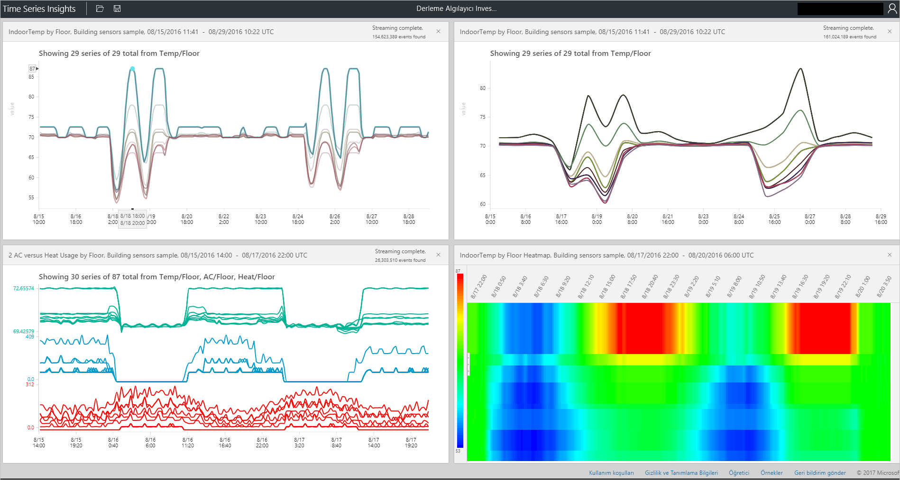

# Azure Time Series Insights Gezgini

Bu makalede özelliklere ve kullanılabilirlik için Azure Time Series Insights genel seçenekleri [explorer web uygulaması](https://insights.timeseries.azure.com/). Time Series Insights Gezgini hizmet tarafından sağlanan güçlü veri görselleştirme özellikleri gösterir ve kendi ortamında erişilebilir.

Azure Time Series Insights, milyarlarca IoT olayını aynı anda keşfedip analiz etmeyi kolaylaştıran ve tam olarak yönetilen bir analiz, depolama ve görselleştirme hizmetidir. IOT çözümünüzü hızlıca doğrulamanıza ve görev açısından kritik cihazlarda, kapalı kalma önlemenize olanak tanır, verilerinizin genel bir görünüm sağlar. Anomalileri, gizli eğilimleri keşfetmenize ve neredeyse gerçek zamanlı olarak kök neden analizleri gerçekleştirebilir. Time Series Insights Gezgini şu anda genel Önizleme aşamasındadır.

> [!TIP]
> Tanıtım ortamı üzerinden Kılavuzlu Tur için okuma [Azure Time Series Insights hızlı](time-series-quickstart.md).

## Video

### Time Series Insights Gezginini kullanarak verileri sorgulama hakkında bilgi edinin.  

> [!VIDEO https://www.youtube.com/embed/SHFPZvrR71s]

>[!NOTE]
>Önceki video bkz <a href="https://www.youtube.com/watch?v=6ehNf6AJkFo">"Zaman serisi görüşleri ile bir Azure IOT Çözüm Hızlandırıcısı kullanarak Başlarken."</a>

## Önkoşullar

Time Series Insights gezgininin kullanabilmeniz için önce şunları yapmalısınız:

- Zaman serisi görüşleri ortamı oluşturun. Daha fazla bilgi için [Time Series Insights ile çalışmaya başlama konusunda](./time-series-insights-get-started.md).
- [Erişim sağlamak](time-series-insights-data-access.md) hesabınıza ortamında.
- Ekleme bir [IOT hub'ı](time-series-insights-how-to-add-an-event-source-iothub.md) veya [olay hub'ı](time-series-insights-how-to-add-an-event-source-eventhub.md) olay kaynağına.

## Keşfedin ve veri sorgulama

Zaman serisi görüşleri ortamınıza olay kaynağınızı bağlanan dakika içinde keşfedebilir ve zaman serisi verilerinizi sorgulayın.

1. Başlamak için açık [Time Series Insights gezgininin](https://insights.timeseries.azure.com/) web tarayıcınızda. Pencerenin sol tarafında bir ortam seçin. Alfabetik olarak erişiminiz olan tüm ortamlar listelenir.

1. Bir ortam seçin sonra kullanın ya da **gelen** ve **için** yapılandırmaları, üst veya tıklayın ve istediğiniz zaman aralığını sürükleyin. Sağ üst köşesinde Büyüteç'i seçin veya seçilen zaman aralığı üzerinde sağ tıklayıp **arama**.

1. Ayrıca kullanılabilirlik otomatik olarak dakikada seçerek yenileyebileceğiniz **otomatik üzerinde** düğmesi. **Otomatik üzerinde** düğmesine yalnızca ana görselleştirme içeriğini değil, kullanılabilirlik grafiği uygular.

1. Azure bulut simgesi ortamınıza Azure portalında alır.

   

1. Ardından, seçili zaman aralığı tüm olayların sayısını gösteren bir grafik görürsünüz. Buraya çeşitli denetimler vardır:

    - **Koşulları Düzenleyicisi paneli**: Ortamınızı sorgu burada terimi alandır. Ekranın sol tarafında bulunan:
      - **Ölçü**: Bu açılan liste tüm sayısal sütunları gösterir (**double**).
      - **Bölme ölçütü**: Bu açılan liste kategorik sütunlar gösterir (**dizeleri**).
      - Basamaklı interpolasyon etkinleştirme, minimum ve maksimum Göster ve Denetim Masası'ndan y ekseninin yanındaki ayarlamak **ölçü**. Gösterilen veri sayısı, ortalama veya toplam veri olup olmadığını da ayarlayabilirsiniz.
      - Aynı x eksenine görüntülemek için en fazla beş koşullarını ekleyebilirsiniz. Kullanım **kopyalama aşağı** ek bir terim eklemek için düğme ya da seçin **Ekle** yeni bir terim eklemek için.

        

      - **Koşul**: Aşağıdaki tabloda listelenen işlenen kümesini kullanarak, olayları hızlı bir şekilde filtrelemek için koşul kullanın. Seçerek veya tıklayarak arama yapma, koşul güncelleştirmeleri otomatik olarak bu arama tabanlı. Desteklenen işlenen türleri şunlardır:

         |İşlem  |Desteklenen türler  |Notlar  |
         |---------|---------|---------|
         |`<`, `>`, `<=`, `>=`     |  Çift, DateTime, zaman aralığı       |         |
         |`=`, `!=`, `<>`     | Dize, Bool, Double, DateTime, zaman aralığı, NULL        |         |
         |IN     | Dize, Bool, Double, DateTime, zaman aralığı, NULL        |  Tüm işlenenler aynı türde veya NULL sabiti olması.        |
         |SAHİP     | String        |  Yalnızca sabit dize değişmez değerleri, sağ tarafa izin verilir. Boş dize ve NULL olmasına izin verilmez.       |

      - **Sorgu örnekleri**

         

1. Kullanabileceğiniz **aralık boyutu** içine ve dışına aralıklar aynı timespan yakınlaştırmak için kaydırıcı aracını. Kaydırıcıyı hareket ayrıntılı, yüksek çözünürlüklü keser verilerinizi görmenize olanak tanıyan aşağı dilimleri kesintisiz eğilimleri, milisaniyeye kadar küçük gösteren büyük dilimleri arasında süreyi daha kesin bir denetim sağlar. Başlangıç noktası Kaydırıcının varsayılan çözümleme, sorgu hızı ve ayrıntı düzeyi dengelemek için seçimden verilerinin en iyi görünümü ayarlayın.

1. **Zaman fırça** aracı bir timespan diğerine gitmek kolaylaştırır.

1. Kullanım **Kaydet** geçerli sorgunuzu kaydedin ve ortam diğer kullanıcılarla paylaşmak için komutu. Kullanırken **açık**, tüm kayıtlı sorgularınızı ve diğer kullanıcıların erişim iznine sahip olduğunuz ortamlarda paylaşılan sorgular görebilirsiniz.

   

## Verileri görselleştirme

1. Kullanım **perspektif Görünüm** aracı için en fazla dört benzersiz sorgu eş zamanlı bir görünüm. **Perspektif Görünüm** grafiğin sağ üst köşesinde bulunan düğmesidir.

   

1. Görsel olarak verilerinizi keşfetmek ve kullanmak için bir grafiği görüntülemeye **grafik** araçları:

    - **Seçin** veya **tıklayın** belirli bir zaman aralığı veya tek bir veri dizisi.
    - Bir zaman aralığı seçimi içinde yakınlaştırma veya olayları keşfedin.
    - Bir veri serisi içinde serisi başka bir sütunu örneğe göre Böl, seri yeni bir terim olarak ekleyebilir, yalnızca seçilen seriyi Göster, seçili seriyi dışta bırak, serisi ping veya seçili serisinden olayları keşfedin.
    - Grafiğin sol filtre alanına tüm görüntülenen veri serisi görebilir ve değer veya adına göre yeniden sıralayabilir. Ayrıca, tüm veri serisi veya sabitlenmiş veya sabitlenmemiş serisine de görüntüleyebilirsiniz. Tek bir veri dizisi seçin ve serisi başka bir sütunu örneğe göre Böl, serisi yeni bir terim olarak ekleyebilir, yalnızca seçili seriyi Göster, seçili seriyi dışta bırak, serisi sabitleme veya seçili serisinden olayları keşfedin.
    - Aynı anda birden çok kullanım koşulları görüntülediğinizde, yığın, biriktir, veri serisi hakkında ek verileri görmek ve tüm terimler arasında aynı y ekseni kullan. Grafiğin sağ üst köşesinde bulunan düğmeleri kullanın.

    

1. Kullanım **ısı Haritası** benzersiz veya anormal veri serisi içinde belirli bir sorgu hızlı bir şekilde kolayca belirleyebilmek için. Yalnızca bir arama terimi bir ısı Haritası görselleştirilebilir.

    

1. Ne zaman keşif olayları seçerek veya sağ tıklayarak, **olayları** paneli kullanımına sunulur. Tüm ham olaylarınızı burada görebilirsiniz ve olaylarınızı JSON veya CSV dosyaları olarak dışarı aktarın. Time Series Insights, tüm ham verileri depolar.

    

1. Seçin **İSTATİSTİKLERİ** olayları desenleri ve sütun istatistikleri kullanıma sunmak için keşfetmek sonra sekmesi.

    - **Desenler**: Bu özellik, seçili veri bölgesindeki en istatistiksel açıdan anlamlı desenleri için proaktif olarak ortaya çıkarır. Binlerce olayın en çok zaman ve enerji hangi desenleri gerektiren anlamak için Ara gerekmez. Time Series Insights ile analiz yapmadan devam etmek için doğrudan bu istatistiksel desenleri ile atlayabilirsiniz. Bu özellik ayrıca, geçmiş verilerin son İnceleme araştırmalar için yararlıdır.
    - **Sütun istatistikleri**: Sütun istatistikleri, grafikler ve seçili zaman aralığı seçili veri serisinin her bir sütundan gelen verilerin ayırmanız tablolar sağlar.

      

Artık çeşitli özellikler ve Time Series Insights Gezgini web app içinde mevcut olan seçenekler gördünüz.

## Sonraki adımlar

- Bilgi nasıl [sorunları tanılama ve çözme](time-series-insights-diagnose-and-solve-problems.md) Time Series Insights ortamınızdaki.
- Kılavuzlu ele [Azure Time Series Insights hızlı](time-series-quickstart.md) turu.
