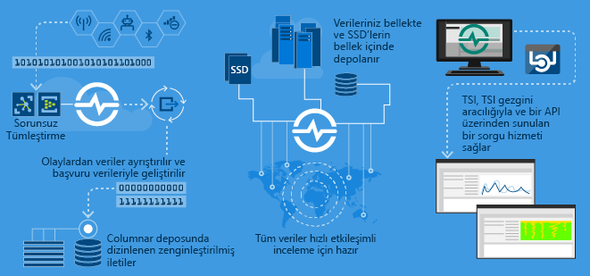

# Azure Time Series Insights nedir?

Azure zaman serisi öngörüleri (TSI), depolama, Görselleştirme ve zaman serisi verileri gibi IOT cihazlar tarafından oluşturulan büyük miktarda sorgulama için oluşturulmuştur.  Bulutta zaman serisi verilerini depolamak, yönetmek, sorgulamak veya görselleştirmek istiyorsanız Time Series Insights aradığınız çözüm olabilir.  

Time Series Insights dört temel işe sahiptir:

1. Azure IOT Hub ve Azure Event Hubs gibi bulut ağ geçidi ile tamamen tümleşiktir. Bu olay kaynaklarına kolayca bağlanır ve JSON kodu içindeki veri içeren iletilerle yapıları ayrıştırarak temiz satırlara ve sütunlara uygular. Meta verileri telemetri verileriyle birleştirerek verilerinizi sütunlu bir depoda dizinler.
1. TSI, depolama, verilerinizin yönetir. Verilerin her zaman kolayca erişilebilir durumda olmasını sağlamak için verilerinizi 400 güne kadar bellek içinde ve SSD'lerde depolar. İstek üzerine milyarlarca olayı etkileşimli olarak sorgulayabilirsiniz.
1. TSI TSI Gezgini aracılığıyla kullanıma hazır görselleştirme sağlar.  
1. TSI, TSI Gezgininde ve zaman serisi verilerinizle özel uygulamalara eklemek için kullanabileceğiniz tümleştirmek kolay API'leri kullanarak bir sorgu hizmeti sağlar.  

Dahili tüketim veya kullanmak, dış müşteriler için bir uygulama oluşturuyorsanız TSI dizin oluşturma, depolama ve zaman serisi verilerini toplamak için bir arka uç kullanılabilir. Özel Görselleştirme ve kullanıcı deneyimini üst kullanarak oluşturabileceğiniz [istemci SDK'sı](tutorial-explore-js-client-lib.md). TSI da donatılmış birkaç ile [sorgu API'leri](how-to-shape-query-json.md) senaryoları bu etkinleştirmek için özelleştirilebilir.  

Zaman serisi verileri bir varlığın veya işlemin zaman içindeki değişimini gösterir. Zaman serisi verileri bu nedenle zaman damgaları tarafından dizine eklenir ve zamanı en anlamlı eksen hangi tür veriler düzenlenir. Zaman serisi verileri, genellikle sıralı bir düzende ulaştığında ve genellikle bir güncelleştirme veritabanınıza yerine INSERT olarak sonuç olarak kabul edilir.

Büyük hacimlerdeki verilerin depolanması, dizinlenmesi, sorgulanması, analiz edilmesi ve görselleştirilmesi zor olabilir.
Ancak, Azure Time Series Insights yakalar ve her yeni olay bir satır olarak depolar ve değişiklik verimli bir şekilde zaman içinde son kavrayabilmeniz ve gelecekteki değişiklik tahmin etmek için geriye doğru görünmesini sağlayarak ölçülür.

## Video

### Azure zaman serisi görüşleri, IOT bulut tabanlı analiz platformu hakkında daha fazla bilgi edinin. 

> [!VIDEO https://youtube.com/embed/GaARrFfjoss]

## Birincil senaryolar

- Zaman serisi verilerini ölçeklenebilir bir şekilde depolama.  
  - Time Series Insights'ın temelinde zaman serisi verilerine göre tasarlanmış bir veritabanı bulunur.  Time Series Insights ölçeklenebilir ve tamamen yönetilebilir olduğundan olay depolama ve yönetme süreçlerini üstlenir.

- Neredeyse gerçek zamanlı veri keşfi.  
  - Time Series Insights, bir ortama akan tüm verileri görselleştiren bir gezgin sağlar.  Bir olay kaynağına bağlandıktan hemen sonra olay verilerini Time Series Insights içinde görüntüleyebilir, keşfedebilir ve sorgulayabilirsiniz.  Veriler cihazın beklenen verileri iletip iletmediğini doğrulamanın yanı sıra bir IoT varlığını sistem durumu, üretkenlik ve genel verimlilik açılarından izleme konusunda kullanışlıdır.  

- Kök neden analizi ve anormallik algılama.
  - Time Series Insights, çok adımlı kök neden analizi gerçekleştirmek ve kaydetmek için desenler ve perspektif görünümleri gibi araçlara sahiptir.  Time Series Insights ayrıca Azure Stream Analytics gibi uyarı hizmetleriyle birlikte çalışarak uyarıların ve algılanan anormalliklerin Time Series Insights gezgininin içinde neredeyse gerçek zamanlı olarak görüntülenmesini sağlar.  

- Çoklu varlık/site karşılaştırması için ayrı konumlardan gelen zaman serisi veri akışının genel görünümü.
  - Bir Time Series Insights ortamına birden fazla olay kaynağı bağlayabilirsiniz.  Bu da birden fazla ve birbirinden ayrı konumlardaki veri akışlarının neredeyse gerçek zamanlı olarak birlikte görüntülenebileceği anlamına gelir.  Kullanıcılar bu görünürlükten faydalanarak iş liderleriyle veri paylaşabilir ve sorunların çözülmesi, en iyi yöntemlerin uygulanması ve öğrenilenlerin paylaşılması konusunda yardımcı olabilecek alan uzmanlarıyla daha iyi bir işbirliği yapılmasını sağlayabilir.

- Time Series Insights'ı temel alan bir müşteri uygulaması derleme. 
  - Time Series Insights, REST Sorgu API'leri sunarak zaman serisi verilerini kullanan uygulamalar derlemenizi sağlar.

## Özellikler

- **Hızla kullanmaya başlayın:** Azure zaman serisi görüşleri önceden veri hazırlığı gerektirir. Azure IoT Hub'ınızdaki veya Event Hub'ındaki milyonlarca olaya dakikalar içinde bağlanın. Bağlandıktan sonra, IoT çözümlerinizi hızla doğrulamak için sensör verilerini görselleştirin ve verilerinizle etkileşim kurmaya hemen başlayın. Kod yazmadan verilerinizle etkileşim kurabilirsiniz.
Yeni dil öğrenmek gerekmez; Zaman Serisi Görüşleri ileri düzey kullanıcılara ayrıntılı, serbest metin kullanılan bir sorgu yüzeyi ve üzerine gelip tıklamayla ulaşılan açıklamalar sağlar.

- **Gerçek zamanlı içgörüler:** Time Series Insights milyonlarca sensör olayını her gün, bir dakikalık bir gecikmeyle alabilen. Time Series Insights, eğilimleri ve anormallikleri saptamanıza, kök-neden analizleri yürütmenize ve masraflı sistem kapatma sürelerini önlemenize yardımcı olarak sensör verileriniz üzerinde içgörüler kazanmanıza katkıda bulunur. Gerçek zamanlı verilerle geçmiş verileri arasında çapraz bağıntıya olanak tanıdığından, Zaman Serisi Görüşleri verilerindeki gizli eğilimleri ortaya çıkarmanıza yardımcı olur.

- **Özel çözümler derleme:** Azure zaman serisi öngörüleri verilerini mevcut uygulamalarınıza ekleyin ya da zaman serisi öngörüleri REST API'leriyle yeni özel çözümler oluşturun. Diğer kişilerin de içgörülerinizi incelemesini sağlamak için paylaşabileceğiniz kişiselleştirilmiş görünümler oluşturun.

- **Ölçeklenebilirlik:** Zaman serisi görüşleri, ölçekli olarak Iot'yi destekleyecek şekilde tasarlanmıştır. Günde 1 milyon ile 100 milyon arası olay alabilir ve varsayılan saklama süresi 31 gündür. Geçmiş verilerine ek olarak canlı veri akışlarını da neredeyse gerçek zamanlı olarak görselleştirebilir ve analiz edebilirsiniz. Kurumsal ölçekle başa çıkmak için ilerletme, giriş ve saklama hızları artırılacaktır.

## Başlarken

5 dakikadan daha kısa bir sürede kullanmaya başlayabilirsiniz.

1. Başlamak için Azure portalında Time Series Insights ortamı sağlayın.
1. Azure IoT Hub veya Event Hub gibi bir etkinlik kaynağına bağlanın.  
1. Başvuru verilerini yükleyin (bu ek hizmet değildir).
1. Time Series Insights gezgininde verilerinizi dakikalar halinde görün.

## Time Series Insights gezgini

Örnek zaman serisinin Bu diyagramda gösterilmektedir ınsights Veri Gezgini üzerinden görüntülenebilir: 

## Sonraki adımlar

- Azure Time Series Insights genel kullanılabilirliğini keşfedin [ücretsiz tanıtım ortamı](./time-series-quickstart.md).

- Daha fazla bilgi edinin [, zaman serisi görüşleri planlama](time-series-insights-environment-planning.md) ortam.