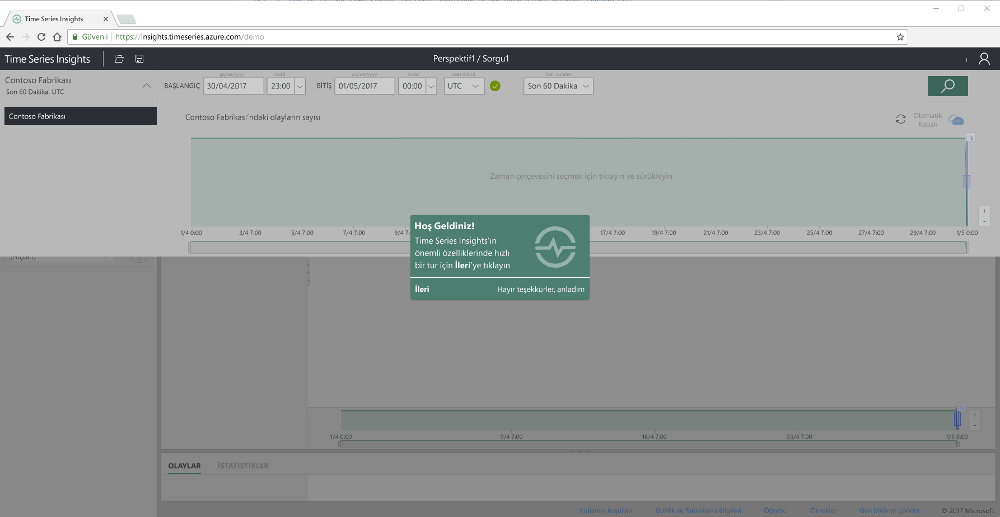
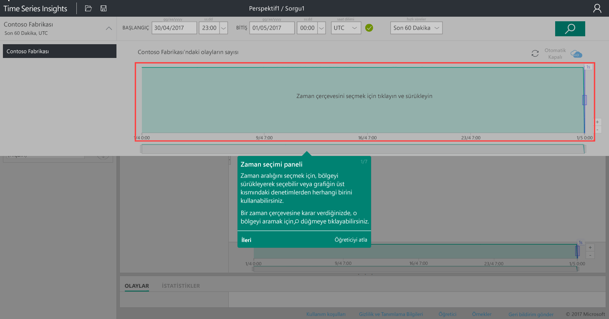
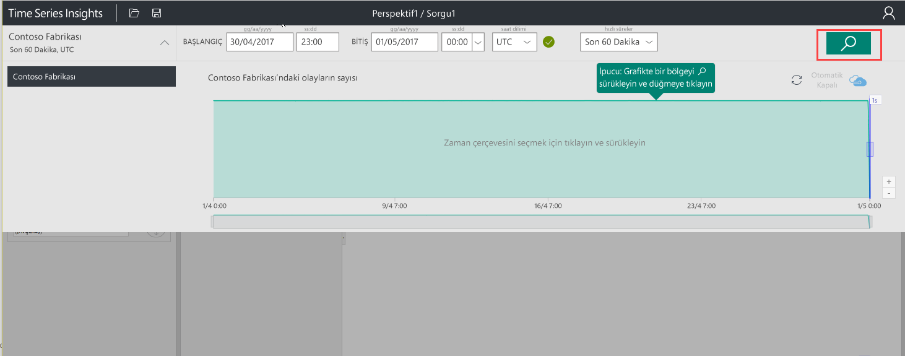
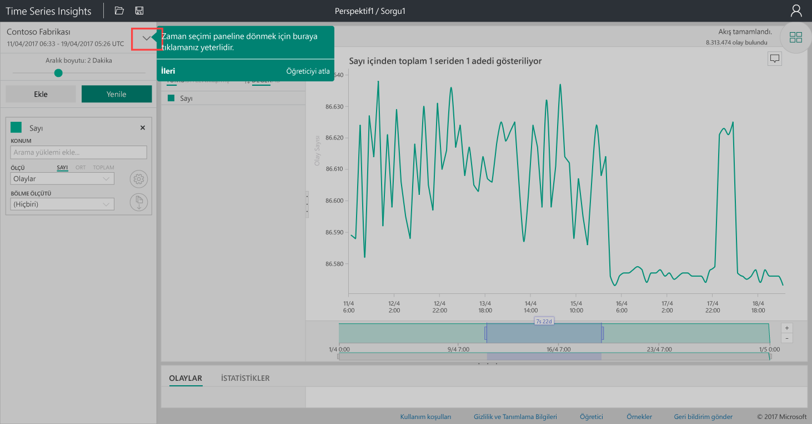
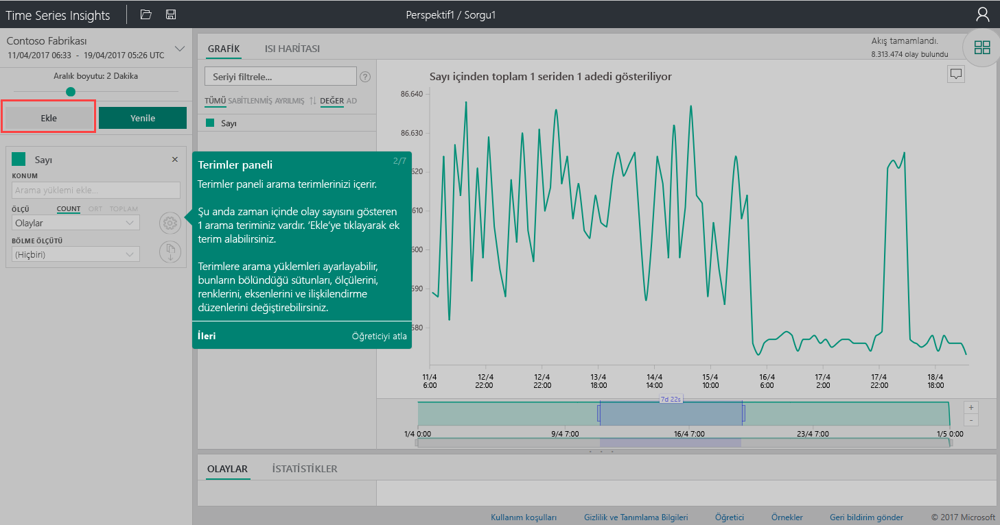
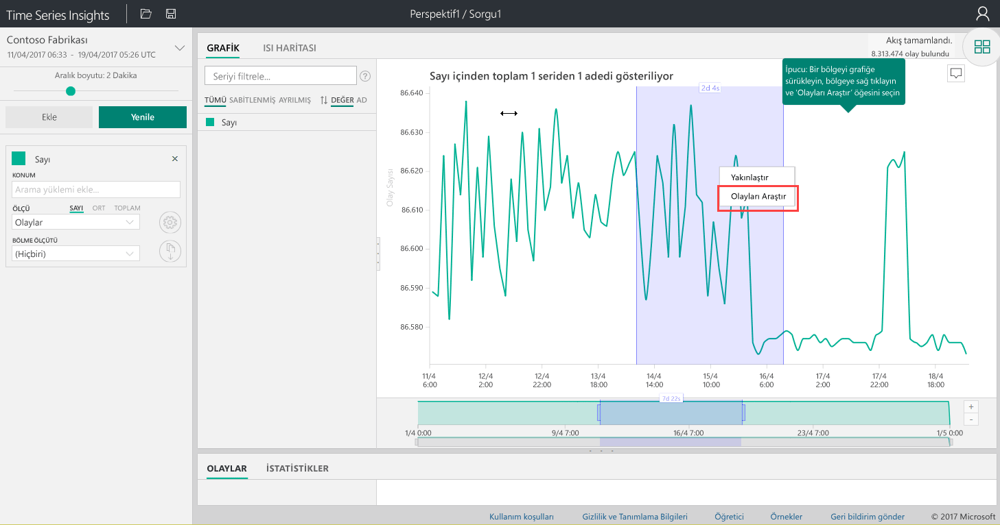
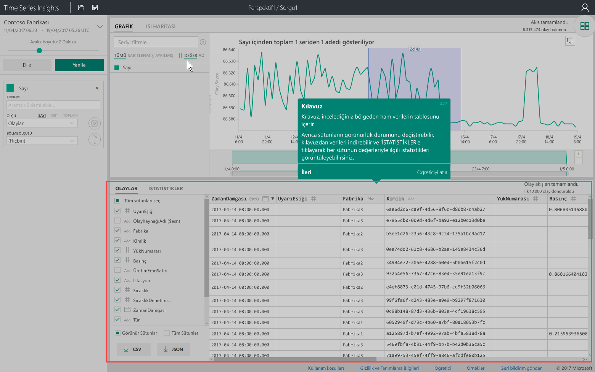
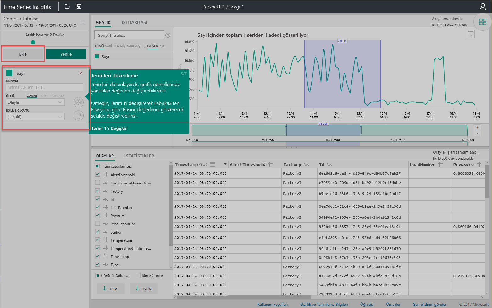

# Hızlı Başlangıç: Azure Time Series Insights’ı keşfedin

Bu hızlı başlangıçta Azure Time Series Insights Gezgini ücretsiz bir tanıtım ortamında Time Series Insights ile çalışmaya başlamanıza yardımcı olur. Artık genel kullanıma sunulmuş olan IOT verilerini ve turu anahtar özelliklerini büyük hacimli görselleştirmek için web tarayıcınızı kullanmayı öğrenin.

Azure Time Series Insights keşfedin ve milyarlarca IOT olayını aynı anda keşfedip Analiz işlemini kolaylaştıran tam olarak yönetilen bir analiz, depolama ve görselleştirme hizmeti olan. Böylece hızla IOT çözümünüzü doğrulamanıza ve görev açısından kritik cihazlarda, kapalı kalma kaçının, verilerinize ilişkin genel bir görünüm sağlar. Azure Time Series Insights, gizli eğilimleri anormallikleri keşfetmenize ve neredeyse gerçek zamanlı olarak kök neden analizleri gerçekleştirebilir yardımcı olur.

Daha fazla esneklik için kendi güçlü üzerinden önceden var olan bir uygulama için Azure Time Series Insights ekleyebilirsiniz [REST API'leri](./time-series-insights-update-tsq.md) ve [istemci SDK'sı](./tutorial-create-tsi-sample-spa.md). API'leri, sorgu, depolayın ve tercih ettiğiniz bir istemci uygulamasında zaman serisi verilerini kullanmak için kullanabilirsiniz. İstemci SDK'sı, kullanıcı Arabirimi bileşenleri, varolan bir uygulamaya eklemek için de kullanabilirsiniz.

Bu hızlı başlangıçta Time Series Insights Gezgini, artık genel kullanıma sunulmuş olan özellikler için Kılavuzlu bir turu sunar.

## Tanıtım ortamı hazırlama

1. Oluşturma bir [ücretsiz Azure hesabı](https://azure.microsoft.com/free/?ref=microsoft.com&utm_source=microsoft.com&utm_medium=docs&utm_campaign=visualstudio) , bir henüz oluşturmadıysanız.

1. Tarayıcınızda, Git [genel kullanılabilirlik tanıtım](https://insights.timeseries.azure.com/demo).

1. İstenirse, Time Series Insights Gezgini Azure hesabı kimlik bilgilerinizi kullanarak oturum açın.

1. Time Series Insights Hızlı Tur sayfası görüntülenir. Seçin **sonraki** hızlı turu başlatmak için.

   

## Tanıtım ortamı keşfedin

1. **Zaman seçimi paneline** görüntüler. Görselleştirilecek zaman aralığını seçmek için bu paneli kullanın.

   

1. Bir zaman aralığı seçin ve bölgede sürükleyin. Ardından **arama**.

   

   Time Series Insights, belirttiğiniz zaman aralığı için bir grafik görselleştirmesi görüntüler. Bunu, çizgi grafik çeşitli eylemler gerçekleştirebilirsiniz. Örneğin, filtreleme, sabitleme, sıralama yığın ve.

   Geri dönmek için **zaman seçimi paneline**, gösterildiği gibi aşağı oku seçin:

   

1. Seçin **Ekle** içinde **terimler paneli** yeni bir arama terimi eklemek için.

   

1. Grafikte bir bölgeyi seçip bölgeye sağ tıklayabilir ve **Olayları Keşfet**’i seçebilirsiniz.

   

   Ham verileriniz bir ızgara, araştırırken, bölgeden görüntüler.

   

## Seçin ve verileri filtreleme

1. Grafikteki değerleri değiştirmek için terimlerinizi düzenleyin. Karşılıklı çapraz-farklı türde değerler olarak ilişkilendirmek için başka bir terim ekleyin.

   

1. Bir filtreleme terimi girin **filtre serisi** improvised seri filtreleme kutusu. Bu hızlı başlangıçta, bir istasyona ait sıcaklığı ve basıncı karşılıklı olarak ilişkilendirmek için **Station5** terimini girin.

   

Hızlı başlangıcı bitirdikten sonra örnek veri kümesiyle deneme yaparak farklı görselleştirmeler oluşturabilirsiniz.

## Sonraki adımlar

Kendi Time Series Insights ortamınızı oluşturmaya hazırsınız:
> [!div class="nextstepaction"]
> [Time Series Insights ortamınızı planlayın](time-series-insights-environment-planning.md)
