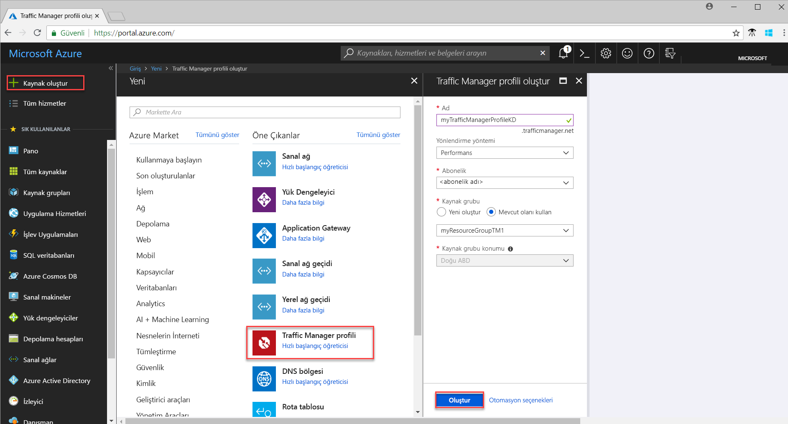
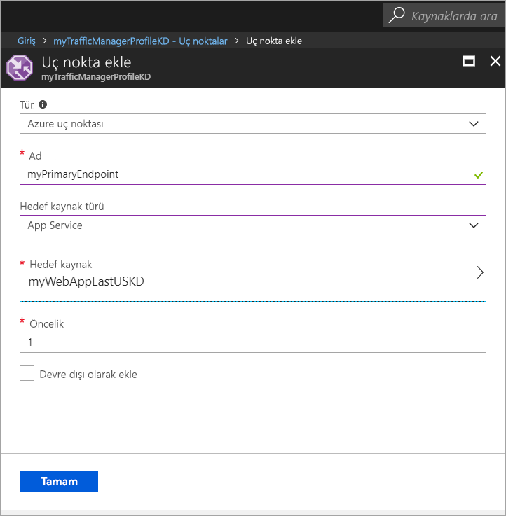

# Hızlı başlangıç: Yüksek oranda kullanılabilir web uygulaması için Traffic Manager profili oluşturma

Bu hızlı başlangıçta web uygulamanız için yüksek oranda kullanılabilirlik sunan bir Traffic Manager profili oluşturma adımları anlatılmaktadır. 

Bu hızlı başlangıçta anlatılan senaryo, bir web uygulamasının farklı Azure bölgelerinde çalışan iki örneğini kapsamaktadır. Kullanıcı trafiğinin uygulamayı çalıştıran birincil siteye yönlendirilmesine yardımcı olan bir [uç nokta önceliği](traffic-manager-routing-methods.md#priority) temelli Traffic Manager profili oluşturulmaktadır. Traffic Manager, web uygulamasını sürekli izler ve birincil site kullanım dışı olduğunda yedek siteye otomatik yük devretme gerçekleştirir.

Azure aboneliğiniz yoksa başlamadan önce [ücretsiz bir hesap](https://azure.microsoft.com/free/?WT.mc_id=A261C142F) oluşturun.

## Azure'da oturum açma 
https://portal.azure.com adresinden Azure portalında oturum açın.

## Ön koşullar
Bu hızlı başlangıç için bir web uygulamasının farklı Azure bölgelerinde (*Doğu ABD* ve *Batı Avrupa*) çalışan iki örneğini dağıtmanız gerekir. İki web uygulaması örneği, Traffic Manager için birincil ve yedek uç nokta görevi görür.

1. Ekranın sol üst tarafından **Kaynak oluştur** > **Web** > **Web Uygulaması** > **Oluştur**'u seçin.
2. **Web Uygulaması** sayfasında aşağıdaki bilgileri girdikten veya seçtikten sonra değer belirtilmeyen yerler için varsayılan ayarları kabul edin:

     | Ayar         | Değer     |
     | ---              | ---  |
     | Adı           | Web uygulamanız için benzersiz bir ad girin  |
     | Kaynak grubu          | **Yeni**'yi seçin ve *myResourceGroupTM1* yazın. |
     | Uygulama hizmeti planı/Konumu         | **Yeni**'yi seçin.  App Service planına *myAppServicePlanEastUS* yazın ve **Tamam**'ı seçin. 
     |      Konum  |   Doğu ABD        |
    |||

3. **Oluştur**’u seçin.
4. Web Uygulaması başarıyla dağıtıldığında varsayılan bir web sitesi oluşturulur.
5. 1-3 arası adımları tekrarlayarak aşağıdaki ayarlarla farklı bir Azure bölgesinde ikinci bir web sitesi oluşturun:

     | Ayar         | Değer     |
     | ---              | ---  |
     | Adı           | Web Uygulamanız için benzersiz bir ad girin  |
     | Kaynak grubu          | **Yeni**'yi seçin ve *myResourceGroupTM2* yazın. |
     | Uygulama hizmeti planı/Konumu         | **Yeni**'yi seçin.  App Service planına *myAppServicePlanWestEurope* yazın ve **Tamam**'ı seçin. 
     |      Konum  |   Batı Avrupa      |
    |||

## Traffic Manager profili oluşturma
Kullanıcı trafiğini uç nokta önceliğine göre yönlendiren bir Traffic Manager profili oluşturun.

1. Ekranın sol üst tarafından **Kaynak oluştur** > **Ağ** > **Traffic Manager profili** > **Oluştur**'u seçin.
2. **Traffic Manager profili oluştur** ekranında aşağıdaki bilgileri girin veya seçin, kalan ayarlar için varsayılan değerleri kabul edin ve sonra **Oluştur**'u seçin:
    
    | Ayar                 | Değer                                              |
    | ---                     | ---                                                |
    | Adı                   | Bu adın trafficmanager.net bölgesinde benzersiz olması ve Traffic Manager profilinize erişmek için kullanılan **trafficmanager.net** DNS adı ile sonuçlanması gerekir.|
    | Yönlendirme yöntemi          | **Öncelik** yönlendirme yöntemini seçin.|
    | Abonelik            | Aboneliğinizi seçin.|
    | Kaynak grubu          | **Var olan**’ı seçin ve sonra *myResourceGroupTM1* öğesini seçin.|
    |Konum |Bu ayar, kaynak grubunun konumunu ifade eder ve genel olarak dağıtılacak Traffic Manager profilini etkilemez.|
    |||
    
    
   

## Traffic Manager uç noktalarını ekleme

Tüm kullanıcı trafiğini yönlendirmek için birincil uç nokta olarak *Doğu ABD* bölgesindeki web sitesini ekleyin. Yedek uç nokta olarak *Batı Avrupa* bölgesindeki web sitesini ekleyin. Birincil uç nokta kullanılamadığında trafik otomatik olarak ikincil uç noktaya yönlendirilir.

1. Portalın arama çubuğunda önceki bölümde oluşturduğunuz Traffic Manager profili adını arayın ve görüntülenen sonuçların arasından bu profili seçin.
2. **Traffic Manager profili** sayfasının **Ayarlar** bölümünde **Uç noktalar**'a ve ardından **Ekle**'ye tıklayın.
3. Aşağıdaki bilgileri girin veya seçin, kalan ayarlar için varsayılan değerleri kabul edin ve sonra **Tamam**’ı seçin:

    | Ayar                 | Değer                                              |
    | ---                     | ---                                                |
    | Tür                    | Azure uç noktası                                   |
    | Adı           | myPrimaryEndpoint                                        |
    | Hedef kaynak türü           | App Service                          |
    | Hedef kaynak          | **Bir uygulama hizmeti seçerek** aynı abonelik altındaki Web Uygulamaların listesini görüntüleyebilirsiniz. **Kaynak** bölümünde ilk uç nokta olarak kullanmak istediğiniz uygulama hizmetini seçin. |
    | Öncelik               | **1**'i seçin. Bu durum, sağlıksız olması durumunda tüm trafiğin bu uç noktaya gitmesiyle sonuçlanır.    |
    
4. Bir sonraki Web Uygulaması uç noktası için 2 ve 3 numaralı adımları tekrarlayın. Uç noktayı eklerken **Öncelik** değerinin **2** olarak ayarlandığından emin olun.
5.  Her iki uç noktanın eklenmesi tamamlandığında, **Çevrimiçi** izleme durumuyla birlikte **Traffic Manager profili** bölümünde gösterilir.

    

## Traffic Manager profilini test etme
Bu bölümde ilk olarak Traffic Manager profilinizin etki alanı adını belirleyecek, ardından birincil uç nokta kullanım dışı olduğunda Traffic Manager'ın ikincil uç noktaya nasıl yük devrettiğini göreceksiniz.
### DNS adını belirleme
1.  Portalın arama çubuğunda önceki bölümde oluşturduğunuz **Traffic Manager profili** adını arayın. Görüntülenen sonuçların arasından Traffic Manager profilini seçin.
2. **Genel Bakış**'a tıklayın.
3. **Traffic Manager profili** penceresinde yeni oluşturduğunuz Traffic Manager profilinin DNS adı görüntülenir.
  
   

### Traffic Manager'ın nasıl çalıştığını görün

1. Web Uygulamanızın varsayılan web sitesini görüntülemek için bir web tarayıcısında Traffic Manager profilinizin DNS adını yazın. Bu hızlı başlangıç senaryosunda tüm istekler **Öncelik 1** olarak ayarlanmış olan birincil uç noktaya yönlendirilir.

2. Traffic Manager yük devretmesinin nasıl çalıştığını görmek için aşağıdaki adımları uygulayarak birincil sitenizi devre dışı bırakın:
    1. Traffic Manager Profil sayfasında **Ayarlar**>**Uç noktalar**>*MyPrimaryEndpoint* yolunu izleyin.
    2. *MyPrimaryEndpoint* sayfasında **Devre dışı bırakıldı**'yı seçin. 
    3. *MyPrimaryEndpoint* adlı birincil uç noktanın durumu **Devre dışı bırakıldı** olarak gösterilir.
3. Bir önceki adımdan Traffic Manager Profilinizin DNS adını kopyalayarak bir web tarayıcısına yapıştırdığınızda web sitesinin başarıyla görüntülendiğini göreceksiniz. Birincil uç nokta devre dışı bırakıldığında kullanıcı trafiği ikincil uç noktaya yönlendirilir.

## Kaynakları temizleme
Artık gerekli olmadığında kaynak grubunu, web uygulamalarını ve tüm ilgili kaynakları silin. Bunu yapmak için kaynak gruplarını (*myResourceGroupTM1* ve *myResourceGroupTM2*) seçin ve **Sil**'e tıklayın.

## Sonraki adımlar
Bu hızlı başlangıçta yüksek oranda kullanılabilir bir web uygulaması oluşturma amacıyla kullanıcı trafiğini yönlendirmenizi sağlayan bir Traffic Manager profili oluşturdunuz. Trafiği yönlendirme hakkında daha fazla bilgi edinmek için Traffic Manager öğreticilerine geçin.

> [!div class="nextstepaction"]
> [Traffic Manager öğreticileri](tutorial-traffic-manager-improve-website-response.md)

