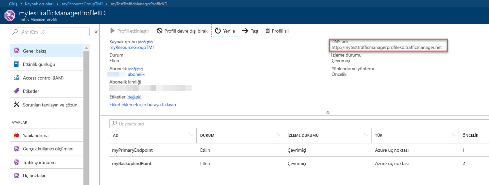
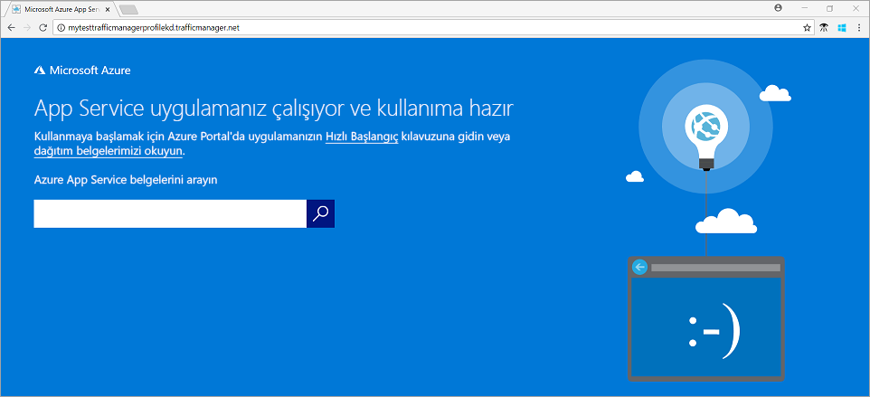

# Hızlı Başlangıç: Azure portalını kullanarak bir Traffic Manager profili oluşturma

Bu hızlı başlangıçta, web uygulamanız için yüksek kullanılabilirlik sağlayan bir Traffic Manager profilinin nasıl oluşturulacağını açıklar.

Bu hızlı başlangıçta, bir web uygulaması yaklaşık iki örneğini okuyun. Bunların her biri farklı bir Azure bölgesinde çalışıyor. Temel bir Traffic Manager profilini oluşturacağınız [uç nokta önceliği](traffic-manager-routing-methods.md#priority). Profil, kullanıcı trafiğini web uygulaması çalıştıran bir birincil siteye yönlendirir. Traffic Manager, web uygulaması sürekli olarak izler. Birincil site kullanılamıyorsa, otomatik yük devretme için yedekleme sitesi sağlar.

Azure aboneliğiniz yoksa şimdi [ücretsiz bir hesap](https://azure.microsoft.com/free/?WT.mc_id=A261C142F) oluşturun.

## Azure'da oturum açma

[Azure Portal](https://portal.azure.com) oturum açın.

## Önkoşullar

Bu hızlı başlangıçta, iki farklı Azure bölgelerinde dağıtılan web uygulamasının iki örneği gerekir (*Doğu ABD* ve *Batı Avrupa*). Traffic Manager için her birincil ve yük devretme uç noktalar olarak hizmet verecektir.

1. Ekranın sol üst tarafında seçin **kaynak Oluştur** > **Web** > **Web uygulaması**.
2. İçinde **Web uygulaması**girin veya bu ayarları seçin:

    | Ayar | Değer |
    | ------- | ----- |
    | Uygulama adı | Web uygulamanız için benzersiz bir ad girin.  |
    | Abonelik | Web uygulaması için uygulanan istediğiniz aboneliği seçin. |
    | Kaynak Grubu | Seçin **Yeni Oluştur**girin *myResourceGroupTM1*. |
    | İşletim Sistemi | Seçin **Windows** işletim sisteminiz olarak. |
    | Yayımlama | Seçin **kod** yayımlamak istediğiniz biçimi olarak. |

3. Seçin **App Service planı/konumu**.
4. İçinde **App Service planı**seçin **Yeni Oluştur**.
5. İçinde **yeni App Service planı**girin veya bu ayarları seçin:

    | Ayar | Değer |
    | ------- | ----- |
    | App Service planı | Girin *myAppServicePlanEastUS*. |
    | Location | Doğu ABD |
    | Fiyatlandırma katmanı | S1 Standart |

6. **Tamam**’ı seçin.

7. İçinde **Web uygulaması**seçin **Oluştur**. Web uygulaması başarıyla dağıttığında, varsayılan web sitesi oluşturur.

8. Farklı bir Azure bölgesinde ikinci bir Web sitesi oluşturmak için adım 1-7 bu ayarlarla yineleyin:

    | Ayar | Değer |
    | --------| ----- |
    | Ad | Web uygulamanız için benzersiz bir ad girin. |
    | Abonelik | Web uygulaması için uygulanan istediğiniz aboneliği seçin. |
    | Kaynak grubu | Seçin **Yeni Oluştur**yazıp enter *myResourceGroupTM2*. |
    | İşletim Sistemi | Seçin **Windows** işletim sisteminiz olarak. |
    | Yayımlama | Seçin **kod** yayımlamak istediğiniz biçimi olarak. |
    | Uygulama hizmeti planı/Konumu | Girin *myAppServicePlanWestEurope*. |
    | Location | Batı Avrupa |
    | Fiyatlandırma katmanı | S1 Standart |

## Traffic Manager profili oluşturma

Uç nokta önceliği temelinde kullanıcı trafiği yönlendiren bir Traffic Manager profili oluşturun.

1. Ekranın sol üst tarafında seçin **kaynak Oluştur** > **ağ** > **Traffic Manager profili**.
2. İçinde **Traffic Manager profili oluştur**girin veya bu ayarları seçin:

    | Ayar | Değer |
    | --------| ----- |
    | Ad | Traffic Manager profilinizin için benzersiz bir ad girin.|
    | Yönlendirme yöntemi | Seçin **öncelik**.|
    | Abonelik | Traffic manager profili uygulanmasını istediğiniz aboneliği seçin. |
    | Kaynak grubu | Seçin *myResourceGroupTM1*.|
    | Location |Bu ayar, kaynak grubunun konumunu ifade eder. Genel olarak dağıtılacak Traffic Manager profili bir etkisi yoktur.|

3. **Oluştur**’u seçin.

## Traffic Manager uç noktalarını ekleme

Tüm kullanıcı trafiğini yönlendirmek için birincil uç nokta olarak *Doğu ABD* bölgesindeki web sitesini ekleyin. Web sitesi Ekle *Batı Avrupa* bir yük devretme uç noktası olarak. Birincil uç noktaya kullanılamadığında, trafiği otomatik olarak yük devretme uç noktasına yönlendirir.

1. Portalın arama çubuğunda, önceki bölümde oluşturduğunuz Traffic Manager profil adı girin.
2. Arama sonuçlarından profili seçin.
3. İçinde **Traffic Manager profili**, **ayarları** bölümünden **uç noktaları**ve ardından **Ekle**.
4. Girin veya seçin, bu ayarları:

    | Ayar | Değer |
    | ------- | ------|
    | Tür | Seçin **Azure uç noktası**. |
    | Ad | Girin *myPrimaryEndpoint*. |
    | Hedef kaynak türü | Seçin **App Service'e**. |
    | Hedef kaynak | Seçin **uygulama hizmeti seçin** > **Doğu ABD**. |
    | Öncelik | **1**'i seçin. İyi durumda olduğunda tüm trafiğin Bu uç noktaya gider. |

    

5. **Tamam**’ı seçin.
6. İkinci Azure bölgeniz için bir yük devretme uç nokta oluşturmak için bu ayarlarla 3 ve 4 numaralı adımları tekrarlayın:

    | Ayar | Değer |
    | ------- | ------|
    | Tür | Seçin **Azure uç noktası**. |
    | Ad | Girin *myFailoverEndpoint*. |
    | Hedef kaynak türü | Seçin **App Service'e**. |
    | Hedef kaynak | Seçin **uygulama hizmeti seçin** > **Batı Avrupa**. |
    | Öncelik | Seçin **2**. Tüm trafiği birincil uç nokta iyi durumda olmayan yük devretme Bu uç noktaya gider. |

7. **Tamam**’ı seçin.

Bitirdiğinizde iki uç noktaları ekleyerek, bunların görüntülenme **Traffic Manager profili**. İzleme durumlarını olduğuna dikkat edin **çevrimiçi** şimdi.

## Traffic Manager profilini test etme

Bu bölümde, Traffic Manager profilinizin etki alanı adını kontrol edeceğiz. Ayrıca, kullanılamaz olarak birincil uç noktaya yapılandıracaksınız. Son olarak, web uygulaması hala kullanılabilir olduğunu görmek alın. Traffic Manager trafik yük devretme uç noktasına gönderir. olmasıdır.

### DNS adı denetleyin

1. Portalın arama çubuğunda önceki bölümde oluşturduğunuz **Traffic Manager profili** adını arayın.
2. Traffic manager profili seçin. **Genel bakış** görünür.
3. **Traffic Manager profili** penceresinde yeni oluşturduğunuz Traffic Manager profilinin DNS adı görüntülenir.
  
   

### Traffic Manager'ın nasıl çalıştığını görün

1. Bir web tarayıcısında, Web uygulamanızın varsayılan Web sitesini görüntülemek için Traffic Manager profilinizin DNS adını girin.

    > [!NOTE]
    > Bu hızlı başlangıçta senaryoda, tüm istekleri birincil uç noktasına yönlendirme. Ayarlanmış **öncelik 1**.

    

2. Traffic Manager yük devretme uygulamada görüntülemek için birincil siteniz devre dışı bırakın:
    1. Traffic Manager profili sayfasındaki gelen **genel bakış** bölümünden **myPrimaryEndpoint**.
    2. İçinde *myPrimaryEndpoint*seçin **devre dışı bırakılmış** > **Kaydet**.
    3. Kapat **myPrimaryEndpoint**. Durum olduğuna dikkat edin **devre dışı bırakılmış** şimdi.
3. Traffic Manager profilinizin DNS adını Web sitesini yeni bir web tarayıcı oturumunda görüntülemek için önceki adımı kopyalayın.
4. Web uygulaması hala kullanılabilir olduğunu doğrulayın.

Birincil uç noktaya yük devretme uç noktaya yönlendirilmesini için kullanılamaz.

## Kaynakları temizleme

İşiniz bittiğinde, kaynak grupları, web uygulamaları ve tüm ilgili kaynakları silin. Bunu yapmak için her bir öğe panonuzu ve select seçin **Sil** her sayfanın üstünde.

## Sonraki adımlar

Bu hızlı başlangıçta, bir Traffic Manager profili oluşturuldu. Yüksek kullanılabilirlik web uygulamaları için kullanıcı trafiği yönlendirmek sağlar. Trafiği yönlendirme hakkında daha fazla bilgi için Traffic Manager öğreticilerine devam edin.

> [!div class="nextstepaction"]
> [Traffic Manager öğreticileri](tutorial-traffic-manager-improve-website-response.md)
