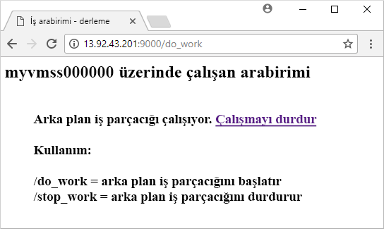

# <a name="quickstart-create-a-linux-virtual-machine-scale-set-with-an-azure-template"></a>Hızlı Başlangıç: Azure şablonuyla Linux sanal makine ölçek kümesi oluşturma
Sanal makine ölçek kümesi, birbiriyle aynı ve otomatik olarak ölçeklendirilen sanal makine kümesi dağıtmanızı ve yönetmenizi sağlar. Ölçek kümesi içindeki sanal makine sayısını el ile ölçeklendirebilir veya CPU, bellek talebi ya da ağ trafiği gibi kaynak kullanımını temel alan otomatik ölçeklendirme kuralları tanımlayabilirsiniz. Azure Load Balancer daha sonra ölçek kümesindeki sanal makine örneklerine trafiği dağıtır. Bu hızlı başlangıçta, Azure Resource Manager şablonu ile bir sanal makine ölçek kümesi oluşturur ve örnek uygulama dağıtırsınız.

Azure aboneliğiniz yoksa başlamadan önce [ücretsiz bir hesap](https://azure.microsoft.com/free/?WT.mc_id=A261C142F) oluşturun.

[!INCLUDE [cloud-shell-try-it.md](../../includes/cloud-shell-try-it.md)]

CLI'yi yerel olarak yükleyip kullanmayı tercih ederseniz bu öğretici için Azure CLI 2.0.29 veya sonraki bir sürümünü kullanmanız gerekir. Sürümü bulmak için `az --version` komutunu çalıştırın. Yükleme veya yükseltme yapmanız gerekiyorsa bkz. [Azure CLI'yı yükleme]( /cli/azure/install-azure-cli).


## <a name="define-a-scale-set-in-a-template"></a>Şablonda ölçek kümesi tanımlama
Azure Resource Manager şablonları, ilgili kaynak gruplarını dağıtmanızı sağlar. Şablonlar JavaScript Nesne Gösterimi (JSON) ile yazılmıştır ve uygulamanıza ait Azure altyapısı ortamının tamamını tanımlar. Tek bir şablonda sanal makine ölçek kümesi oluşturabilir, uygulamaları yükleyebilir ve otomatik ölçeklendirme kurallarını yapılandırabilirsiniz. Değişkenleri ve parametreleri kullanarak bu şablonu var olan ölçek kümelerini güncelleştirme veya yenilerini oluşturma amacıyla tekrar kullanabilirsiniz. Şablonları Azure portalı, Azure CLI veya Azure PowerShell aracılığıyla ya da sürekli tümleştirme/sürekli teslim (CI/CD) işlem hatlarından dağıtabilirsiniz.

Şablonlar hakkında daha fazla bilgi için bkz. [Azure Resource Manager'a genel bakış](https://docs.microsoft.com/azure/azure-resource-manager/resource-group-overview#template-deployment). JSON söz dizimi ve özellikler için bkz: [Microsoft.Compute/virtualMachineScaleSets](/azure/templates/microsoft.compute/virtualmachinescalesets) şablon başvurusu.

Şablonla ölçek kümesi oluşturmak için gerekli kaynakları tanımlamanız gerekir. Sanal makine ölçek kümesi kaynak türünün ana bölümleri şunlardır:

| Özellik                     | Özellik açıklaması                                  | Örnek şablon değeri                    |
|------------------------------|----------------------------------------------------------|-------------------------------------------|
| tür                         | Oluşturulacak Azure kaynağı türü                            | Microsoft.Compute/virtualMachineScaleSets |
| name                         | Ölçek kümesi adı                                       | myScaleSet                                |
| konum                     | Ölçek kümesinin oluşturulacağı konum                     | Doğu ABD                                   |
| sku.name                     | Her bir ölçek kümesi örneği için VM boyutu                  | Standard_A1                               |
| sku.capacity                 | Başlangıçta oluşturulacak VM örneği sayısı           | 2                                         |
| upgradePolicy.mode           | Değişiklik yapıldığında kullanılacak VM örneği yükseltme modu              | Automatic                                 |
| imageReference               | VM örnekleri için kullanılacak platform veya özel görüntü | Canonical Ubuntu Server 16.04-LTS         |
| osProfile.computerNamePrefix | Her bir VM örneği için ad ön eki                     | myvmss                                    |
| osProfile.adminUsername      | Her bir VM örneği için kullanıcı adı                        | azureuser                                 |
| osProfile.adminPassword      | Her bir VM örneği için parola                        | P@ssw0rd!                                 |

 Aşağıdaki örnekte temel ölçek kümesi kaynak tanımı gösterilmektedir. Bir ölçek kümesi şablonunu özelleştirmek için VM boyutunu veya başlangıç kapasitesini değiştirebilir ya da farklı bir platform veya özel görüntü kullanabilirsiniz.

```json
{
  "type": "Microsoft.Compute/virtualMachineScaleSets",
  "name": "myScaleSet",
  "location": "East US",
  "apiVersion": "2017-12-01",
  "sku": {
    "name": "Standard_A1",
    "capacity": "2"
  },
  "properties": {
    "upgradePolicy": {
      "mode": "Automatic"
    },
    "virtualMachineProfile": {
      "storageProfile": {
        "osDisk": {
          "caching": "ReadWrite",
          "createOption": "FromImage"
        },
        "imageReference":  {
          "publisher": "Canonical",
          "offer": "UbuntuServer",
          "sku": "16.04-LTS",
          "version": "latest"
        }
      },
      "osProfile": {
        "computerNamePrefix": "myvmss",
        "adminUsername": "azureuser",
        "adminPassword": "P@ssw0rd!"
      }
    }
  }
}
```

 Örneği kısa tutmak için sanal ağ arabirim kartı (NIC) yapılandırılması gösterilmemiştir. Yük dengeleyici gibi ek bileşenler de gösterilmemiştir. Ölçek kümesi şablonunun tamamı [bu makalenin sonunda](#deploy-the-template) gösterilmiştir.


## <a name="add-a-sample-application"></a>Örnek uygulama ekleme
Ölçek kümenizi test etmek için temel web uygulaması yükleyin. Bir ölçek kümesini dağıttığınızda VM uzantıları uygulama yükleme gibi dağıtım sonrası yapılandırma ve otomasyon görevlerini gerçekleştirebilir. Betikler Azure depolama veya GitHub konumlarından indirilebilir ya da Azure portalına uzantı çalışma zamanında iletilebilir. Ölçek kümenize uzantı uygulamak için önceki kaynak örneğine *extensionProfile* bölümünü eklemeniz gerekir. Uzantı profili temelde aşağıdaki özellikleri tanımlar:

- Uzantı türü
- Uzantı yayımcısı
- Uzantı sürümü
- Yapılandırma veya yükleme betiklerinin konumu
- VM örneklerinde yürütülecek komutlar

[Linux'ta Python HTTP sunucusu](https://github.com/Azure/azure-quickstart-templates/tree/master/201-vmss-bottle-autoscale) şablonu, Özel Betik Uzantısı'nı kullanarak bir Python web çerçevesi olan [Bottle](https://bottlepy.org/docs/dev/) uygulamasını ve basit bir HTTP sunucusu yükler. 

İki betik **fileUris** - *installserver.sh* ve *workserver.py* içinde tanımlanmıştır. Bu dosyalar GitHub'dan indirildikten sonra *commandToExecute*, uygulamayı yüklemek ve yapılandırmak için `bash installserver.sh` komutunu çalıştırır:

```json
"extensionProfile": {
  "extensions": [
    {
      "name": "AppInstall",
      "properties": {
        "publisher": "Microsoft.Azure.Extensions",
        "type": "CustomScript",
        "typeHandlerVersion": "2.0",
        "autoUpgradeMinorVersion": true,
        "settings": {
          "fileUris": [
            "https://raw.githubusercontent.com/Azure/azure-quickstart-templates/master/201-vmss-bottle-autoscale/installserver.sh",
            "https://raw.githubusercontent.com/Azure/azure-quickstart-templates/master/201-vmss-bottle-autoscale/workserver.py"
          ],
          "commandToExecute": "bash installserver.sh"
        }
      }
    }
  ]
}
```


## <a name="deploy-the-template"></a>Şablonu dağıtma
[Linux'ta Python HTTP sunucusu](https://github.com/Azure/azure-quickstart-templates/tree/master/201-vmss-bottle-autoscale) şablonunu aşağıdaki **Azure'a dağıtın** düğmesiyle dağıtabilirsiniz. Bu düğme Azure portalını açar, şablonun tamamını yükler ve ölçek kümesi adı, örnek sayısı ve yönetici kimlik bilgileri gibi birkaç parametreyi sorar.

[](https://portal.azure.com/#create/Microsoft.Template/uri/https%3A%2F%2Fraw.githubusercontent.com%2FAzure%2Fazure-quickstart-templates%2Fmaster%2F201-vmss-bottle-autoscale%2Fazuredeploy.json)

Azure CLI ile [az group deployment create](/cli/azure/group/deployment) komutunu kullanarak da Python HTTP sunucusunu Linux'ta dağıtabilirsiniz:

```azurecli-interactive
# Create a resource group
az group create --name myResourceGroup --location EastUS

# Deploy template into resource group
az group deployment create \
    --resource-group myResourceGroup \
    --template-uri https://raw.githubusercontent.com/Azure/azure-quickstart-templates/master/201-vmss-bottle-autoscale/azuredeploy.json
```

VM örnekleri için ölçek kümesi adı, örnek sayısı ve yönetici kimlik bilgileri istemlerini yanıtlayın. Ölçek kümesinin ve yardımcı kaynakların oluşturulması birkaç dakika sürer.


## <a name="test-your-scale-set"></a>Ölçek kümenizi test etme
Ölçek kümenizi çalışır halde görmek için bir web tarayıcısında örnek web uygulamasına erişin. Aşağıdaki adımları uygulayarak [az network public-ip list](/cli/azure/network/public-ip) ile yük dengeleyicisinin genel IP adresini alın:

```azurecli-interactive
az network public-ip list \
    --resource-group myResourceGroup \
    --query [*].ipAddress -o tsv
```

Yük dengeleyicinin genel IP adresini bir web tarayıcısına şu biçimde girin *http:\//publicIpAddress:9000 / do_work*. Aşağıdaki örnekte gösterildiği gibi yük dengeleyici trafiği VM örneklerinizden birine dağıtır:




## <a name="clean-up-resources"></a>Kaynakları temizleme
Artık gerekli değilse, aşağıdaki gibi [az group delete](/cli/azure/group) komutunu kullanarak kaynak grubunu, ölçek kümesini tüm ilgili kaynakları kaldırabilirsiniz. `--no-wait` parametresi işlemin tamamlanmasını beklemeden denetimi komut istemine döndürür. `--yes` parametresi kaynakları ek bir komut istemi olmadan silmek istediğinizi onaylar.

```azurecli-interactive
az group delete --name myResourceGroup --yes --no-wait
```


## <a name="next-steps"></a>Sonraki adımlar
Bu hızlı başlangıçta, Azure şablonuyla bir Linux ölçek kümesi oluşturdunuz ve Özel Betik Uzantısı'nı kullanarak VM örneklerine basit bir Python web sunucusu yüklediniz. Daha fazla bilgi edinmek için Azure sanal makine ölçek kümelerinin nasıl oluşturulacağı ve yönetileceğine ilişkin öğreticiyle devam edin.

> [!div class="nextstepaction"]
> [Azure sanal makine ölçek kümeleri oluşturma ve yönetme](tutorial-create-and-manage-cli.md)
