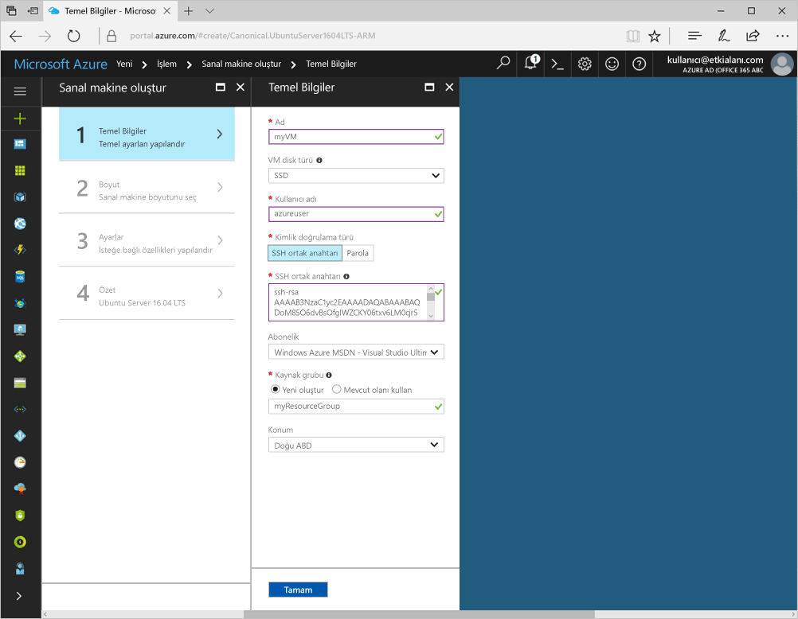
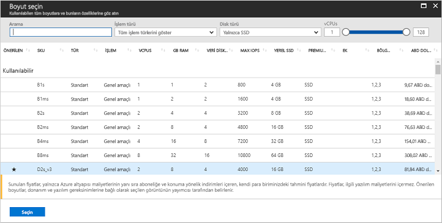

<a id="create-a-linux-virtual-machine-with-the-azure-portal" class="xliff"></a>

# Azure portal ile Linux sanal makinesi oluşturma

Azure sanal makineleri, Azure portalı üzerinden oluşturulabilir. Bu yöntem, sanal makineleri ve tüm ilgili kaynakları oluşturup yapılandırmaya yönelik tarayıcı tabanlı bir kullanıcı arabirimi sağlar. Sanal makine oluşturma ve VM’ye web sunucusu yüklemeye yönelik Hızlı Başlangıç adımları.

Azure aboneliğiniz yoksa başlamadan önce [ücretsiz bir hesap](https://azure.microsoft.com/free/?WT.mc_id=A261C142F) oluşturun.

<a id="create-ssh-key-pair" class="xliff"></a>

## SSH anahtar çifti oluşturma

Bu hızlı başlangıcı tamamlamak için bir SSH anahtar çifti gerekir. Bir SSH anahtar çiftiniz varsa bu adımı atlayabilirsiniz.

Bir Bash kabuğundan bu komutu çalıştırın ve ekrandaki yönergeleri izleyin. Komut çıktısı genel anahtar dosyasının dosya adını içerir. Ortak anahtar dosyasının içeriğini panoya kopyalayın.

```bash
ssh-keygen -t rsa -b 2048
```

<a id="log-in-to-azure" class="xliff"></a>

## Azure'da oturum açma 

http://portal.azure.com sayfasından Azure portalda oturum açın.

<a id="create-virtual-machine" class="xliff"></a>

## Sanal makine oluşturma

1. Azure portalının sol üst köşesinde bulunan **Yeni** düğmesine tıklayın.

2. **İşlem** ve **Ubuntu Server 16.04 LTS**’yi seçin ve **Resource Manager**’ın seçili dağıtım modeli olduğundan emin olun. **Oluştur** düğmesine tıklayın. 

3. Sanal makine bilgilerini girin. **Kimlik doğrulama türü** için **SSH ortak anahtarı**’nı seçin. SSH ortak anahtarınıza yapıştırırken, önce veya sonra gelen tüm boşlukları kaldırmaya dikkat edin. İşlem tamamlandığında **Tamam**’a tıklayın.

    

4. VM için bir boyut seçin. Daha fazla boyut görmek için **Tümünü görüntüle**’yi seçin veya **Desteklenen disk türü** filtresini değiştirin. 

      

5. Ayarlar dikey penceresinde, **Yönetilen diskleri kullan** altında **Evet**’i seçin, kalan ayarları varsayılan değerlerinde bırakın ve **Tamam**’a tıklayın.

6. Özet sayfasında **Tamam**’a tıklayarak sanal makine dağıtımını başlatın.

7. VM, Azure portalı panosuna sabitlenir. Dağıtım tamamlandıktan sonra VM özeti dikey penceresi otomatik olarak açılır.


<a id="connect-to-virtual-machine" class="xliff"></a>

## Sanal makineye bağlanma

Sanal makine ile bir SSH bağlantısı oluşturun.

1. Sanal makine dikey penceresindeki **Bağlan** düğmesine tıklayın. Bağlan düğmesi, sanal makineye bağlanmak için kullanılabilen bir SSH bağlantı dizesi gösterir.

     

2. Bir SSH oturumu oluşturmak için aşağıdaki komutu çalıştırın. Bağlantı dizesini Azure portaldan kopyaladığınız dizeyle değiştirin.

```bash 
ssh azureuser@40.112.21.50
```

<a id="install-nginx" class="xliff"></a>

## NGINX yükleme

Paket kaynaklarını güncelleştirmek ve en son NGINX paketini yüklemek için aşağıdaki bash betiğini kullanın. 

```bash 
#!/bin/bash

# update package source
sudo apt-get -y update

# install NGINX
sudo apt-get -y install nginx
```

İşiniz bittiğinde, SSH oturumundan çıkıp Azure portalında VM özelliklerine geri dönün.


<a id="open-port-80-for-web-traffic" class="xliff"></a>

## Web trafiği için 80 numaralı bağlantı noktasını açın 

Ağ güvenlik grubu (NSG), gelen ve giden trafiğin güvenliğini sağlar. Azure portalından bir VM oluşturulduğunda, SSH bağlantıları için 22 numaralı bağlantı noktasında bir gelen kuralı oluşturulur. Bu VM bir web sunucusunu barındırdığından, 80 numaralı bağlantı noktası için bir NSG kuralının oluşturulması gerekir.

1. Sanal makinede **Kaynak grubunun** adına tıklayın.
2. **Ağ güvenlik grubu**’nu seçin. NSG, **Tür** sütunu kullanılarak tanımlanabilir. 
3. Sol menüdeki ayarlar altında **Gelen güvenlik kuralları**’na tıklayın.
4. **Ekle**'ye tıklayın.
5. **Ad** alanına **http** yazın. **Bağlantı noktası aralığı** değerinin 80, **Eylem** ayarının **İzin Ver** olarak belirlendiğinden emin olun. 
6. **Tamam** düğmesine tıklayın.


<a id="view-the-nginx-welcome-page" class="xliff"></a>

## NGINX karşılama sayfasını görüntüleme

NGINX yüklüyken ve 80 numaralı bağlantı noktası sanal makineniz için açıkken, web sunucusuna İnternet üzerinden erişilebilir. Bir web tarayıcısı açın ve VM’nin ortak IP adresini girin. Genel IP adresi, Azure portalındaki VM dikey penceresinde bulunabilir.

 

<a id="clean-up-resources" class="xliff"></a>

## Kaynakları temizleme

Artık gerekli olmadığında kaynak grubunu, sanal makineyi ve tüm ilişkili kaynakları silin. Bunu yapmak için sanal makine dikey penceresinden kaynak grubunu seçip **Sil**’e tıklayın.

<a id="next-steps" class="xliff"></a>

## Sonraki adımlar

Bu hızlı başlangıçta basit bir sanal makine ve bir ağ güvenlik grubu kuralı dağıtıp, bir web sunucusu yüklediniz. Azure sanal makineleri hakkında daha fazla bilgi için Linux VM’lerine yönelik öğreticiye geçin.

> [!div class="nextstepaction"]
> [Azure Linux sanal makine öğreticileri](./tutorial-manage-vm.md)

