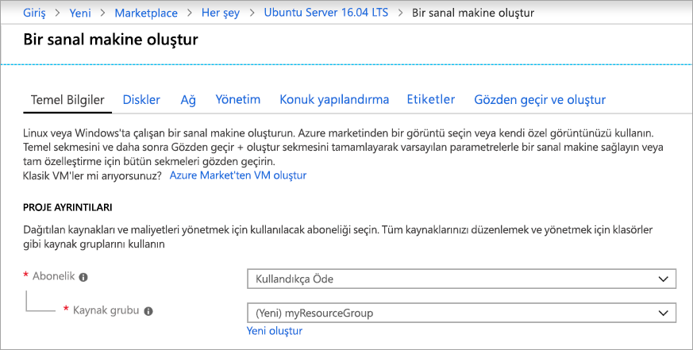
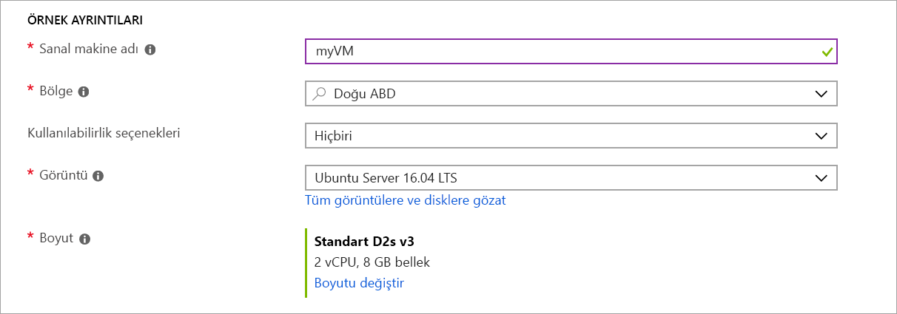
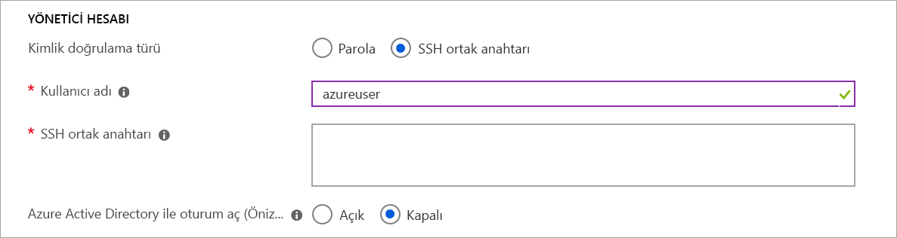
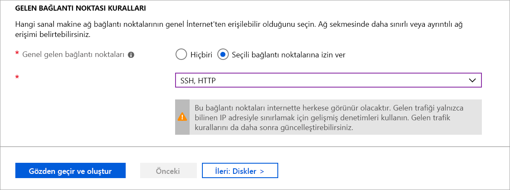
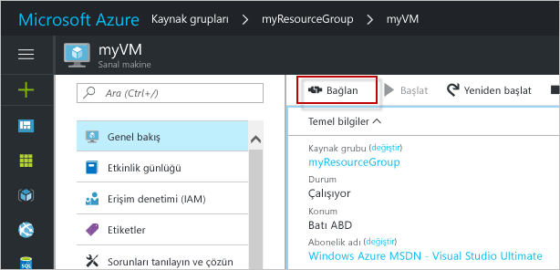

# <a name="quickstart-create-a-linux-virtual-machine-in-the-azure-portal"></a>Hızlı Başlangıç: Azure portalında bir Linux sanal makinesi oluşturma

Azure sanal makineleri (VM’ler), Azure portalı üzerinden oluşturulabilir. Azure portal, sanal makineleri ve tüm ilgili kaynaklarını oluşturmaya yönelik tarayıcı tabanlı bir kullanıcı arabirimi sağlar. Bu hızlı başlangıçta Azure portalı kullanarak Ubuntu 16.04 LTS çalıştıran bir Linux sanal makinesinin (VM) nasıl dağıtılacağı gösterilir. Ayrıca VM'nizin çalıştığını görmek için SSH ile VM bağlantısı kurup NGINX web sunucusunu da yükleyeceksiniz.

Azure aboneliğiniz yoksa başlamadan önce [ücretsiz bir hesap](https://azure.microsoft.com/free/?WT.mc_id=A261C142F) oluşturun.

## <a name="create-ssh-key-pair"></a>SSH anahtar çifti oluşturma

Bu hızlı başlangıcı tamamlamak için bir SSH anahtar çifti gerekir. Bir SSH anahtar çiftiniz varsa bu adımı atlayabilirsiniz.

SSH anahtar çifti oluşturmak için bir Bash kabuğu açın ve [ssh-keygen](https://www.ssh.com/ssh/keygen/) komutunu kullanın. Yerel bilgisayarınızda Bash kabuğunuz yoksa [Azure Cloud Shell](https://shell.azure.com/bash)'i kullanabilirsiniz.  

```bash
ssh-keygen -t rsa -b 2048
```

Yukarıdaki komut `~/.ssh directory` içinde `id_rsa` varsayılan adıyla ortak ve özel anahtarlar oluşturur. Komut, ortak anahtarın tam yolunu döndürür. `cat` komutuyla ortak anahtarın yolunu kullanarak içeriğini görüntüleyebilirsiniz.

```bash 
cat ~/.ssh/id_rsa.pub
```

Bu komutun çıktısını kaydedin. VM'nize oturum açmak için kullanacağınız yönetici hesabını yapılandırma sırasında buna ihtiyacınız olacak.

PuTTy kullanımı dahil olmak üzere SSH anahtar çiftlerinin oluşturulması konusunda daha ayrıntılı bilgi edinmek için bkz. [Windows ile SSH anahtarları kullanma](ssh-from-windows.md).

SSH anahtar çiftinizi Cloud Shell'i kullanarak oluşturduğunuzda [Cloud Shell tarafından otomatik olarak takılan](https://docs.microsoft.com/azure/cloud-shell/persisting-shell-storage) bir Azure Dosya Paylaşımında depolanır. Anahtarlarınızı alana kadar bu dosya paylaşımını veya depolama hesabını silmeyin. Aksi takdirde VM erişimini kaybedersiniz. 

## <a name="sign-in-to-azure"></a>Azure'da oturum açma

[Azure Portal](https://portal.azure.com) oturum açın.

## <a name="create-virtual-machine"></a>Sanal makine oluşturma

1. Azure portalının sol üst köşesinde bulunan **Kaynak oluştur** öğesini seçin.

1. Azure Market kaynaklarının listesi üzerindeki arama kutusunda, Canonical tarafından sağlanan **Ubuntu Server 16.04 LTS** işletim sistemini arayıp seçin ve ardından **Oluştur**’u seçin.

1. **Temel Bilgiler** sekmesinde, **Proje ayrıntıları** altında doğru aboneliğin seçildiğinden emin olun, ardından **Kaynak grubu** altından **Yeni oluştur**'u seçin. Açılan pencerede kaynak grubunun adı için *myResourceGroup* yazın ve **Tamam**'ı seçin. 

    

1. **Örnek ayrıntıları** altında, **Sanal makine adı** için *myVM* yazın ve **Bölge** için *East US*'yi seçin. Diğer varsayılan değerleri bırakın.

    

1. **Yönetici hesabı** altından **SSH ortak anahtarı**'nı seçin, kullanıcı adınızı yazın, sonra ortak anahtarınızı metin kutusuna yapıştırın. Ortak anahtarınızda varsa baştaki ve sondaki tüm boşlukları kaldırın.

    

1. **Gelen bağlantı noktası kuralları** > **Ortak gelen bağlantı noktaları** altından **Seçilen bağlantı noktalarına izin ver**'i, sonra aşağı açılan listeden **SSH (22)** ve **HTTP (80)** değerlerini seçin. 

    

1. Kalan varsayılan ayarları bırakın, ardından sayfanın alt kısmındaki **Gözden geçir + oluştur** düğmesini seçin.

1. **Sanal makine oluştur** sayfasında oluşturmak üzere olduğunuz VM'nin ayrıntılarını görüntüleyebilirsiniz. Hazır olduğunuzda **Oluştur**'u seçin.

VM'nizin dağıtılması birkaç dakika sürer. Dağıtım tamamlandıktan sonra bir sonraki bölüme geçin.

    
## <a name="connect-to-virtual-machine"></a>Sanal makineye bağlanma

VM ile bir SSH bağlantısı oluşturun.

1. VM’nizin genel bakış sayfasından **Bağlan** düğmesini seçin. 

    

2. **Sanal makineye bağlan** sayfasında, 22 numaralı bağlantı noktası üzerinden IP adresine göre bağlanmak için varsayılan seçenekleri olduğu gibi bırakın. **VM yerel hesabı kullanarak oturum açın** bölümünde bir bağlantı komutu gösterilir. Düğmeye tıklayarak komutu kopyalayın. Aşağıdaki örnekte SSH bağlantı komutunun nasıl göründüğü gösterilmiştir:

    ```bash
    ssh azureuser@10.111.12.123
    ```

3. SSH anahtar çiftini oluşturmak için kullandığınız Bash kabuğunu kullanarak ([Azure Cloud Shell](https://shell.azure.com/bash) veya yerel Bash kabuğunuz gibi) SSH bağlantı komutunu kabuğa yapıştırarak bir SSH oturumu oluşturun. 

## <a name="install-web-server"></a>Web sunucusunu yükleyin

Sanal makinenizin çalıştığını görmek için NGINX web sunucusunu yükleyin. SSH oturumunuzdan paket kaynaklarınızı güncelleştirip en son NGINX paketini yükleyin.

```bash
sudo apt-get -y update
sudo apt-get -y install nginx
```

İşlemi tamamladığınızda `exit` yazarak SSH oturumunu kapatın.


## <a name="view-the-web-server-in-action"></a>Web sunucusunu iş başında görün

İstediğiniz web tarayıcısını kullanarak varsayılan NGINX karşılama sayfasını görüntüleyin. VM'nin genel IP adresini web adresi olarak girin. Genel IP adresini VM genel bakış sayfasında veya önceden kullandığınız SSH bağlantı dizesinde bulabilirsiniz.


## <a name="clean-up-resources"></a>Kaynakları temizleme

Artık gerekli olmadığında kaynak grubunu, sanal makineyi ve tüm ilişkili kaynakları silebilirsiniz. Bunu yapmak için sanal makinenin kaynak grubunu ve **Sil**’i seçip silinecek kaynak grubunun adını onaylayın.

## <a name="next-steps"></a>Sonraki adımlar

Bu hızlı başlangıçta basit bir sanal makine dağıttınız, bir Ağ Güvenlik Grubu ve kuralı oluşturdunuz ve temel bir web sunucusu yüklediniz. Azure sanal makineleri hakkında daha fazla bilgi için Linux VM’lerine yönelik öğreticiye geçin.

> [!div class="nextstepaction"]
> [Azure Linux sanal makine öğreticileri](./tutorial-manage-vm.md)
