<properties
    pageTitle="İlk Windows VM’nizi oluşturma | Microsoft Azure"
    description="Azure portalı kullanarak ilk Windows sanal makinenizi oluşturmayı öğrenin."
    keywords="Windows sanal makine,sanal makine oluşturma,sanal bilgisayar,sanal makine ayarlama"
    services="virtual-machines-windows"
    documentationCenter=""
    authors="cynthn"
    manager="timlt"
    editor=""
    tags="azure-resource-manager"/>
<tags
    ms.service="virtual-machines-windows"
    ms.workload="infrastructure-services"
    ms.tgt_pltfrm="vm-windows"
    ms.devlang="na"
    ms.topic="hero-article"
    ms.date="08/29/2016"
    ms.author="cynthn"/>

# Azure portalı kullanarak ilk Windows sanal makinenizi oluşturma

Bu öğretici, Azure Portal'ı kullanarak birkaç dakika içinde bir Windows VM oluşturmanın ne kadar kolay olduğunu gösterir.  

Bir Azure aboneliğiniz yoksa, yalnızca birkaç dakika içinde [ücretsiz bir hesap](https://azure.microsoft.com/free/) oluşturabilirsiniz.

Bu öğreticinin [videolu kılavuzunu](https://channel9.msdn.com/Blogs/Azure-Documentation-Shorts/Create-A-Virtual-Machine-Running-Windows-In-The-Azure-Preview-Portal) burada bulabilirsiniz. 

## Marketten VM görüntüsünü seçin

Örnek olarak Windows Server 2012 R2 Datacenter görüntüsü kullanıyoruz, ancak bu Azure’un sunduğu birçok görüntüden sadece biridir. Görüntü seçenekleriniz aboneliğinize göre değişir. Örneğin, masaüstü görüntüleri [MSDN aboneleri](https://azure.microsoft.com/pricing/member-offers/msdn-benefits-details/?WT.mc_id=A261C142F) tarafından kullanılabilir.

1. [Azure Portal](https://portal.azure.com)’ında oturum açın.

2. Hub menüsünde, **Yeni** > **Virtual Machines** > **Windows Server 2012 R2 Datacenter**’a tıklayın.

    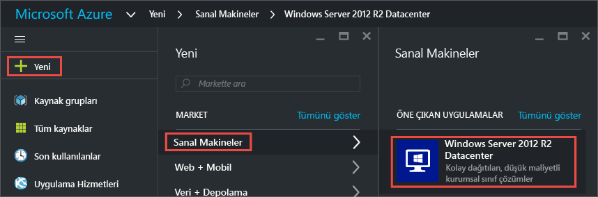

3. **Windows Server 2012 R2 Datacenter** dikey penceresindeki **Dağıtım modeli seçin** altında, **Resource Manager**’ın seçili olduğunu doğrulayın. **Oluştur**’a tıklayın.

    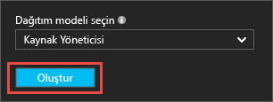

## Windows sanal makine oluşturma

Görüntüyü seçtikten sonra, yapılandırmaların çoğu için Azure’un varsayılan ayarlarını kullanabilir ve hızlı bir şekilde sanal makine oluşturabilirsiniz.

1. **Temel Bilgiler** dikey penceresinde, sanal makine için **adı** girin. Ad, 1-15 karakter uzunluğunda olmalıdır ve özel karakterler içeremez.

2. VM’de yerel hesap oluşturmak için kullanılacak bir **Kullanıcı adı** ve güçlü bir **Parola** girin. Yerel hesap VM’de oturum açmak ve yönetmek için kullanılır. 

    Parola 8-123 karakter uzunluğunda olmalıdır ve en az şu dört karmaşıklık gereksinimini karşılamalıdır: bir küçük harf karakter, bir büyük harf karakter, bir sayı ve bir özel karakter. [Kullanıcı adı ve parola gereksinimleri](virtual-machines-windows-faq.md#what-are-the-username-requirements-when-creating-a-vm) hakkında daha fazla bilgi edinin.

3. Varolan [Kaynak grubunu](../resource-group-overview.md#resource-groups) seçin veya yenisi için adı yazın. **Batı ABD** gibi, bir Azure veri merkezi **Konumu** yazın. 

4. İşiniz bittiğinde, sonraki bölüme geçmek için **Tamam**’a tıklayın. 

    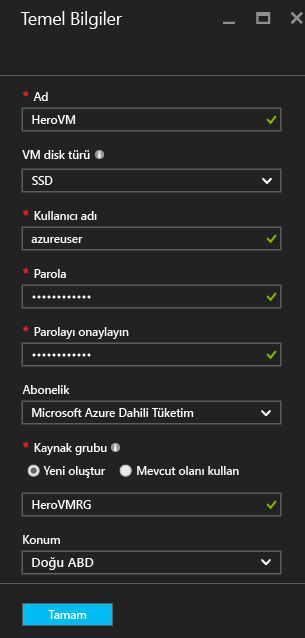

    
5. Bir sanal makine [boyutu](virtual-machines-windows-sizes.md) seçin ve ardından devam etmek için **Seç**’e tıklayın. 

    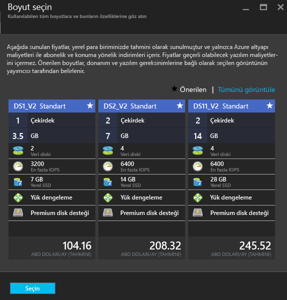

6. **Ayarlar** dikey penceresinde depolama ve ağ seçeneklerini değiştirebilirsiniz. Bu öğretici için varsayılan ayarları kabul edin. Bunu destekleyen bir sanal makine boyutu seçtiyseniz, **Disk türü** altında **Premium (SSD)**’yi seçerek Premium Storage’ı deneyebilirsiniz. Değişiklikleriniz bittiğinde **Tamam**’a tıklayın.

    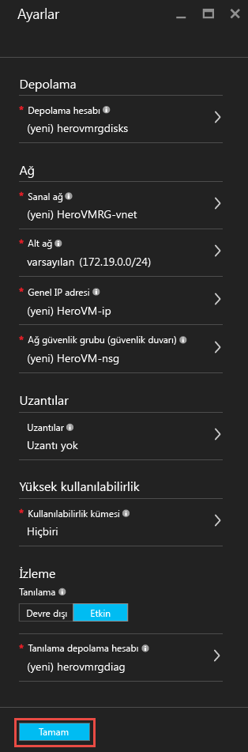

7. Seçimlerinizi gözden geçirmek için **Özet**’e tıklayın. **Doğrulama başarılı** iletisini gördüğünüzde **Tamam**’a tıklayın.

    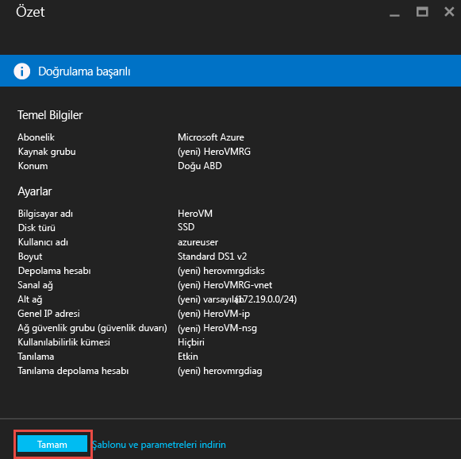

8. Azure Virtual Machine oluştururken, hub menüsünde **Virtual Machines** altında ilerleme durumunu izleyebilirsiniz. 

## Sanal makineye bağlanma ve oturum açma

1.  Hub menüsünde, **Virtual Machines**’e tıklayın.

2.  Listeden sanal makineyi seçin.

3. Sanal makine için dikey pencere üzerinde **Bağlan**’a tıklayın. Bu , makinenize bağlanmak için kısayola benzeyen bir Uzak Masaüstü Protokol dosyası (.rdp dosyası) oluşturur ve indirir. Kolay erişim için dosyayı masaüstünüze kaydetmek isteyebilirsiniz. VM'nize bağlanmak için bu dosyayı **Açın** .

    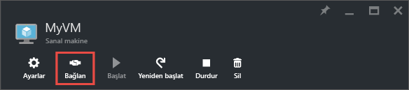

4. .rdp dosyasının bilinmeyen bir yayımcıdan geldiğine ilişkin bir uyarı alırsınız. Bu normaldir. Uzak Masaüstü penceresinde, devam etmek için **Bağlan**’a tıklayın.

    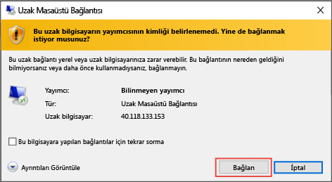

5. Windows Güvenlik penceresinde, VM oluşturduğunuz sırada oluşturduğunuz yerel hesabın kullanıcı adı ve parolasını yazın. Kullanıcı adı *vmname*&#92;*username* olarak girilir ve sonra **Tamam**’a tıklayın.

    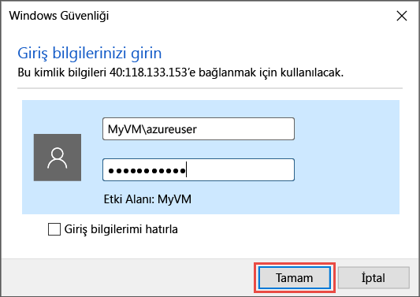
    
6.  Sertifikanın doğrulanamadığına ilişkin uyarı alırsınız. Bu normaldir. Sanal makine kimliğini doğrulamak için **Evet**’e tıklayın ve oturum açmayı tamamlayın.

    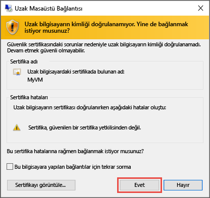

Bağlanmayı denediğinizde sorun yaşıyorsanız, bkz. [Windows tabanlı Azure Virtual Machine’e Uzak Masaüstü Bağlantı Sorunlarını Giderme](virtual-machines-windows-troubleshoot-rdp-connection.md).

Artık başka bir sunucuyla yaptığınız gibi sanal makine ile çalışabilirsiniz.

## Sanal makinenize IIS yükleme

Sanal makinenizde oturum açtığınıza göre daha fazla deneyim edinmeniz için bir sunucu rolü yüklenecektir.

1. Henüz açık değilse **Sunucu Yöneticisi**’ni açın. **Başlat** menüsüne ve ardından **Sunucu Yöneticisi**’ne tıklayın.
2. **Sunucu Yöneticisi**’nde sol bölmeden **Yerel Sunucu**’yu seçin. 
3. Menüde **Yönet** > **Rol ve Özellik Ekle**’yi seçin.
4. Rol ve Özellik Ekleme Sihirbazı’ndaki **Yükleme Türü** sayfasında **Rol tabanlı veya özellik tabanlı yükleme** öğesini seçin ve ardından **İleri**’ye tıklayın.

    

5. Sunucu havuzundan sanal makineyi seçin ve **İleri**’ye tıklayın.
6. **Sunucu Rolleri** sayfasında **Web Sunucusu (IIS)** öğesini seçin.

    

7. IIS için gerekli özellikleri eklemeye ilişkin açılır pencerede **Yönetim araçlarını ekle** öğesinin seçili olduğundan emin olun ve ardından **Özellik Ekle**’ye tıklayın. Açılır pencere kapandığında sihirbazdaki **İleri** öğesine tıklayın.

    

8. Özellikler sayfasında **İleri**’ye tıklayın.
9. **Web Sunucusu Rolü (IIS)** sayfasında **İleri**’ye tıklayın. 
10. **Rol Hizmetleri** sayfasında **İleri**’ye tıklayın. 
11. **Onay** sayfasında **İleri**’ye tıklayın. 
12. Yükleme tamamlandığında sihirbazda **Kapat**’a tıklayın.

## Bağlantı noktası 80'i açın 

Sanal makinenizin bağlantı noktası 80 üzerinden gelen trafiği kabul etmesi için ağ güvenlik grubuna bir gelen kuralı eklemeniz gerekir. 

1. [Azure portalı](https://portal.azure.com) açın.
2. **Sanal makineler** altında oluşturduğunuz sanal makineye tıklayın.
3. Sanal makine ayarları altında **Ağ arabirimleri**’ni ve ardından var olan ağ arabirimini seçin.

    

4. Ağ arabirimine ilişkin **Temel Bileşenler** menüsünde **Ağ güvenlik grubu** öğesine tıklayın.

    

5. NSG’nin **Temel Bileşenler** dikey penceresinde, sanal makinede oturum açmanızı sağlayan **default-allow-rdp** için bir genel kuralınız mevcut olmalıdır. IIS trafiğine izin vermek için başka bir gelen kuralı eklemeniz gerekir. **Gelen güvenlik kuralı**’na tıklayın.

    

6. **Gelen güvenlik kuralları** bölümünde **Ekle**’ye tıklayın.

    

7. **Gelen güvenlik kuralları** bölümünde **Ekle**’ye tıklayın. Bağlantı noktası aralığına **80** yazın ve **İzin Ver**’in seçildiğinden emin olun. İşiniz bittiğinde **Tamam**’a tıklayın.

    
 
NSG’ler, gelen ve giden kurallar hakkında daha fazla bilgi için bkz. [Azure portalını kullanarak sanal makinelerinize dış erişime izin verme](virtual-machines-windows-nsg-quickstart-portal.md)
 
## Varsayılan IIS web sitesine bağlanma

1. Azure portalında **Sanal makineler**’e tıklayın ve ardından sanal makinenizi seçin.
2. **Temel Bileşenler** dikey penceresinde **Genel IP adresinizi** kopyalayın.

    

2. Bir tarayıcı açın ve adres çubuğuna http://<publicIPaddress> gibi bir genel IP adresi yazıp **Enter** seçeneğine tıklayarak ilgili adrese gidin.
3. Tarayıcınız varsayılan IIS web sayfasına ulaşmalı ve sayfa aşağıdaki gibi görünmelidir:

    

## VM’yi durdurma

Gerçekte kullanmadığınız durumda ücret ödememeniz için VM’yi durdurmak iyi bir fikirdir. **Durdur** düğmesine ve **Evet**’e tıklamanız yeterlidir.

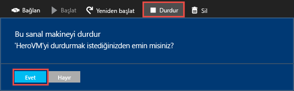
    
Tekrar kullanmaya hazır olduğunuzda, VM’yi yeniden başlatmak için **Başlat** düğmesine tıklamanız yeterlidir.

## Sonraki adımlar

* Sanal makinenize [bir veri diski eklemeyi](virtual-machines-windows-attach-disk-portal.md) de deneyimleyebilirsiniz. Veri diskleri sanal makineniz için daha fazla depolama alanı sağlar.

* Ayrıca [Windows Powershell kullanarak bir VM oluşturabilir](virtual-machines-windows-ps-create.md) veya Azure CLI kullanarak [Linux sanal makine oluşturabilirsiniz](virtual-machines-linux-quick-create-cli.md).

* Otomatik dağıtımlarla ilgileniyorsanız [Resource Manager şablonu kullanarak Windows sanal makine oluşturma](virtual-machines-windows-ps-template.md) bölümüne göz atın.

<!--HONumber=ago16_HO5-->

