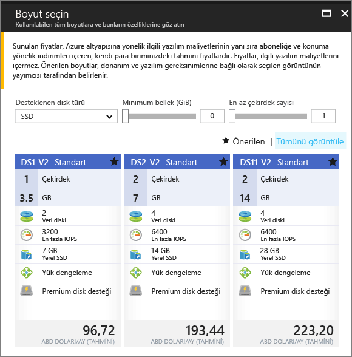

# <a name="create-a-windows-virtual-machine-in-an-availability-zone-with-the-azure-portal"></a>Azure portal ile bir kullanılabilirlik bölgesindeki bir Windows sanal makine oluşturma

Bir Azure kullanılabilirlik bölgesinde bir sanal makine oluşturmak için Azure portalını kullanarak aracılığıyla bu makalede adımlar. [Kullanılabilirlik alanı](../../availability-zones/az-overview.md), bir Azure bölgesinde fiziksel olarak ayrılmış bir alandır. Uygulamalarınızı beklenmeyen hatalardan veya tüm veri merkezinin kaybedilmesinden korumak için kullanılabilirlik alanlarından yararlanın.

[!INCLUDE [availability-zones-preview-statement.md](../../../includes/availability-zones-preview-statement.md)]


## <a name="log-in-to-azure"></a>Azure'da oturum açma 

Https://portal.azure.com Azure portalında oturum açın.

## <a name="create-virtual-machine"></a>Sanal makine oluşturma

1. Azure portalının sol üst köşesinde bulunan **Yeni** düğmesine tıklayın.

2. **İşlem**'i seçin ve sonra da **Windows Server 2016 Datacenter**'ı seçin. 

3. Sanal makine bilgilerini girin. Burada girilen kullanıcı adı ve parola, sanal makinede oturum açarken kullanılır. İşlem tamamlandığında **Tamam**’a tıklayın.

    

4. VM için bir boyut seçin. Daha fazla boyut görmek için **Tümünü görüntüle**’yi seçin veya **Desteklenen disk türü** filtresini değiştirin. Kullanılabilirlik bölgeleri önizlemede gibi desteklenen boyutlarından birini seçmek için dikkatli *DS1_v2 standart*. 

      

5. Altında **ayarları** > **yüksek kullanılabilirlik**, numaralandırılmış bölgelerinden birini seçin **kullanılabilirlik bölge** açılan listesinde, kalan Varsayılanları tutun ve tıklatın **Tamam**.

    

6. Özet sayfasında, tıklatın **satın alma** sanal makine dağıtımı başlatmak için.

7. VM, Azure portalı panosuna sabitlenir. Dağıtım tamamlandıktan sonra VM özeti otomatik olarak açılır.


## <a name="zone-for-ip-address-and-managed-disk"></a>IP adresi ve yönetilen disk için alan

VM bir kullanılabilirlik bölgesinde dağıtıldığında, yönetilen disk kaynakları ve IP adresi aynı kullanılabilirlik bölgede dağıtılır. Azure PowerShell kullanarak bölge ayarlarını onaylayabilirsiniz. Yüklemeniz veya yükseltmeniz gerekirse, bkz. [Azure PowerShell Modülü yükleme](/powershell/azure/install-azurerm-ps).

Aşağıdaki örnekler adlı bir kaynak grubunda kaynaklar hakkında bilgi alma *myResourceGroup*. VM oluşturmak için kullanılan kaynak grubu adını değiştirin.

Ortak IP adresiyle bölgesi bulma [Get-AzureRmPublicIpAddress](/en-us/powershell/module/azurerm.network/get-azurermpublicipaddress):

```powershell
Get-AzureRmPublicIpAddress -ResourceGroupName myResourceGroup
```
`Zones` Ayarı çıktıda gösterir genel IP adresi VM ile aynı kullanılabilirlik bölgedeki olduğunu:

```powershell
Name                     : myVM-ip
ResourceGroupName        : myResourceGroup
Location                 : eastus2
Id                       : /subscriptions/e44f251c-c67e-4760-9ed6-bf99a306ecff/resourceGroups/danlep0911/providers/Micr
                           osoft.Network/publicIPAddresses/myVM-ip
Etag                     : W/"b67e14c0-7e8a-4d12-91c5-da2a5dfad132"
ResourceGuid             : 314bf57d-9b25-4474-9282-db3561d536aa
ProvisioningState        : Succeeded
Tags                     :
PublicIpAllocationMethod : Dynamic
IpAddress                : 13.68.16.25
PublicIpAddressVersion   : IPv4
IdleTimeoutInMinutes     : 4
IpConfiguration          : {
                             "Id": "/subscriptions/e44f251c-c67e-4760-9ed6-bf99a306ecff/resourceGroups/myResourceGroup/providers/Microsoft.Network/networkInterfaces/myVM11842/ipConfigurations/ipconfig1"
                           }
DnsSettings              : null
Zones                    : {2}
```


VM için yönetilen disk kaynağı da aynı kullanılabilirlik alanında oluşturulur. Bunu [Get-AzureRmDisk](/powershell/module/azurerm.compute/get-azurermdisk) ile doğrulayabilirsiniz:

```powershell
Get-AzureRmDisk -ResourceGroupName myResourceGroup
```

Çıktı, yönetilen diskin VM ile aynı kullanılabilirlik alanında olduğunu gösterir:

```powershell
ResourceGroupName  : myResourceGroup
AccountType        : PremiumLRS
OwnerId            : /subscriptions/d5b9d4b7-6fc1-0000-0000-000000000000/resourceGroups/myResourceGroup/providers/Microsoft.
                     Compute/virtualMachines/myVM
ManagedBy          : /subscriptions/d5b9d4b7-6fc1-0000-0000-000000000000/resourceGroups/myResourceGroup/providers/Microsoft.
                     Compute/virtualMachines/myVM
Sku                : Microsoft.Azure.Management.Compute.Models.DiskSku
Zones              : {2}
TimeCreated        : 9/7/2017 6:57:26 PM
OsType             : Windows
CreationData       : Microsoft.Azure.Management.Compute.Models.CreationData
DiskSizeGB         : 127
EncryptionSettings :
ProvisioningState  : Succeeded
Id                 : /subscriptions/d5b9d4b7-6fc1-0000-0000-000000000000/resourceGroups/myResourceGroup/providers/Microsoft.
                     Compute/disks/myVM_OsDisk_1_bd921920bb0a4650becfc2d830000000
Name               : myVM_OsDisk_1_bd921920bb0a4650becfc2d830000000
Type               : Microsoft.Compute/disks
Location           : eastus2
Tags               : {}
```

## <a name="next-steps"></a>Sonraki adımlar

Bu makalede, bir kullanılabilirlik alanında VM oluşturmayı öğrendiniz. Azure VM’leri için [bölgeler ve kullanılabilirlik](regions-and-availability.md) hakkında daha fazla bilgi edinin.
