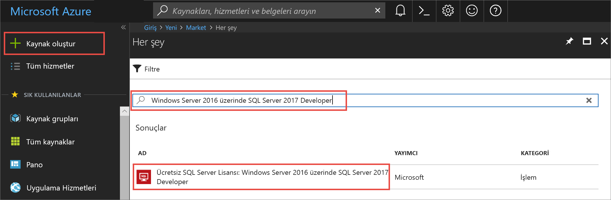
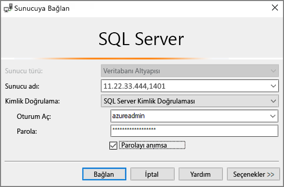

# Hızlı Başlangıç: Azure Portal’da SQL Server 2017 Windows sanal makinesi oluşturma

> [!div class="op_single_selector"]
> * [Windows](quickstart-sql-vm-create-portal.md)
> * [Linux](../../linux/sql/provision-sql-server-linux-virtual-machine.md)

Bu hızlı başlangıç, Azure Portal’da SQL Server sanal makinesi oluşturma adımlarında yol gösterir.

  > [!TIP]
  > - Bu hızlı başlangıç, hızlı bir şekilde bir SQL VM sağlama ve VM’ye bağlanma yolu sağlar. Diğer SQL VM sağlama seçimleri hakkında daha fazla bilgi için bkz. [Azure portalında Windows SQL Server VM'leri için sağlama kılavuzu](virtual-machines-windows-portal-sql-server-provision.md).
  > - SQL Server sanal makineleri hakkında sorularınız olursa [Sık Sorulan Sorular](virtual-machines-windows-sql-server-iaas-faq.md) bölümüne bakın.

##  Azure aboneliği edinme

Azure aboneliğiniz yoksa başlamadan önce [ücretsiz bir hesap](https://azure.microsoft.com/free/?WT.mc_id=A261C142F) oluşturun.

##  SQL Server VM görüntüsü seçme

1. Oturum [Azure portalında](https://portal.azure.com) hesabınızı kullanarak.

1. Azure portalda **Kaynak oluştur**’u seçin. 

1. Arama alanına yazın `SQL Server 2017 Developer on Windows Server 2016`, ve ENTER tuşuna basın.

1. Seçin **ücretsiz SQL Server Lisansı: Windows Server 2016 üzerinde SQL Server 2017 Developer** görüntü. Geliştirme testi amacıyla kullanım için ücretsiz olan tam özellikli SQL Server sürümü olduğundan bu öğreticide Developer sürümü kullanılmıştır. Yalnızca çalışan VM'ler için ücret ödersiniz. Fiyatlandırma konusunda dikkate alınacak tüm noktalar için bkz. [SQL Server Azure VM’leri için fiyatlandırma kılavuzu](virtual-machines-windows-sql-server-pricing-guidance.md).

   

1. **Oluştur**’u seçin.

##  Temel ayrıntıları sağlama

Üzerinde **Temelleri** sekmesinde, aşağıdaki bilgileri sağlayın:

1. İçinde **Project Details** bölümünde Azure aboneliğinizi seçin ve ardından **Yeni Oluştur** yeni bir kaynak grubu oluşturmak için. Tür _SQLVM-RG_ adı.

   

1. Altında **örnek ayrıntıları**:
    1. Tür _SQLVM_ için **sanal makine adı**. 
    1. İçin bir konum seçin, **bölge**. 
    1. Bu hızlı başlangıç bırakın **kullanılabilirlik seçeneklerini** kümesine _gerekli altyapı artıklık_. Kullanılabilirlik seçenekleri hakkında daha fazla bilgi edinmek için bkz. [Azure bölgeler ve kullanılabilirlik](../../windows/regions-and-availability.md). 
    1. İçinde **görüntü** listesinden _ücretsiz SQL Server Lisansı: Windows Server 2016 üzerinde SQL Server 2017 Developer_. 
    1. Tercih **değiştirme boyutu** için **boyutu** seçin ve sanal makine **A2 temel** teklifidir. Herhangi bir beklenmeyen maliyetleri önlemek için bunları ile işiniz bittiğinde, kaynakları temizlemek emin olun. 

   

1. Altında **yönetici hesabı**, bir kullanıcı adı sağlayın _azureuser_ ve parola. Parola en az 12 karakter uzunluğunda olmalı ve [tanımlanmış karmaşıklık gereksinimlerini](../../windows/faq.md#what-are-the-password-requirements-when-creating-a-vm) karşılamalıdır.

   

1. Altında **gelen bağlantı noktası kuralları**, seçin **Seçili bağlantı noktalarına izin** seçip **RDP (3389)** açılır listeden. 

   

## SQL Server ayarları

Üzerinde **SQL Server ayarları** sekmesinde, aşağıdaki seçenekleri yapılandırın:

1. Altında **güvenlik ve ağ**seçin _genel (Internet_) için **SQL Bağlantısı** ve bağlantı noktasına değiştirin `1401` iyi bilinen bir bağlantı noktası kullanmaktan kaçınmak için Genel senaryoda. 
1. Altında **SQL kimlik doğrulaması**seçin **etkinleştirme**. SQL Oturum Açma, sanal makine için yapılandırdığınız kullanıcı adı ve parolanın aynısına ayarlanır. İçin varsayılan ayarları kullanın **Azure anahtar kasası tümleştirme** ve **depolama yapılandırması**.  

   

1. Gerekirse diğer ayarları değiştirin ve ardından **gözden geçir + Oluştur**. 

   

## SQL Server VM’sini oluşturma

Üzerinde **gözden + Oluştur** sekmesinde, özeti gözden geçirin ve seçin **Oluştur** SQL Server, kaynak grubunu ve bu VM için belirtilen kaynakları oluşturmak için.

Azure portalından dağıtımı izleyebilirsiniz. Ekranın üst kısmındaki **Bildirimler** düğmesi dağıtımın temel durumunu gösterir. Dağıtım birkaç dakika sürebilir. 

## SQL Server'a bağlanma

1. Portalı'nda bulması **genel IP adresi** , SQL Server VM'nize **genel bakış** sanal makinenizin özelliklerinin bölümü.

1. Internet'e bağlı farklı bir bilgisayarda açın [SQL Server Management Studio (SSMS)](/sql/ssms/download-sql-server-management-studio-ssms).

1. **Sunucuya Bağlan** veya **Veritabanı Altyapısına Bağlan** iletişim kutusunda **Sunucu adı** değerini düzenleyin. Sanal makinenizin genel IP adresini girin. Sonra bir virgül koyun ve yeni sanal makineyi yapılandırırken belirttiğimiz özel bağlantı noktasını (**1401**) ekleyin. Örneğin, `11.22.33.444,1401`.

1. **Kimlik Doğrulaması** kutusunda **SQL Server Kimlik Doğrulaması**’nı seçin.

1. **Oturum Aç** kutusuna geçerli bir SQL oturum açma adı yazın.

1. **Parola** kutusuna oturum açma parolasını yazın.

1. **Bağlan**’ı seçin.

    

##  VM’de uzaktan oturum açma

Uzak Masaüstü kullanarak SQL Server sanal makinesine bağlanmak için aşağıdaki adımları kullanın:

[!INCLUDE [Connect to SQL Server VM with remote desktop](../../../../includes/virtual-machines-sql-server-remote-desktop-connect.md)]

SQL Server sanal makineye bağlandıktan sonra, SQL Server Management Studio'yu başlatabilir ve yerel yönetici kimlik bilgilerinizi kullanarak Windows Kimlik Doğrulamasına bağlanabilirsiniz. SQL Server Kimlik Doğrulamasını etkinleştirdiyseniz, sağlama işlemi sırasında yapılandırdığınız SQL oturum açma adı ve parolasını kullanarak da SQL Kimlik Doğrulamasına bağlanabilirsiniz.

Makineye erişim, gereksinimlerinize göre makineyi ve SQL Server ayarlarını doğrudan değiştirmenize olanak tanır. Örneğin, güvenlik duvarı ayarlarını yapılandırabilir veya SQL Server yapılandırma ayarlarını değiştirebilirsiniz.

## Kaynakları temizleme

SQL VM’nizin sürekli çalıştırılması gerekmiyorsa, kullanımda olmadığında durdurarak gereksiz ödeme yapmaktan kaçının. Ayrıca, portalda ilişkili kaynak grubunu silerek, sanal makineyle ilişkilendirilmiş tüm kaynakları kalıcı olarak silebilirsiniz. Bu işlem sanal makineyi de kalıcı olarak sildiğinden, bu komutu dikkatli kullanın. Daha fazla bilgi için bkz. [Azure kaynaklarınızı portal üzerinden yönetme](../../../azure-resource-manager/manage-resource-groups-portal.md).

## Sonraki adımlar

Bu hızlı başlangıçta, Azure Portal'da bir SQL Server 2017 sanal makinesi oluşturdunuz. Verilerinizi yeni SQL Server'a geçirme hakkında daha fazla bilgi edinmek için, aşağıdaki makaleye bakın.

> [!div class="nextstepaction"]
> [Veritabanını SQL VM'ye geçirme](virtual-machines-windows-migrate-sql.md)
