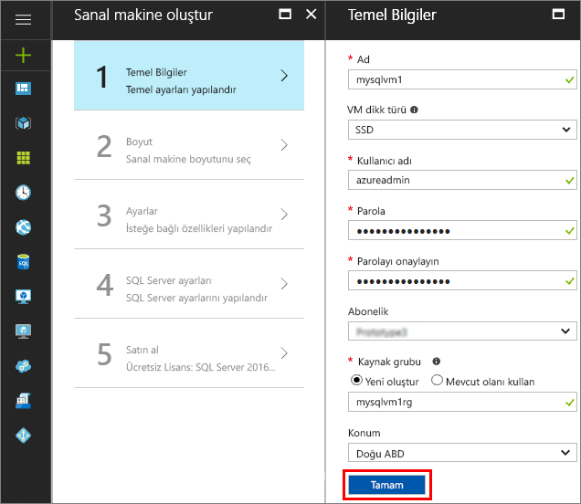
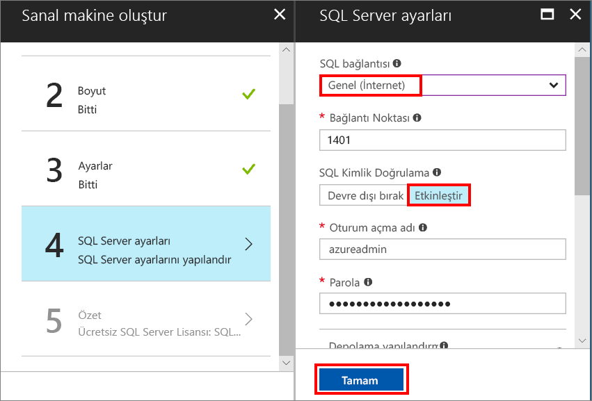

# Azure Portal’da SQL Server 2017 Windows sanal makinesi oluşturma

> [!div class="op_single_selector"]
> * [Windows](quickstart-sql-vm-create-portal.md)
> * [Linux](../../linux/sql/provision-sql-server-linux-virtual-machine.md)

Bu hızlı başlangıç, Azure Portal’da SQL Server sanal makinesi oluşturma adımlarında yol gösterir.

Azure aboneliğiniz yoksa başlamadan önce [ücretsiz bir hesap](https://azure.microsoft.com/free/?WT.mc_id=A261C142F) oluşturun.

##  SQL Server VM görüntüsü seçme

1. Hesabınızı kullanarak [Azure portal](https://portal.azure.com)da oturum açın.

1. Azure portalda **Yeni**’ye tıklayın. Portalda **Yeni** penceresi açılır.

1. Arama alanına **Windows Server 2016 üzerinde SQL Server 2017 Developer** yazın ve ENTER tuşuna basın.

1. **Ücretsiz SQL Server Lisansı: Windows Server 2016 üzerinde SQL Server 2017 Developer** görüntüsünü seçin.

   

   > [!TIP]
   > Geliştirme testi amacıyla kullanım için ücretsiz olan tam özellikli SQL Server sürümü olduğundan bu öğreticide Developer sürümü kullanılmıştır. Yalnızca çalışan VM'ler için ücret ödersiniz. Fiyatlandırma konusunda dikkate alınacak tüm noktalar için bkz. [SQL Server Azure VM’leri için fiyatlandırma kılavuzu](virtual-machines-windows-sql-server-pricing-guidance.md).

1. **Oluştur**'a tıklayın.

##  Temel ayrıntıları sağlama

**Temel bilgiler** penceresinde, aşağıdaki bilgileri sağlayın:

1. **Ad** alanına benzersiz bir sanal makine adı girin. 

1. **Kullanıcı adı** alanına sanal makinedeki yerel yönetici hesabı için bir ad girin.

1. Güçlü bir **parola** girin.

1. Yeni bir **Kaynak grubu** adı girin. Bu grup, sanal makineyle ilişkilendirilmiş tüm kaynakların yönetilmesine yardımcı olur.

1. Diğer varsayılan ayarları doğrulayın ve devam etmek için **Tamam**’a tıklayın.

   

## Sanal makine boyutunu seçme

**Boyut** adımında, **Boyutu seç** penceresinde bir sanal makine boyutunu seçin. Pencere ilk başta seçtiğiniz görüntüye göre önerilen makine boyutlarını görüntüler. 

1. Kullanılabilir tüm makine boyutlarını görmek için **Tümü görüntüle**’ye tıklayın.

1. Bu hızlı başlangıç için **D2S_V3**’ü seçin. Portalda sürekli kullanım için aylık tahmini makine maliyeti gösterilir (SQL Server lisans maliyetleri dahil değildir). Developer Edition’ın SQL Server için fazladan lisans maliyeti olmadığını unutmayın. Daha net fiyatlandırma bilgileri için [fiyatlandırma sayfasına](https://azure.microsoft.com/pricing/details/virtual-machines/windows/) bakın.

   > [!TIP]
   > **D2S_V3** makine boyutu test sırasında tasarruf sağlar. Ama üretim iş yükleri için [Azure Sanal Makineler'de SQL Server için en iyi performans uygulamaları](virtual-machines-windows-sql-performance.md)’nda önerilen makine boyutlarına ve yapılandırmalara bakın.

1. Devam etmek için **Seç**’e tıklayın.

## İsteğe bağlı özellikleri yapılandırma

**Ayarlar** penceresinde, varsayılanları seçmek için **Tamam**’a tıklayın.

## SQL Server ayarları

**SQL Server ayarları** penceresinde aşağıdaki seçenekleri yapılandırın.

1. **SQL bağlantısı** açılan listesinde **Genel (İnternet)** öğesini seçin. Bu, İnternet üzerinden SQL Server bağlantılarına olanak tanır.

1. Genel senaryoda iyi tanınan bir bağlantı noktası adı kullanmaktan kaçınmak için **Bağlantı noktası** değerini **1401** olarak değiştirin.

1. **SQL Kimlik Doğrulaması** altında **Etkinleştir**’e tıklayın. SQL Oturum Açma, sanal makine için yapılandırdığınız kullanıcı adı ve parolanın aynısına ayarlanır.

1. Gerekiyorsa diğer ayarları değiştirin ve SQL Server sanal makinesinin yapılandırmasını tamamlamak için **Tamam**’a tıklayın.

   

## SQL Server VM’sini oluşturma

**Özet** penceresinde, özeti gözden geçirin ve **Satın al**’a tıklayarak bu VM için belirtilen SQL Server, kaynak grubu ve kaynakları oluşturun.

Azure portalından dağıtımı izleyebilirsiniz. Ekranın üst kısmındaki **Bildirimler** düğmesi dağıtımın temel durumunu gösterir.

> [!TIP]
> Windows SQL Server VM’sinin dağıtımı birkaç dakika sürebilir.

## SQL Server’a bağlanma

1. Portalda, sanal makinenizin özelliklerinin **Genel Bakış** bölümünde VM’nizin **Genel IP adresi**’ni bulun.

1. İnternet'e bağlı başka bir bilgisayarda SQL Server Management Studio’yu (SSMS) açın.

   > [!TIP]
   > SQL Server Management Studio’nuz yoksa [buradan](https://docs.microsoft.com/sql/ssms/download-sql-server-management-studio-ssms) indirebilirsiniz.

1. **Sunucuya Bağlan** veya **Veritabanı Altyapısına Bağlan** iletişim kutusunda **Sunucu adı** değerini düzenleyin. Sanal makinenizin genel IP adresini girin. Sonra bir virgül koyun ve yeni sanal makineyi yapılandırırken belirttiğimiz özel bağlantı noktasını (**1401**) ekleyin. Örneğin, `11.22.33.444,1401`.

1. **Kimlik Doğrulaması** kutusunda **SQL Server Kimlik Doğrulaması**’nı seçin.

1. **Oturum Aç** kutusuna geçerli bir SQL oturum açma adı yazın.

1. **Parola** kutusuna oturum açma parolasını yazın.

1. **Bağlan**'a tıklayın.

    

##  VM’de uzaktan oturum açma

Uzak Masaüstü kullanarak SQL Server sanal makinesine bağlanmak için aşağıdaki adımları kullanın:

[!INCLUDE [Connect to SQL Server VM with remote desktop](../../../../includes/virtual-machines-sql-server-remote-desktop-connect.md)]

SQL Server sanal makineye bağlandıktan sonra, SQL Server Management Studio'yu başlatabilir ve yerel yönetici kimlik bilgilerinizi kullanarak Windows Kimlik Doğrulamasına bağlanabilirsiniz. SQL Server Kimlik Doğrulamasını etkinleştirdiyseniz, sağlama işlemi sırasında yapılandırdığınız SQL oturum açma adı ve parolasını kullanarak da SQL Kimlik Doğrulamasına bağlanabilirsiniz.

Makineye erişim, gereksinimlerinize göre makineyi ve SQL Server ayarlarını doğrudan değiştirmenize olanak tanır. Örneğin, güvenlik duvarı ayarlarını yapılandırabilir veya SQL Server yapılandırma ayarlarını değiştirebilirsiniz.

## Kaynakları temizleme

SQL VM’nizin sürekli çalıştırılması gerekmiyorsa, kullanımda olmadığında durdurarak gereksiz ödeme yapmaktan kaçının. Ayrıca, portalda ilişkili kaynak grubunu silerek, sanal makineyle ilişkilendirilmiş tüm kaynakları kalıcı olarak silebilirsiniz. Bu işlem sanal makineyi de kalıcı olarak sildiğinden, bu komutu dikkatli kullanın. Daha fazla bilgi için bkz. [Azure kaynaklarınızı portal üzerinden yönetme](../../../azure-resource-manager/resource-group-portal.md).

## Sonraki adımlar

Bu hızlı başlangıçta, Azure Portal’da bir SQL Server 2017 sanal makinesi oluşturdunuz. Verilerinizi yeni SQL Server’a geçirme hakkında daha fazla bilgi edinmek için, aşağıdaki makaleye bakın.

> [!div class="nextstepaction"]
> [Veritabanını SQL VM’ye geçirme](virtual-machines-windows-migrate-sql.md)
