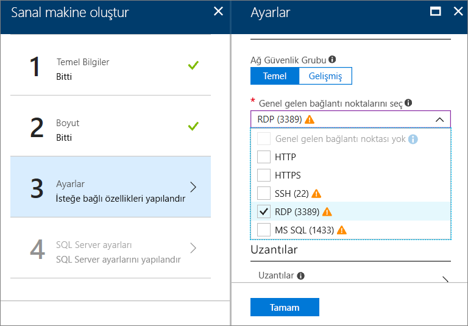

# Azure portalında bir Windows SQL Server sanal makinesi sağlama

Azure portalında Windows SQL Server sanal makine oluşturduğunuzda, bu kılavuzda kullanılabilir farklı seçenekler hakkında ayrıntılar sağlar. Bu makalede daha fazla yapılandırma seçeneği ele alınmaktadır [SQL Server VM Hızlı Başlangıç](quickstart-sql-vm-create-portal.md), daha fazla ile bir olası görev sağlama gider. 

Kendi SQL Server VM oluşturmak için bu kılavuzu kullanın. Veya Azure portalında kullanılabilir seçenekler için referans olarak kullanın.

> [!TIP]
> SQL Server sanal makineleri hakkında sorularınız olursa [Sık Sorulan Sorular](virtual-machines-windows-sql-server-iaas-faq.md) bölümüne bakın.

Azure aboneliğiniz yoksa başlamadan önce [ücretsiz bir hesap](https://azure.microsoft.com/free/?WT.mc_id=A261C142F) oluşturun.

##  SQL Server sanal makine galeri görüntüleri

Bir SQL Server sanal makine oluşturduğunuzda, sanal makine galerisinden birden fazla önceden yapılandırılmış görüntülerden birini seçebilirsiniz. Aşağıdaki adımlarda, SQL Server 2017 görüntülerinden birini seçme gösterilmektedir.

1. Hesabınızı kullanarak [Azure portal](https://portal.azure.com)da oturum açın.

1. Azure portalında **Kaynak oluştur**’a tıklayın. Portalda **Yeni** penceresi açılır.

1. **Yeni** penceresinde **İşlem**’e ve ardından **Tümünü gör**’e tıklayın.

   

1. Arama alanına **SQL Server 2017** yazın ve ENTER tuşuna basın.

1. Ardından **Filtre** simgesine tıklayın.

1. Filtre penceresinde **Windows tabanlı** alt kategorisini ve **Microsoft** yayımcısını işaretleyin. Ardından sonuçlarda Microsoft tarafından yayımlanan Windows SQL Server görüntülerini filtrelemek için **Bitti**'ye tıklayın.

   

1. Kullanılabilir SQL Server görüntülerini gözden geçirin. Her görüntü bir SQL Server sürümü ve işletim sistemi tanımlar.

1. Görüntüsünü seçin **ücretsiz SQL Server Lisansı: Windows Server 2016 üzerinde SQL Server 2017 Developer**.

   > [!TIP]
   > Geliştirme testi için bir tam özellikli ve ücretsiz SQL Server sürümü olduğundan bu izlenecek yolda Developer sürümü kullanılır. Yalnızca çalışan VM'ler için ücret ödersiniz. Ancak, bu izlenecek yolda kullanmak üzere istediğiniz görüntüyü birini seçebilirsiniz. Kullanılabilir görüntüleri açıklaması için bkz: [SQL Server Windows sanal makinelerine genel bakış](virtual-machines-windows-sql-server-iaas-overview.md#payasyougo).

   > [!TIP]
   > SQL Server Lisans maliyetlerini saniye başına fiyatına VM oluşturma ve değişir çekirdek sürümü ile birleştirilir. Geliştirme/test için (üretim için değil), SQL Express ise hafif iş yükleri (1 GB bellek, küçüktür 10 GB depolama alanı) için ancak SQL Server Developer sürümü ücretsizdir. Ayrıca--kendi-lisansını getir (KLG) ve yalnızca VM için ödeme. Bu görüntü adlarının başına {BYOL} ön eki getirilir. 
   >
   > Bu seçeneklerle ilgili daha fazla bilgi için bkz. [SQL Server Azure VM’leri için fiyatlandırma kılavuzu](virtual-machines-windows-sql-server-pricing-guidance.md).

1. **Dağıtım modeli seçin** altında, **Resource Manager**’ın seçili olduğunu doğrulayın. Yeni sanal makineler için önerilen dağıtım modeli Resource Manager’dır. 

1. **Oluştur**’a tıklayın.

    

##  Yapılandırma seçenekleri
Bir SQL Server sanal makinesini yapılandırmak için beş pencere vardır.

| Adım | Açıklama |
| --- | --- |
| **Temel Bilgiler** |[Temel ayarları yapılandırma](#1-configure-basic-settings) |
| **Boyut** |[Sanal makine boyutunu seçme](#2-choose-virtual-machine-size) |
| **Ayarlar** |[İsteğe bağlı özellikleri yapılandırma](#3-configure-optional-features) |
| **SQL Server ayarları** |[SQL Server ayarlarını yapılandırma](#4-configure-sql-server-settings) |
| **Özet** |[Özeti gözden geçirme](#5-review-the-summary) |

## 1. Temel ayarları yapılandırma

**Temel bilgiler** penceresinde, aşağıdaki bilgileri sağlayın:

* Benzersiz bir sanal makine **adı** girin.

* En iyi performans için VM için disk türü olarak **SSD**’yi seçin.

* VM’deki yerel yönetici hesabı için **Kullanıcı adı** belirtin. Bu hesap aynı zamanda SQL Server **sysadmin** sabit sunucu rolüne de eklenir.

* Güçlü bir **parola** girin.

* Birden fazla aboneliğiniz varsa, aboneliğin yeni VM için doğru olduğunu doğrulayın

* **Kaynak grubu** kutusuna, yeni kaynak grubu için bir ad yazın. Alternatif olarak, varolan bir kaynak grubunu kullanmak için **Varolanı kullan**’a tıklayın. Bir kaynak grubu, Azure’daki ilgili kaynakların bir koleksiyonudur (sanal makineler, depolama hesapları, sanal ağlar, vb.).

  > [!NOTE]
  > Yalnızca Azure’daki SQL Server dağıtımlarını test ediyor veya öğreniyorsanız, yeni bir kaynak grubu kullanmak faydalıdır. Test işleminizi tamamladıktan sonra, sanal makineyi ve bu kaynak grubu ile ilişkili tüm kaynakları otomatik olarak silmek için kaynak grubunu silin. Kaynak grupları hakkında daha fazla bilgi için bkz. [Azure Resource Manager’a Genel Bakış](../../../azure-resource-manager/resource-group-overview.md).

* Seçin bir **konumu** bu dağıtımı barındıracak Azure bölgesi.

* Ayarları kaydetmek için **Tamam**’a tıklayın.

    

## 2. Sanal makine boyutunu seçme

**Boyut** adımında, **Boyutu seç** penceresinde bir sanal makine boyutunu seçin. Pencere ilk başta seçtiğiniz görüntüye göre önerilen makine boyutlarını görüntüler.

> [!IMPORTANT]
> **Boyut seçin** penceresinde gösterilen tahmini aylık maliyet, SQL Server lisans maliyetlerini içermez. Bu tahmin yalnızca VM'nin maliyetidir maliyetidir. SQL Server Express ve Developer sürümleri için bu, toplam tahmini maliyeti tahminidir. Diğer sürümler için [Windows Sanal Makineler fiyatlandırma sayfasına](https://azure.microsoft.com/pricing/details/virtual-machines/windows/) bakın ve hedef SQL Server sürümünüzü seçin. Ayrıca bkz. [SQL Server Azure VM’leri için fiyatlandırma kılavuzu](virtual-machines-windows-sql-server-pricing-guidance.md).

Üretim iş yükleri için [Azure Virtual Machines'de SQL Server için en iyi performans uygulamaları](virtual-machines-windows-sql-performance.md)’nda önerilen makine boyutlarına ve yapılandırmalara bakın.

> [!NOTE]
> Sanal makine boyutları hakkında daha fazla bilgi için bkz. [Sanal makineler için boyutlar](../sizes.md?toc=%2fazure%2fvirtual-machines%2fwindows%2ftoc.json).

Makine boyutunuzu seçin ve ardından **Seç**’e tıklayın.

## 3. İsteğe bağlı özellikleri yapılandırma

**Ayarlar** penceresinde, sanal makine için Azure Storage, ağ ve izlemeyi yapılandırın.

* **Depolama** altında, **Yönetilen Diskler** altındaki **Evet**’i seçin.

   > [!NOTE]
   > Microsoft, SQL Server için Yönetilen Diskleri önerir. Yönetilen Diskler, depolama alanını arka planda yönetir. Ayrıca, Yönetilen Disklere sahip sanal makineler aynı kullanılabilirlik kümesinde olduğunda Azure uygun artıklık düzeyini sağlamak için depolama kaynaklarını dağıtır. Daha fazla bilgi için bkz. [Azure yönetilen disklere genel bakış] [… / Yönetilen-disk-overview.md). Bir kullanılabilirlik kümesindeki yönetilen diskler hakkında daha fazla ayrıntı için bkz. [Kullanılabilirlik kümesindeki VM’ler için yönetilen diskleri kullanma](../manage-availability.md).

* Altında **ağ**, select herhangi bir gelen bağlantı noktaları, **seçin ortak gelen bağlantı noktası** listesi. Örneğin, VM'ye Uzak Masaüstü Bağlantısı isterseniz seçin **RDP (3389)** bağlantı noktası.

   

   > [!NOTE]
   > SQL Server’a uzaktan erişmek için **MS SQL (1433)** bağlantı noktasını seçebilirsiniz. Ancak, bunu burada, gerekli olmadığından **SQL Server ayarları** adımı, bu seçeneği de sağlar. Bu adımda 1433 numaralı bağlantı noktasını seçerseniz, bu bağlantı noktası **SQL Server ayarları** adımındaki seçimlerinize bakılmaksızın açılır.

   Ağ ayarları başka değişiklikler yapmak veya varsayılan değerleri koruyun.

* Azure varsayılan olarak, VM için belirlenen aynı depolama hesabıyla **İzleme**’yi etkinleştirir. Burada bu ayarları değiştirebilirsiniz.

* Altında **kullanılabilirlik kümesi**, varsayılan bırakabilirsiniz **hiçbiri** bu gözden geçirme. SQL AlwaysOn Kullanılabilirlik Grupları kurulumunu planlıyorsanız, sanal makinenin yeniden oluşturulmasını önlemek için kullanılabilirliği yapılandırın.  Daha fazla bilgi için bkz. [Sanal Makinelerin Kullanılabilirliğini Yönetme](../manage-availability.md?toc=%2fazure%2fvirtual-machines%2fwindows%2ftoc.json).

Yapılandırma ayarlarını tamamladığınızda, **Tamam**’a tıklayın.

## 4. SQL server ayarlarını yapılandırma
**SQL Server ayarları** penceresinde, belirli ayarları ve SQL Server iyileştirmelerini yapılandırın. SQL Server için yapılandırabileceğiniz ayarlar aşağıdakileri içerir.

| Ayar |
| --- |
| [Bağlantı](#connectivity) |
| [Kimlik doğrulaması](#authentication) |
| [Depolama yapılandırması](#storage-configuration) |
| [Otomatik Düzeltme Eki Uygulama](#automated-patching) |
| [Otomatik Yedekleme](#automated-backup) |
| [Azure Anahtar Kasası Tümleştirmesi](#azure-key-vault-integration) |
| [SQL Server Machine Learning Hizmetleri](#sql-server-machine-learning-services) |

### Bağlantı

**SQL bağlantısı** altında, bu VM’de SQL Server örneğini istediğiniz erişim türünü belirtin. Bu izlenecek yolda amacı doğrultusunda, seçin **genel (internet)** makineler ve hizmetlerden internet üzerindeki SQL Server bağlantılarına izin verecek şekilde. Bu seçenek seçildiğinde, Azure güvenlik duvarı ve ağ güvenlik grubunu bağlantı noktası 1433'te trafiğe izin verecek şekilde otomatik olarak yapılandırır.

> [!TIP]
> Varsayılan olarak, SQL Server **1433** gibi iyi bilinen bir bağlantı noktasını dinler. Daha yüksek güvenlik için önceki iletişim kutusunda dinleme bağlantı noktasını 1401 gibi varsayılan olmayan bir bağlantı noktasıyla değiştirin. Bağlantı noktasını değiştirirseniz, bu bağlantı noktasına SSMS gibi bir istemci aracı kullanarak bağlanmanız gerekir.

İnternet üzerinden SQL Server'a bağlanmak için, sonraki bölümde açıklanan, SQL Server Kimlik Doğrulamasını etkinleştirmeniz gerekir.

İnternet üzerinden Veritabanı Altyapısı’na bağlantıları etkinleştirmek istemiyorsanız, aşağıdaki seçeneklerden birini seçin:

* SQL Server’a Yalnızca VM içinden gelen bağlantılara izin vermek için **Yerel (yalnızca VM dahilinde)** 
* SQL Server’a aynı sanal ağdaki makineler ve hizmetlerden gelen bağlantılara izin vermek için **Özel (Sanal Ağ dahilinde)** 

Genel olarak, senaryonuzun izin verdiği en kısıtlayıcı bağlantıyı seçerek güvenliği geliştirin. Ancak tüm seçenekler Ağ Güvenlik Grubu kuralları ve SQL/Windows Kimlik Doğrulaması üzerinden korumaya alınabilir. VM oluşturulduktan sonra Ağ Güvenlik Grubu’nu düzenleyebilirsiniz. Daha fazla bilgi için bkz. [Azure Sanal Makineler'de SQL Server için Güvenlikle İlgili Dikkat Edilmesi Gerekenler](virtual-machines-windows-sql-security.md).

### Kimlik Doğrulaması

SQL Server Kimlik Doğrulaması gerekiyorsa, **SQL kimlik doğrulaması** altında **Etkinleştir**’e tıklayın.

> [!NOTE]
> SQL Server (genel bağlantı seçeneği) internet üzerinden erişmeyi planlıyorsanız, burada SQL kimlik doğrulamasını etkinleştirmeniz gerekir. SQL Server'a genel erişim SQL Kimlik Doğrulaması kullanılması gerektirir.

SQL Server Kimlik Doğrulamasını etkinleştirirseniz, bir **Oturum açma adı** ve **parola** belirtin. Bu kullanıcı adı bir SQL Server Kimlik Doğrulaması oturum açma bilgisi ve **sysadmin** sabit sunucu rolü üyesi olarak yapılandırılır. Kimlik Doğrulama Modları hakkında daha fazla bilgi için bkz. [Kimlik Doğrulama Modu Seçme](https://docs.microsoft.com/sql/relational-databases/security/choose-an-authentication-mode).

SQL Server Kimlik Doğrulamasını etkinleştirmezseniz, SQL Server örneğine bağlanmak için VM’deki yerel Yönetici hesabını kullanabilirsiniz.

### Depolama yapılandırması

Depolama gereksinimlerini belirlemek için **Depolama yapılandırması**na tıklayın. 

> [!NOTE]
> VM’nizi standart depolama kullanmak için el ile yapılandırdıysanız, bu seçenek kullanılamaz. Otomatik depolama iyileştirmesi yalnızca Premium Storage için kullanılabilir.

> [!TIP]
> Durak sayısı ve her kaydırıcının üst sınırları seçtiğiniz VM boyutuna bağlıdır. Daha büyük ve daha güçlü bir VM, daha fazla ölçeklendirilebilir.

Gereksinimleri, saniye başına girdi/çıktı işlemleri (IOP), MB/saniyedeki iş ve toplam depolama boyutu olarak belirleyebilirsiniz. Hareketli ölçekleri kullanarak bu değerleri yapılandırın. İş yüküne göre bu depolama ayarlarını değiştirebilirsiniz. Portal, bu gereksinimler temelinde, eklenecek ve yapılandırılacak disk sayısını otomatik olarak hesaplar.

**Depolama iyileştirme seçimi** altında aşağıdaki seçeneklerden birini seçin:

* **Genel**, varsayılan ayardır ve çoğu iş yükünü destekler.
* **İşlem** işleme depolamayı geleneksel veritabanı OLTP iş yükleri için iyileştirir.
* **Veri depolama**, depolamayı çözümleme ve raporlama iş yükleri için iyileştirir.

### Otomatik düzeltme eki uygulama

**Otomatik düzeltme eki uygulama** varsayılan olarak etkindir. Otomatik düzeltme eki uygulama Azure’un SQL Server’a ve işletim sistemine otomatik olarak düzeltme eki uygulamasını sağlar. Bakım penceresi için haftanın gününü, saati ve süreyi belirtin. Azure düzeltme eki uygulamayı bu bakım penceresinde gerçekleştirir. Bakım penceresi zamanlaması saat için VM yerel saatini kullanır. Azure’un SQL Server’a ve işletim sistemine otomatik olarak düzeltme eki uygulamasını istemiyorsanız tıklayın **Devre dışı**’na tıklayın.  

Daha fazla bilgi için bkz. [Azure Virtual Machines’de SQL Server için Otomatik Düzeltme Eki Uygulama](virtual-machines-windows-sql-automated-patching.md).

### Otomatik yedekleme

**Otomatik yedekleme** altında, tüm veritabanları için otomatik veritabanı yedeklemeyi etkinleştirin. Otomatik yedekleme varsayılan olarak devre dışıdır.

SQL otomatik yedeklemeyi etkinleştirdiğinizde aşağıdaki ayarları yapılandırabilirsiniz:

* Yedeklemeler için elde tutma süresi (gün)
* Yedeklemeler için kullanılacak depolama hesabı
* Yedeklemeler için şifreleme seçeneği ve parola
* Backup sistem veritabanları
* Yedekleme zamanlamasını yapılandırma

Yedeklemeyi şifrelemek için **Etkinleştir**’e tıklayın. Ardından **Parola**’yı belirtin. Azure yedeklemeleri şifrelemek için bir sertifika oluşturur ve bu sertifikayı korumak için belirtilen parolayı kullanır.

 Daha fazla bilgi için bkz. [Azure Virtual Machines’de SQL Server için Otomatik Yedekleme](virtual-machines-windows-sql-automated-backup.md).

### Azure Anahtar Kasası tümleştirme

Şifreleme için güvenlik gizli anahtarlarını depolamak üzere, **Azure anahtar kasası tümleştirme**’ye ve **Etkinleştir**’e tıklayın.

Aşağıdaki tabloda Azure Anahtar Kasası Tümleştirmeyi yapılandırmak için gereken parametreler listelenmektedir.

| PARAMETRE | AÇIKLAMA | ÖRNEK |
| --- | --- | --- |
| **Anahtar Kasası URL'si** |Anahtar kasası konumu. |https://contosokeyvault.vault.azure.net/ |
| **Asıl ad** |Azure Active Directory hizmet asıl adı. Bu ad İstemci Kimliği olarak da bilinir. |fde2b411-33d5-4e11-af04eb07b669ccf2 |
| **Asıl parola** |Azure Active Directory hizmet asıl gizli anahtarı. Bu gizli anahtar İstemci Gizli Anahtarı olarak da bilinir. |9VTJSQwzlFepD8XODnzy8n2V01Jd8dAjwm/azF1XDKM= |
| **Kimlik bilgisi adı** |**Kimlik bilgisi adı**: AKV tümleştirme VM'nin anahtar kasasına erişim sağlayan, SQL Server içinde bir kimlik bilgisi oluşturur. Bu kimlik bilgisi için bir ad seçin. |mycred1 |

Daha fazla bilgi için bkz. [Azure VM’lerde SQL Server için Azure Anahtar Kasası Tümleştirmeyi Yapılandırma](virtual-machines-windows-ps-sql-keyvault.md).

### SQL Server Machine Learning Hizmetleri

[SQL Server Machine Learning Hizmetleri](https://msdn.microsoft.com/library/mt604845.aspx) seçeneğini etkinleştirebilirsiniz. Bu seçenek, SQL Server 2017 ile Gelişmiş analizi kullanmanıza olanak sağlar. **SQL Server Ayarları** penceresinde **Etkinleştir** seçeneğini belirleyin.

SQL Server ayarlarını yapılandırmayı bitirdiğinizde, **Tamam**’a tıklayın.

## 5. Özeti gözden geçirme

**Özet** penceresinde, özeti gözden geçirin ve **Satın al**’a tıklayarak bu VM için belirtilen SQL Server, kaynak grubu ve kaynakları oluşturun.

Azure portalından dağıtımı izleyebilirsiniz. Ekranın üst kısmındaki **Bildirimler** düğmesi dağıtımın temel durumunu gösterir.

> [!NOTE]
> Size dağıtım zamanları hakkında bir fikir vermek için,Doğu ABD bölgesinde, varsayılan ayarlarla bir SQL VM dağıttım. Bu test dağıtımının tamamlanması yaklaşık 12 dakika sürdü. Ancak bölgeniz ve seçili ayarlarınıza göre, daha hızlı veya daha yavaş dağıtım süresiyle karşılaşabilirsiniz.

##  VM’yi Uzak Masaüstü ile açma

Uzak Masaüstü kullanarak SQL Server sanal makinesine bağlanmak için aşağıdaki adımları kullanın:

[!INCLUDE [Connect to SQL Server VM with remote desktop](../../../../includes/virtual-machines-sql-server-remote-desktop-connect.md)]

SQL Server sanal makineye bağlandıktan sonra, SQL Server Management Studio'yu başlatabilir ve yerel yönetici kimlik bilgilerinizi kullanarak Windows Kimlik Doğrulamasına bağlanabilirsiniz. SQL Server Kimlik Doğrulamasını etkinleştirdiyseniz, sağlama işlemi sırasında yapılandırdığınız SQL oturum açma adı ve parolasını kullanarak da SQL Kimlik Doğrulamasına bağlanabilirsiniz.

Makineye erişim, gereksinimlerinize göre makineyi ve SQL Server ayarlarını doğrudan değiştirmenize olanak tanır. Örneğin, güvenlik duvarı ayarlarını yapılandırabilir veya SQL Server yapılandırma ayarlarını değiştirebilirsiniz.

##  SQL Server'a uzaktan bağlanma

Bu kılavuzda, seçtiğiniz **genel** sanal makine için erişim ve **SQL Server kimlik doğrulaması**. Bu ayarlar, İnternet üzerinden tüm istemcilerden gelen (doğru SQL oturum açma bilgilerine sahip oldukları varsayılarak) SQL Server bağlantılarına izin verecek şekilde sanal makineyi yapılandırdı.

> [!NOTE]
> Sağlama sırasında Genel’i seçmediyseniz, sağlamadan sonra SQL bağlantı ayarlarınızı portal üzerinden değiştirebilirsiniz. Daha fazla bilgi edinmek için bkz. [SQL bağlantı ayarlarınızı değiştirme](virtual-machines-windows-sql-connect.md#change).

Aşağıdaki bölümlerde, SQL Server sanal makine Örneğinize internet üzerinden bağlanmak gösterilmektedir.

[!INCLUDE [Connect to SQL Server in a VM Resource Manager](../../../../includes/virtual-machines-sql-server-connection-steps-resource-manager.md)]

## Sonraki Adımlar

Azure’da SQL Server'ı kullanma hakkında diğer bilgiler için bkz. [Azure Virtual Machines’de SQL Server](virtual-machines-windows-sql-server-iaas-overview.md) ve [Sık Sorulan Sorular](virtual-machines-windows-sql-server-iaas-faq.md).