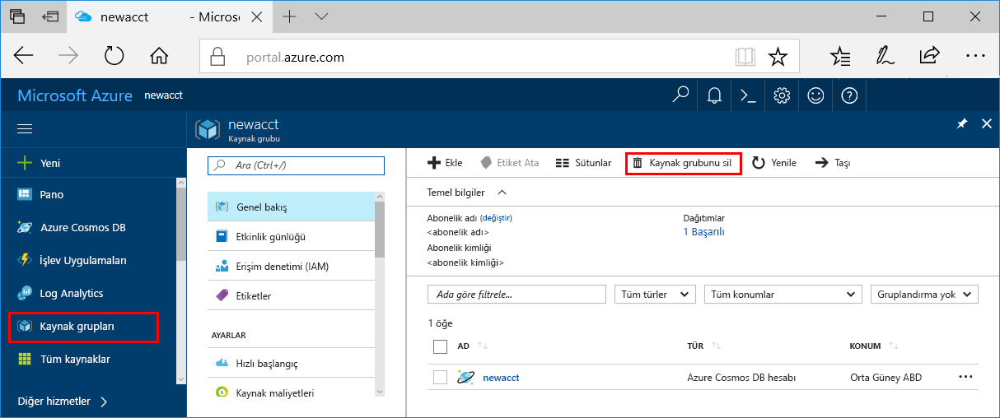

>[!IMPORTANT]
>Oluşturduğunuz kaynaklar, diğer Azure Machine Learning hizmeti öğreticileri ve nasıl yapılır makalelerinde önkoşul olarak kullanılabilir. 

Oluşturduğunuz kaynaklarını kullanmayı planlamıyorsanız, herhangi bir ücret ödememeniz bunları silin:

1. Azure portalının en sol tarafındaki **Kaynak gruplarını** seçin.
 
   

1. Listeden oluşturduğunuz kaynak grubunu seçin.

1. **Kaynak grubunu sil**'i seçin.

1. Kaynak grubu adı girin. Ardından **Sil**’i seçin.
