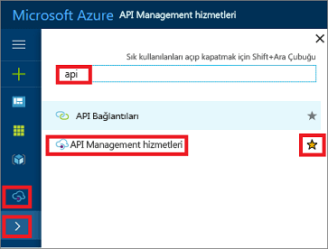

## APIM örneğinize gitme

APIM örneğinize gitmek için şu adımları izleyin:

1. [Azure Portal](https://portal.azure.com) oturum açın. 
2. Ekranın sol üst kısmında **Tüm hizmetler**'i seçin.  
3. Arama kutusuna "api" yazın.
4. **API Management hizmetleri**'ne tıklayın.

    

5. APIM hizmet örneğinizi seçin.

>[!TIP]
>Azure portalında yıldıza tıklayarak API Management'ı (APIM) sık kullanılanlarınıza ekleyin.  Bunu yaptığınızda portalın sol tarafındaki menüye APIM simgesi eklenir. Tüm APIM hizmetlerinizi görmek için simgeye () tıklayın.
 

