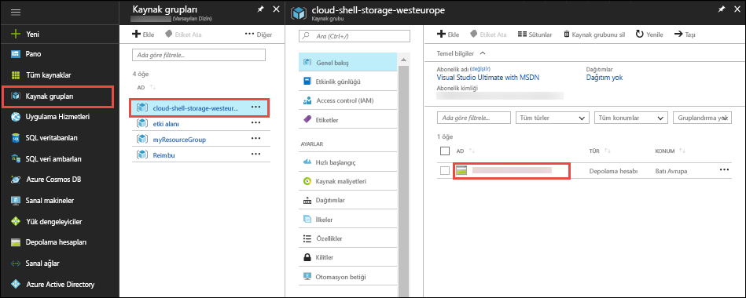
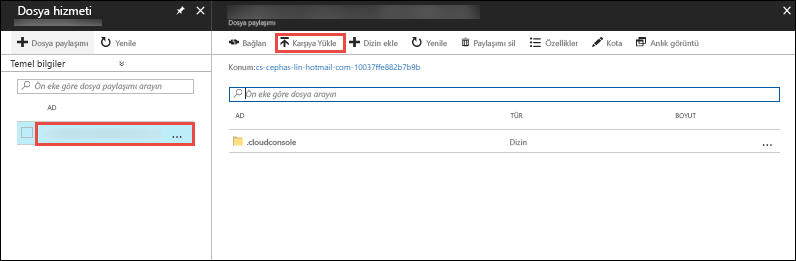

İçinde [Azure portalında](https://portal.azure.com), tıklayın **kaynak grupları** > **cloud-shell-depolama -\<your_region >**  >   **\<depolama_hesabı_adı >**.



İçinde **genel bakış** sayfa seçin depolama hesabının **dosyaları**.

Otomatik olarak oluşturulan dosya paylaşımını seçip **karşıya**. Bu dosya paylaşımı Cloud shell'de takılı `clouddrive`.



Dosya Seçici ve ZIP dosyanızı seçin, ardından tıklatın **karşıya**. 

Cloud Shell'de kullanmak `ls` varsayılan olarak yüklenen ZIP dosyasını gördüğünüzü doğrulamak için `clouddrive` paylaşın.

```azurecli-interactive
ls clouddrive
```
