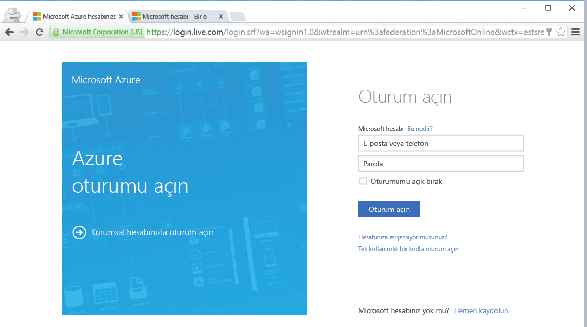

<!--
includes/azure-include-getting-started-v12portal-gettings-an-account.md

Latest Freshness check:  2016-04-11 , carlrab.

As of circa 2016-04-11, the following topics might include this include:
articles/sql-database/sql-database-get-started-tutorial.md

-->
## Microsoft Azure portala abonelikle bağlanma

Microsoft Azure portala abonelikle bağlanmak için aboneliğinizin olması gerekir. 

### Yeni bir hesap alın

Var olan bir Microsoft Azure hesabınız yoksa, bir hesap almak için aşağıdaki bağlantılardan birini izleyin:

- [Ücretsiz hesap](https://azure.microsoft.com/get-started/) alın
- [MSDN aboneliği](https://azure.microsoft.com/pricing/member-offers/msdn-benefits/) kullanın

###Var olan hesabınızı kullanarak oturum açın

[Var olan aboneliğinizi]( https://account.windowsazure.com/Home/Index) kullanarak Azure portala bağlanmak için aşağıdaki adımları uygulayın. 

1. Tercih ettiğiniz tarayıcınızı açın ve [Azure portal](https://portal.azure.com/)’a bağlanın.

1. [Azure portal](https://portal.azure.com/)’da oturum açın.

1. Oturum açma sayfası görüntülendiğinde aboneliğinize ait kimlik bilgilerini sağlayın

   
   

<!--HONumber=Jun16_HO2-->

