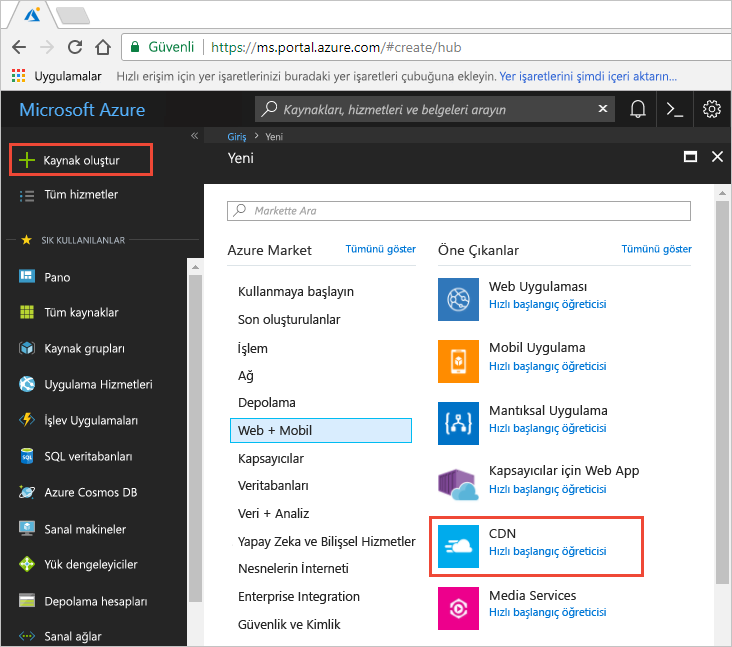
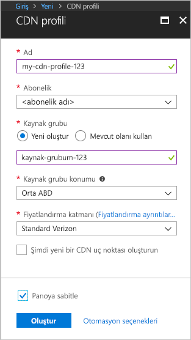

## Yeni bir CDN profili oluşturma

CDN profili, CDN uç noktaları için bir kapsayıcı olup bir fiyatlandırma katmanını belirtir.

1. Azure portalında sol üst köşedeki **Kaynak oluştur** seçeneğini belirleyin. 
    
    **Yeni** bölmesi görüntülenir.
   
2. **Web ve Mobil** seçeneğini belirleyin ve **CDN**’yi seçin.
   
    

    **CDN profili** bölmesi görüntülenir.

3. CDN profil ayarları için aşağıdaki tabloda belirtilen değerleri kullanın:
   
    | Ayar  | Value |
    | -------- | ----- |
    | **Name** | Profil adınız olarak *my-cdn-profile-123* girin. Bu ad küresel olarak benzersiz olmalıdır. Daha önceden kullanılmışsa farklı bir ad girebilirsiniz. |
    | **Abonelik** | Açılan listeden bir Azure aboneliği seçin. |
    | **Kaynak grubu** | **Yeni oluştur**’u seçin ve kaynak grubu adınız olarak *my-resource-group-123* girin. Ad zaten kullanılıyorsa, farklı bir ad girebilir ya da **Var olanı kullan**'ı seçip açılan listeden **my-resource-group-123**'ü seçebilirsiniz. | 
    | **Kaynak grubu konumu** | Açılan listeden **Orta ABD**’yi seçin. |
    | **Fiyatlandırma katmanı** | Açılan listeden **Standart Verizon**’u seçin. |
    | **Şimdi yeni bir CDN uç noktası oluşturun** | Seçilmemiş şekilde bırakın. |  
   
    

4. **Panoya sabitle**’yi seçerek profili oluşturulduktan sonra panonuza kaydedin.
    
5. Profili oluşturmak için **Oluştur**’u seçin. 

    **Microsoft’tan Azure CDN Standart** profilleri için tamamlanma işlemi genellikle iki saat sürer. 

