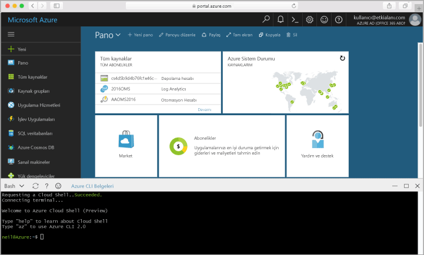

## Azure Cloud Shell'i başlatma

Azure Cloud Shell doğrudan Azure portalının içinde çalıştırabileceğiniz ücretsiz bir Bash kabuğudur. Azure CLI, kabuğa önceden yüklenmiştir ve kabuk, hesabınızla birlikte kullanılacak şekilde yapılandırılmıştır. [Azure portalının](https://portal.azure.com) sağ üst tarafında yer alan menüdeki **Cloud Shell** düğmesine tıklayın.

Düğme bu konu başlığındaki adımların tümünü uygulamak için kullanabileceğiniz etkileşimli bir kabuk başlatır:

