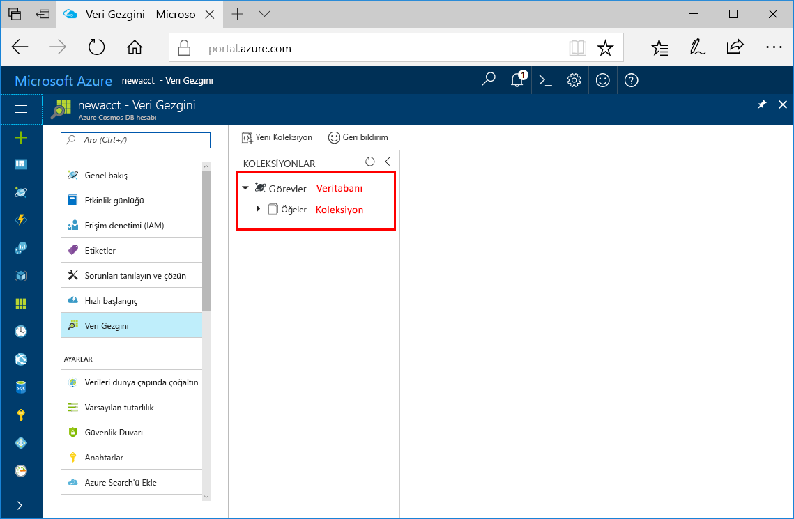

Şimdi bir veritabanı ve koleksiyon oluşturmak için Azure portalında Veri Gezgini aracını kullanabilirsiniz. 

1. **Veri Gezgini** > **Yeni Koleksiyon**’a tıklayın. 
    
    **Koleksiyon Ekle** alanı en sağda görüntülenir, görmek için sağa kaydırmanız gerekebilir.

    

2. **Koleksiyon Ekle** sayfasında, yeni koleksiyon için ayarları girin.

    Ayar|Önerilen değer|Açıklama
    ---|---|---
    Veritabanı kimliği|Görevler|Yeni veritabanınızın adı olarak *Görevler* girin. Veritabanı adı 1 ila 255 karakterden oluşmalı, boşlukla bitmemeli ve şu karakterleri içermemelidir: /, \\, # ve ?.
    Koleksiyon kimliği|Öğeler|Yeni koleksiyonunuzun adı olarak *Öğeler* girin. Koleksiyon kimliği karakter gereksinimleri, veritabanı adlarına ilişkin karakter gereksinimleri ile aynıdır.
    Depolama kapasitesi| Sabit (10 GB)|Varsayılan **Sabit (10 GB)** değerini kullanın. Bu değer, veritabanının depolama kapasitesidir.
    Aktarım hızı|400 RU|Aktarım hızını saniyede 400 istek birimi (RU/s) olarak değiştirin. Aktarım hızını 400 RU/s olarak ayarlamak için depolama hızı **Sabit (10 GB)** olarak ayarlanmalıdır. Daha sonra gecikme süresini azaltmak isterseniz aktarım hızının ölçeğini artırabilirsiniz. 
    
    Önceki ayarlara ek olarak, isterseniz koleksiyon için **Benzersiz anahtarlar** ekleyebilirsiniz. Bu örnekte bu alanı boş bırakalım. Benzersiz anahtarlar sayesinde geliştiriciler veritabanına bir veri bütünlüğü katmanı ekleyebilir. Koleksiyon oluştururken benzersiz anahtar ilkesi oluşturulduğunda, bölüm anahtarı başına bir veya birden çok değerin benzersiz olduğundan emin olursunuz. Daha fazla bilgi edinmek için [Azure Cosmos DB'de benzersiz anahtarlar](../articles/cosmos-db/unique-keys.md) makalesine bakın.
    
    **Tamam**’a tıklayın.

    Veri Gezgini, yeni veritabanını ve koleksiyonu görüntüler.

    