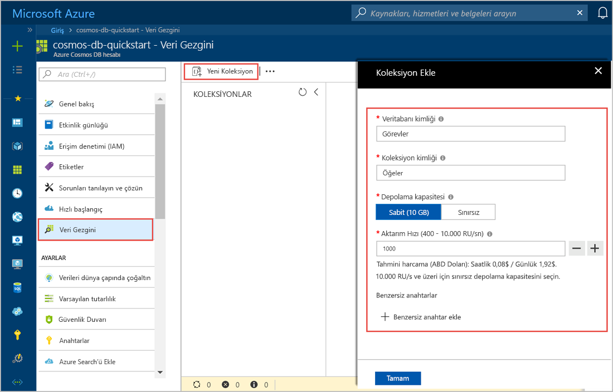

Artık, bir veritabanı ve kapsayıcı oluşturmak için Azure portalında Veri Gezgini aracını kullanabilirsiniz. 

1. Seçin **Veri Gezgini** > **yeni kapsayıcı**. 
    
    **Ekle kapsayıcı** alanı en sağda görüntülenir, görmek için sağa kaydırmanız gerekebilir.

    

2. İçinde **kapsayıcısı Ekle** sayfasında, yeni bir kapsayıcı için ayarları girin.

    |Ayar|Önerilen değer|Açıklama
    |---|---|---|
    |**Veritabanı Kimliği**|Görevler|Girin *ToDoList* yeni bir veritabanı adı olarak. Veritabanı adı 1 ila 255 karakter içermeli ve içeremezler `/, \\, #, ?`, veya bir boşluk. Denetleme **sağlama veritabanı aktarım hızını** seçeneği, bu veritabanındaki tüm kapsayıcılar arasında veritabanına sağlanan işleme paylaşmak olanak tanır. Bu seçenek ile maliyet tasarrufları da yardımcı olur. |
    |**Aktarım hızı**|400|Aktarım hızını 400 istek birimi (RU/sn) saniyede bırakılacak. Daha sonra gecikme süresini azaltmak isterseniz aktarım hızının ölçeğini artırabilirsiniz.| 
    |**Kapsayıcı kimliği**|Öğeler|Girin *öğeleri* yeni kapsayıcınız için adı. Kapsayıcı kimlikleri aynı karakter gereksinimleri veritabanı adlarına sahip.|
    |**Bölüm anahtarı**| /kategori| Bu makalede açıklanan örnek kullanır */Category* bölüm anahtarı olarak.|
    
    Önceki ayarlara ek olarak, isteğe bağlı olarak ekleyebilirsiniz **benzersiz anahtarlar** kapsayıcısı için. Bu örnekte bu alanı boş bırakalım. Benzersiz anahtarlar sayesinde geliştiriciler veritabanına bir veri bütünlüğü katmanı ekleyebilir. Bir kapsayıcı oluştururken bir benzersiz anahtar ilkesi oluşturarak, bölüm anahtarı başına bir veya daha fazla değerlerin benzersiz olmasını sağlamak. Daha fazla bilgi edinmek için [Azure Cosmos DB'de benzersiz anahtarlar](../articles/cosmos-db/unique-keys.md) makalesine bakın.
    
    **Tamam**’ı seçin. Veri Gezgini yeni veritabanını ve kapsayıcı görüntüler.