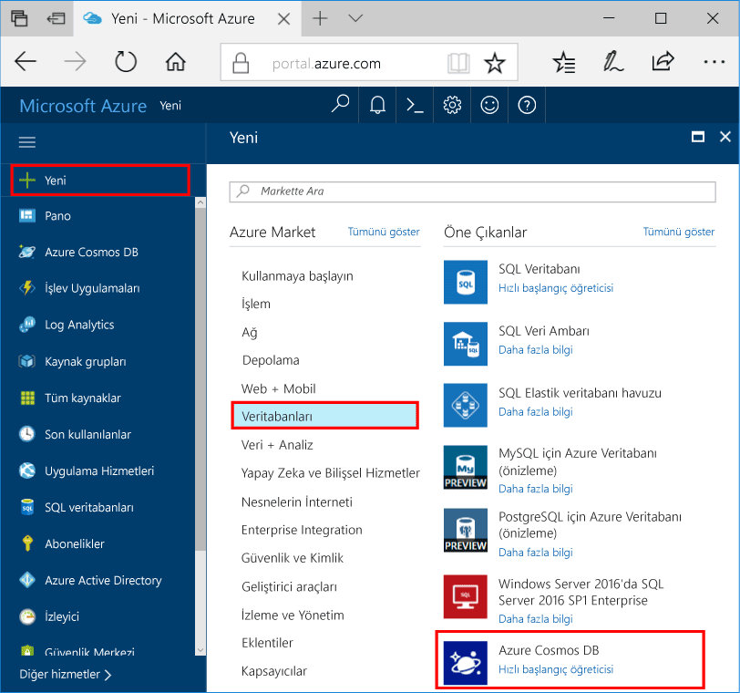
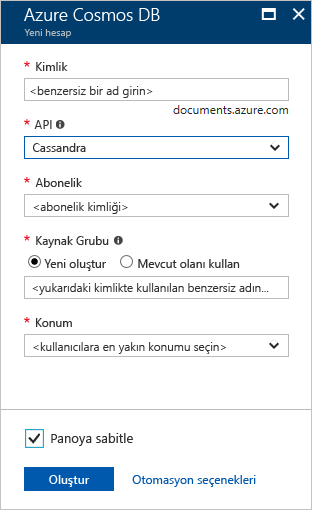

1. Yeni bir tarayıcı penceresinde [Azure portalında](https://portal.azure.com/) oturum açın.
2. **Kaynak oluştur** > **Veritabanları** > **Azure Cosmos DB** seçeneğine tıklayın.
   
   

3. **Yeni hesap** sayfasında, yeni Azure Cosmos DB hesabının ayarlarını girin. 
 
    Ayar|Önerilen değer|Açıklama
    ---|---|---
    Kimlik|*Benzersiz bir ad girin*|Bu Azure Cosmos DB hesabını tanımlayan benzersiz bir ad girin. Girdiğiniz kimliğe *cassandra.cosmosdb.azure.com* eklenerek ilgili kişi noktanız oluşturulacağından benzersiz ancak tanımlanabilir bir kimlik kullanın.  Kimlik yalnızca küçük harf, sayı ve kısa çizgi (-) karakterini içerebilir ve 3 ila 50 karakterden oluşmalıdır.
    API|Cassandra|API, oluşturulacak hesap türünü belirler. Azure Cosmos DB, uygulamanızın ihtiyaçlarını karşılayacak beş API sunar: Her biri ayrı hesap gerektiren SQL (belge veritabanı), Gremlin (grafik veritabanı), MongoDB (belge veritabanı), Azure Tablosu ve Cassandra.   Hızlı başlangıçta CQL söz dizimini kullanarak sorgulanabilir bir geniş sütun veritabanı oluşturduğunuzdan **Cassandra**’yı seçin.  Cassandra (geniş sütun) listenizde görüntülenmiyorsa, Cassandra API önizleme programına [katılmak üzere başvurmanız](../articles/cosmos-db/cassandra-introduction.md#sign-up-now) gerekir.   [Cassandra API hakkında daha fazla bilgi edinin](../articles/cosmos-db/cassandra-introduction.md)|
    Abonelik|*Aboneliğiniz*|Bu Azure Cosmos DB hesabı için kullanmak istediğiniz Azure aboneliğini seçin. 
    Kaynak Grubu|Yeni oluştur  *Yukarıdaki kimlikte sağlanan benzersiz adın aynısını girin*|**Yeni oluştur**’u seçin ve ardından hesabınız için yeni bir kaynak grubu adı girin. Kolaylık olması için kimliğinizle aynı adı kullanabilirsiniz. 
    Konum|*Kullanıcılarınıza en yakın bölgeyi seçin*|Azure Cosmos DB hesabınızın barındırılacağı coğrafi konumu seçin. Verilere en hızlı erişimi sağlamak için kullanıcılarınıza en yakın olan konumu kullanın.
    Panoya sabitle | Şunu seçin: | Kolay erişim amacıyla yeni veritabanı hesabınızın portal panonuza eklenmesi için bu kutuyu seçin.

    Sonra **Oluştur**’a tıklayın.

    

4. Hesabın oluşturulması birkaç dakika sürer. Portalın **Tebrikler! Azure Cosmos DB hesabınız oluşturuldu** sayfasını görüntülemesini bekleyin.

