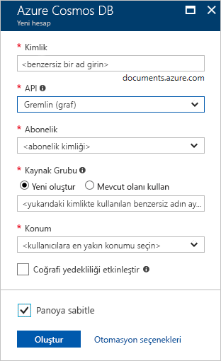
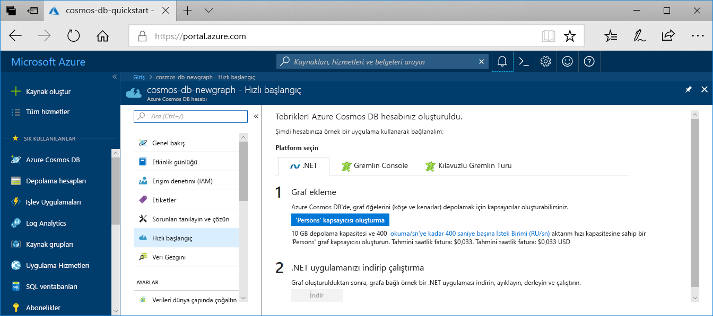

1. Yeni bir tarayıcı penceresinde [Azure portalında](https://portal.azure.com/) oturum açın.

2. **Kaynak oluştur** > **Veritabanları** > **Azure Cosmos DB** seçeneğine tıklayın.
   
   

3. İçinde **Azure Cosmos DB hesabı oluştur** sayfasında, yeni Azure Cosmos DB hesabının ayarlarını girin. 

    Ayar|Değer|Açıklama
    ---|---|---
    Abonelik|Aboneliğiniz|Bu Azure Cosmos DB hesabı için kullanmak istediğiniz Azure aboneliğini seçin. 
    Kaynak Grubu|Yeni oluştur  Ardından Kimlikte sağlanan benzersiz adın aynısını girin|**Yeni oluştur**’u seçin. Ardından hesabınız için yeni bir kaynak grubu adı girin. Kolaylık olması için kimliğinizle aynı adı kullanın. 
    Hesap Adı|Benzersiz bir ad girin|Azure Cosmos DB hesabınızı tanımlayan benzersiz bir ad girin. Girdiğiniz kimliğe *documents.azure.com* eklenerek URI'niz oluşturulacağından benzersiz bir kimlik kullanın.  Kimlik yalnızca küçük harf, sayı ve kısa çizgi (-) karakterini kullanabilirsiniz. 3 ila 31 karakter uzunluğunda olmalıdır.
    API|Gremlin (grafik)|API, oluşturulacak hesap türünü belirler. Azure Cosmos DB, beş API sunar: Gremlin graf veritabanları, belge veritabanları, Azure tablosu ve Cassandra, MongoDB Core(SQL) belge veritabanları için. Şu anda, her bir API için ayrı bir hesap oluşturmanız gerekir.   Seçin **Gremlin (graf)** çünkü bu hızlı başlangıçta, Gremlin API'si ile birlikte çalışan bir tablo oluşturuluyor.   [Graph API hakkında daha fazla bilgi](../articles/cosmos-db/graph-introduction.md).|
    Konum|Kullanıcılarınıza en yakın bölgeyi seçin|Azure Cosmos DB hesabınızın barındırılacağı coğrafi konumu seçin. Verilere en hızlı erişimi sağlamak için kullanıcılarınıza en yakın olan konumu kullanın.

    Seçin **gözden geçir + Oluştur**. Atlayabilirsiniz **ağ** ve **etiketleri** bölümü. 

    

4. Hesabın oluşturulması birkaç dakika sürer. Portalın **Tebrikler! Azure Cosmos DB hesabınız oluşturuldu** sayfasını görüntülemesini bekleyin.

    