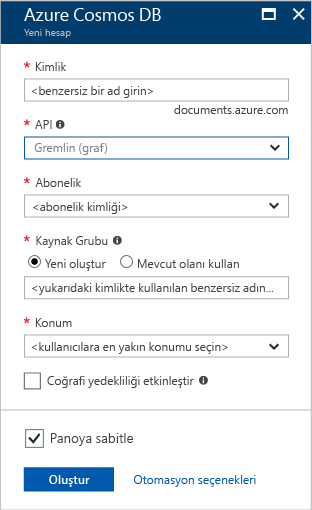

1. Yeni bir tarayıcı penceresinde oturum [Azure portal](https://portal.azure.com/).

2. Tıklatın **yeni** > **veritabanları** > **Azure Cosmos DB**.
   
   

3. İçinde **yeni hesabı** sayfasında, yeni Azure Cosmos DB hesap ayarlarını girin. 

    Ayar|Önerilen değer|Açıklama
    ---|---|---
    Kimlik|*Benzersiz bir ad girin*|Bu Azure Cosmos DB hesabını tanımlayacak benzersiz bir ad girin. Girdiğiniz kimliğe *documents.azure.com* eklenerek URI'niz oluşturulacağından benzersiz ancak tanımlanabilir bir kimlik kullanın.  Kimlik yalnızca küçük harf, sayı ve kısa çizgi (-) karakterini içerebilir ve 3 ila 50 karakterden oluşmalıdır.
    API|Gremlin (grafik)|API oluşturmak için hesabı türünü belirler. Azure Cosmos DB sağlar beş API uygulamanızın gereksinimlerine uygun: SQL (belge veritabanı), Gremlin (grafik veritabanı), MongoDB (belge veritabanı), Azure Table ve Cassandra, her gerektiren şu anda ayrı bir hesap.   Seçin **Gremlin (grafiği)** çünkü bu hızlı başlangıcı, Gremlin sözdizimi kullanılarak sorgulanabilir bir grafik oluşturuluyor.  [Grafik API'si hakkında daha fazla bilgi edinin](../articles/cosmos-db/graph-introduction.md)
    Abonelik|*Aboneliğiniz*|Bu Azure Cosmos DB hesap için kullanmak istediğiniz Azure aboneliğini seçin. 
    Kaynak grubu|*Yukarıdaki Kimliğinde sağlanan gibi aynı benzersiz bir ad girin*|Hesabınız için yeni bir kaynak grubu adı girin. Kolaylık olması için kimliğinizle aynı adı kullanabilirsiniz. 
    Konum|*Kullanıcılarınız için en yakın bölgeyi seçin*|Azure Cosmos DB hesabınızın barındırılacağı coğrafi konumu seçin. Hızlı erişim için veri vermediğiniz kullanıcılarınıza en yakın konumu kullanın.
    Coğrafi yedeklilik etkinleştir| Boş bırakın | Bu, ikinci (eşleştirilmiş) bölgede veritabanınızı çoğaltılmış bir sürümünü oluşturur. Bu alanı boş bırakın.  
    Panoya sabitle | Şunu seçin: | Bu kutuyu seçin, böylece portalı panonuza kolay erişim için yeni veritabanı hesabınızı eklenir.

    Sonra **Oluştur**’a tıklayın.

    

4. Hesap oluşturma birkaç dakika sürer. Oluşturma sırasında portal görüntüler hesap **dağıtımı Azure Cosmos DB** kutucuğunu sağ tarafta döşeme görmek için sağ Panonuzda kaydırmanız gerekebilir. Ekranın üst görüntülenen bir ilerleme çubuğu yoktur. İlerleme durumu için her iki alan izleyebilirsiniz.

    

    Hesap oluşturulduktan sonra **Tebrikler! Azure Cosmos DB hesabınız oluşturuldu** sayfası görüntülenir. 