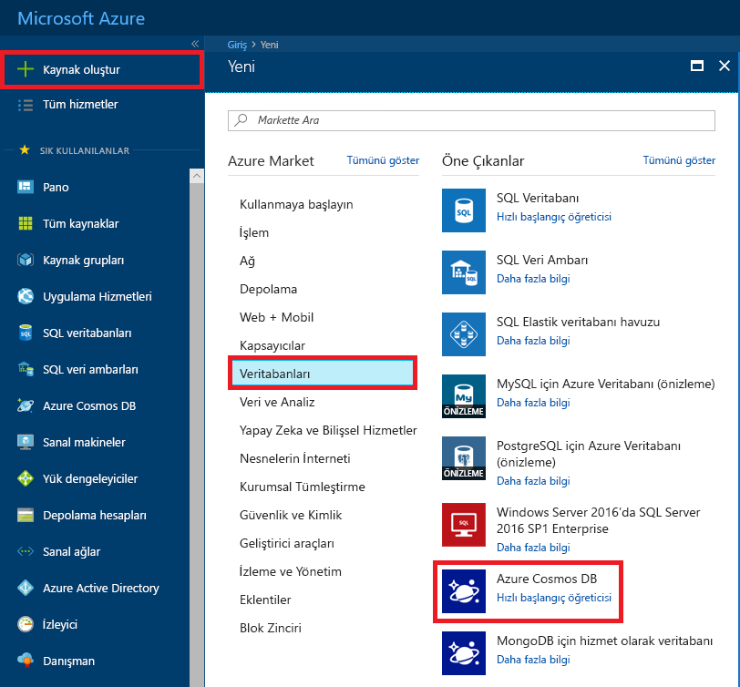
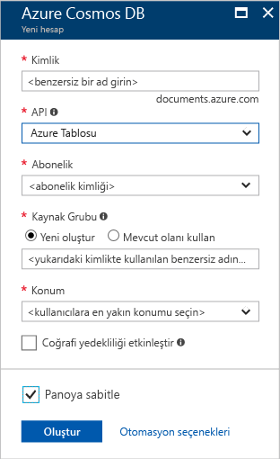
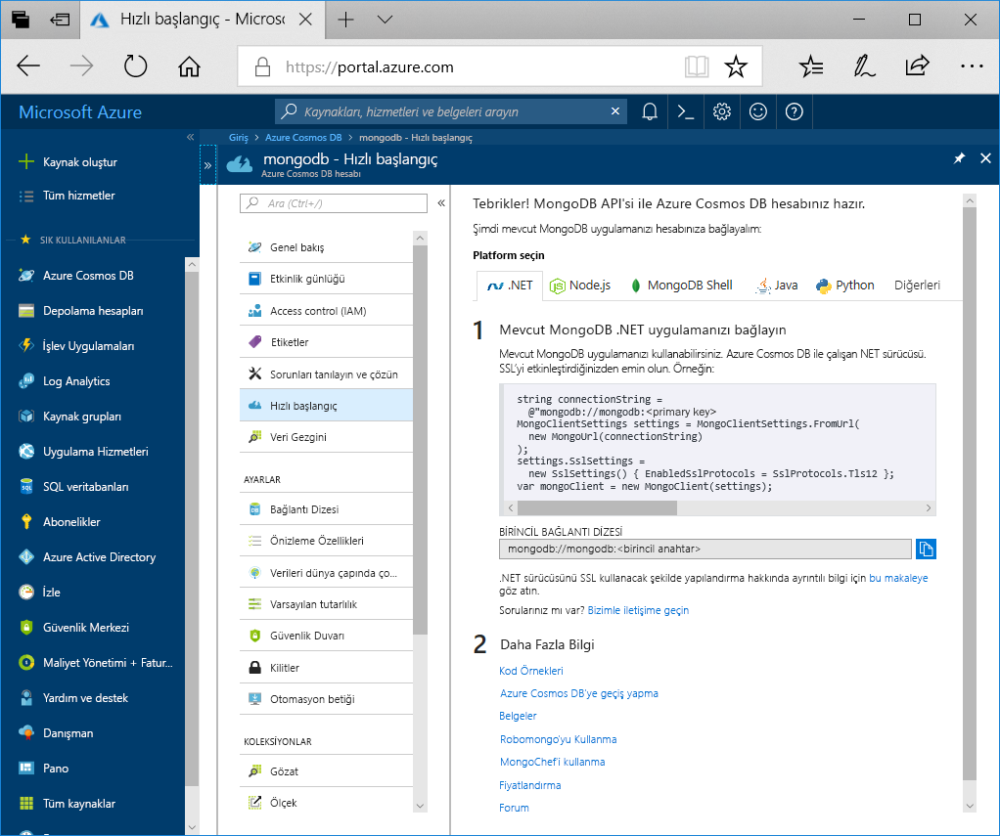

1. Yeni bir pencerede [Azure portalında](https://portal.azure.com/) oturum açın.
2. Sol taraftaki menüde **Kaynak oluştur**'a, **Veritabanları**'na ve ardından **Azure Cosmos DB**' altında **Oluştur**’a tıklayın.
   
   

3. İçinde **Azure Cosmos DB hesabı oluştur** sayfasında, yeni Azure Cosmos DB hesabının ayarlarını girin. 
 
    Ayar|Değer|Açıklama
    ---|---|---
    Abonelik|Aboneliğiniz|Bu Azure Cosmos DB hesabı için kullanmak istediğiniz Azure aboneliğini seçin. 
    Kaynak Grubu|Yeni oluştur  Ardından Kimlikte sağlanan benzersiz adın aynısını girin|**Yeni oluştur**’u seçin. Ardından hesabınız için yeni bir kaynak grubu adı girin. Kolaylık olması için kimliğinizle aynı adı kullanın. 
    Hesap Adı|Benzersiz bir ad girin|Azure Cosmos DB hesabınızı tanımlayan benzersiz bir ad girin. Girdiğiniz kimliğe *documents.azure.com* eklenerek URI'niz oluşturulacağından benzersiz bir kimlik kullanın.  Kimlik yalnızca küçük harf, sayı ve kısa çizgi (-) karakterini kullanabilirsiniz. 3 ila 31 karakter uzunluğunda olmalıdır.
    API|MongoDB için Azure Cosmos DB API'si|API, oluşturulacak hesap türünü belirler. Azure Cosmos DB, beş API sunar: Gremlin graf veritabanları, Azure Cosmos DB belge veritabanı, Azure tablosu ve Cassandra API MongoDB belge veritabanları için çekirdek (SQL). Şu anda, her bir API için ayrı bir hesap oluşturmanız gerekir.   Seçin **MongoDB** çünkü bu hızlı başlangıçta, MongoDB ile çalışan bir tablo oluşturuluyor.|
    Location|Kullanıcılarınıza en yakın bölgeyi seçin|Azure Cosmos DB hesabınızın barındırılacağı coğrafi konumu seçin. Verilere en hızlı erişimi sağlamak için kullanıcılarınıza en yakın olan konumu kullanın.

    Seçin **gözden geçir + Oluştur**. Atlayabilirsiniz **ağ** ve **etiketleri** bölümü. 

    

4. Hesabın oluşturulması birkaç dakika sürer. Portalın **Tebrikler! MongoDB için protokol uyumluluğunu kablo ile Cosmos hesabınız hazır** sayfası.

    
