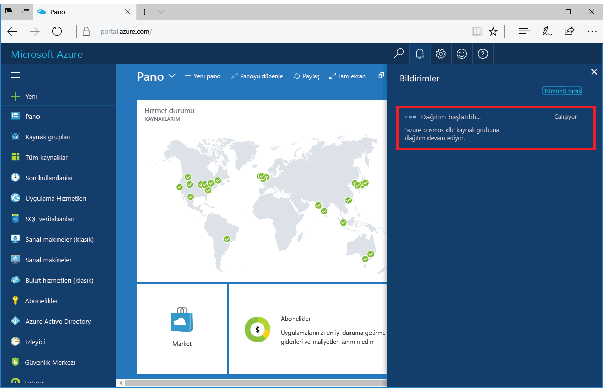
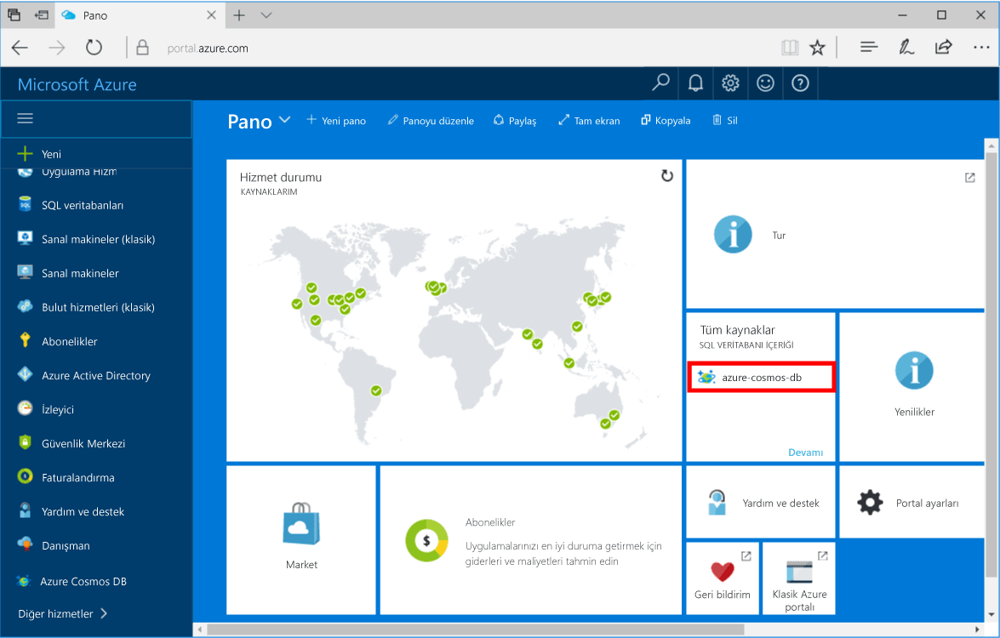

1. Yeni bir pencerede [Azure portalında](https://portal.azure.com/) oturum açın.
2. Sol taraftaki menüde **Yeni**'ye, **Veritabanları**'na ve ardından **Azure Cosmos DB**' altında **Oluştur**’a tıklayın.
   
   

3. **Yeni hesap** dikey penceresinde, Azure Cosmos DB hesabı için istenen yapılandırmayı belirtin. 

    Azure Cosmos DB ile dört programlama modeli birini seçebilirsiniz: Gremlin (grafiği), MongoDB, SQL ve tablosu (anahtar-değer). 
       
    Bu hızlı başlangıçta MongoDB API'si ile programlama yapacağımız için formu doldururken **MongoDB** seçeneğini belirleyin. Ancak bir sosyal medya uygulaması için grafik verileriniz, bir katalog uygulamasından belge verileriniz veya anahtar/değer (tablo) verileriniz varsa Azure Cosmos DB'nin tüm görev açısından kritik uygulamalarınız için yüksek oranda kullanılabilir ve genel olarak dağıtılmış bir veritabanı hizmeti platformu sunacağını unutmayın.

    **Yeni hesap** dikey penceresini tablodaki bilgilerden yararlanarak doldurun.
 
    
   
    Ayar|Önerilen değer|Açıklama
    ---|---|---
    Kimlik|*Benzersiz değer*|Azure Cosmos DB hesabını tanımlamak için kullanılacak benzersiz ad. Girdiğiniz kimliğe *documents.azure.com* eklenerek URI'niz oluşturulur, bu nedenle benzersiz ancak uygun bir kimlik kullanmanız gerekir. Kimlik yalnızca küçük harf, rakam ve "-" karakteri içerebilir; 3 ila 50 karakter uzunluğunda olmalıdır.
    API|MongoDB|API oluşturmak için hesabı türünü belirler. Azure Cosmos DB sağlar beş API uygulamanızın gereksinimlerine uygun: SQL (belge veritabanı), Gremlin (grafik veritabanı), MongoDB (belge veritabanı), Azure Table ve Cassandra, her gerektiren şu anda ayrı bir hesap.   Seçin **MongoDB** çünkü bu hızlı başlangıcı, MongoDB kullanılarak sorgulanabilir bir belge veritabanı oluşturuluyor.  [MongoDB API'si hakkında daha fazla bilgi edinin](../articles/cosmos-db/mongodb-introduction.md)|
    Abonelik|*Aboneliğiniz*|Azure Cosmos DB hesabı için kullanmak istediğiniz Azure aboneliği. 
    Kaynak Grubu|*Kimlikle aynı değer*|Hesabınız için yeni kaynak grubu adı. Kolaylık olması için kimliğinizle aynı adı kullanabilirsiniz. 
    Konum|*Kullanıcılarınıza en yakın bölge*|Azure Cosmos DB hesabınızın barındırılacağı coğrafi konum. Verilere en hızlı erişim için kullanıcılarınıza en yakın konumu seçin.

4. Hesabı oluşturmak için **Oluştur**’a tıklayın.
5. Araç çubuğunda **Bildirimler**’e tıklayarak dağıtım işlemini izleyin.

    

6.  Dağıtım tamamlandığında Tüm Kaynaklar kutucuğundan yeni hesabı açın. 

    
