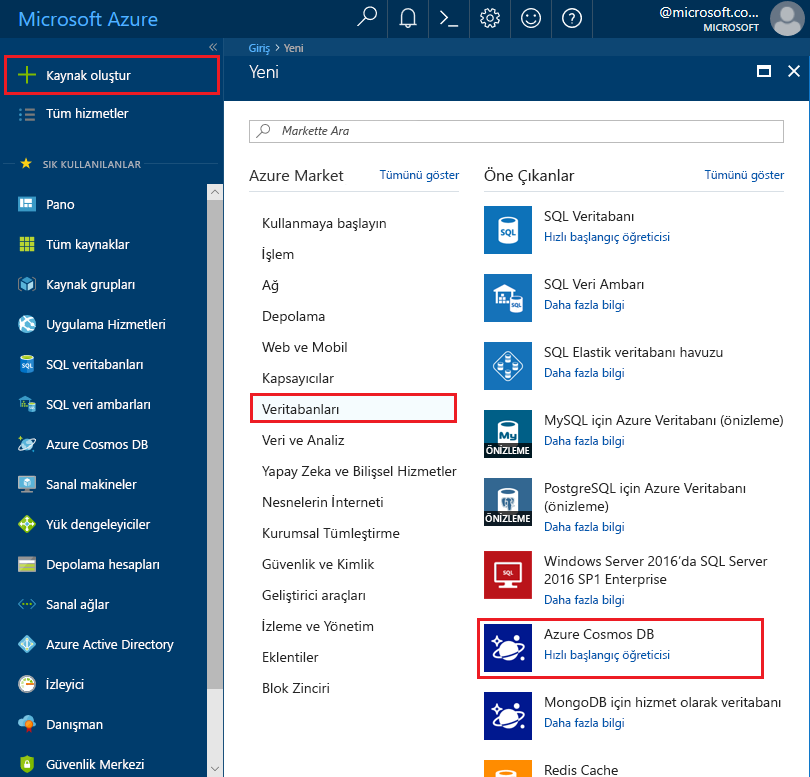
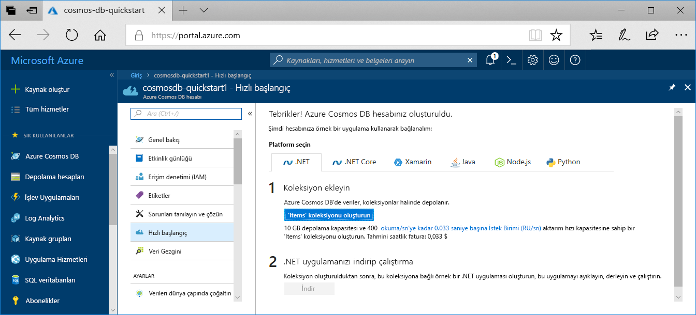

1. Yeni bir tarayıcı penceresinde [Azure portalında](https://portal.azure.com/) oturum açın.
2. **Kaynak oluştur** > **Veritabanları** > **Azure Cosmos DB** seçeneğine tıklayın.
   
   

3. İçinde **Azure Cosmos DB hesabı oluştur** sayfasında, yeni Azure Cosmos DB hesabının ayarlarını girin. 
 
    Ayar|Değer|Açıklama
    ---|---|---
    Abonelik|*Aboneliğiniz*|Bu Azure Cosmos DB hesabı için kullanmak istediğiniz Azure aboneliğini seçin. 
    Kaynak Grubu|Yeni oluştur  *Benzersiz bir ad girin*|**Yeni oluştur**’u seçin ve ardından hesabınız için yeni bir kaynak grubu adı girin. Kolaylık olması için hesap adınız aynı adı kullanabilirsiniz. 
    Hesap Adı|*Benzersiz bir ad girin*|Azure Cosmos DB hesabınızı tanımlayan benzersiz bir ad girin. Girdiğiniz kimliğe *documents.azure.com* eklenerek URI'niz oluşturulacağından benzersiz bir kimlik kullanın.  Kimlik yalnızca küçük harf, sayı ve kısa çizgi (-) karakterini içerebilir ve uzunluğu 3 ile 31 karakter arasında olmalıdır...
    API|Çekirdek (SQL)|API, oluşturulacak hesap türünü belirler. Azure Cosmos DB, beş API sunar: SQL (belge veritabanı), Gremlin (grafik veritabanı), MongoDB (belge veritabanı), tablo API'si ve Cassandra API'si. Her API şu anda ayrı bir hesap oluşturmanızı gerektirir.   Seçin **çekirdek (SQL)** bu makalede, bir belge veritabanı oluşturur ve SQL söz dizimini kullanarak sorgulamak için.   [SQL API’si hakkında daha fazla bilgi edinme](../articles/cosmos-db/documentdb-introduction.md)|
    Location|*Kullanıcılarınıza en yakın bölgeyi seçin*|Azure Cosmos DB hesabınızın barındırılacağı coğrafi konumu seçin. Verilere en hızlı erişimi sağlamak için kullanıcılarınıza en yakın olan konumu kullanın.
    Coğrafi yedekliliği etkinleştir| Boş bırakın | Bu, ikinci (eşleştirilmiş) bir bölgede veritabanınızın çoğaltılmış bir sürümünü oluşturur. Bunu boş bırakın.  
    Çok bölgeli Yazar| Boş bırakın | Bu, her iki okuma ve yazma bölgesi, veritabanı bölgeleri sağlar. Bunu boş bırakın.  

    Ardından **Gözden geçir + oluştur**’a tıklayın. Atlayabilirsiniz **ağ** ve **etiketleri** bölümü. 

    

    Özet bilgilerini gözden geçirin ve tıklayın **Oluştur**. 

    

4. Hesabın oluşturulması birkaç dakika sürer. Görüntülemek portalın **dağıtımınız tamamlandıktan** tıklayın ve ileti **kaynağa Git**.     

    

5. Portalı artık görüntülenecek **Tebrikler! Azure Cosmos DB hesabınız oluşturuldu** sayfasını görüntülemesini bekleyin.

    

