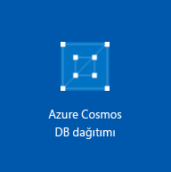

1. Yeni bir tarayıcı penceresinde [Azure portalında](https://portal.azure.com/) oturum açın.
2. Sol taraftaki menüde **Kaynak oluştur**'a, **Veritabanları**'na ve ardından **Azure Cosmos DB**' altında **Oluştur**’a tıklayın. 
   
   

3. **Yeni hesap** sayfasında, yeni Azure Cosmos DB hesabının ayarlarını girin. 
 
    Ayar|Önerilen değer|Açıklama
    ---|---|---
    Kimlik|*Benzersiz bir ad girin*|Bu Azure Cosmos DB hesabını tanımlayan benzersiz bir ad girin. Girdiğiniz kimliğe *documents.azure.com* eklenerek URI'niz oluşturulacağından benzersiz ancak tanımlanabilir bir kimlik kullanın.  Kimlik yalnızca küçük harf, sayı ve kısa çizgi (-) karakterini içerebilir ve 3 ila 50 karakterden oluşmalıdır.
    API|Azure Tablosu|API, oluşturulacak hesap türünü belirler. Azure Cosmos DB, uygulamanızın ihtiyaçlarını karşılayacak beş API sunar: Her biri ayrı hesap gerektiren SQL (belge veritabanı), Gremlin (grafik veritabanı), MongoDB (belge veritabanı), Azure Tablosu ve Cassandra.  Bu hızlı başlangıçta Tablo API’si ile birlikte çalışan bir tablo oluşturduğunuz için **Azure Tablosu**’nu seçin.  [Tablo API’si hakkında daha fazla bilgi edinin](../articles/cosmos-db/table-introduction.md) |
    Abonelik|*Yukarıdaki kimlikte sağlanan benzersiz adın aynısını girin*|Bu Azure Cosmos DB hesabı için kullanmak istediğiniz Azure aboneliğini seçin. 
    Kaynak Grubu|*Kimlikle aynı değer*|Hesabınız için yeni bir kaynak grubu adı girin. Kolaylık olması için kimliğinizle aynı adı kullanabilirsiniz. 
    Konum|*Kullanıcılarınıza en yakın bölgeyi seçin*|Azure Cosmos DB hesabınızın barındırılacağı coğrafi konumu seçin. Verilere en hızlı erişimi sağlamak için kullanıcılarınıza en yakın olan konumu kullanın.
    Coğrafi yedekliliği etkinleştir| Boş bırakın | Bu, ikinci (eşleştirilmiş) bir bölgede veritabanınızın çoğaltılmış bir sürümünü oluşturur. Bunu boş bırakın.  
    Panoya sabitle | Şunu seçin: | Kolay erişim amacıyla yeni veritabanı hesabınızın portal panonuza eklenmesi için bu kutuyu seçin.

    Sonra, **Oluştur**’a tıklayın.  

    

4. Hesabın oluşturulması birkaç dakika sürer. Hesap oluşturulduğu sırada portal **Azure Cosmos DB dağıtılıyor** kutucuğunu görüntüler.

    

    Hesap oluşturulduktan sonra **Tebrikler! Azure Cosmos DB hesabınız oluşturuldu** sayfası görüntülenir.
