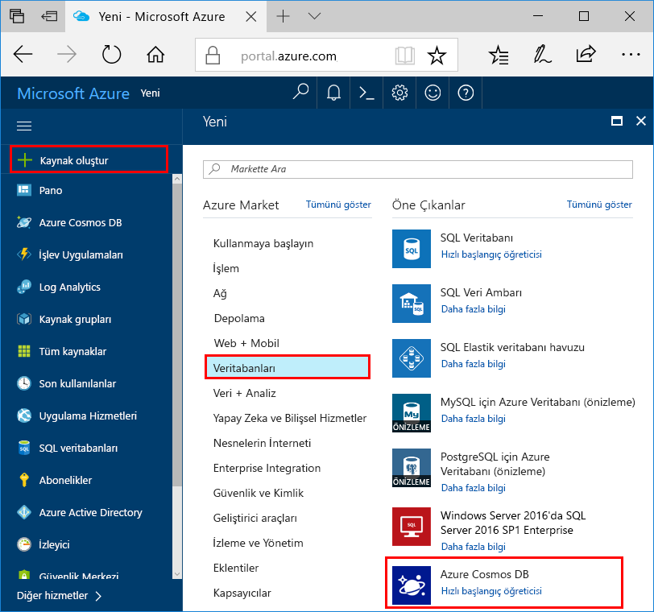
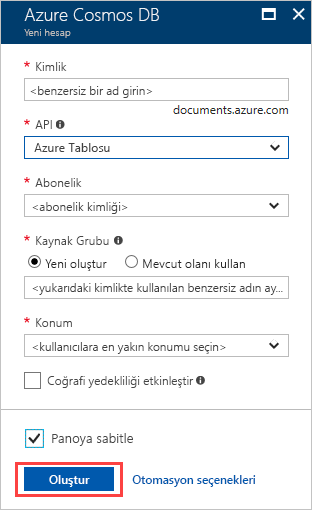
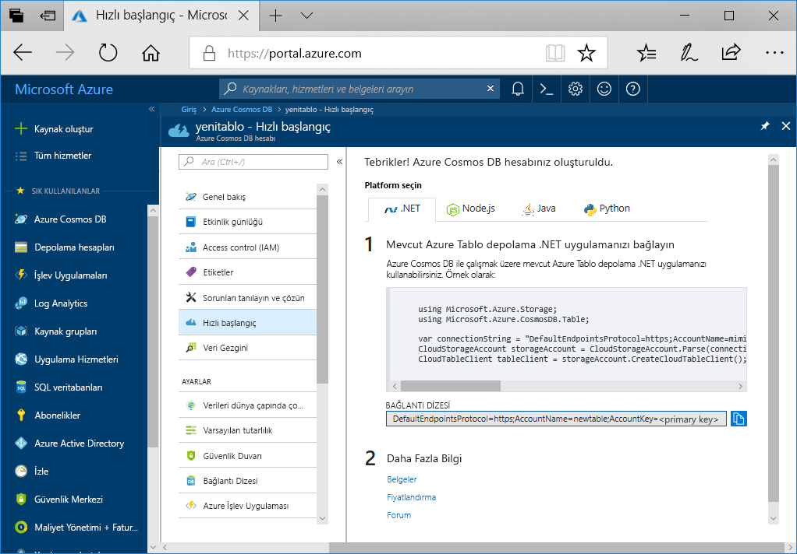

1. Yeni bir tarayıcı penceresinde [Azure portalında](https://portal.azure.com/) oturum açın.
2. Sol gezinti bölmesinde seçin **kaynak Oluştur**. Seçin **veritabanları** seçip **Azure Cosmos DB**.
   
   

3. Üzerinde **Azure Cosmos DB hesabı oluştur** sayfasında, yeni Azure Cosmos DB hesabının ayarlarını girin:
 
    Ayar|Değer|Açıklama
    ---|---|---
    Abonelik|Aboneliğiniz|Bu Azure Cosmos DB hesabı için kullanmak istediğiniz Azure aboneliğini seçin. 
    Kaynak Grubu|Yeni oluştur  Ardından Kimlikte sağlanan benzersiz adın aynısını girin|**Yeni oluştur**’u seçin. Ardından hesabınız için yeni bir kaynak grubu adı girin. Kolaylık olması için kimliğinizle aynı adı kullanın. 
    Hesap Adı|Benzersiz bir ad girin|Azure Cosmos DB hesabınızı tanımlayan benzersiz bir ad girin.  Kimlik yalnızca küçük harf, sayı ve kısa çizgi (-) karakterini kullanabilirsiniz. Bu, 3 ila 31 karakter uzunluğunda olmalıdır.
    API|Azure Tablosu|API, oluşturulacak hesap türünü belirler. Azure Cosmos DB, beş API sunar: Gremlin graf veritabanları, belge veritabanları, Azure tablosu ve Cassandra, MongoDB Core(SQL) belge veritabanları için. Şu anda, her bir API için ayrı bir hesap oluşturmanız gerekir.   Seçin **Azure tablo** Bu hızlı başlangıçta tablo API'si ile birlikte çalışan bir tablo oluşturmakta olduğunuz çünkü.   [Tablo API'si hakkında daha fazla bilgi](../articles/cosmos-db/table-introduction.md).|
    Location|Kullanıcılarınıza en yakın bölgeyi seçin|Azure Cosmos DB hesabınızın barındırılacağı coğrafi konumu seçin. Bunları verilere en hızlı erişim sağlamak için kullanıcılarınıza en yakın konumu kullanın.

    Bırakabilirsiniz **coğrafi Yedeklilik** ve **çok bölgeli Yazar** seçenekleri varsayılan değerlerinde (**devre dışı**) ek RU ücretlerden kaçınmak için. Atlayabilirsiniz **ağ** ve **etiketleri** bölümler.

5. Seçin **gözden geçir + Oluştur**. Doğrulama tamamlandıktan sonra seçip **Oluştur** hesabı oluşturmak için. 
 
   

6. Hesabı oluşturmak için birkaç dakika sürer. Bildiren bir ileti görürsünüz **devam ettiği dağıtımıdır**. Son seçin ve sonra dağıtımın bitmesini bekleyin **kaynağa Git**.

    
