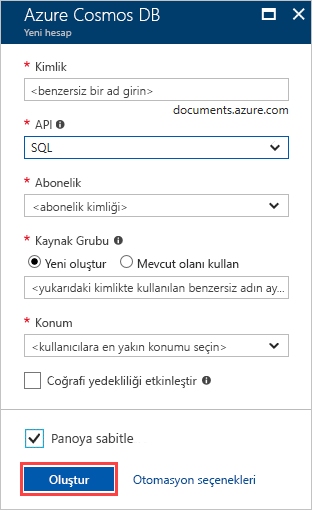

1. [Azure Portal](https://portal.azure.com/) oturum açın.
1. **Kaynak oluştur** > **Veritabanları** > **Azure Cosmos DB** seçeneğini belirleyin.
   
   

1. Üzerinde **Azure Cosmos DB hesabı oluştur** sayfasında, yeni Azure Cosmos hesabı için temel ayarları girin. 
 
    |Ayar|Değer|Açıklama |
    |---|---|---|
    |Abonelik|Abonelik adı|Bu Azure Cosmos hesap için kullanmak istediğiniz Azure aboneliğini seçin. |
    |Kaynak Grubu|Kaynak grubu adı|Bir kaynak grubu seçin ya da seçin **Yeni Oluştur**, ardından yeni bir kaynak grubu için benzersiz bir ad girin. |
    | Hesap Adı|Benzersiz bir ad girin|Azure Cosmos hesabınızı tanımlamak için bir ad girin. Girdiğiniz kimliğe *documents.azure.com* eklenerek URI'niz oluşturulacağından benzersiz bir kimlik kullanın.  Kimlik yalnızca küçük harf, sayı ve kısa çizgi (-) karakterini içerebilir. 3-31 karakter uzunluğunda olmalıdır.|
    | API|Çekirdek (SQL)|API, oluşturulacak hesap türünü belirler. Azure Cosmos DB, beş API sunar: Çekirdek (SQL) ve MongoDB, Gremlin graf verilerini, Azure tablosu ve Cassandra belge veriler için. Şu anda, her bir API için ayrı bir hesap oluşturmanız gerekir.   Seçin **çekirdek (SQL)** SQL söz dizimini kullanarak bir belge veritabanı ve sorgu oluşturmak için.   [SQL API'si hakkında daha fazla bilgi](../articles/cosmos-db/documentdb-introduction.md).|
    | Konum|Kullanıcılarınıza en yakın bölgeyi seçin|Azure Cosmos DB hesabınızın barındırılacağı coğrafi konumu seçin. Bunları verilere en hızlı erişim sağlamak için kullanıcılarınıza en yakın konumu kullanın.|
   
   

1. **İncele ve oluştur**’u seçin. Atlayabilirsiniz **ağ** ve **etiketleri** bölümler. 

1. Hesap ayarları gözden geçirin ve ardından **Oluştur**. Hesabı oluşturmak için birkaç dakika sürer. Portal sayfasında görüntülenecek bekleyin **dağıtımınız tamamlandıktan**. 

    

1. Seçin **kaynağa Git** Azure Cosmos DB hesap sayfasına gidin. 

    
