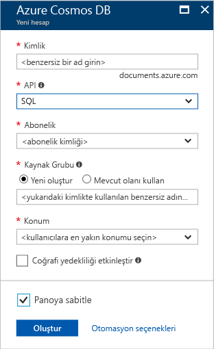

1. Yeni bir tarayıcı penceresinde [Azure portalında](https://portal.azure.com/) oturum açın.
2. **Kaynak oluştur** > **Veritabanları** > **Azure Cosmos DB** seçeneğine tıklayın.
   
   

3. **Yeni hesap** sayfasında, yeni Azure Cosmos DB hesabının ayarlarını girin. 
 
    Ayar|Değer|Açıklama
    ---|---|---
    Kimlik|*Benzersiz bir ad girin*|Bu Azure Cosmos DB hesabını tanımlayan benzersiz bir ad girin. Girdiğiniz kimliğe *documents.azure.com* eklenerek URI'niz oluşturulacağından benzersiz ancak tanımlanabilir bir kimlik kullanın.  Kimlik yalnızca küçük harf, sayı ve kısa çizgi (-) karakterini içerebilir ve 3 ila 50 karakterden oluşmalıdır.
    API|SQL|API, oluşturulacak hesap türünü belirler. Azure Cosmos DB, uygulamanızın ihtiyaçlarını karşılayacak beş API sunar: Her biri ayrı hesap gerektiren SQL (belge veritabanı), Gremlin (grafik veritabanı), MongoDB (belge veritabanı), Azure Tablosu ve Cassandra.   Seçin **SQL** çünkü bu hızlı başlangıcı, sorgulanabilir SQL sözdizimini kullanarak ve SQL API'yi ile erişilebilir bir belge veritabanı oluşturuluyor.  [SQL API'si hakkında daha fazla bilgi edinin](../articles/cosmos-db/documentdb-introduction.md)|
    Abonelik|*Aboneliğiniz*|Bu Azure Cosmos DB hesabı için kullanmak istediğiniz Azure aboneliğini seçin. 
    Kaynak Grubu|Yeni oluştur  *Ardından yukarıdaki Kimliğinde sağlanan gibi aynı benzersiz bir ad girin*|Seçin **Yeni Oluştur**, hesabınız için yeni bir kaynak grubu adı girin. Kolaylık olması için kimliğinizle aynı adı kullanabilirsiniz. 
    Konum|*Kullanıcılarınıza en yakın bölgeyi seçin*|Azure Cosmos DB hesabınızın barındırılacağı coğrafi konumu seçin. Verilere en hızlı erişimi sağlamak için kullanıcılarınıza en yakın olan konumu kullanın.
    Coğrafi yedekliliği etkinleştir| Boş bırakın | Bu, ikinci (eşleştirilmiş) bir bölgede veritabanınızın çoğaltılmış bir sürümünü oluşturur. Bunu boş bırakın.  
    Panoya sabitle | Şunu seçin: | Kolay erişim amacıyla yeni veritabanı hesabınızın portal panonuza eklenmesi için bu kutuyu seçin.

    Sonra **Oluştur**’a tıklayın.

    

4. Hesabın oluşturulması birkaç dakika sürer. Portal görüntülenecek bekleyin **Tebrikler! Azure Cosmos DB hesabınız oluşturuldu** sayfası.

    

