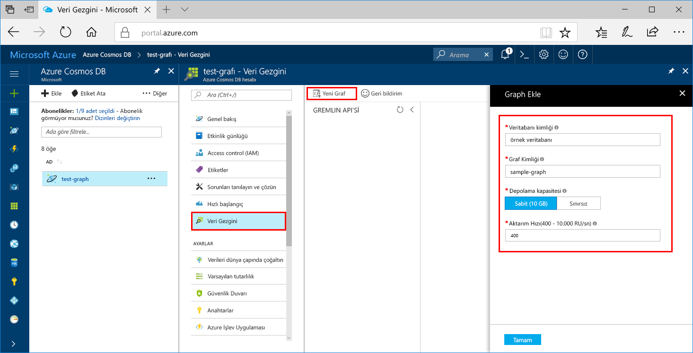

Şimdi bir grafik veritabanı oluşturmak için Azure portalında Veri Gezgini aracını kullanabilirsiniz. 

1. **Veri Gezgini** > **Yeni Grafik**’e tıklayın.

    **Grafik Ekle** alanı en sağda görüntülenir, görmek için sağa kaydırmanız gerekebilir.

    

2. **Grafik Ekle** sayfasında, yeni grafik için ayarları girin.

    Ayar|Önerilen değer|Açıklama
    ---|---|---
    Veritabanı Kimliği|sample-database|Yeni veritabanınızın adını *sample-database* olarak belirleyin. Veritabanı adı 1 ile 255 karakter arasında olmalı, `/ \ # ?` içermemeli ve boşlukla bitmemelidir.
    Graf Kimliği|sample-graph|Yeni koleksiyonunuzun adını *sample-graph* olarak belirleyin. Grafik adı karakter gereksinimleri, veritabanı kimliklerine ilişkin karakter gereksinimleri ile aynıdır.
    Depolama Kapasitesi|Sabit (10 GB)|Varsayılan **Sabit (10 GB)** değerini değiştirmeyin. Bu değer, veritabanının depolama kapasitesidir.
    Aktarım hızı|400 RU|Aktarım hızını saniyede 400 istek birimi (RU/s) olarak değiştirin. Daha sonra gecikme süresini azaltmak isterseniz aktarım hızının ölçeğini artırabilirsiniz.

3. Formu doldurduktan sonra **Tamam**'a tıklayın.
