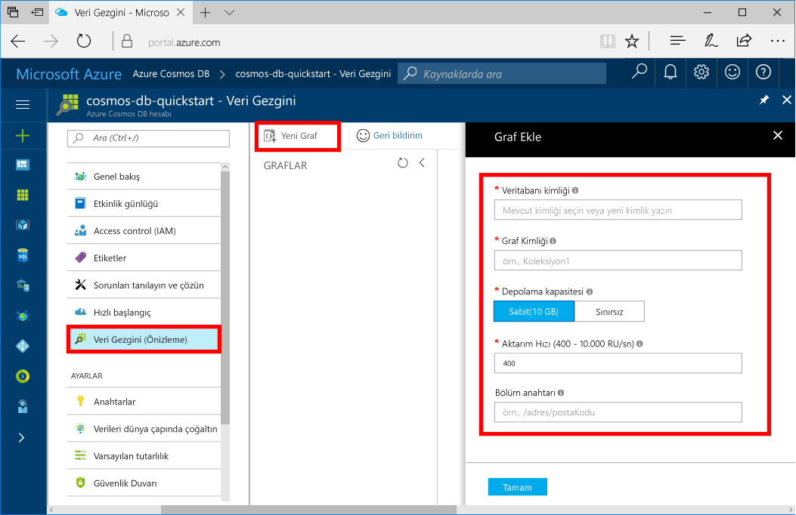

Şimdi bir grafik veritabanı oluşturmak için Azure portalında Veri Gezgini aracını kullanabilirsiniz. 

1. Azure portalının solundaki gezinti menüsünde **Veri Gezgini (Önizleme)** seçeneğine tıklayın. 
2. **Veri Gezgini (Önizleme)** dikey penceresinde **Yeni Grafik**'e tıklayın ve aşağıdaki bilgileri kullanarak sayfayı doldurun.

    

    Ayar|Önerilen değer|Açıklama
    ---|---|---
    Veritabanı kimliği|sample-database|Yeni veritabanınızın kimliği. Veritabanı adı 1 ile 255 karakter arasında olmalı, `/ \ # ?` içermemeli ve boşlukla bitmemelidir.
    Grafik kimliği|sample-graph|Yeni grafiğinizin kimliği. Grafik adı karakter gereksinimleri, veritabanı kimliklerine ilişkin karakter gereksinimleri ile aynıdır.
    Depolama Kapasitesi| 10 GB|Varsayılan değeri değiştirmeyin. Bu, veritabanının depolama kapasitesidir.
    Aktarım hızı|400 RU|Varsayılan değeri değiştirmeyin. Daha sonra gecikme süresini azaltmak isterseniz, aktarım hızının ölçeğini artırabilirsiniz.
    RU/dk|Kapalı|Varsayılan değeri değiştirmeyin. Öngörülemeyen iş yükleri ile başa çıkmanız gerekirse daha sonra [RU/dk](../articles/cosmos-db/request-units-per-minute.md) özelliğini etkinleştirebilirsiniz.
    Bölüm anahtarı|/userid|Verileri bölümlere eşit şekilde dağıtacak bölüm anahtarıdır. Grafik performansının yüksek olması için doğru bölüm anahtarının seçilmesi önemlidir. Daha fazla bilgi için bkz. [Bölümleme için tasarlama](../articles/cosmos-db/partition-data.md#designing-for-partitioning).

3. Formu doldurduktan sonra **Tamam**'a tıklayın.