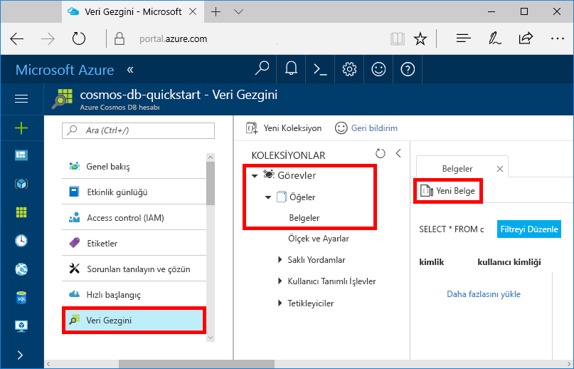
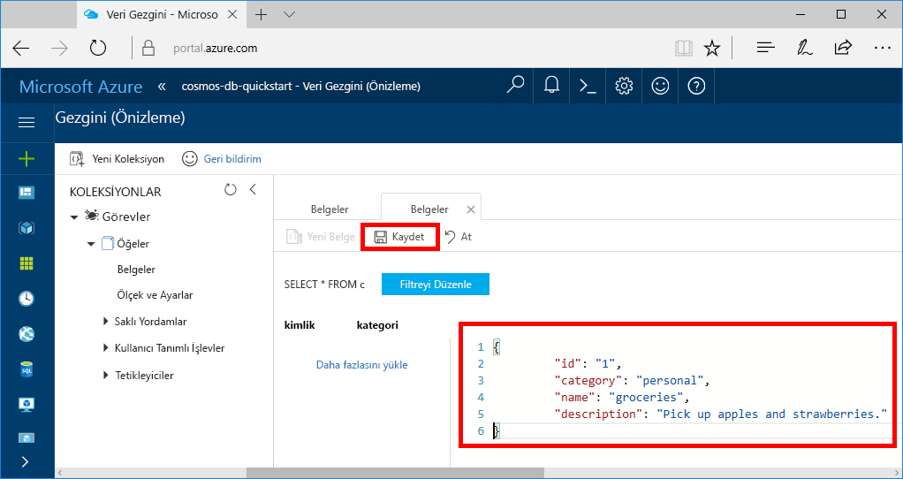

Şimdi Veri Gezgini'ni kullanarak yeni koleksiyonunuza veri ekleyebilirsiniz.

1. Yeni veritabanı, Veri Gezgini'nin Koleksiyonlar bölmesinde görüntülenir. **Görevler** veritabanını genişletin, **Öğeler** koleksiyonunu genişletin, **Belgeler**'e ve ardından **Yeni Belge**'ye tıklayın. 

   
  
2. Şimdi koleksiyona aşağıdaki yapıya sahip bir belge ekleyin.

     ```json
     {
         "id": "1",
         "category": "personal",
         "name": "groceries",
         "description": "Pick up apples and strawberries.",
         "isComplete": false
     }
     ```

3. JSON öğesini **Belgeler** sekmesine ekledikten sonra **Kaydet**'e tıklayın.

    

4.  `id` özelliği için benzersiz bir değer eklediğiniz yerde bir veya daha fazla belge oluşturun ve kaydedin ve diğer özellikleri uygun şekilde değiştirin. Azure Cosmos DB, verilerinizin bir şemaya uygun olmasını şart koşmadığı için yeni belgelerinizin yapısını istediğiniz şekilde oluşturabilirsiniz.